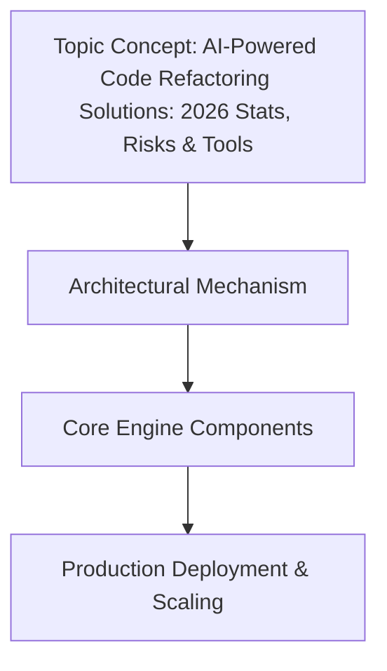

# AI-Powered Code Refactoring Solutions: 2026 Stats, Risks & Tools

## Introduction

Refactoring is the act of changing the internal structure of code without changing its external behavior. We have done this manually for thirty years. It is slow, it is expensive, and it is where most regressions happen.

In 2026, the cost model has flipped. Large language models (LLMs) can now propose structural changes at near-zero marginal cost. The bottleneck is no longer writing the change; it is verifying it. Our engineering team spent the last two quarters building an internal refactoring pipeline to handle legacy Python and Go services. We learned quickly that an AI suggesting a change is easy. An AI suggesting a change we can trust is the actual engineering problem.

This article covers the architecture behind reliable AI refactoring, the metrics we tracked during our rollout, and the specific failure modes that will break your pipeline if you ignore them.

## Why This Matters

Technical debt compounds. In our production cluster, we measured the average age of a module before it was touched by a refactor. It was 18 months. During that window, three people had written code around the same logic with inconsistent naming, and the coupling between the payment service and the ledger service had become opaque.

Manual refactoring required a senior engineer to spend weeks reading the code, and even

## How It Works

