# Arrays vs Linked Lists: Why the Textbook Winner Loses on Real Hardware

## Introduction

Imagine you are building a high-frequency trading (HFT) engine. Your system needs to ingest millions of market ticks per second—price updates, volume changes, and order book snapshots—and process them with sub-microsecond latency. You reach for your algorithms textbook to decide how to store these incoming ticks.

The book tells you that if you need frequent insertions and deletions in the middle of your stream, a Linked List is your best friend. It promises $O(1)$ complexity for insertions once you have a pointer to the location. You implement it, confident in your Big O analysis, only to find that your production benchmarks show the system lagging behind a "suboptimal" array-based implementation.

What went wrong? You followed the math, but you forgot the machine.

## Why This Matters

In modern systems, the bottleneck is rarely the number of instructions executed; it's the time the CPU spends waiting for data to arrive from memory. We live in an era of "Memory Walls." While CPU speeds have increased exponentially, memory latency has improved much more slowly. 

If you design your software based solely on Big O complexity, you are operating under the "Uniform Memory Access" fallacy—the assumption that accessing any piece of data takes the same amount of time. On real hardware, this assumption is dead. Choosing the wrong data structure can lead to performance regressions that no amount of multi-threading or "faster" code can fix.

## How It Works

To understand why the textbook theory fails, we have to look at how data moves from your RAM to your CPU registers. Data isn't fetched one byte at a time. It's fetched in "Cache Lines"—typically 64-byte chunks.

When you access an element in an array, the CPU fetches that element *and the next several elements* into the L1 cache. This is called **Spatial Locality**. When you move to the next index, the data is already sitting in the fastest memory available.

Linked lists, however, are "pointer-chasing" structures. Each node lives at a random heap address. When you follow a pointer to the next node, there is a high probability that the node is not in the cache. This triggers a "cache miss," forcing the CPU to stall for hundreds of cycles while it fetches the next node from main memory.

```mermaid
flowchart TD
    subgraph CPU_Cache_Layer ["CPU Cache (Fast/Small)"]
        A1[Array Element 1]
        A2[Array Element 2]
        A3[Array Element 3]
        A4[Array Element 4]
    end

    subgraph Main_Memory ["Main RAM (Slow/Large)"]
        B1[Node A]
        B2[Node B]
        B3[Node C]
        B4[Node D]
    end

    A1 -.->|Prefetcher loads contiguous block| A2
    A2 -.->|Prefetcher loads contiguous block| A3
    A3 -.->|Prefetcher loads contiguous block| A4

    B1 -->|Pointer Chase: High Latency| B2
    B2 -->|Pointer Chase: High Latency| B3
    B3 -->|Pointer Chase: High Latency| B4

    style CPU_Cache_Layer fill:#e1f5fe,stroke:#01579b
    style Main_Memory fill:#fff3e0,stroke:#e65100
```



## Core Concepts

1.  **Spatial Locality**: The principle that if a memory location is accessed, nearby locations are likely to be accessed soon. Arrays have perfect spatial locality.
2.  **Cache Line**: The smallest unit of data transferred between main memory and the CPU cache. Usually 64 bytes.
3.  **Hardware Prefetching**: A feature of modern CPUs that detects sequential access patterns (like in an array) and proactively pulls upcoming data into the cache before the program even asks for it.
4.  **Pointer Chasing**: The act of reading a memory address to find the address of the next piece of data. This is the "silent killer" of performance in linked structures.
5.  **Cache Miss**: When the CPU looks for data in the cache and fails, forcing a slow trip to RAM.

## Examples & Code Walkthrough

Let's look at how these structures look in code and how we might optimize them for real-world hardware.

### The Textbook Implementation
This is what you'll find in most CS 101 courses. It's elegant, but it's a nightmare for the CPU cache.

```python
class MarketTickNode:
    """A standard linked list node for market data."""
    def __init__(self, price: float, volume: int):
        self.price = price
        self.volume = volume
        self.next = None

class LinkedListTickStore:
    """Classic linked list: Great for insertions, terrible for CPU caches."""
    def __init__(self):
        self.head = None

    def prepend(self, price: float, volume: int):
        new_node = MarketTickNode(price, volume)
        new_node.next = self.head
        self.head = new_node

    def aggregate_volume(self) -> float:
        total_volume = 0.0
        current = self.head
        while current:
            # Each 'current.next' likely causes a cache miss
            total_volume += current.volume
            current = current.next
        return total_volume
```

### The Optimized Real-World Implementation
In production, we often use "Chunked" structures or "Ring Buffers" to get the benefits of both worlds.

```python
import array

class RingBufferTickStore:
    """
    A fixed-size circular buffer. 
    Uses contiguous memory for maximum cache efficiency.
    """
    def __init__(self, capacity: int):
        self.capacity = capacity
        # Using array.array for compact, contiguous memory allocation
        self.prices = array.array('d', [0.0] * capacity)
        self.volumes = array.array('i', [0] * capacity)
        self.head = 0
        self.size = 0

    def push(self, price: float, volume: int):
        idx = self.head % self.capacity
        self.prices[idx] = price
        self.volumes[idx] = volume
        self.head += 1
        if self.size < self.capacity:
            self.size += 1

    def aggregate_volume(self) -> float:
        total_volume = 0.0
        # The CPU prefetcher loves this loop
        for i in range(self.head - self.size, self.head):
            total_volume += self.volumes[i % self.capacity]
        return total_volume
```

## Best Practices

*   **Default to Contiguous**: Unless you have a very specific reason to use a linked structure, use an array (or `std::vector` in C++, `ArrayList` in Java, etc.).
*   **Prefer Data-Oriented Design**: Instead of an "Array of Objects" (where each object is a pointer to a heap location), try "Arrays of Primitives" (Structure of Arrays). This keeps the data tightly packed.
*   **Pre-allocate Memory**: Avoid frequent resizing of arrays. If you know you need 1 million elements, allocate them upfront to prevent expensive reallocations and memory fragmentation.
*   **Profile the Cache**: Use tools like `perf` (on Linux) or Intel VTune to actually see your cache miss rates. Don't guess; measure.

## Common Mistakes & Anti-Patterns

1.  **The "Big O" Trap**: Assuming that because an operation is $O(1)$, it is "fast." An $O(1)$ operation with a cache miss is often slower than an $O(n)$ operation that stays entirely within the L1 cache.
2.  **Over-Abstraction**: Creating deeply nested object hierarchies where every relationship is a pointer. This creates a "pointer soup" that destroys performance.
3.  **Ignoring Memory Alignment**: Not being aware of how your data structures align with 64-byte cache lines.
4.  **Premature Optimization**: While cache awareness is vital, don't rewrite your entire codebase into a Ring Buffer until you've actually identified a bottleneck in your profiling data.

## Performance Considerations

| Metric | Array (Contiguous) | Linked List (Scattered) |
| :--- | :--- | :--- |
| **Access Pattern** | Sequential (Predictable) | Random (Unpredictable) |
| **CPU Prefetching** | Highly Effective | Ineffective |
| **Cache Hit Rate** | Very High | Low |
| **Memory Overhead** | Minimal (Data only) | High (Data + Pointers) |
| **Complexity (Insert)** | $O(n)$ (due to shifting) | $O(1)$ (if pointer is known) |

In high-throughput systems, the $O(n)$ cost of shifting elements in a small-to-medium array is often much lower than the cost of the cache misses incurred by a linked list.

## Real-World Usage

*   **High-Frequency Trading**: Use circular buffers and flat arrays to ensure deterministic, low-latency processing.
*   **Game Engines**: Use "Entity Component Systems" (ECS) which rely heavily on contiguous arrays to ensure the CPU can iterate over thousands of entities without stalling.
*   **Database Engines**: While B-Trees use pointers, modern "LSM-Trees" (Log-Structured Merge-Trees) use sequential writes to optimize for the physical characteristics of both SSDs and CPU caches.

## Frequently Asked Questions (FAQ)

**Q: When is a Linked List actually better?**
A: When the objects are massive (e.g., each node is several kilobytes) or when you are performing frequent deletions in the middle of a list and you already have a direct pointer to the node.

**Q: Does Python's `list` behave like a C++ array?**
A: Not exactly. A Python `list` is actually an array of pointers to objects. While the *pointers* are contiguous, the *objects* they point to are scattered in the heap. This makes Python inherently harder to optimize for cache locality than C++ or Rust.

**Q: How do I detect cache misses in my code?**
A: On Linux, the `perf` tool is the industry standard. Running `perf stat -e cache-misses./my_program` will give you a direct count of how often your CPU failed to find data in the cache.

## Conclusion

The gap between theoretical complexity and hardware reality is where high-performance software is written. Big O notation is a vital tool for understanding scalability, but it is a blunt instrument that ignores the physical reality of the CPU. 

As a software engineer, your goal isn't just to write code that is "efficient" in a textbook sense, but code that works *with* the hardware, not against it. Respect the cache, minimize pointer chasing, and always remember: the fastest code is the code that keeps the CPU busy, not the code that keeps it waiting.
