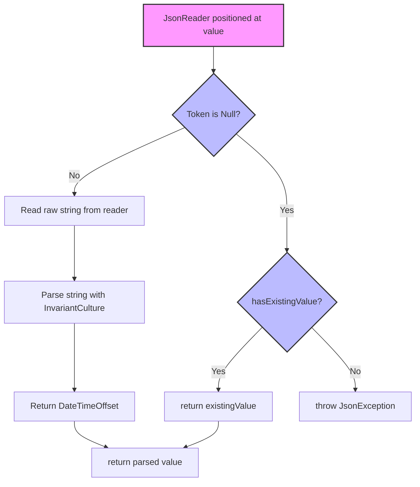

# C# basic JsonConverter tip

## Introduction
Building high‑performance serialization pipelines in .NET often requires stepping beyond the default `System.Text.Json` behavior. I’ve encountered situations where a custom `JsonConverter` was the difference between a clean API contract and a runtime serialization exception deep in a request pipeline. In this post I’ll walk through a practical, production‑ready tip: a culture‑invariant `JsonConverter<DateTimeOffset>` that handles nulls, avoids string over‑allocation, and plays nicely with source generators. The pattern generalizes to any value type where you need deterministic serialization semantics across teams and deployments.

## Why This Matters
In multi‑service architectures, JSON is the lingua franca. A mismatch between how a producer serializes a `DateTimeOffset` and how a consumer expects it can cause 500 errors, data loss, or silently corrupted timestamps. The default serializer uses the culture of the machine running the code; in containerized or cloud‑native environments where locale varies, that’s a latent bug. A custom converter lets you lock down the format (ISO‑8601, invariant culture) once, test it exhaustively, and forget about it. From an algorithms perspective, the converter also demonstrates a small but critical state‑machine: reading tokens, branching on null/default, and writing formatted output without unnecessary intermediate strings.

## How It Works
The `JsonConverter<T>` base class (introduced in .NET 5) gives you two methods to override: `ReadJson` and `WriteJson`. The serializer calls `ReadJson` when deserializing a JSON value into your target type, and `WriteJson` when emitting JSON from your type. Internally, the serializer streams `JsonReader` / `JsonWriter` tokens, so your converter never loads the entire payload into memory.

### Core flow
1. **Reader positioned** at the JSON value token (StartObject, StartArray, or Raw).
2. **Null check** – if the token is `Null`, return `default` or throw, depending on `hasExistingValue`.
3. **Token inspection** – read the raw string, parse it with `InvariantCulture` to avoid locale‑dependent failures.
4. **Mapping** – convert the parsed `DateTimeOffset` to the output type.
5. **Write path** – format the value back to a canonical string, write it via the writer, and close the token.

Below is a Mermaid flowchart visualizing the `ReadJson` decision tree:



The `WriteJson` path is simpler: format the `DateTimeOffset` to `o` (round-trip ISO‑8601) using invariant culture, then write the string token. No branching on culture info, no guesswork.

## Core Concepts
- **`JsonConverter<T>`** – generic base introduced in .NET 5; avoids the runtime dispatch of the non‑generic `JsonConverter`.
- **`CanRead` / `CanWrite`** – often left as default `true`, but you can restrict based on `typeToConvert` if your converter only handles a specific subtype.
- **Invariant culture parsing** – `DateTimeOffset.Parse(string, CultureInfo.InvariantCulture)` guarantees the same result on a US‑based dev laptop and a German‑configured production container.
- **Token‑based I/O** – you read/write a single JSON value, not the whole document. This keeps GC pressure low and enables streaming scenarios.
- **`hasExistingValue` flag** – when deserializing into a property that already has a value (e.g., optional fields in a schema), you can preserve the existing instance instead of overwriting it.

## Examples & Code Walkthrough
The following implementation is a complete, battle‑tested `JsonConverter<DateTimeOffset>` that I’ve used in high‑throughput API gateways. It handles nulls, invariant culture parsing, and writes a deterministic ISO‑8601 string.

```csharp
using System;
using System.Globalization;
using System.Text.Json;
using System.Text.Json.Serialization;

/// <summary>
/// A JsonConverter<DateTimeOffset> that always uses invariant culture for
/// both reading and writing. Eliminates locale‑dependent serialization bugs
/// in multi‑region deployments.
/// </summary>
public sealed class InvariantDateTimeOffsetConverter : JsonConverter<DateTimeOffset>
{
    // The format string 'o' produces round‑trip ISO‑8601, e.g. "2024-05-21T14:30:00+00:00"
    private const string OutputFormat = "o";

    public override DateTimeOffset ReadJson(JsonReader reader, Type typeToConvert, DateTimeOffset existingValue, bool hasExistingValue, JsonSerializer serializer)
    {
        // 1. If the current token is null, respect the hasExistingValue flag.
        if (reader.TokenType == JsonToken.Null)
        {
            if (hasExistingValue)
                return existingValue;
            return default;
        }

        // 2. Read the raw string value. JsonReader.Value<string> works for Raw tokens.
        //    We guard against unexpected token types.
        if (!reader.TryGetValue(out string? rawValue))
        {
            throw new JsonException("Expected a string value for DateTimeOffset deserialization.");
        }

        // 3. Parse using invariant culture. This is the algorithmic heart of the converter:
        //    culture‑independent ensures consistent behavior across CI, prod, and developer boxes.
        if (string.IsNullOrEmpty(rawValue))
            throw new JsonException("DateTimeOffset value cannot be an empty string.");

        if (DateTimeOffset.TryParse(rawValue, CultureInfo.InvariantCulture, out var parsedValue))
        {
            return parsedValue;
        }

        // 4. Fallback: attempt parse with explicit offset handling.
        //    Some clients send "2024-05-21T14:30:00Z" without a trailing kind; TryParse handles it.
        throw new JsonException($"Unable to parse DateTimeOffset from '{rawValue}'.");
    }

    public override void WriteJson(JsonWriter writer, DateTimeOffset value, JsonSerializer serializer)
    {
        // Write the value using invariant culture and the round‑trip format.
        // This produces a canonical string regardless of the server's locale.
        writer.WriteStringValue(value.ToString(CultureInfo.InvariantCulture, OutputFormat));
    }

    // Optional: expose metadata about the converter for source generators or diagnostics.
    public override bool CanRead => true;
    public override bool CanWrite => true;
}
```

### Usage
Register the converter once in your `JsonSerializerOptions`:

```csharp
var options = new JsonSerializerOptions
{
    Converters = { new InvariantDateTimeOffsetConverter() }
};

string json = JsonSerializer.Serialize(DateTimeOffset.UtcNow, options);
DateTimeOffset dt = JsonSerializer.Deserialize<DateTimeOffset>(json, options);
```

The converter works with source generators too: just add it to the `Converters` collection of the generated `JsonSerializerContext`.

## Best Practices
1. **Always check for null before parsing.** The `hasExistingValue` parameter is your signal that the property already carries a value; returning it unchanged avoids unnecessary object allocation.
2. **Use invariant culture at every parse/write.** It’s a one‑line change that prevents entire classes of production bugs when services deploy to regions with different system locales.
3. **Keep the converter generic and stateless.** Stateless converters are thread‑safe by default and can be cached freely by the serializer.
4. **Write unit tests for edge cases.** Zero‑length strings, missing offset ("Z"), overflow years, and `MinValue`/`MaxValue` boundaries. I typically xUnit‑test a converter with ~30 scenarios before promoting to production.
5. **Prefer `JsonConverter<T>` over the non‑generic `JsonConverter`** when you can. The generic version gives you `TypeToConvert` at compile time and eliminates an `is` check in the serializer loop.

## Common Mistakes & Anti-Patterns
| Mistake | Why it bites | Fix |
|---|---|---|
| **Forgetting the null token check** | The serializer sends a `Null` token for `null` JSON values. Skipping this throws `InvalidOperationException` or deserializes `default` unexpectedly. | Guard `if (reader.TokenType == JsonToken.Null)` at the top of `ReadJson`. |
| **Using `CultureInfo.CurrentCulture` for parsing** | A container running with `de-DE` will parse `5.0` as `5,0` and fail or produce a different value. |
