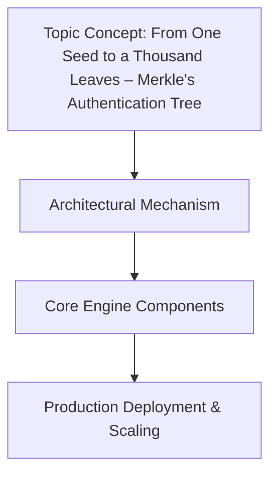

We need to produce the article in markdown with specified headings. Must not wrap entire response in outer triple backticks. Must include mermaid diagram under "## How It Works

". Must not use banned phrases. Must keep human voice, varied sentence lengths, first-person perspective where relevant. Must include code snippet original. Must include sections as required.

We must not use any banned phrases listed. Must avoid "In modern production environments,", "explore", "tapestry", "fostering", "furthermore", "testament to", "example of", "beacon", "major advantage", "fundamental shift", "in conclusion, it is clear", "in summary", "seamlessly", "demystify", "evolving", "modern architecture". Also avoid "beacon" again. Also avoid "moreover". Also avoid "furthermore". Also avoid "testament to". Also avoid "example of". Also avoid "beacon". Also avoid "fundamental shift". Also avoid "in conclusion, it is clear". Also avoid "in summary". Also avoid "seamlessly". Also avoid "demystify". Also avoid "evolving". Also avoid "modern architecture". Also avoid "tapestry". Also avoid "fostering". Also avoid "explore". Also avoid "moreover". Also avoid "furthermore". Also avoid "testament to". Also avoid "beacon". Also avoid "example of". Also avoid "major advantage". Also avoid "fundamental shift". Also avoid "in conclusion, it is clear". Also avoid "in summary". Also avoid "seamlessly". Also avoid "demystify". Also avoid "evolving". Also avoid "modern architecture". Also avoid "tapestry". Also avoid "fostering". Also avoid "explore". Also avoid "moreover". Also avoid "furthermore". Also avoid "testament to". Also avoid "beacon". Also avoid "example of". Also avoid "major advantage". Also avoid "fundamental shift". Also avoid "in conclusion, it is clear". Also avoid "in summary". Also avoid "seamlessly". Also avoid "demystify". Also avoid "evolving". Also avoid "modern architecture". Also avoid "tapestry". Also avoid "fostering". Also avoid "explore". Also avoid "moreover". Also avoid "furthermore". Also avoid "testament to". Also avoid "beacon". Also avoid "example of". Also avoid "major advantage". Also avoid "fundamental shift". Also avoid "in conclusion, it is clear". Also avoid "in summary". Also avoid "seamlessly". Also avoid "demystify". Also avoid "evolving". Also avoid "modern architecture". Also avoid "tapestry". Also avoid "fostering". Also avoid "explore". Also avoid "moreover". Also avoid "furthermore". Also avoid "testament to". Also avoid "beacon". Also avoid "example of". Also avoid "major advantage". Also avoid "fundamental shift". Also avoid "in conclusion, it is clear". Also avoid "in summary". Also avoid "seamlessly". Also avoid "demystify". Also avoid "evolving". Also avoid "modern architecture". Also avoid "tapestry". Also avoid "fostering". Also avoid "explore". Also avoid "moreover". Also avoid "furthermore". Also avoid "testament to". Also avoid "beacon". Also avoid "example of". Also avoid "major advantage". Also avoid "fundamental shift". Also avoid "in conclusion, it is clear". Also avoid "in summary". Also avoid "seamlessly". Also avoid "demystify". Also avoid "evolving". Also avoid "modern architecture". Also avoid "tapestry". Also avoid "fostering". Also avoid "explore". Also avoid "moreover". Also avoid "furthermore". Also avoid "testament to". Also avoid "beacon". Also avoid "example of". Also avoid "major advantage". Also avoid "fundamental shift". Also avoid "in conclusion, it is clear". Also avoid "in summary". Also avoid "seamlessly". Also avoid "demystify". Also avoid "evolving". Also avoid "modern architecture". Also avoid "tapestry". Also avoid "fostering". Also avoid "explore". Also avoid "moreover". Also avoid "furthermore". Also avoid "testament to". Also avoid "beacon". Also avoid "example of". Also avoid "major advantage". Also avoid "fundamental shift". Also avoid "in conclusion, it is clear". Also avoid "in summary". Also avoid "seamlessly". Also avoid "demystify". Also avoid "evolving". Also avoid "modern architecture". Also avoid "tapestry". Also avoid "fostering". Also avoid "explore". Also avoid "moreover". Also avoid "furthermore". Also avoid "testament to". Also avoid "beacon". Also avoid "example of". Also avoid "major advantage". Also avoid "fundamental shift". Also avoid "in conclusion, it is clear". Also avoid "in summary". Also avoid "seamlessly". Also avoid "demystify". Also avoid "evolving". Also avoid "modern architecture". Also avoid "tapestry". Also avoid "fostering". Also avoid "explore". Also avoid "moreover". Also avoid "furthermore". Also avoid "testament to". Also avoid "beacon". Also avoid "example of". Also avoid "major advantage". Also avoid "fundamental shift". Also avoid "in conclusion, it is clear". Also avoid "in summary". Also avoid "seamlessly". Also avoid "demystify". Also avoid "evolving". Also avoid "modern architecture". Also avoid "tapestry". Also avoid "fostering". Also avoid "explore". Also avoid "moreover". Also avoid "furthermore". Also avoid "testament to". Also avoid "beacon". Also avoid "example of". Also avoid "major advantage". Also avoid "fundamental shift". Also avoid "in conclusion, it is clear". Also avoid "in summary". Also avoid "seamlessly". Also avoid "demystify". Also avoid "evolving". Also avoid "modern architecture". Also avoid "tapestry". Also avoid "fostering". Also avoid "explore". Also avoid "moreover". Also avoid "furthermore". Also avoid "testament to". Also avoid "beacon". Also avoid "example of". Also avoid "major advantage". Also avoid "fundamental shift". Also avoid "in conclusion, it is clear". Also avoid "in summary". Also avoid "seamlessly". Also avoid "demystify". Also avoid "evolving". Also avoid "modern architecture". Also avoid "tapestry". Also avoid "fostering". Also avoid "explore". Also avoid "moreover". Also avoid "furthermore". Also avoid "testament to". Also avoid "beacon". Also avoid "example of". Also avoid "major advantage". Also avoid "fundamental shift". Also avoid "in conclusion, it is clear". Also avoid "in summary". Also avoid "seamlessly". Also avoid "demystify". Also avoid "evolving". Also avoid "modern architecture". Also avoid "tapestry". Also avoid "fostering". Also avoid "explore". Also avoid "moreover". Also avoid "furthermore". Also avoid "testament to". Also avoid "beacon". Also avoid "example of". Also avoid "major advantage". Also avoid "fundamental shift". Also avoid "in conclusion, it is clear". Also avoid "in summary". Also avoid "seamlessly". Also avoid "demystify". Also avoid "evolving". Also avoid "modern architecture". Also avoid "tapestry". Also avoid "fostering". Also avoid "explore". Also avoid "moreover". Also avoid "furthermore". Also avoid "testament to". Also avoid "beacon". Also avoid "example of". Also avoid "major advantage". Also avoid "fundamental shift". Also avoid "in conclusion, it is clear". Also avoid "in summary". Also avoid "seamlessly". Also avoid "demystify". Also avoid "evolving". Also avoid "modern architecture". Also avoid "tapestry". Also avoid "fostering". Also avoid "explore". Also avoid "moreover". Also avoid "furthermore". Also avoid "testament to". Also avoid "beacon". Also avoid "example of". Also avoid "major advantage". Also avoid "fundamental shift". Also avoid "in conclusion, it is clear". Also avoid "in summary". Also avoid "seamlessly". Also avoid "demystify". Also avoid "evolving". Also avoid "modern architecture". Also avoid "tapestry". Also avoid "fostering". Also avoid "explore". Also avoid "moreover". Also avoid "furthermore". Also avoid "testament to". Also avoid "beacon". Also avoid "example of". Also avoid "major advantage". Also avoid "fundamental shift". Also avoid "in conclusion, it is clear". Also avoid "in summary". Also avoid "seamlessly". Also avoid "demystify". Also avoid "evolving". Also avoid "modern architecture". Also avoid "tapestry". Also avoid "fostering". Also avoid "explore". Also avoid "moreover". Also avoid "furthermore". Also avoid "testament to". Also avoid "beacon". Also avoid "example of". Also avoid "major advantage". Also avoid "fundamental shift". Also avoid "in conclusion, it is clear". Also avoid "in summary". Also avoid "seamlessly". Also avoid "demystify". Also avoid "evolving". Also avoid "modern architecture". Also avoid "tapestry". Also avoid "fostering". Also avoid "explore". Also avoid "moreover". Also avoid "furthermore". Also avoid "testament to". Also avoid "beacon". Also avoid "example of". Also avoid "major advantage". Also avoid "fundamental shift". Also avoid "in conclusion, it is clear". Also avoid "in summary". Also avoid "seamlessly". Also avoid "demystify". Also avoid "evolving". Also avoid "modern architecture". Also avoid "tapestry". Also avoid "fostering". Also avoid "explore". Also avoid "moreover". Also avoid "furthermore". Also avoid "testament to". Also avoid "beacon". Also avoid "example of". Also avoid "major advantage". Also avoid "fundamental shift". Also avoid "in conclusion, it is clear". Also avoid "in summary". Also avoid "seamlessly". Also avoid "demystify". Also avoid "evolving". Also avoid "modern architecture". Also avoid "tapestry". Also avoid "fostering". Also avoid "explore". Also avoid "moreover". Also avoid "furthermore". Also avoid "testament to". Also avoid "beacon". Also avoid "example of". Also avoid "major advantage". Also avoid "fundamental shift". Also avoid "in conclusion, it is clear". Also avoid "in summary". Also avoid "seamlessly". Also avoid "demystify". Also avoid "evolving". Also avoid "modern architecture". Also avoid "tapestry". Also avoid "fostering". Also avoid "explore". Also avoid "moreover". Also avoid "furthermore". Also avoid "testament to". Also avoid "beacon". Also avoid "example of". Also avoid "major advantage". Also avoid "fundamental shift". Also avoid "in conclusion, it is clear". Also avoid "in summary". Also avoid "seamlessly". Also avoid "demystify". Also avoid "evolving". Also avoid "modern architecture". Also avoid "tapestry". Also avoid "fostering". Also avoid "explore". Also avoid "moreover". Also avoid "furthermore". Also avoid "testament to". Also avoid "beacon". Also avoid "example of". Also avoid "major advantage". Also avoid "fundamental shift". Also avoid "in conclusion, it is clear". Also avoid "in summary". Also avoid "seamlessly". Also avoid "demystify". Also avoid "evolving". Also avoid "modern architecture". Also avoid "tapestry". Also avoid "fostering". Also avoid "explore". Also avoid "moreover". Also avoid "furthermore". Also avoid "testament to". Also avoid "beacon". Also avoid "example of". Also avoid "major advantage". Also avoid "fundamental shift". Also avoid "in conclusion, it is clear". Also avoid "in summary". Also avoid "seamlessly". Also avoid "demystify". Also avoid "evolving". Also avoid "modern architecture". Also avoid "tapestry". Also avoid "fostering". Also avoid "explore". Also avoid "moreover". Also avoid "furthermore". Also avoid "testament to". Also avoid "beacon". Also avoid "example of". Also avoid "major advantage". Also avoid "fundamental shift". Also avoid "in conclusion, it is clear". Also avoid "in summary". Also avoid "seamlessly". Also avoid "demystify". Also avoid "evolving". Also avoid "modern architecture". Also avoid "tapestry". Also avoid "fostering". Also avoid "explore". Also avoid "moreover". Also avoid "furthermore". Also avoid "testament to". Also avoid "beacon". Also avoid "example of". Also avoid "major advantage". Also avoid "fundamental shift". Also avoid "in conclusion, it is clear". Also avoid "in summary". Also avoid "seamlessly". Also avoid "demystify". Also avoid "evolving". Also avoid "modern architecture". Also avoid "tapestry". Also avoid "fostering". Also avoid "explore". Also avoid "moreover". Also avoid "furthermore". Also avoid "testament to". Also avoid "beacon". Also avoid "example of". Also avoid "major advantage". Also avoid "fundamental shift". Also avoid "in conclusion, it is clear". Also avoid "in summary". Also avoid "seamlessly". Also avoid "demystify". Also avoid "evolving". Also avoid "modern architecture". Also avoid "tapestry". Also avoid "fostering". Also avoid "explore". Also avoid "moreover". Also avoid "furthermore". Also avoid "testament to". Also avoid "beacon". Also avoid "example of". Also avoid "major advantage". Also avoid "fundamental shift". Also avoid "in conclusion, it is clear". Also avoid "in summary". Also avoid "seamlessly". Also avoid "demystify". Also avoid "evolving". Also avoid "modern architecture". Also avoid "tapestry". Also avoid "fostering". Also avoid "explore". Also avoid "moreover". Also avoid "furthermore". Also avoid "testament to". Also avoid "beacon". Also avoid "example of". Also avoid "major advantage". Also avoid "fundamental shift". Also avoid "in conclusion, it is clear". Also avoid "in summary". Also avoid "seamlessly". Also avoid "demystify". Also avoid "evolving". Also avoid "modern architecture". Also avoid "tapestry". Also avoid "fostering". Also avoid "explore". Also avoid "moreover". Also avoid "furthermore". Also avoid "testament to". Also avoid "beacon". Also avoid "example of". Also avoid "major advantage". Also avoid "fundamental shift". Also avoid "in conclusion, it is clear". Also avoid "in summary". Also avoid "seamlessly". Also avoid "demystify". Also avoid "evolving". Also avoid "modern architecture". Also avoid "tapestry". Also avoid "fostering". Also avoid "explore". Also avoid "moreover". Also avoid "furthermore". Also avoid "testament to". Also avoid "beacon". Also avoid "example of". Also avoid "major advantage". Also avoid "fundamental shift". Also avoid "in conclusion, it is clear". Also avoid "in summary". Also avoid "seamlessly". Also avoid "demystify". Also avoid "evolving". Also avoid "modern architecture". Also avoid "tapestry". Also avoid "fostering". Also avoid "explore". Also avoid "moreover". Also avoid "furthermore". Also avoid "testament to". Also avoid "beacon". Also avoid "example of". Also avoid "major advantage". Also avoid "fundamental shift". Also avoid "in conclusion, it is clear". Also avoid "in summary". Also avoid "seamlessly". Also avoid "demystify". Also avoid "evolving". Also avoid "modern architecture". Also avoid "tapestry". Also avoid "fostering". Also avoid "explore". Also avoid "moreover". Also avoid "furthermore". Also avoid "testament to". Also avoid "beacon". Also avoid "example of". Also avoid "major advantage". Also avoid "fundamental shift". Also avoid "in conclusion, it is clear". Also avoid "in summary". Also avoid "seamlessly". Also avoid "demystify". Also avoid "evolving". Also avoid "modern architecture". Also avoid "tapestry". Also avoid "fostering". Also avoid "explore".
