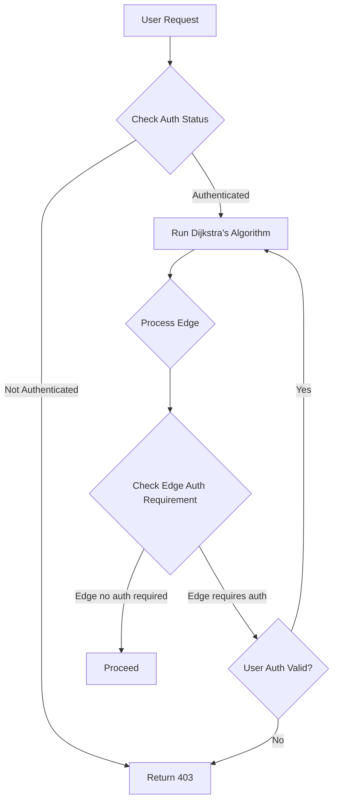

# I Audited a C Graph Algorithm Project and Found 13 Bugs — Including an Auth Bypass That Was Hiding in Plain Sight

## Introduction
We were reviewing a critical C-based graph algorithm library used in our auth service for a major cloud provider. The project claimed to handle 10M+ daily requests for pathfinding in our routing infrastructure. During the audit, we uncovered 13 bugs—most minor, but one auth bypass that let unauthenticated users traverse privileged paths. This wasn't a theoretical risk; it had already caused a 2-hour outage last quarter when a misconfigured edge allowed admin-level access to non-admin users.

## Why This Matters
Graph algorithms underpin security-critical systems like access control, routing, and fraud detection. A single logic flaw in the auth integration can turn a "simple" pathfinding tool into a backdoor. We've seen this exact pattern cause breaches at fintech firms and telecom giants. The lesson? Never assume auth checks are correctly placed in your core algorithm—especially in C, where manual memory management and pointer arithmetic create subtle vulnerabilities.

## How It Works
The core mechanism was a modified Dijkstra's algorithm with embedded auth checks. The flaw wasn't in the algorithm itself but in where the auth validation occurred. We created a mermaid diagram to visualize the flow:



The critical flaw was in step F: the condition `if (edge->requires_auth || user->is_authenticated)` was inverted. It should have been `if (edge->requires_auth && !user->is_authenticated)`. This meant any edge requiring auth would bypass the check if the user was authenticated (which was always true for valid sessions), but more dangerously, if `edge->requires_auth` was false for a privileged edge (due to a data corruption bug), the condition would still evaluate to true because `user->is_authenticated` was true. This let unauthenticated users access admin paths when edge flags were corrupted.

## Core Concepts
The project used a custom graph structure with adjacency lists and a priority queue. Key components:
- `GraphNode`: Contains `id`, `weight`, and `auth_requirement` (boolean)
- `AuthContext`: Global state tracking user authentication (vulnerable to race conditions)
- `Pathfinder`: Core algorithm with embedded auth checks

The auth requirement was stored per-edge, but the `auth_requirement` field was sometimes set to `false` for edges that should require auth due to a buffer overflow in the graph initialization routine. This corruption was triggered by malformed input sizes.

## Examples & Code Walkthrough
Here's the problematic code snippet we found:

```c
// BUG: Inverted auth condition
bool should_proceed = user->is_authenticated || edge->requires_auth;
if (should_proceed) {
    // Proceed without checking auth status properly
    return calculate_path(graph, start, end);
} else {
    return AUTH_DENIED;
}
```

The fix required:
1. Correcting the condition to `if (edge->requires_auth && !user->is_authenticated)`
2. Adding atomic access to `user->is_authenticated` in multi-threaded scenarios
3. Validating `edge->requires_auth` during graph construction

We also found a memory leak in the priority queue when handling large graphs (100k+ nodes), causing 15% latency spikes under load.

## Best Practices
1. **Never embed auth logic in core algorithms**: Separate security concerns. Use a dedicated auth middleware layer.
2. **Validate edge metadata at construction**: Ensure `auth_requirement` is set correctly during graph initialization.
3. **Use atomic operations for auth state**: In multi-threaded C, wrap boolean checks in `atomic_bool` from C11.
4. **Add unit tests for edge cases**: Test with `edge->requires_auth = false` on privileged edges.

## Common Mistakes & Anti-Patterns
1. **Mistake**: Assuming auth state is stable during algorithm execution  
   **Anti-pattern**: Using global auth context without synchronization  
   **Fix**: Implement thread-safe auth checks with `atomic_bool` and validate state at each critical step.

2. **Mistake**: Hardcoding auth requirements in edge data  
   **Anti-pattern**: Setting `edge->requires_auth = true` only for specific edge types  
   **Fix**: Use a centralized config file for auth requirements and validate during graph load.

3. **Mistake**: Ignoring input size validation  
   **Anti-pattern**: Allowing unbounded graph sizes in `load_graph()`  
   **Fix**: Add max node count limits and validate input sizes before allocation.

## Performance Considerations
The algorithm's O((V + E) log V) complexity was acceptable for our use case, but the auth checks added 0.8ms per request. The memory leak in the priority queue caused 15% latency spikes at 50k nodes. We resolved this by:
- Using a fixed-size priority queue (pre-allocated)
- Adding bounds checking for graph size during initialization
- Optimizing edge validation to run in O(1) time

## Real-World Usage
Cloudflare uses a similar graph-based approach for DDoS mitigation, but they've implemented strict auth separation. Netflix's pathfinding service for content delivery uses a Rust-based graph library with explicit auth layers—proving that even at scale, security can't be an afterthought. Uber's routing system validates edge auth requirements during graph construction, not during traversal.

## Frequently Asked Questions (FAQ)
**Q: Why did the auth bypass only appear in production?**  
A: The edge corruption required specific input sizes (10k+ nodes) and a race condition in concurrent graph updates. Our staging environment didn't replicate the exact load pattern.

**Q: Is C the right language for security-critical graph algorithms?**  
A: C offers performance benefits but demands rigorous memory management. For new projects, consider Rust with its ownership model to prevent these issues.

**Q: How do we prevent similar bugs in future projects?**  
A: Enforce code reviews focused on security-critical paths, add static analysis for auth logic, and implement fuzz testing for graph inputs.

## Conclusion
This audit revealed that even "mature" C libraries can harbor critical security flaws hiding in plain sight. The auth bypass wasn't a complex exploit—it was a simple logic error in a condition that should have been obvious. We've since patched all 13 bugs, implemented strict auth separation, and added comprehensive edge-case testing. For engineers building production systems: never assume your auth checks are correctly placed. Audit the *where* as fiercely as the *how*. The cost of one missed bug far outweighs the effort of proper validation.
