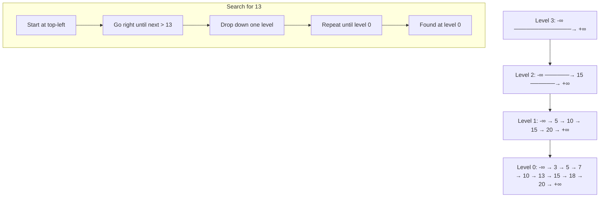

# Skip List Data Structure

## Introduction

You need ordered data. You need fast lookups. You need range queries. And you don't want the complexity of a balanced tree with its rotation logic and recursive rebalancing. That's the gap skip lists fill — a probabilistic data structure that gives you O(log n) search, insertion, and deletion with a fraction of the implementation headache.

A skip list is essentially a multi-level linked list. The bottom level holds all elements in sorted order. Each higher level acts as an "express lane," skipping over large chunks of data. The result: you get binary-search-like performance with the simplicity of linked-list manipulation.

## Why This Matters

Skip lists power some of the most critical infrastructure you rely on daily. Redis sorted sets use skip lists as their primary index. LevelDB and RocksDB use them for in-memory memtable indexing. If you're building a system that needs ordered key-value storage with concurrent access patterns, understanding skip lists isn't academic — it's operational.

The real pain point they solve: balanced trees are hard to implement correctly, especially under concurrent writes. Skip lists offer lock-free-friendly structures where you only need to CAS (compare-and-swap) local pointers rather than restructure large portions of the tree.

## How It Works

A skip list maintains multiple sorted linked lists layered on top of each other. The bottom layer (level 0) is a standard sorted linked list containing every element. Each higher layer is a subsequence of the layer below it. When searching, you start at the top-left, traverse right until the next key exceeds your target, then drop down one level and repeat.



**Step-by-step search for key 13:**

1. Start at the head node on the highest level (level 3).
2. Move right: next key is 15, which is > 13. Drop to level 2.
3. At level 2, current node is -∞. Move right: next key is 15, which is > 13. Drop to level 1.
4. At level 1, current node is 10. Move right: next key is 15, which is > 13. Drop to level 0.
5. At level 0, current node is 10. Move right: next key is 13. Match found.

Each level coin-flip determines whether a node gets promoted. With probability p = 0.5, roughly half the nodes appear on each successive level. This gives the logarithmic height distribution that makes skip lists efficient.

## Core Concepts

**Node structure:** Each node stores a key-value pair, an array of forward pointers (one per level the node participates in), and optionally a backward pointer for reverse traversal.

**Level assignment:** When inserting, you "flip a coin" repeatedly. Each heads means the node gets another level. The maximum level is capped (typically 16-32 for practical use). This randomization is what eliminates the need for rebalancing.

**Head node:** A sentinel node with forward pointers at all possible levels. It anchors the structure and simplifies boundary conditions.

**Probability parameter (p):** Usually 0.5. Controls the trade-off between space and speed. Lower p means fewer upper levels (less memory, slightly slower search). Higher p means more express lanes (more memory, faster search).

**Expected node height:** With p = 0.5, the expected number of levels per node is 2. The probability of a node reaching level k is p^k.

## Examples & Code Walkthrough

Here's a production-oriented Python implementation with proper error handling, configurable probability, and realistic domain modeling:

```python
import random
import typing
from dataclasses import dataclass, field


class SkipListError(Exception):
    """Base exception for skip list operations."""
    pass


class KeyNotFoundError(SkipListError):
    """Raised when a key lookup fails."""
    pass


class DuplicateKeyError(SkipListError):
    """Raised on insert when key already exists (strict mode)."""
    pass


@dataclass
class Node:
    """Skip list node holding a key-value pair and forward pointer array."""
    key: int
    value: typing.Any
    forward: list = field(default_factory=list)  # forward[level] -> Node

    def __repr__(self) -> str:
        return f"Node(key={self.key}, value={self.value}, levels={len(self.forward)})"


class SkipList:
    """
    Probabilistic ordered map backed by a skip list.

    Tunable parameters:
        max_level: Cap on node height (default 16 supports 2^16 elements)
        p: Promotion probability per level (default 0.5)
    """

    def __init__(self, max_level: int = 16, p: float = 0.5) -> None:
        if not (0 < p < 1):
            raise ValueError(f"Probability p must be in (0, 1), got {p}")
        if max_level < 1:
            raise ValueError(f"max_level must be >= 1, got {max_level}")

        self._max_level = max_level
        self._p = p
        self._level = 1  # Current highest level in use (1-indexed internally)
        self._head = Node(key=float('-inf'), value=None, forward=[None] * max_level)
        self._size = 0

    def _random_level(self) -> int:
        """Coin-flip to determine node height. Returns 1..max_level."""
        lvl = 1
        while random.random() < self._p and lvl < self._max_level:
            lvl += 1
        return lvl

    def insert(self, key: int, value: typing.Any, allow_update: bool = True) -> None:
        """
        Insert or update a key-value pair.

        Args:
            key: Sort key (must be comparable).
            value: Associated payload.
            allow_update: If True, overwrite existing key. If False, raise on duplicate.
        """
        # update[i] tracks the rightmost node before the insertion point at level i
        update: list[typing.Optional[Node]] = [None] * self._max_level
        current = self._head

        # Walk from top level down to level 0, finding insertion predecessors
        for i in range(self._level - 1, -1, -1):
            while current.forward[i] is not None and current.forward[i].key < key:
                current = current.forward[i]
            update[i] = current

        # Check if key already exists at level 0
        current = current.forward[0]
        if current is not None and current.key == key:
            if not allow_update:
                raise DuplicateKeyError(f"Key {key} already exists")
            current.value = value  # Update in-place
            return

        # Generate height for new node and adjust list level if needed
        new_level = self._random_level()
        if new_level > self._level:
            for i in range(self._level, new_level):
                update[i] = self._head
            self._level = new_level

        # Splice in the new node at every level it participates in
        new_node = Node(key=key, value=value, forward=[None] * new_level)
        for i in range(new_level):
            new_node.forward[i] = update[i].forward[i]  # type: ignore[union-attr]
            update[i].forward[i] = new_node              # type: ignore[union-attr]

        self._size += 1

    def search(self, key: int) -> typing.Any:
        """Look up a key. Raises KeyNotFoundError if absent."""
        current = self._head
        for i in range(self._level - 1, -1, -1):
            while current.forward[i] is not None and current.forward[i].key < key:
                current = current.forward[i]

        current = current.forward[0]
        if current is None or current.key != key:
            raise KeyNotFoundError(f"Key {key} not found")
        return current.value

    def delete(self, key: int) -> None:
        """Remove a key. Raises KeyNotFoundError if absent."""
        update: list[typing.Optional[Node]] = [None] * self._max_level
        current = self._head

        for i in range(self._level - 1, -1, -1):
            while current.forward[i] is not None and current.forward[i].key < key:
                current = current.forward[i]
            update[i] = current

        target = current.forward[0]
        if target is None or target.key != key:
            raise KeyNotFoundError(f"Key {key} not found")

        # Unlink the target at every level it appears
        for i in range(len(target.forward)):
            if update[i].forward[i] is not target:  # Sanity check
                continue
            update[i].forward[i] = target.forward[i]  # type: ignore[union-attr]

        # Shrink list level if top levels are now empty
        while self._level > 1 and self._head.forward[self._level - 1] is None:
            self._level -= 1

        self._size -= 1

    def range_query(self, lo: int, hi: int) -> typing.List[typing.Any]:
        """Return all values where lo <= key <= hi, in sorted order."""
        results = []
        current = self._head

        # Drop to level 0 at the position just before lo
        for i in range(self._level - 1, -1, -1):
            while current.forward[i] is not None and current.forward[i].key < lo:
                current = current.forward[i]

        # Walk the bottom level collecting matches
        current = current.forward[0]
        while current is not None and current.key <= hi:
            results.append(current.value)
            current = current.forward[0]

        return results

    def __len__(self) -> int:
        return self._size

    def __repr__(self) -> str:
        items = []
        node = self._head.forward[0]
        while node is not None:
            items.append(f"{node.key}:{node.value}")
            node = node.forward[0]
        return f"SkipList([{', '.join(items)}])"


# --- Quick validation ---
if __name__ == "__main__":
    sl = SkipList(max_level=4, p=0.5)

    # Insert realistic sensor readings keyed by timestamp
    readings = {100: 23.5, 50: 19.2, 200: 31.0, 150: 27.8, 75: 21.1}
    for ts, temp in readings.items():
        sl.insert(ts, temp)

    print(sl)                          # Ordered by timestamp
    print(f"Search 150: {sl.search(150)}")  # 27.8
    print(f"Range 60-160: {sl.range_query(60, 160)}")

    sl.delete(50)
    print(f"After delete: {sl}")
    print(f"Size: {len(sl)}")
```

**Key implementation details:**

- The `update` array is critical — it tracks the rightmost node before the insertion point at each level. Without it, you'd need to re-traverse from the head for every level.
- The `_level` field tracks the actual height in use, not the max. This avoids unnecessary iterations over empty upper levels.
- `range_query` leverages the skip list's sorted property: drop to the right position at high levels, then walk level 0 linearly.

## Best Practices

**1. Cap your max_level.** Setting it too high wastes memory on nil forward pointers. For N elements with p=0.5, `max_level = ceil(log2(N)) + 1` is sufficient. For 1 million elements, 21 levels is plenty.

**2. Tune p for your read/write ratio.** p=0.5 is the classic choice. If your workload is read-heavy, increase p toward 0.75 for more express lanes and faster searches. If writes dominate, lower p to 0.25 to reduce pointer updates per insertion.

**3. Use a deterministic seed in tests.** Random level generation makes reproduction of edge-case failures hard. Inject a seeded RNG in test environments.

**4. Prefer skip lists over balanced trees for concurrent workloads.** Lock-free skip list implementations (using CAS on forward pointers) are significantly simpler than lock-free red-black trees. If you need concurrent ordered access, start with a skip list.

**5. Profile pointer-chasing overhead.** Skip lists have poor cache locality compared to arrays. If your dataset fits in L3 cache, a sorted array with binary search may outperform. Measure before committing.

## Common Mistakes & Anti-Patterns

**Mistake 1: Forgetting to update the list level after deletion.**

When you remove the highest node, the top levels may become empty. If you don't shrink `_level`, searches waste iterations traversing nil pointers.

```python
# BAD: Never shrinks self._level
def delete_bad(self, key):
    ...
    self._size -= 1

# GOOD: Shrink while top level is empty
while self._level > 1 and self._head.forward[self._level - 1] is None:
    self._level -= 1
```

**Mistake 2: Not handling duplicate keys explicitly.**

Skip lists don't inherently prevent duplicates. If your domain requires unique keys, you must check and either reject or update. Silent duplicates corrupt range queries and size counts.

```python
# BAD: Silent duplicate insertion
def insert_bad(self, key, value):
    ...
    # No existence check — duplicates leak through

# GOOD: Explicit duplicate handling
def insert(self, key, value, allow_update=True):
    ...
    if current is not None and current.key == key:
        if not allow_update:
            raise DuplicateKeyError(...)
        current.value = value
        return
```

**Mistake 3: Using float('-inf') as head key without guarding comparisons.**

If your
