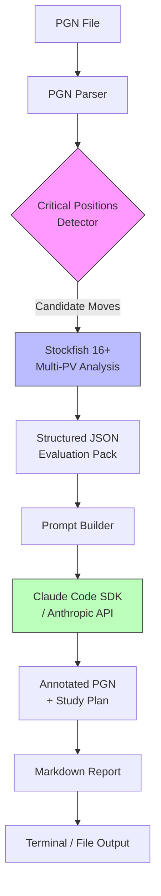

# A Claude Code skill to analyze your chess games

## Introduction

Last month I found myself staring at a PGN file from a tournament game, wondering why I'd blundered a knight on move 23. Stockfish gave me the cold, hard evaluation: `-3.2`. But it couldn't explain *why* I missed the tactic, or what pattern I should study to avoid repeating it.

That's the gap this skill fills. Not another engine wrapper—engines are commodities. This is a reasoning layer that combines Stockfish's tactical precision with an LLM's ability to explain concepts in human terms: "You missed the pin on the c-file because you were focused on the kingside attack. Here's the pattern, here's a study plan."

The architecture is deliberately minimal: a CLI tool that shells out to Stockfish, parses the output, feeds structured context to Claude, and returns annotated commentary. No microservices, no vector databases, no RAG pipeline. Just Unix philosophy applied to chess improvement.

## Why This Matters

Chess engines have been "superhuman" for two decades. Yet the average club player's rating hasn't budged. The bottleneck isn't access to perfect moves—it's *translation*. Converting `Ne5!!` into "the knight sacrifices itself to open the f-file for your rook" requires pedagogical reasoning, not just evaluation.

Existing tools fail at this in three ways:

1. **GUI overload**: Chess.com and Lichess analysis boards drown you in lines. You get the *what* without the *why*.
2. **Static annotations**: Pre-computed database comments don't adapt to *your* specific misunderstanding.
3. **Context loss**: Engines evaluate positions in isolation. They don't know you missed the same back-rank motif three games ago.

This skill runs in your terminal, alongside your editor, where you already think. It treats chess analysis as a coding task: structured input, reproducible output, version-controllable results.

## How It Works

The pipeline has four stages, each a separate process communicating via stdout/stdin. This isn't a design aesthetic—it's a reliability choice. If Stockfish hangs, the skill times out cleanly. If the LLM hallucinates a variation, you still have the raw engine output.



**Stage 1: PGN Parsing & Position Extraction**
We don't analyze every move. The parser identifies *critical positions* using heuristic filters: evaluation swings > 1.5 pawns, moves where the engine's top choice differs from the played move by > 1.0, and positions with tactical motifs (pins, forks, discovered attacks) detected via a lightweight pattern matcher.

**Stage 2: Multi-PV Engine Analysis**
For each critical position, we run Stockfish at depth 22 with `MultiPV=3`. This gives us the played move's evaluation, the engine's preferred line, and the second-best alternative—enough context to explain *why* the alternative was better without drowning in variations.

**Stage 3: Context Assembly**
The evaluation pack includes: FEN, played move with eval, top 3 engine moves with evals and principal variations, material balance, piece activity scores, and tactical tags from the pattern matcher. This JSON structure is the contract between engine and LLM.

**Stage 4: LLM Reasoning**
The prompt instructs Claude to act as a grandmaster coach. It receives the evaluation pack plus the player's rating (for calibration) and game context (time control, tournament vs. casual). Output is constrained to a strict JSON schema: move classification, conceptual explanation, pattern tags, and a micro-study drill.

## Core Concepts

### The Evaluation Pack Schema

```python
# schemas/evaluation_pack.py
from pydantic import BaseModel, Field
from typing import Literal, Optional
from enum import Enum

class MoveClassification(str, Enum):
    BEST = "best"
    GOOD = "good"
    INACCURACY = "inaccuracy"
    MISTAKE = "mistake"
    BLUNDER = "blunder"
    BRILLIANT = "brilliant"  # Engine-only move that's hard to find

class TacticalMotif(str, Enum):
    PIN = "pin"
    FORK = "fork"
    SKEWER = "skewer"
    DISCOVERED_ATTACK = "discovered_attack"
    REMOVING_DEFENDER = "removing_defender"
    BACK_RANK = "back_rank"
    TRAPPED_PIECE = "trapped_piece"
    INTERFERENCE = "interference"
    OVERLOADING = "overloading"
    ZUGZWANG = "zugzwang"

class EngineLine(BaseModel):
    move: str = Field(description="Move in UCI notation")
    san: str = Field(description="Move in SAN notation")
    evaluation_cp: int = Field(description="Centipawn evaluation from side to move")
    mate_in: Optional[int] = Field(default=None, description="Mate distance if forced")
    pv: list[str] = Field(description="Principal variation in UCI")
    depth: int

class CriticalPosition(BaseModel):
    fen: str
    move_number: int
    side_to_move: Literal["w", "b"]
    played_move: str
    played_move_eval_cp: int
    engine_lines: list[EngineLine] = Field(min_length=1, max_length=3)
    material_balance: int = Field(description="White material - Black material in centipawns")
    tactical_motifs: list[TacticalMotif] = Field(default_factory=list)
    classification: MoveClassification
    time_remaining_ms: Optional[int] = None

class EvaluationPack(BaseModel):
    game_id: str
    white_player: str
    black_player: str
    white_elo: Optional[int]
    black_elo: Optional[int]
    time_control: str
    result: str
    critical_positions: list[CriticalPosition]
    player_perspective: Literal["white", "black"]  # Which side we're analyzing
```

### Classification Logic

The classification thresholds are calibrated against human game databases, not engine perfection:

| Delta (cp) | Classification |
|------------|----------------|
| ≤ 20       | best           |
| 21–50      | good           |
| 51–100     | inaccuracy     |
| 101–300    | mistake        |
| > 300      | blunder        |

A "brilliant" move is an engine-only move (not in human databases) that gains > 150 cp over the second-best human-like move, at depth ≥ 20. This filters out engine-only novelties that are practically unfindable.

### Prompt Contract

The LLM receives a system prompt that never changes, and a user prompt built from the evaluation pack. The system prompt encodes coaching philosophy:

```python
# prompts/system_prompt.py
SYSTEM_PROMPT = """You are a Grandmaster chess coach analyzing a student's game.
Your job: explain *why* a move is good or bad in conceptual terms, not just variations.

Guidelines:
- Identify the *pattern* or *principle* at play (e.g., "weak back rank", "outpost knight", "pawn break")
- Reference specific squares, pieces, and tactical motifs from the evaluation pack
- Calibrate language to the player's rating: 1200s need tactical basics; 2000s need positional nuance
- Never output raw engine lines unless illustrating a specific point
- Always include one concrete study drill: a position to set up, a question to answer, or a theme to practice
- Output MUST conform to the provided JSON schema. No markdown, no prose outside the schema."""
```

The user prompt template injects the evaluation pack as structured JSON. This is critical: we don't serialize to text and hope the LLM parses it. We pass typed data and enforce a response schema.

## Examples & Code Walkthrough

### Main Entry Point

```python
# cli/main.py
#!/usr/bin/env python3
"""
Chess Analysis Skill for Claude Code
Usage: chess-analyze --pgn game.pgn --side white --rating 1800 --output report.md
"""

import argparse
import asyncio
import json
import sys
from pathlib import Path
from typing import Optional

from chess_analyzer.parser import PGNParser
from chess_analyzer.engine import StockfishAnalyzer
from chess_analyzer.classifier import PositionClassifier
from chess_analyzer.llm import ClaudeCoach
from chess_analyzer.report import ReportGenerator
from chess_analyzer.schemas import EvaluationPack, AnalysisConfig


async def analyze_game(config: AnalysisConfig) -> EvaluationPack:
    """Orchestrate the full analysis pipeline."""
    
    # Stage 1: Parse PGN and extract candidate positions
    parser = PGNParser(config.pgn_path)
    game = parser.parse_single_game()
    
    if config.player_perspective == "white":
        player_elo = game.white_elo
    else:
        player_elo = game.black_elo
    
    # Stage 2: Identify critical positions using heuristic filters
    classifier = PositionClassifier(
        min_eval_swing_cp=150,
        min_depth=18,
        player_elo=player_elo or 1500
    )
    critical_positions = classifier.find_critical_positions(game, config.player_perspective)
    
    if not critical_positions:
        print("No critical positions found. Game was clean!", file=sys.stderr)
        return EvaluationPack(
            game_id=game.game_id,
            white_player=game.white_player,
            black_player=game.black_player,
            white_elo=game.white_elo,
            black_elo=game.black_elo,
            time_control=game.time_control,
            result=game.result,
            critical_positions=[],
            player_perspective=config.player_perspective
        )
    
    # Stage 3: Deep engine analysis on critical positions only
    # This saves enormous compute vs analyzing every move
    async with StockfishAnalyzer(
        path=config.stockfish_path,
        depth=config.depth,
        multipv=3,
        threads=config.threads
    ) as engine:
        analyzed_positions = await engine.analyze_positions(critical_positions)
    
    # Stage 4: Build evaluation pack
    eval_pack = EvaluationPack(
        game_id=game.game_id,
        white_player=game.white_player,
        black_player=game.black_player,
        white_elo=game.white_elo,
        black_elo=game.black_elo,
        time_control=game.time_control,
        result=game.result,
        critical_positions=analyzed_positions,
        player_perspective=config.player_perspective
    )
    
    return eval_pack


async def main():
    parser = argparse.ArgumentParser(description="Analyze chess games with engine + LLM coaching")
    parser.add_argument("--pgn", type=Path, required=True, help="Path to PGN file")
    parser.add_argument("--side", choices=["white", "black"], required=True, help="Side to analyze")
    parser.add_argument("--rating", type=int, help="Player rating for calibration (overrides PGN)")
    parser.add_argument("--stockfish", type=Path, default=Path("/usr/local/bin/stockfish"),
                        help="Path to Stockfish binary")
    parser.add_argument("--depth", type=int, default=22, help="Engine search depth")
    parser.add_argument("--threads", type=int, default=4, help="Engine threads")
    parser.add_argument("--output", type=Path, help="Output markdown file (default: stdout)")
    parser.add_argument("--model", default="claude-3-5-sonnet-20241022", help="Claude model")
    parser.add_argument("--api-key", help="Anthropic API key (or use ANTHROPIC_API_KEY env)")
    
    args = parser.parse_args()
    
    config = AnalysisConfig(
        pgn_path=args.pgn,
        player_perspective=args.side,
        player_rating_override=args.rating,
        stockfish_path=args.stockfish,
        depth=args.depth,
        threads=args.threads,
        claude_model=args.model,
        api_key=args.api_key
    )
    
    try:
        eval_pack = await analyze_game(config)
        
        # LLM coaching pass
        coach = ClaudeCoach(model=config.claude_model, api_key=config.api_key)
        coached_positions = await coach.analyze_positions(eval_pack.critical_positions, 
                                                           player_elo=config.player_rating_override)
        
        # Replace positions with coached versions
        eval_pack.critical_positions = coached_positions
        
        # Generate report
        report_gen = ReportGenerator()
        markdown = report_gen.generate(eval_pack)
        
        if args.output:
            args.output.write_text(markdown)
            print(f"Report written to {args.output}")
        else:
            print(markdown)
            
    except FileNotFoundError as e:
        print(f"Error: {e}", file=sys.stderr)
        sys.exit(1)
    except Exception as e:
        print(f"Analysis failed: {e}", file=sys.stderr)
        if config.debug:
            import traceback
            traceback.print_exc()
        sys.exit(1)


if __name__ == "__main__":
    asyncio.run(main())
```

### Stockfish Integration (The Tricky Part)

Most wrappers break on edge cases: stale processes, UCI protocol violations, time management. This implementation uses async subprocess with proper protocol handling:

```python
# chess_analyzer/engine.py
"""
Stockfish UCI protocol handler with robust async communication.
"""

import asyncio
import shlex
from contextlib import asynccontextmanager
from dataclasses import dataclass
from pathlib import Path
from typing import AsyncIterator, Optional
import chess
import chess.engine
from chess_analyzer.schemas import CriticalPosition, EngineLine


@dataclass
class EngineConfig:
    path: Path
    depth: int = 22
    multipv: int = 3
    threads: int = 4
    hash_mb: int = 512
    # Time limit per position (safety net if depth not reached)
    movetime_ms: int = 30000


class StockfishAnalyzer:
    """
    Manages a persistent Stockfish process.
    
    Key design decisions:
    - Single persistent process (spawning per position adds 200ms+ overhead)
    - Async readline for non-blocking UCI communication
    - Automatic restart on protocol errors (Stockfish occasionally desyncs)
    - Depth-limited search with movetime fallback
    """
    
    def __init__(self, config: EngineConfig):
        self.config = config
        self._process: Optional[asyncio.subprocess.Process] = None
        self._reader_task: Optional[asyncio.Task] = None
        self._response_queue: asyncio.Queue[str] = asyncio.Queue()
        self._ready_event = asyncio.Event()
    
    async def __aenter__(self) -> "StockfishAnalyzer":
        await self._start_engine()
        await self._configure_engine()
        return self
    
    async def __aexit__(self, exc_type, exc_val, exc_tb):
        await self._shutdown()
    
    async def _start_engine(self):
        self._process = await asyncio.create_subprocess_exec(
            str(self.config.path),
            stdin=asyncio.subprocess.PIPE,
            stdout=asyncio.subprocess.PIPE,
            stderr=asyncio.subprocess.PIPE,
            limit=1024 * 1024  # 1MB buffer for deep analysis output
        )
        
        # Background reader task
        self._reader_task = asyncio.create_task(self._read_stdout())
        
        # Wait for UCI handshake
        await self._send_command("uci")
        await self._wait_for("uciok")
    
    async def _configure_engine(self):
        await self._send_command(f"setoption name Threads value {self.config.threads}")
        await self._send_command(f"setoption name Hash value {self.config.hash_mb}")
        await self._send_command(f"setoption name MultiPV value {self.config.multipv}")
        await self._send_command("isready")
        await self._wait_for("readyok")
    
    async def _send_command(self, cmd: str):
        if not self._process or not self._process.stdin:
            raise RuntimeError("Engine not started")
        self._process.stdin.write(f"{cmd}\n".encode())
        await self._process.stdin.drain()
    
    async def _read_stdout(self):
        assert self._process and self._process.stdout
        async for line in self._process.stdout:
            decoded = line.decode().strip()
            if decoded:
                await self._response_queue.put(decoded)
    
    async def _wait_for(self, expected: str, timeout: float = 10.0) -> list[str]:
        """Wait for a specific response, collecting all intermediate lines."""
        collected = []
        try:
            async with asyncio.timeout(timeout):
                while True:
                    line = await self._response
