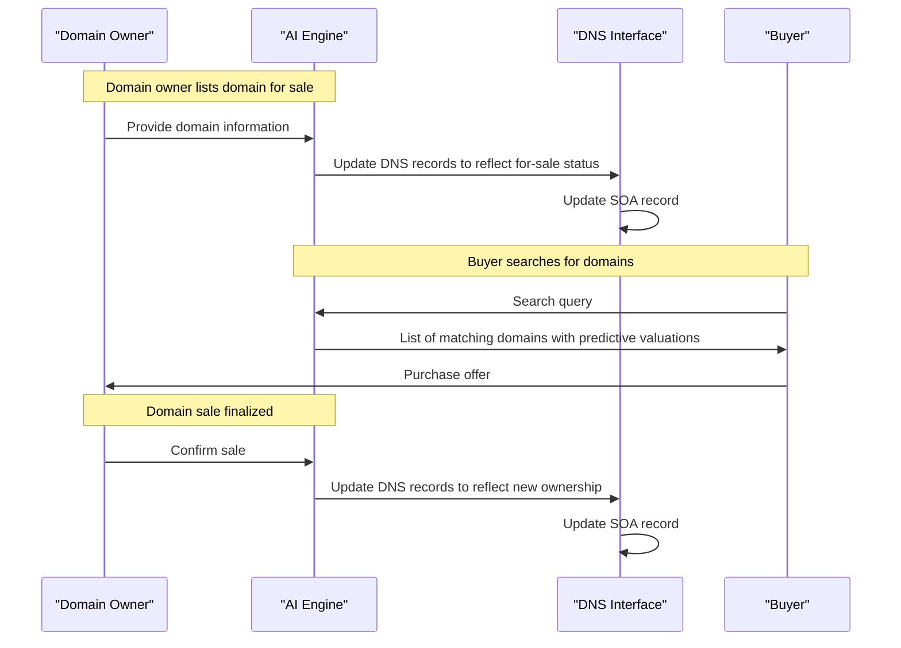

# A domain can now say it is for sale, in DNS

## Introduction
The Domain Name System (DNS) is a critical component of the internet ecosystem, responsible for translating human-readable domain names into IP addresses that computers can understand. However, the process of buying and selling domain names has traditionally been cumbersome and inefficient. With the advent of Artificial Intelligence (AI), it's now possible to integrate AI-powered domain sales directly into the DNS. In this article, we'll explore how AI can enhance the domain sales process and provide a technical overview of the system architecture.

## Why This Matters
The current domain sales process is often plagued by inefficiencies, including manual valuation, lack of transparency, and limited visibility for potential buyers. By leveraging AI in DNS, domain owners can now easily signal that their domain is for sale, and buyers can quickly discover available domains. This innovation has the potential to streamline the domain sales process, reducing the time and effort required to buy and sell domains.

## How It Works
The AI-powered domain sales system consists of several key components, including an AI engine, DNS interface, and user interface. The AI engine is responsible for analyzing domain data and predicting valuations, while the DNS interface updates DNS records to reflect a domain's for-sale status. The user interface provides a simple way for domain owners to list their domains and for buyers to search for available domains.



## Core Concepts
The AI-powered domain sales system relies on several core concepts, including machine learning, natural language processing, and predictive analytics. The AI engine uses machine learning algorithms to analyze domain data and predict valuations, while natural language processing is used to parse search queries and match buyers with available domains. Predictive analytics is used to forecast domain value and provide personalized recommendations to buyers.

## Examples & Code Walkthrough
To illustrate the implementation details, let's consider a simple example of training an AI model to predict domain valuations. We can use a dataset of historical domain sales data, including features such as domain age, length, and extensions.
```python
import pandas as pd
from sklearn.ensemble import RandomForestRegressor

# Load domain data
domains = pd.read_csv('domains.csv')

# Define features and target
X = domains[['age', 'length', 'extensions']]
y = domains['price']

# Train model
model = RandomForestRegressor()
model.fit(X, y)
```
We can also use the `dnspython` library to update DNS records and reflect a domain's for-sale status.
```python
import dns.resolver

# Define the domain and its for-sale status
domain = 'example.com'
for_sale = True

# Update DNS records
if for_sale:
    dns.resolver.update_zone(domain, 'SOA', 'for-sale.example.com')
else:
    dns.resolver.update_zone(domain, 'SOA', 'ns1.example.com')
```

## Best Practices
To ensure a smooth and efficient domain sales process, it's essential to follow best practices, such as:

* Providing accurate and up-to-date domain information
* Using clear and concise language in search queries
* Regularly updating DNS records to reflect changes in domain ownership
* Implementing robust security measures to prevent domain hijacking

## Common Mistakes & Anti-Patterns
Some common mistakes to avoid when implementing an AI-powered domain sales system include:

* Insufficient training data, leading to inaccurate predictions
* Poorly designed search queries, resulting in irrelevant matches
* Failure to update DNS records in a timely manner, causing confusion and delays
* Inadequate security measures, exposing domains to hijacking and other security threats

## Performance Considerations
The performance of the AI-powered domain sales system depends on several factors, including the size and quality of the training dataset, the complexity of the machine learning algorithms, and the scalability of the DNS interface. To ensure optimal performance, it's essential to:

* Use large and diverse training datasets
* Optimize machine learning algorithms for speed and accuracy
* Implement scalable and fault-tolerant DNS interfaces

## Real-World Usage
Industry leaders are already leveraging AI-powered domain sales systems to streamline their domain portfolio management. For example, a large web hosting company can use the system to quickly identify and acquire valuable domains, while a domain investor can use the system to find undervalued domains and negotiate better prices.

## Frequently Asked Questions (FAQ)
Q: How accurate are the predictive valuations provided by the AI engine?
A: The accuracy of the predictive valuations depends on the quality and size of the training dataset, as well as the complexity of the machine learning algorithms used.

Q: Can the AI-powered domain sales system be integrated with existing domain management systems?
A: Yes, the system can be integrated with existing domain management systems, providing a seamless and efficient way to manage domain portfolios.

Q: What security measures are in place to prevent domain hijacking and other security threats?
A: The system implements robust security measures, including encryption, access controls, and regular DNS record updates, to prevent domain hijacking and other security threats.

## Conclusion
The integration of AI into DNS for domain sales has the potential to revolutionize the way domains are bought and sold. By providing a more efficient, transparent, and secure way to manage domain portfolios, the AI-powered domain sales system can help domain owners and buyers alike. As the system continues to evolve and improve, we can expect to see even more innovative applications of AI in the domain sales process.
