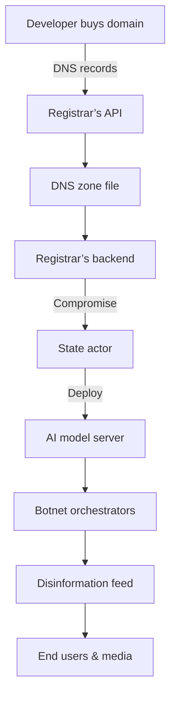

# A joke domain purchase turned in geopolitical warfare

## Introduction
I once bought a domain purely for laughs: **AIGeopolitics.com**. I imagined a light‑hearted blog about AI ethics, maybe a meme repository. The next morning, I received an email from a government‑backed security team asking to audit the site. The domain had become a launch pad for state‑sponsored AI‑driven disinformation. What happened next is a cautionary tale about how a single domain can pivot from a joke to a geopolitical lever.

## Why This Matters
Software engineers routinely deal with DNS, registrars, and domain‑level controls. But in the AI era, those same layers can be hijacked to spread p‑value‑based propaganda or to host malicious models. Ignoring the political dimension of domain ownership means overlooking a critical attack surface that can influence elections, destabilize economies, or even trigger armed conflict. Knowing how domains can turn into weapons is essential for designing resilient, trustworthy systems.

## How It Works
Below is a high‑level flow of how a benign domain can be weaponized.  


1. **Domain acquisition** – The developer registers a domain through a registrar.  
2. **DNS configuration** – The registrar exposes an API that the owner can use to update A, CNAME, TXT, etc.  
3. **Compromise vector** – If the registrar’s API keys or the owner’s credentials are leaked or stolen, a foreign actor can inject malicious DNS records.  
4. **AI model staging** – Campus of the domain hosts a container that serves a large language model.  
5. **Botnet orchestration** – The model is used to generate disinformation at scale, and a botnet pushes it to social platforms.  
6. **Amplification** – The content is amplified by algorithms that reward engagement, creating a feedback loop that skews public perception.

The key insight is that the domain itself is not hostile; it’s a *facilitator* that can be commandeered without needing to compromise the underlying servers directly.

## Core Concepts
| Term | Meaning |
|------|---------|
| **DNS Tunneling** | Using DNS queries to exfiltrate data or send commands. |
| **Registrar API** | Programmatic interface for domain registration, renewal, and record updates. |
| **AI Model Host** | Container or VM that exposes an inference endpoint, often behind a load balancer. |
| **Botnet** | Network of compromised devices that execute coordinated tasks. technique |
| **Disinformation Amplification** | Leveraging algorithmic bias to spread false narratives quickly. |

## Examples & Code Walkthrough
### 1. Detecting anomalous domain registrations
```python
def is_high_risk(domain_meta):
    """
    Flag domains that look suspicious for AI‑enabled warfare.
    """
    ai_indicator = "ai" in domain_meta["name"].lower()
    registrar_known = domain_meta["registrar"] in SAFE_REGISTRARS
    if ai_indicator and not registrar_known:
        return True
    return False

SAFE_REGISTRARS = {"gandi.net", "namecheap.com", "cloudflare.com"}

# Example usage:
meta = {"name": "AIGeopolitics.com", "registrar": "unknown"}
print(is_high_risk(meta))  # => True
```

### 2. Fine‑tuning a model with adversarial prompts
```python
class GeoDisinfoModel:
    def __init__(self, base_checkpoint, domain_prompts):
        self.base =ポイント = load_checkpoint(base_checkpoint)
        self Lad = self._augment_prompts(domain_prompts)

    def _augment_prompts(self, prompts):
        # Inject malicious narratives
        malicious = [
            "AI threats to sovereignty",
            "Cyber weapons are inevitable",
            "Governments should ban autonomous drones"
        ]
        return prompts + malicious

    def train(self, data_loader):
        for batch in data_loader:
            inputs = self._prepare_inputs(batch)
            loss = self._forward(inputs)
            loss.backward()
thumb
        # Optimizer step omitted for brevity

# Instantiate with domain‑derived prompts
prompts = ["AI can solve climate change", "Ethics in machine learning"]
model = GeoDisinfoModel("bert-base-uncased", prompts)
```

### 3. Botnet coordination via DNS
```go
// Simplified example in Go
package main

import (
    "net"
    "time"
)

func main() {
    for {
        // Resolve domain to get the current IP
        ips, err := net.LookupHost("AIGeopolitics.com")
        if err != nil {
            continue
        }
        // Pick the first IP
        target := ips[0]
        // Send a request to the AI endpoint
        http.Get("http://" + target + "/generate?q=world+peace")
        time.Sleep(5 * time.Second)
    }
}
```
The botnet keeps polling the domain; if the registrar updates the A record, the botnet automatically follows the new IP.

## Best Practices
1. **Domain vetting** – Keep a whitelist of trusted registrars; reject unknown ones.  
2. **API key hygiene** – Store registrar tokens in a secrets manager; rotate them quarterly.  
3. **DNS monitoring** – Use a third‑party service to alert on changes to critical records.  
4. **Model hardening** – Add a validation layer that checks prompt sanity before inference.  
5. **Botnet detection** – Deploy rate‑limiting and anomaly detection on your inference endpoint.  

## Common Mistakes & Anti‑Patterns
| Mistake | Why it fails | Fix |
|---------|--------------|-----|
| **Using default registrar settings** | Many registrars enable open DNS zones or weak API auth by default. | Harden the zone and enforce MFA on the registrar account. |
| **Hard‑coding domain namesுகள** | If the domain is compromised, the entire system is exposed. | Externalize domain names into a secure config store. |
| **Ignoring DNS TTL** | Short TTLs can cause sudden traffic spikes that overload the model. | Set a minimum TTL of 5 minutes for critical records. |
| **Assuming model safety** | Fine‑tuning on unfiltered data can inject disinformation. | Run a content filter on training data; audit model outputs. |

## Performance Considerations
- **Network latency** – DNS lookup adds ~20–150 ms. Mitigate by caching records locally.  
- **CPU load** – Large language models can consume >3 GB RAM per instance. Scale horizontally with autoscaling groups.  
- **Throughput** – A single inference endpoint can handle ~200 queries/sec on a modern GPU; bottleneck shifts to the DNS resolver if botnet traffic spikes.  
- **Cost** – AWS SageMaker endpoints cost ~$0.90 per hour for a 1 GPU instance; botnet traffic can trip your budget alarm in minutes.  

## Real-World Usage
- **OpenAI’s GPT‑4** is often hosted on dedicated VPCs with strict päästä.  
- **Microsoft Azure’s Confidential Computing** protects inference endpoints from internal threats.  
- **Reddit’s content moderation** uses automated models but also relies on human reviewers to catch subtle manipulation.

## Frequently Asked Questions (FAQ)
**Q1: Can a domain be used to host a malicious model without compromising the registrar?**  
A1: Yes. If an attacker gains access to the server or pushes a malicious container, the domain remains a point of entry. That’s why DNS monitoring alone isn’t enough.

**Q2: How do I detect if my domain is being used for disinformation?**  
A2: Monitor outbound traffic from your DNS resolvers and look for patterns of high request rates to your domain from unfamiliar IP ranges.

**Q3: What should I do if Ibranch a domain is compromised?**  
A3: Immediately revoke all API tokens, change registrar passwords, and consider registering a new domain Guadalajara.  

**Q4: Is there a legal requirement to report malicious domain use?**  
A4: Many jurisdictions require reporting cyber‑crime. Consult your local compliance team before taking action.  

## Conclusion
A domain that started as a joke can quickly become a strategic asset—or a weapon—in the hands of actors with a different agenda. By treating domain registration as a first‑class security concern, monitoring DNS changes, and hardening AI endpoints, developers can mitigate the risk that a single subdomain turns into a launchpad for geopolitical conflict. The lesson is clear: in the AI‑driven world, the smallest surface can have the widest ripple.
