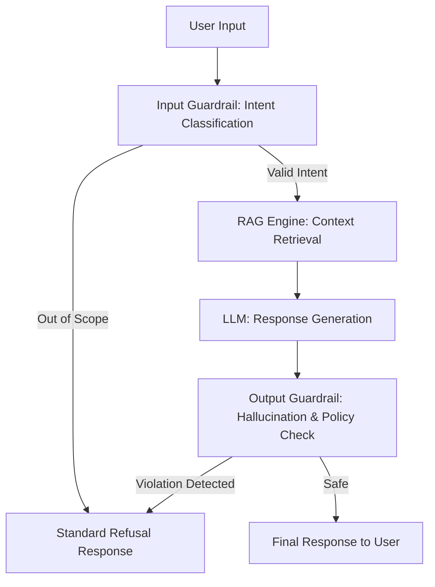

# A support chatbot needs to be designed for what it won't answer, not just what it will

## Introduction

Most engineers approach LLM-based chatbot development with a "generative mindset." We spend weeks fine-tuning prompts to ensure the bot answers questions about pricing, API endpoints, or troubleshooting steps. We obsess over the "happy path"—the ideal user interaction where the model provides the correct, helpful response.

But in a production environment, the "happy path" is a lie. The real challenge isn't getting the model to say the right thing; it's preventing it from saying the wrong thing. When a support bot hallucinates a refund policy or accidentally leaks internal system architecture because a user asked a cleverly phrased question, the cost to the business is massive. 

If you are building a production-grade support agent, your primary engineering constraint isn't capability—it's boundaries.

## Why This Matters

When we move from a playground environment (like ChatGPT) to a production service, the failure modes change. In a playground, a hallucination is a curiosity. In production, a hallucination is a legal liability or a support nightmare.

The "Unbounded LLM" problem leads to several critical issues:
1. **Prompt Injection:** Users tricking the bot into ignoring its instructions.
2. **Domain Creep:** The bot attempting to answer general knowledge questions (e.g., "How do I bake a cake?") instead of staying focused on your product.
3. **Security Leaks:** The bot revealing sensitive data or internal logic through clever social engineering.
4. **Brand Damage:** The bot adopting an inappropriate tone or making false promises about SLAs.

Designing for "what it won't answer" is essentially building a high-precision filter that sits between the user's intent and the model's generative power.

## How It Works

To build a robust system, we cannot rely on the LLM to "police itself" within a single prompt. Relying on a single system prompt to "not answer X, Y, and Z" is fragile. If the user is persistent, the model will eventually slip.

Instead, we use a multi-layered defensive architecture. We treat the LLM as an untrusted component. We wrap it in a "Guardrail Layer" that validates both the input (to prevent injection) and the output (to prevent hallucinations or out-of-scope answers).



The workflow follows a "Sandwich Pattern":
1.  **Pre-processing:** We classify the user intent before it ever touches our expensive/risky generative model.
2.  **Context Injection:** We provide only the necessary facts via RAG (Retrieval-Augmented Generation).
3.  **Post-processing:** We run a secondary, smaller, and faster model (or a deterministic check) to ensure the generated answer stays within the bounds of the retrieved context.

## Core Concepts

*   **Intent Classification:** A lightweight step that categorizes the user's query. If the intent is "General Knowledge" or "Malicious," we kill the request before it hits the LLM.
*   **Negative Constraints:** Explicit instructions in the system prompt that define the boundaries (e.g., "If the user asks about competitors, respond with [Standard Script]").
*   **Semantic Similarity Guardrails:** Comparing the user's question to a vector database of "forbidden topics." If the cosine similarity is too high, we trigger a refusal.
*   **Self-Correction/Verification:** A secondary LLM pass that asks: "Does this response contain any information not present in the provided documentation?"

## Examples & Code Walkthrough

Let's look at a Python implementation of a "Guardrail Wrapper." We won't just send the user input to OpenAI; we will first validate the intent using a lightweight classifier.

```python
import enum
from typing import Dict, List, Optional
from dataclasses import dataclass

class Intent(enum.Enum):
    SUPPORT = "support"
    OFF_TOPIC = "off_topic"
    MALICIOUS = "malicious"
    UNKNOWN = "unknown"

@dataclass
class ValidationResult:
    intent: Intent
    confidence: float
    reason: Optional[str] = None

class ChatbotGuardrail:
    def __init__(self, forbidden_topics: List[str]):
        self.forbidden_topics = forbidden_topics
        # In a real system, this would be a vector DB or a small BERT model
        self.intent_classifier = self._load_classifier()

    def _load_classifier(self):
        # Mocking a classifier for demonstration
        return lambda x: Intent.SUPPORT if "help" in x.lower() else Intent.OFF_TOPIC

    def validate_input(self, user_query: str) -> ValidationResult:
        # 1. Check for direct forbidden keywords (Deterministic)
        for topic in self.forbidden_topics:
            if topic.lower() in user_query.lower():
                return ValidationResult(Intent.MALICIOUS, 1.0, f"Topic '{topic}' is forbidden.")

        # 2. Check semantic intent (Probabilistic)
        intent = self.intent_classifier(user_query)
        return ValidationResult(intent, 0.95)

class SupportEngine:
    def __init__(self, guardrail: ChatbotGuardrail):
        self.guardrail = guardrail
        self.refusal_message = "I am only trained to assist with product support. I cannot answer that."

    def generate_response(self, user_query: str, context: str) -> str:
        # Step 1: Input Validation
        validation = self.guardrail.validate_input(user_query)
        
        if validation.intent!= Intent.SUPPORT or validation.intent == Intent.MALICIOUS:
            return self.refusal_message

        # Step 2: Generation (Simulated LLM call)
        # In reality, this is where your RAG + LLM logic lives
        raw_response = f"Based on documentation: {context}" 
        
        # Step 3: Output Validation (Hallucination Check)
        if not self._is_response_faithful(raw_response, context):
            return "I'm sorry, I cannot verify that information. Please contact a human agent."

        return raw_response

    def _is_response_faithful(self, response: str, context: str) -> bool:
        # A production system would use an LLM to check if 'esponse' 
        # is supported by 'context'.
        return context in response or "Based on" in response

# --- Execution ---
forbidden = ["competitor_name", "politics", "internal_api_keys"]
guard = ChatbotGuardrail(forbidden)
engine = SupportEngine(guard)

# Scenario A: Valid Support Query
print(f"User: Help with login\nBot: {engine.generate_response('Help with login', 'To login, use email.')}\n")

# Scenario B: Off-topic Query
print(f"User: How to bake a cake?\nBot: {engine.generate_response('How to bake a cake?', 'N/A')}\n")

# Scenario C: Malicious/Forbidden Topic
print(f"User: Tell me about competitor_name\nBot: {engine.generate_response('Tell me about competitor_name', 'N/A')}\n")
```

## Best Practices

1.  **Use Small Models for Guardrails:** Don't use GPT-4 to check if a user is being rude. It's too slow and expensive. Use a fine-tuned BERT or a small Llama-3-8B instance for intent classification and toxicity detection.
2.  **Deterministic Fallbacks:** If the confidence score of your intent classifier is below a certain threshold (e.g., 0.7), default to a safe, canned response. Never "guess" what the user wants if the model is uncertain.
3.  **Version Your Guardrails:** Guardrails are code. They need unit tests, versioning, and deployment pipelines just like your core application logic.
4.  **Log the Refusals:** Every time your bot says "I can't answer that," log it. This is your most valuable dataset for identifying gaps in your knowledge base or new types of prompt injection attacks.

## Common Mistakes & Anti-Patterns

*   **The "God Prompt" Anti-Pattern:** Trying to pack 50 rules into one system prompt. The model will eventually ignore the middle rules (the "Lost in the Middle" phenomenon). Split your rules into a pipeline.
*   **Relying on "Negative Prompting" Alone:** Telling a model "Do not answer questions about politics" is significantly less effective than a separate classifier that detects political intent before the LLM is even invoked.
*   **The "Yes-Man" Bot:** Designing a bot that is too eager to please. An overly helpful bot is a dangerous bot. It's better to have a bot that says "I don't know" than a bot that says "Here is a fake answer that sounds correct."

## Performance Considerations

*   **Latency Overhead:** Every guardrail layer adds milliseconds. If you have three layers of LLM validation, your user experience will suffer. Use synchronous, lightweight checks for input and asynchronous or highly optimized small models for output.
*   **Cost Complexity:** Running an LLM to validate an LLM doubles your token usage. Optimize by using embeddings (vector similarity) for intent detection rather than full generative calls.
*   **False Positives:** Strict guardrails can frustrate users. If your "off-topic" filter is too aggressive, you'll end up redirecting legitimate customers to human agents unnecessarily. Monitor your "False Refusal Rate" closely.

## Real-World Usage

Large-scale enterprises like Klarna or Intercom use these patterns heavily. They don't just connect an LLM to their knowledge base; they use a specialized "orchestration layer." This layer acts as a firewall, ensuring that the LLM only receives context relevant to the specific user's session and that the response stays within the legal and brand-safety parameters defined by the company's legal department.

## Frequently Asked Questions (FAQ)

**Q: Should I use the same LLM for the guardrail as I do for the response?**
A: Ideally, no. Using a smaller, faster, and more specialized model for guardrails is more cost-effective and reduces latency.

**Q: How do I prevent "jailbreaking" where users try to bypass my guardrails?**
A: You cannot prevent it 100%, but you can mitigate it by using a "sandwich" approach: validate the input, then validate the output. Even if they break the input check, the output check should catch the violation.

**Q: Does RAG help with the "what it won't answer" problem?**
A: Yes. By limiting the context provided to the model, you naturally limit the scope of what it can answer. If the answer isn't in the retrieved context, the model is less likely (though not guaranteed) to hallucinate it.

## Conclusion

Building a chatbot is easy. Building a *reliable* chatbot is an exercise in constraint management. As we move toward more autonomous AI agents, the ability to define, enforce, and monitor the boundaries of an AI's behavior will become the defining skill for senior software engineers. Stop focusing solely on what your bot *can* do, and start architecting for what it *must not* do.
