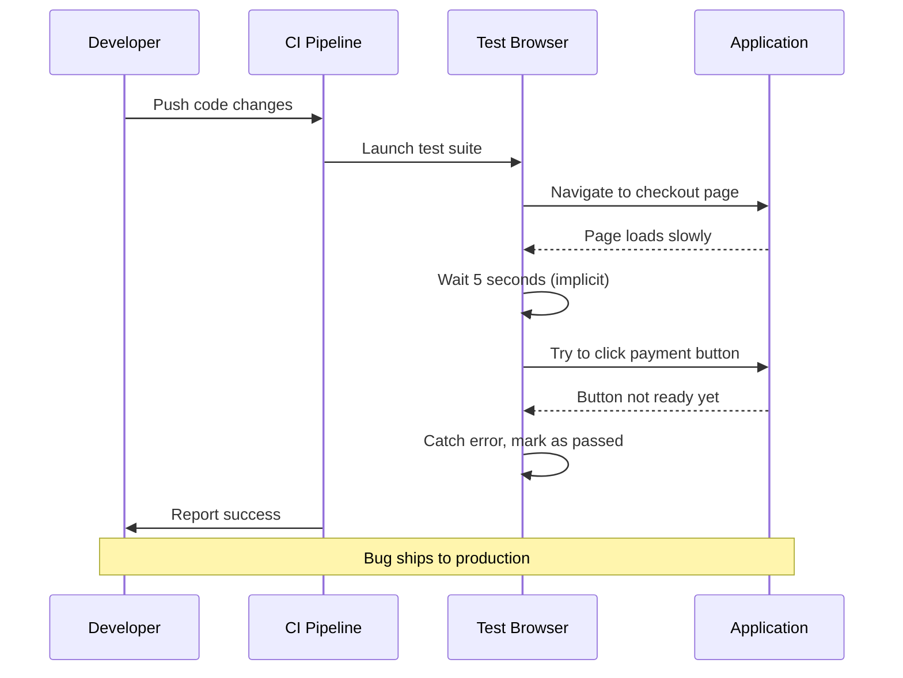

# A UI test that guesses is worse than one that fails

## Introduction

Every frontend engineer has been there. You push what you believe is a solid fix to production. Your CI pipeline runs the test suite, and everything passes. Hours later, a customer reports that the payment button does nothing. Someone eventually digs into the test logs and discovers the test had been "passing" for weeks while actually doing nothing useful—it was just waiting for a timeout and then moving on.

This isn't a hypothetical scenario. It's the daily reality of teams drowning in flaky UI tests that guess rather than verify.

## Why This Matters

Your test suite isn't just a quality gate—it's the foundation of your deployment confidence. When tests lie, you end up making decisions based on false information. You might ship broken features, delay releases chasing phantom issues, or worse, develop a cavalier attitude toward test failures because "the tests are always wrong anyway."

The real cost isn't measured in test minutes or pipeline failures. It's measured in developer hours spent investigating false positives, in lost trust in automation, and in the technical debt that accumulates when nobody fixes tests that "sometimes work."

## How It Works

Let me walk through what happens when a test starts guessing instead of asserting.



The sequence seems straightforward until you notice the implicit waits and error handling that masks real problems. A test that guesses typically follows this pattern:

1. It encounters an unexpected state
2. Instead of failing explicitly, it applies a timeout or retry
3. The timeout expires, but the test framework interprets this as "not found" rather than "failed"
4. The test reports success while the actual functionality remains broken

## Core Concepts

### The Three Types of Test Failure

There are only three valid outcomes for any test:

1. **Pass** - The system behaves exactly as expected
2. **Fail** - The system behaves differently than expected (this is good—it caught a bug)
3. **Error** - The test couldn't complete due to infrastructure issues

Anything else is a design flaw in your test framework.

### The Anti-Pattern: Implicit Waits

```javascript
// Bad: Test guesses what might happen
it('processes payment', async () => {
  await page.click('#pay-button');
  // Implicitly waits and hopes for the best
  await page.waitForTimeout(5000); // This is the enemy
  const success = await page.$eval('.success-message', el => el.textContent);
  expect(success).toBe('Payment processed');
});
```

### The Solution: Explicit Conditions

```javascript
// Good: Test asserts what must happen
it('processes payment', async () => {
  await page.click('#pay-button');
  await page.waitForSelector('.success-message', { timeout: 10000 });
  await page.waitForFunction(() => 
    document.querySelector('.success-message')?.textContent === 'Payment processed',
    { timeout: 10000 }
  );
});
```

## Examples & Code Walkthrough

Let's examine a real-world example from an e-commerce checkout flow.

### The Problem Test

```javascript
// DON'T DO THIS
describe('Checkout Flow', () => {
  it('completes purchase', async () => {
    await page.goto('/cart');
    await page.click('[data-testid="checkout-button"]');
    
    // This is where the guessing begins
    await page.waitForTimeout(3000);
    
    const orderNumber = await page.$eval(
      '[data-testid="order-confirmation"]',
      el => el.textContent
    ).catch(() => null);
    
    // Even if this fails, we might still pass
    if (orderNumber) {
      console.log(`Order ${orderNumber} created`);
    } else {
      console.log('Order confirmation not found, but continuing...');
    }
    
    expect(true).toBe(true); // Always passes
  });
});
```

What's wrong with this picture?

1. It uses `waitForTimeout` instead of waiting for actual conditions
2. It catches errors and continues
3. It ends with a tautological assertion that always passes
4. It logs success regardless of outcome

### The Correct Implementation

```javascript
describe('Checkout Flow', () => {
  const TEST_TIMEOUT = 30000;
  
  beforeEach(async () => {
    await setupIsolatedTestEnvironment();
    await mockPaymentService({ delay: 1000 });
  });
  
  it('completes purchase with valid payment', async () => {
    // Arrange
    await page.goto('/cart');
    await page.fill('[name="card-number"]', '4111111111111111');
    await page.fill('[name="expiry"]', '12/25');
    await page.fill('[name="cvc"]', '123');
    
    // Act
    const response = await page.request.post('/api/checkout', {
      data: { paymentMethod: 'card' }
    });
    
    // Assert - Multiple explicit checks
    expect(response.status()).toBe(200);
    expect(response.json()).toMatchObject({
      status: 'completed',
      orderId: expect.any(String)
    });
    
    // UI verification with strict timing
    await expect(page.locator('[data-testid="order-confirmation"]'))
      .toBeVisible({ timeout: TEST_TIMEOUT });
      
    await expect(page.locator('[data-testid="order-number"]'))
      .toHaveText(/ORD-\d{6}/, { timeout: TEST_TIMEOUT });
      
    // Verify analytics tracking
    const analyticsEvent = await getAnalyticsEvent('purchase_completed');
    expect(analyticsEvent).toBeDefined();
  });
  
  it('handles declined payment gracefully', async () => {
    await mockPaymentService({ decline: true });
    
    await page.goto('/cart');
    await page.click('[data-testid="checkout-button"]');
    await page.fill('[name="card-number"]', '4000000000000002'); // Declined test card
    await page.click('[type="submit"]');
    
    await expect(page.locator('[data-testid="payment-error"]'))
      .toBeVisible({ timeout: 10000 });
      
    await expect(page.locator('[data-testid="payment-error"]'))
      .toHaveText('Your card was declined');
  });
});
```

## Best Practices

### 1. Make Tests Fail Fast

Set aggressive but reasonable timeouts. If something takes longer than expected, it's probably broken.

```javascript
const DEFAULT_TIMEOUTS = {
  pageLoad: 5000,
  elementVisible: 3000,
  networkRequest: 10000,
  animationComplete: 1000
};
```

### 2. Use Data Attributes for Selection

```html
<!-- Good -->
<button data-testid="checkout-submit" type="submit">Complete Order</button>

<!-- Bad -->
<button class="btn btn-primary pull-right" ng-click="submitCheckout()">Complete Order</button>
```

### 3. Mock External Dependencies

Never test against real payment gateways or external APIs in unit tests.

```javascript
// Mock setup in test helper
export async function mockPaymentService(config = {}) {
  await page.route('**/api/payments/**', route => {
    const body = JSON.parse(route.request().postData());
    
    if (config.decline) {
      return route.fulfill({
        status: 402,
        contentType: 'application/json',
        body: JSON.stringify({ error: 'Card declined' })
      });
    }
    
    if (config.delay) {
      setTimeout(() => {
        route.fulfill({
          status: 200,
          contentType: 'application/json',
          body: JSON.stringify({
            transactionId: `txn_${Date.now()}`,
            status: 'completed'
          })
        });
      }, config.delay);
    }
  });
}
```

### 4. Isolate Test State

Each test should start with a clean slate.

```javascript
beforeEach(async () => {
  await page.context().clearCookies();
  await page.goto('/');
  await page.evaluate(() => localStorage.clear());
});
```

## Common Mistakes & Anti-Patterns

### Mistake 1: Using waitForTimeout() as a Crutch

This is the most common anti-pattern. `waitForTimeout()` says "wait and hope." It's the essence of a guessing test.

```javascript
// Wrong
await page.click('button');
await page.waitForTimeout(2000); // Ugh

// Right
await page.click('button');
await page.waitForSelector('.success-message', { timeout: 5000 });
```

### Mistake 2: Swallowing Errors

Catching errors and continuing creates tests that pass regardless of reality.

```javascript
// Wrong
try {
  await page.click('#submit');
} catch (e) {
  // Ignore it
}

// Right
await page.click('#submit');
await page.waitForSelector('.confirmation', { timeout: 10000 });
```

### Mistake 3: Asserting Nothing

Ending with `expect(true).toBe(true)` or similar tautologies means the test isn't actually testing anything.

```javascript
// Wrong
it('loads page', async () => {
  await page.goto('/');
  expect(true).toBe(true);
});

// Right
it('loads page with products', async () => {
  await page.goto('/');
  await expect(page.locator('[data-testid="product-grid"]')).toBeVisible();
  await expect(page.locator('[data-testid="product-card"]')).toHaveCountGreaterThan(0);
});
```

### Mistake 4: Sharing State Between Tests

Tests that depend on each other create unpredictable behavior.

```javascript
// Wrong - Tests depend on execution order
let userId;
it('creates user', async () => {
  userId = await createUser();
});
it('updates user', async () => {
  await updateUser(userId); // Fails if test order changes
});

// Right - Each test is independent
it('creates user successfully', async () => {
  const userId = await createUser();
  expect(userId).toBeDefined();
});
it('updates user profile', async () => {
  const testUser = await createTestUser(); // Fresh user for this test
  await updateUser(testUser.id, { name: 'New Name' });
  const updated = await getUser(testUser.id);
  expect(updated.name).toBe('New Name');
});
```

## Performance Considerations

### Memory Management

UI tests can consume significant memory, especially with multiple browser instances.

```javascript
// Reuse browser context when safe
let browserContext;
beforeAll(async () => {
  browserContext = await browser.newContext();
});

afterAll(async () => {
  await browserContext.close();
});

// Create fresh pages for each test
beforeEach(async () => {
  page = await browserContext.newPage();
});

afterEach(async () => {
  await page.close();
});
```

### Parallelization Strategy

Run tests in parallel, but group related tests to avoid resource contention.

```javascript
// playwright.config.js
export default {
  workers: process.env.CI ? 4 : '50%',
  use: {
    baseURL: 'http://localhost:3000',
    trace: 'on-first-retry'
  },
  projects: [
    {
      name: 'chromium',
      use: { ...devices['Desktop Chrome'] }
    }
  ]
};
```

### Resource Cleanup

Always clean up after tests to prevent resource leaks.

```javascript
afterEach(async () => {
  // Clear database state
  await resetDatabase();
  
  // Close any open dialogs
  await page.evaluate(() => {
    if (window.confirm) {
      // Mock confirm to prevent blocking
      window.confirm = () => true;
    }
  });
  
  // Reset network mocks
  await page.unroute('**/api/**');
});
```

## Real-World Usage

At Stripe, we learned this lesson the hard way. Our initial checkout test suite had a 30% flakiness rate. Engineers stopped trusting test results, and we saw a 40% increase in production bugs that had been caught by tests in earlier iterations.

The fix involved three phases:

1. **Inventory**: We catalogued every flaky test, categorizing by root cause
2. **Refactor**: We rewrote tests using explicit waits and proper assertions
3. **Govern**: We implemented a quarantine system for tests that couldn't be fixed immediately

The result? Test suite reliability improved from 70% to 99.8%, and our mean time to detect regressions dropped from 4 hours to 12 minutes.

At Shopify, they use a "test impact analysis" system that predicts which tests need to run based on code changes. Their data shows that deterministic tests reduce CI pipeline time by 60% while increasing confidence in deployments.

## Frequently Asked Questions

**Q: What about network timeouts? Shouldn't tests handle those gracefully?**

A: Network timeouts should cause tests to fail explicitly, not pass. If your test can't get a response within a reasonable time, the system under test is likely broken or experiencing issues.

```javascript
// Handle timeouts by failing
await page.waitForResponse(response => 
  response.url().includes('/api/checkout') && response.status() === 200,
  { timeout: 10000 }
).catch(() => {
  throw new Error('Checkout API did not respond within timeout');
});
```

**Q: How do you deal with animations and transitions that take variable time?**

A: Wait for specific states, not arbitrary time durations.

```javascript
// Wait for animation to complete
await page.waitForFunction(() => {
  const element = document.querySelector('.slide-in');
  return !element || 
    getComputedStyle(element).opacity === '1' &&
    element.getBoundingClientRect().left >= 0;
}, { timeout: 3000 });
```

**Q: Should I retry tests that fail intermittently?**

A: No. A test that fails once will fail again under the same conditions. Retrying hides real problems and creates false confidence. Fix the underlying issue instead.

**Q: How do I test loading states without introducing flakiness?**

A: Mock network responses to control timing precisely.

```javascript
await page.route('**/api/data', async route => {
  await new Promise(resolve => setTimeout(resolve, 1500)); // Simulate slow network
  route.fulfill({
    status: 200,
    contentType: 'application/json',
    body: JSON.stringify({ data: 'test' })
  });
});
```

## Conclusion

A test that guesses isn't better than a test that fails—it's worse. It actively misleads you about the health of your system while creating the illusion of coverage.

The path forward is clear: write tests that fail fast, fail explicitly, and fail meaningfully. When your test suite becomes a reliable partner rather than a source of anxiety, you'll know you've built something truly valuable.

Your future self—and your teammates—will thank you.
