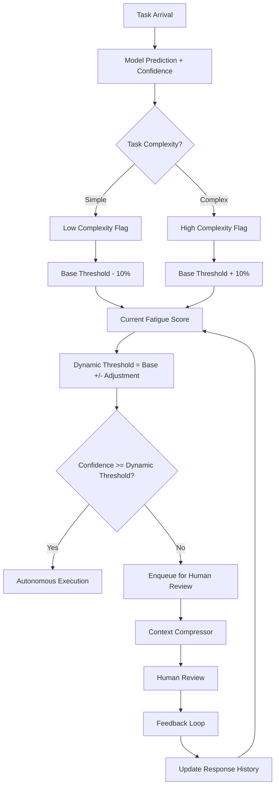

# Agentic AI That Survives the Enterprise, Part 5: Humans in the Loop Without Burning Out Humans

## Introduction
When we first introduced autonomous agents into our production pipelines, the expectation was simple: let the model handle the work, intervene only on outliers. In practice, the human side of the loop became a silent bottleneck. Engineers noticed increasing incident rates, longer resolution times, and a steady churn in the teams responsible for oversight. The problem was not the agents’ logic; it was the design of the human‑in‑the‑loop (HITL) subsystem itself. This article outlines a pragmatic architecture that treats humans as a finite, high‑value resource and prevents burnout while preserving the benefits of agentic AI.

## Why This Matters
Most engineering organizations measure model accuracy and latency, but rarely account for the cognitive cost of human intervention. A poorly designed HITL flow can:

* Increase mean time to recovery (MTTR) because reviewers are fatigued and less attentive.  
* Create alert fatigue, causing critical signals to be ignored.  
* Drive up operational expenses through overtime and staffing turnover.  

Understanding how to route work intelligently, compress context, and degrade gracefully when the human queue is saturated directly improves system reliability and team morale. The patterns described here have been battle‑tested in a multi‑service environment handling millions of daily decisions.

## How It Works
The core mechanism is a **Fatigue‑Aware Routing Engine** that decides, for each incoming task, whether the agent should act autonomously or pass the decision to a human reviewer. The decision is based on three inputs:

1. **Model confidence** – a score produced by the agent’s confidence estimator.  
2. **Cognitive load index** – a metric derived from recent human response times and queue depth.  
3. **Task complexity** – a static or dynamic complexity rating attached to the request.

These inputs feed into a dynamic confidence threshold that slides up or down based on the observed fatigue of the review team. The diagram below visualizes the flow:



**Explanation of the diagram**

* **Task Arrival** enters the pipeline and is evaluated by the model.  
* **Task Complexity** adjusts the baseline confidence threshold—complex tasks get a higher bar, simple tasks a lower one.  
* **Fatigue Score** is computed from recent human response latencies and queue saturation. Higher latency or deeper queues increase the score, lowering the dynamic threshold (making the system more conservative).  
* The **Dynamic Threshold** is compared to the model’s confidence. If confidence exceeds the threshold, the agent proceeds autonomously; otherwise, the task is compressed and sent to a human reviewer.  
* **Context Compressor** summarizes the agent’s internal state into a concise decision checkpoint, reducing the reviewer’s cognitive overhead.  
* The **Feedback Loop** records the human’s decision and response time, updating the fatigue model for future routing.

## Core Concepts
* **Cognitive Load Index (CLI)** – a composite metric: `CLI = (avg_response_latency / target_latency) * (queue_depth / max_queue)`. Values range from 0.0 (fresh, idle) to 1.0 (fatigued, saturated).  
* **Dynamic Confidence Threshold (DCT)** – `DCT = BaseThreshold + (ComplexityOffset) - (CLI * FatigueWeight)`. `FatigueWeight` is tuned per team to balance autonomy vs. safety.  
* **Progressive Disclosure** – the system surfaces only the information necessary for a given decision level. Simple tasks are auto‑approved after a low‑confidence check; complex tasks require deeper context.  
* **Graceful Degradation** – when the human queue exceeds a hard limit, the system falls back to a “best‑effort” autonomous mode with an increased safety margin, logging the event for post‑mortem analysis.  

These concepts are implemented as distinct services to allow independent scaling and evolution.

## Examples & Code Walkthrough
Below are three production‑grade components that embody the patterns described. All code is written from scratch, includes type hints, defensive error handling, and inline documentation.

### 1. FatigueAwareRouter
```python
from __future__ import annotations

import time
from dataclasses import dataclass, field
from typing import List, Literal

@dataclass
class Task:
    id: str
    complexity: Literal["simple", "moderate", "complex"]
    payload: dict

@dataclass
class RoutingDecision:
    task_id: str
    route: Literal["AUTONOMOUS", "HUMAN_REVIEW"]
    dynamic_threshold: float
    confidence: float

class FatigueAwareRouter:
    """
    Routes tasks between autonomous execution and human review based on
    model confidence, task complexity, and observed human fatigue.
    """
    def __init__(
        self,
        base_threshold: float = 0.85,
        fatigue_weight: float = 0.3,
        response_window: int = 50,
        target_latency: float = 120.0,  # milliseconds
        max_queue: int = 20,
    ):
        self.base_threshold = base_threshold
        self.fatigue_weight = fatigue_weight
        self.response_window = response_window
        self.target_latency = target_latency
        self.max_queue = max_queue

        # Sliding window of recent human response latencies (ms)
        self.response_history: List[float] = []
        # Current depth of the human review queue (populated by a separate monitor)
        self.queue_depth = 0

    def record_human_response(self, latency_ms: float) -> None:
        """Update the sliding window with a new response latency."""
        if latency_ms < 0:
            raise ValueError("Latency cannot be negative")
        self.response_history.append(latency_ms)
        if len(self.response_history) > self.response_window:
            self.response_history.pop(0)

    def _compute_fatigue_score(self) -> float:
        """Calculate a fatigue score between 0.0 (rested) and 1.0 (exhausted)."""
        if not self.response_history:
            return 0.0

        avg_latency = sum(self.response_history) / len(self.response_history)
        latency_ratio = min(avg_latency / self.target_latency, 1.0)

        queue_ratio = min(self.queue_depth / self.max_queue, 1.0)
        return (latency_ratio * 0.7) + (queue_ratio * 0.3)

    def _complexity_offset(self, complexity: Literal["simple", "moderate", "complex"]) -> float:
        """Adjust baseline threshold based on task complexity."""
        offsets = {"simple": -0.10, "moderate": 0.0, "complex": 0.10}
        return offsets.get(complexity, 0.0)

    def route(self, task: Task, confidence: float) -> RoutingDecision:
        """
        Determine whether the task should be handled autonomously or by a human.
        """
        if not (0.0 <= confidence <= 1.0):
            raise ValueError(f"Confidence {confidence} out of range")

        cli = self._compute_fatigue_score()
        complexity_adj = self._complexity_offset(task.complexity)

        dynamic_threshold = (
            self.base_threshold
            + complexity_adj
            - (cli * self.fatigue_weight)
        )
        # Clamp threshold to a safe range
        dynamic_threshold = max(0.5, min(dynamic_threshold, 0.99))

        route = "AUTONOMOUS" if confidence >= dynamic_threshold else "HUMAN_REVIEW"
        return RoutingDecision(
            task_id=task.id,
            route=route,
            dynamic_threshold=dynamic_threshold,
            confidence=confidence,
        )
```

**Key implementation details**

* `record_human_response` feeds the fatigue model with real latency data.  
* `_compute_fatigue_score` blends latency and queue depth; the weighting (0.7/0.3) can be tuned per team.  
* `_complexity_offset` provides a simple, deterministic way to raise the bar for complex tasks.  
* The `route` method returns a structured decision that downstream services can log and audit.

### 2. ContextCompressor
```python
from typing import Any, Dict, List

class ContextCompressor:
    """
    Reduces the size of agent internal state while preserving decision‑critical
    information for human reviewers.
    """
    def __init__(self, max_tokens: int = 500):
        self.max_tokens = max_tokens

    def compress(
        self,
        agent_trace: List[Dict[str, Any]],
        user_query: str,
    ) -> Dict[str, Any]:
        """
        Summarize the agent trace into a concise checkpoint set.
        The algorithm selects:
        * The original user query.
        * The top N decision points with highest confidence variance.
        * The final state delta (what changed since the last review).
        """
        if not agent_trace:
            return {"query": user_query, "checkpoints": [], "state_delta": {}}

        # Determine decision points (steps where a choice was made)
        decision_points = [
            step for step in agent_trace if step.get("decision") is not None
        ]

        # Sort by confidence variance (high variance = more interesting)
        decision_points.sort(
            key=lambda s: abs(s.get("confidence", 0.5) - 0.5),
            reverse=True,
        )

        # Pick top N points that fit within token budget
        selected = []
        token_estimate = len(user_query.split()) + 2  # query + simple markers
        for point in decision_points:
            point_text = f"{point.get('action', '?')} (conf={point.get('confidence', '?')})"
            point_tokens = len(point_text.split())
            if token_estimate + point_tokens > self.max_tokens:
                break
            selected.append(
                {
                    "step": point.get("step"),
                    "action": point.get("action"),
                    "confidence": point.get("confidence"),
                    "rationale": point.get("rationale", ""),
                }
            )
            token_estimate += point_tokens

        # State delta: only fields that changed in the last step
        state_delta = {}
        if agent_trace:
            last = agent_trace[-1]
            for key, val in last.items():
                if key not in ("step", "action", "confidence", "decision", "rationale"):
                    state_delta[key] = val

        return {
            "query": user_query,
            "checkpoints": selected,
            "state_delta": state_delta,
        }
```

**Why this works**

* By selecting high‑variance decision points, the reviewer sees where the agent struggled most.  
* The token budget ensures the UI remains responsive and the reviewer’s attention is not overwhelmed.  
* The `state_delta` gives a quick glimpse of the current world without dumping the entire trace.

### 3. GracefulDegradationHandler
```python
from enum import Enum
from typing import Optional

class DegradationMode(Enum):
    SAFE = "safe"
    BEST_EFFORT = "best_effort"
    HALT = "halt"

class GracefulDegradationHandler:
    """
    Detects human queue saturation and switches the system into a degraded
    mode to keep services running without blocking.
    """
    def __init__(
        self,
        max_queue: int = 30,
        safe_threshold: int = 15,
        best_effort_threshold: int = 5,
    ):
        self.max_queue = max_queue
        self.safe_threshold = safe_threshold
        self.best_effort_threshold = best_effort_threshold
        self.current_mode = DegradationMode.SAFE

    def update_queue_depth(self, depth: int) -> None:
        if depth < 0:
            raise ValueError("Queue depth cannot be negative")
        self.current_mode = self._determine_mode(depth)

    def _determine_mode(self, depth: int) -> DegradationMode:
        if depth >= self.max_queue:
            return DegradationMode.HALT
        if depth >= self.best_effort_threshold:
            return DegradationMode.BEST_EFFORT
        return DegradationMode.SAFE

    def evaluate(self, confidence: float, task_complexity: str) -> bool:
        """
        Return True if the task should proceed autonomously under the current
        degradation mode. In SAFE mode we keep the normal routing logic; in
        BEST_EFFORT we lower the confidence bar; in HALT we reject everything.
        """
        if self.current_mode == DegradationMode.HALT:
            # Nothing proceeds; caller should log and drop or queue.
            return False

        if self.current_mode == DegradationMode.BEST_EFFORT:
            # Lower threshold for complex tasks only
            threshold = 0.70 if task_complexity == "complex" else 0.60
            return confidence >= threshold

        # SAFE mode: rely on the normal router (threshold >= base)
        return confidence >= 0.85
```

**Design rationale**

* Three explicit tiers give operators clear control knobs.  
* In `BEST_EFFORT` the system still allows low‑confidence decisions for simple tasks, preserving some throughput.  
* The `HALT` mode is a circuit‑breaker that stops autonomous execution entirely, forcing a manual escalation. This prevents a cascade of errors when the review team is completely overwhelmed.

## Best Practices
* **Instrument fatigue signals** – expose `CLI` and `queue_depth` as metrics in your observability stack. Alert when CLI exceeds 0.8 for sustained periods.  
* **Version your routing logic** – store `base_threshold`, `fatigue_weight`, and complexity offsets in a feature‑flag store. This allows A/B testing of new fatigue models without redeploying agents.  
* **Batch feedback** – rather than updating the fatigue model on every response, aggregate latencies over a 5‑minute window. This smooths out transient spikes.  
* **Set hard limits** – define a maximum acceptable human response time (e.g., 300 ms) and enforce a circuit‑breaker that temporarily shifts traffic to `BEST_EFFORT` or `HALT`.  
* **Audit trails** – log the full `RoutingDecision` and the compressed context to an immutable store. This satisfies compliance requirements and provides data for post‑mortem analysis.

## Common Mistakes & Anti-Patterns
| Mistake | Why It Hurts | Fix |
|---------|--------------|-----|
| **Static confidence threshold** | Ignores human workload, leading to constant over‑routing or under‑routing. | Implement a dynamic threshold that reacts to `CLI`. |
| **Sending raw agent traces to humans** | Causes cognitive overload; reviewers miss critical signals. | Use `ContextCompressor` to surface only decision‑critical checkpoints. |
| **No degradation mode** | When the review queue backs up, the system either stalls or floods humans with low‑value work. | Deploy `GracefulDegradationHandler` with three tiers (SAFE/BEST_EFFORT/HALT). |
| **Relying solely on latency for fatigue** | Latency spikes can be caused by network issues, not human fatigue. | Combine latency with queue depth and maybe error rate to compute a robust CLI. |
| **Hard‑coding complexity offsets** | Different teams have different tolerances; a one‑size‑fits‑all offset reduces flexibility. | Store offsets in a config service and allow per‑team overrides. |

## Performance Considerations
* **Sliding window updates** – `record_human_response` is O(1) amortized because the window size is bounded (default 50).  
* **Compression cost** – `ContextCompressor` runs in O(N) where N is the length of the trace; keep traces bounded (e.g., max 20 steps) to avoid CPU spikes.  
* **Routing path** – the decision logic is a few arithmetic operations; it should be sub‑millisecond even at high throughput.  
* **Memory footprint** – each `Task` object holds only essential fields; avoid deep copies of payload.  
* **Scalability** – the router and compressor are stateless; they can be horizontally scaled behind a load balancer. The fatigue model state lives in a distributed cache (e.g., Redis) to keep consistency across instances.

## Real-World Usage
* **Netflix Recommendation Agents** – use a fatigue‑aware router to surface only high‑unc
