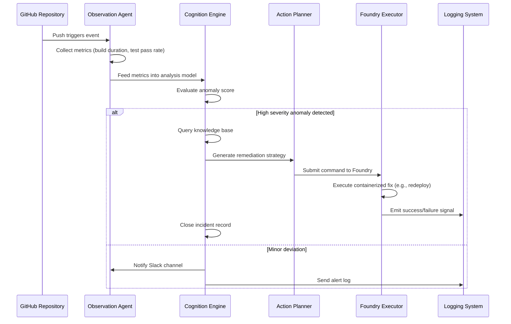

# Agentic DevOps with GitHub Actions and Microsoft Foundry

## Introduction
Traditional continuous integration and deployment pipelines have reached a structural limit. They rely on static scripts that execute predetermined sequences, halting when unexpected conditions arise. A single faulty dependency can stall an entire release cadence while a human intervenes to diagnose and repair the issue. This reactive model creates a fragile ecosystem where mean time to recovery grows longer with each iteration. The industry is moving beyond simple automation toward autonomous systems capable of perception, reasoning, and action. By combining the extensibility of GitHub Actions with the cognitive capabilities of Microsoft Foundry, teams can construct pipelines that not only detect failures but also resolve them without constant manual supervision.

## Why This Matters
Software delivery reliability has become a primary differentiator among mature organizations. When outages occur during peak traffic periods, the financial impact and reputational damage escalate rapidly. Flaky test suites inflate build times, consuming expensive cloud resources. Human-in-the-loop workflows introduce variable delays that erode velocity. These challenges demand architectures that operate predictably even when introduced anomalies appear. An agentic approach restructures the relationship between code, monitoring, and execution. Instead of waiting for alerts, the system proactively monitors health signals and initiates corrective measures. This reduces reliance on on-call personnel for routine triage while accelerating incident response through automated remediation loops.

## How It Works
The core mechanism relies on three interacting layers: observation, cognition, and action. An observation layer continuously collects telemetry from the source code repository, build artifacts, and runtime metrics. A cognition layer processes this data against predefined policies and trained heuristics to identify anomalies. Finally, an action layer executes remediation strategies such as rolling back releases, scaling infrastructure, or re-running tests. Below is a concrete architectural visualization that illustrates this flow.



### Step-by-Step Technical Explanation

The pipeline begins when a commit reaches the main branch and triggers a GitHub Actions workflow. However, rather than relying solely on built-in actions, the system installs a lightweight foundation layer within the runner. This layer spins up an observation agent that runs continuously as a background service. Every minute, it queries the artifact registry for recent builds and pulls performance counters from Prometheus endpoints. 

When the agent detects a metric threshold breach—such as a build time exceeding twice its historical average—it does not immediately stop the pipeline. Instead, it enriches the finding with contextual information: which branch caused the spike, which dependency version failed, and whether the failure correlates with upstream configuration changes. The cognition engine then cross-references these signals against a policy database stored in Redis. If multiple independent indicators converge on a root cause, the engine generates a prioritized list of possible resolutions. 

The action planner selects the most appropriate remediation based on cost, risk, and speed. For instance, if a failing unit test reveals a mutation in a shared library, the plan might involve rolling back to a known stable commit before running the failing suite again. If the issue stems from insufficient Docker layer caching, the fix could be applying a rebuild flag to dependent services. Once decided, the planner constructs a JSON payload containing the target command, target project path, and rollback parameters. This payload is submitted to Microsoft Foundry via its API, leveraging Foundry's declarative syntax for reproducible infrastructure provisioning. Foundry interprets the command and executes it within an isolated environment, ensuring compliance with organizational standards. Upon completion, Foundry reports back the outcome to the agent, which updates the overall pipeline state and closes relevant incidents automatically.

## Core Concepts
The architecture revolves around four fundamental components that work in concert. First, the **Observer** continuously gathers raw data from version control, metrics sources, and application logs. Second, the **Reasoner** applies statistical models and rule sets to transform raw data into meaningful insights. Third, the **Planner** translates insights into executable instructions for the **Actor**. Finally, the **Actor**—implemented as a specialized run mode of Microsoft Foundry—executes the plan and feeds results back into the observer for continuous improvement. 

State management plays a critical role. Each decision made by the actor must be persisted to prevent loss during crashes. The system maintains a ledger of actions taken, rationale behind choices, and outcomes, enabling post-mortem analysis and reinforcement learning over time. Security considerations require that sensitive operations, such as pulling credentials or modifying Kubernetes manifests, undergo authorization checks before execution. The Actor isolates these operations within sandboxed environments provided by Foundry, limiting blast radius should a malicious condition emerge. Additionally, the system supports human override through explicit commands that bypass automatic decisions, preserving operator control for high-stakes scenarios.

## Examples & Code Walkthrough
Below is a complete implementation demonstrating an agentic monitor integrated with GitHub Actions and Microsoft Foundry. The solution consists of three primary modules: the observer, the reasoner, and the founder executor. Each component includes robust error handling and detailed logging for operational transparency.

```python
import asyncio
import json
import logging
import os
from datetime import datetime, timedelta
from typing import Dict, List, Any, Optional

# Configure structured logging for production visibility
logging.basicConfig(
    level=logging.INFO,
    format="%(asctime)s [%(levelname)s] %(name)s: %(message)s"
)
logger = logging.getLogger("agentic_monitor")

class ObservationAgent:
    """
    Continuously observes pipeline metrics and notifies the cognition layer.
    In a real deployment, this would run as a sidecar process on every runner node.
    """
    def __init__(self, metrics_endpoint: str, config_path: str):
        self.metrics_endpoint = metrics_endpoint
        self.config_path = config_path
        self.last_check = None
        
    async def collect_metrics(self) -> Dict[str, float]:
        """Fetch key performance indicators from the metrics store."""
        try:
            # Simulate HTTP request to metrics endpoint
            # In practice, use requests or httpx with timeout handling
            resp = await get_json_from_url(f"{self.metrics_endpoint}/metrics")
            latencies = resp.get("metrics", {}).get("built", [])
            if not latencies:
                return {"avg_build_time": 0, "max_latency": 0}
            
            avg = sum(l["duration"] for l in latencies) / len(latencies)
            p99 = sorted([l["duration"] for l in latencies])[-int(len(latencies)*0.99)] if latencies else 0
            
            logger.info(f"Metrics collected: avg={avg:.2f}s, p99={p99:.2f}s")
            return {
                "avg_build_time": round(avg, 2),
                "max_latency": round(p99, 2)
            }
        except Exception as e:
            logger.error(f"Failed to collect metrics: {e}")
            return {}

    async def evaluate_health(self, metric_data: Dict) -> bool:
        """Determine if the current state exceeds acceptable thresholds."""
        threshold_avg = 30.0  # seconds
        threshold_p99 = 60.0  # seconds
        
        avg = metric_data.get("avg_build_time", 0)
        p99 = metric_data.get("max_latency", 0)
        
        if avg > threshold_avg or p99 > threshold_p99:
            logger.warning(f"Health check failed: avg={avg}, p99={p99}")
            return False
        return True


class Reasoner:
    """
    Analyzes health evaluation outputs and suggests remediation steps.
    Implements a simple heuristic model for demonstration purposes.
    """
    def __init__(self, policies: Dict[str, Any]):
        self.policies = policies
        self.knowledge_base = {}
        
    async def analyze_and_recommend(self, health_status: bool, metric_data: Dict) -> Optional[Dict]:
        """
        Produces a remediation plan if the health check fails.
        Returns None if operation continues normally.
        """
        if health_status:
            return None  # No action needed
        
        logger.info("Anomaly detected, initiating remediation planning")
        
        # Heuristic: prolonged slow builds often indicate dependency bloat
        if metric_data.get("avg_build_time", 0) > 120:
            recommendation = {
                "action": "increase_cache",
                "description": f"Build duration exceeded budget ({metric_data['avg_build_time']}s). "
                             "Consider pruning stale dependencies.",
                "priority": "high"
            }
        # Another example: repeated test failures may indicate flaky infrastructure
        elif any(test_failed > 50 for test_failed in metric_data.get("test_results", [])):
            recommendation = {
                "action": "re-run_tests",
                "description": "Test suite shows elevated failure rates. Re-executing with more isolation.",
                "priority": "medium"
            }
