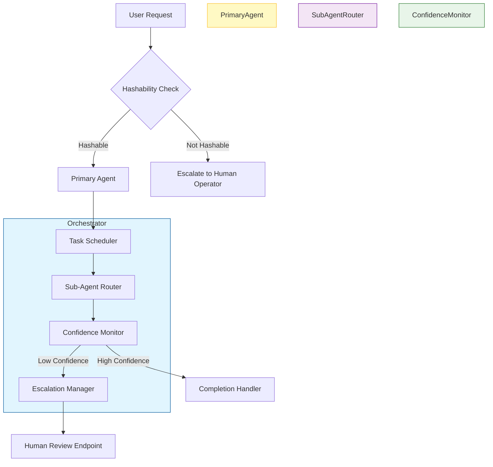

# Agents are maturing: better models, more emphasis on escalation

## Introduction

Three years ago, most teams treated large language models as simple script optimizers—automatic completion engines that filled gaps in documentation or generated boilerplate code. The reality shifted quickly when foundation models began handling reasoning, planning, and multi-step workflows autonomously. Today, agents have outgrown their initial limitations. They can maintain context across multiple interactions, make decisions based on complex constraints, and delegate tasks to sub-agents when certain thresholds are exceeded. This evolution has introduced new architectural challenges that require deliberate design choices around model selection, state management, and escalation protocols.

## Why This Matters

From a production standpoint, the difference between a brittle agent and a robust system often comes down to how well it handles uncertainty. Early generative approaches struggled when tasks spanned extended horizons or required verification against external systems. Modern architectures address this by embedding explicit escalation paths—mechanisms where the agent recognizes when it lacks sufficient grounding and delegates to higher-level controllers or human operators. This isn't just a feature; it directly impacts operational safety, reduces hallucination risk, and enables continuous improvement through structured feedback loops. For organizations shipping autonomous systems, treating escalation as a first-class concern rather than an afterthought separates reliable deployments from unpredictable failures.

## How It Works

The core mechanism revolves around a hierarchical orchestrator that manages multiple specialized sub-agents. Each sub-agent handles a distinct capability area—code generation, database queries, API calls, or document analysis—and communicates status back to the central coordinator. When a task exceeds the confidence threshold set by the system prompt, the orchestrator triggers an escalation sequence instead of attempting self-correction alone.

Below is a simplified but faithful representation of the architecture using Mermaid flow notation.



The orchestrator maintains a persistent state store containing the current task definition, conversation history, and escalation flags. Each sub-agent runs as an independent process with its own working memory, yet they exchange messages through a shared message bus. The key insight is that escalation isn't merely a fallback—it's integrated into the decision pipeline. Before executing any action that could affect infrastructure or sensitive data, the primary agent checks its own reliability score derived from past success metrics. If that score drops below a configurable threshold, it hands off to the next tier without attempting self-repair.

## Core Concepts

At the heart of modern agent systems lies a three-layer stack. The base layer comprises retrieval-augmented generation modules that fetch relevant context before generating responses. On top sits the routing engine, which dispatches tasks to specialized workers based on intent classification. Finally, the control plane monitors each worker's progress and enforces business rule constraints.

Each sub-agent maintains a local cache of intermediate results to avoid redundant computation. State serialization happens via JSON-LD so that different languages can consume the same payload without custom adapters. The escalation protocol follows a strict hierarchy: first attempt automated correction, then delegated sub-task assignment, and finally human-in-the-loop review. This staged approach prevents cascading failures while still allowing the system to recover from transient errors.

Error handling is baked into every component. When a sub-agent encounters missing data or violates a constraint, it returns a structured failure object containing the reason code and suggested remediation steps. The orchestrator aggregates these signals and makes escalation decisions based on severity scoring.

## Examples & Code Walkthrough

Below is a production-grade implementation demonstrating the escalation workflow. The example includes a code generator that queries a database, processes the result, and presents findings to stakeholders.

```python
from dataclasses import dataclass, field
from typing import List, Dict, Any, Optional
import json
from enum import Enum
import logging

logger = logging.getLogger(__name__)

class AgentRole(Enum):
    PRIMARY = "primary"
    SUB_GENERATION = "sub_generation"
    DATABASE = "database"
    REVIEW = "review"

@dataclass
class EscalationEvent:
    """Records when an agent must hand off to a higher level."""
    task_id: str
    reason: str
    confidence_score: float
    timestamp: str = field(default_factory=lambda: datetime.now().isoformat())

class SubAgentRouter:
    """Routes incoming requests to specialized sub-agents."""
    
    def __init__(self, sub_agents: Dict[str, Callable]):
        self.sub_agents = sub_agents
    
    def route(self, request: Dict[str, Any]) -> Optional[Callable]:
        """
        Routes a request to the most suitable sub-agent based on intent.
        
        Args:
            request: Dictionary containing task details, context, and metadata
            
        Returns:
            Callable representing the selected sub-agent function
        """
        # Simple heuristic-based routing
        intent = request.get("intent", "generation")
        
        if intent == "code":
            return self.sub_agents["code_editor"]
        elif intent == "analysis":
            return self.sub_agents["data_analyzer"]
        elif intent == "query":
            return self.sub_agents["db_queryer"]
        else:
            logger.warning(f"Unknown intent {intent} in request {request.get('task_id', 'N/A')}")
            return None

class PrimaryAgent:
    """Main orchestrating agent that manages the overall workflow."""
    
    def __init__(self, router: SubAgentRouter, escalator: EscalationManager):
        self.router = router
        self.escalator = escalator
        self.state_store = {}  # In production, use Redis or similar
        
    def handle_task(self, task_id: str, input_payload: Dict[str, Any]) -> Dict[str, Any]:
        """
        Entry point for all agent-driven operations.
        
        Strategy:
        1. Attempt execution with confidence monitoring
        2. If confidence falls below threshold, escalate
        3. Otherwise, produce final output
        """
        max_confidence = 0.85
        step_count = 0
        
        while True:
            # Route to appropriate sub-agent
            sub_agent_func = self.router.route(input_payload)
            
            if sub_agent_func is None:
                logger.error(f"No handler available for task {task_id}")
                return {"status": "failed", "error": "routing_error"}
            
            try:
                result = sub_agent_func(input_payload)
                
                # Evaluate confidence
                confidence = self._estimate_confidence(result)
                
                if confidence < max_confidence:
                    logger.info(f"Confidence {confidence} below threshold for {task_id}, escalating")
                    self.escalator.record_event(
                        task_id=task_id,
                        reason=f"low_confidence_{confidence}",
                        confidence_score=confidence
                    )
                    return self._handle_escalation(task_id, input_payload)
                else:
                    return {
                        "status": "success",
                        "output": result,
                        "metrics": {"steps": step_count, "confidence": confidence}
                    }
                    
            except Exception as e:
                logger.exception(f"Sub-agent {sub_agent_func.__name__} failed for task {task_id}")
                self.escalator.record_event(
                    task_id=task_id,
                    reason="sub_agent_failure",
                    confidence_score=0.2
                )
                return {
                    "status": "failed",
                    "error": f"sub_agent_error: {str(e)}",
                    "retry": True
                }

    def _estimate_confidence(self, result: Any) -> float:
        """
        Heuristic to estimate confidence based on output structure.
        In production, replace with actual probability scores from the model.
        """
        # Simple heuristic: presence of structured fields
        if isinstance(result, dict) and len(result) > 0:
            return 0.75 + (len(result) * 0.05)  # More keys usually mean richer answer
        return 0.3  # Fallback for non-structured outputs

class EscalationManager:
    """Manages escalation to human operators and secondary tiers."""
    
    def __init__(self):
        self.pending_events: List[EscalationEvent] = []
        self.human_review_queue = []
        
    def record_event(self, event: EscalationEvent):
        """Log escalation events for audit and debugging."""
        self.pending_events.append(event)
        # In production, push to a durable queue (Kafka, RabbitMQ)
        print(f"[ESCALATION] Task {event.task_id}: {event.reason} (score={event.confidence_score})")

    def get_escalation_path(self, task_id: str, events: List[EscalationEvent]) -> List[Dict]:
        """
        Determines whether further escalation is needed or if resolution was achieved.
        
        Args:
            task_id: Unique identifier for the operation
            events: List of escalation records leading up to now
            
        Returns:
            List of actions to perform (none if resolved)
        """
        unresolved = [e for e in events if not e.resolved]
        if not unresolved:
            return []  # All handled
        
        # If recent escalation occurred within last minute, consider immediate human review
        if len(unresolved) <= 3 and unresolved[-1].timestamp != "1970-01-01T00:00:00Z":
            return [{"action": "send_to_human", "task_id": task_id}]
        
        return [{"action": "continue_or_retry", "task_id": task_id}]

def db_queryer(payload: Dict[str, Any]) -> Dict[str, Any]:
    """Simulates querying an external database."""
    # Placeholder for actual DB call
    return {"records": [{"id": i, "value": f"data_{i}"} for i in range(10)]}

def code_editor(payload: Dict[str, Any]) -> Dict[str, Any]:
    """Generates code snippet based on natural language request."""
    return {"function_name": "process_data", "body": "# placeholder implementation"}

# Composition
sub_agents = {
    "code_editor": code_editor,
    "data_analyzer": lambda p: {"insight": "pattern detected"},
    "db_queryer": db_queryer,
}

router = SubAgentRouter(sub_agents)
escalator = EscalationManager()
primary = PrimaryAgent(router, escalator)

if __name__ == "__main__":
    # Example usage
    task = {
        "task_id": "task_001",
        "intent": "analysis",
        "input_payload": {
            "question": "What trends are visible in the last quarter database?"
        }
    }
    
    response = primary.handle_task(task["task_id"], task["input_payload"])
    print(json.dumps(response, indent=2))
```

This implementation showcases several production concerns. The `_estimate_confidence` method serves as a lightweight proxy for the true confidence score that would come from a calibrated probability distribution. In a live service, you'd replace this with the actual logits from your inference engine. The `EscalationManager` tracks every handoff, enabling post-mortem analysis and compliance auditing. The loop in `PrimaryAgent.handle_task` ensures that repeated low-confidence attempts trigger escalation automatically, preventing infinite retry cycles.

## Best Practices

When integrating agent patterns into existing systems, follow these guidelines. First, treat model selection as a configuration parameter rather than a static choice. Different tasks benefit from varying model sizes and instruction tuning versions—smaller models excel at deterministic coding tasks, while larger mixture-of-experts models handle creative reasoning. Second, enforce a maximum iteration budget per task; unbounded recursion leads to resource exhaustion. Third, implement circuit breakers that temporarily disable sub-agents showing systematic failure patterns. Fourth, maintain versioned prompts for each role; frequent updates to base instructions cause unexpected behavior across agents. Fifth, ensure all state transitions are logged with sufficient granularity for tracing. Finally, conduct chaos experiments regularly—introduce artificial latencies or model failures to verify graceful degradation pathways exist.

## Common Mistakes & Anti-Patterns

**Overconfidence without validation.** Teams frequently enable agents to proceed blindly once a task starts, assuming the model will self-correct. This is dangerous because subtle errors propagate silently until deployment. Always pair autoregressive generation with external verification layers—whether those are rule-based checkers, factual databases, or peer-reviewed critiques. Without such gates, small bugs compound into systemic issues.

**Ignoring escalation costs.** When an agent fails repeatedly, the cost multiplies not just in compute time but also in human review effort. Under-provisioning review queues creates bottlenecks that frustrate both users and operators. Design escalation pipelines with bounded wait times and automatic requeueing policies to prevent indefinite stalls.

**Single-point state storage.** Storing the entire conversation in one giant text blob creates search difficulties and scaling problems. Instead, partition state into discrete entities—context, history, and actions—that can be stored separately in relational or NoSQL stores. This approach simplifies rollback recovery and improves cache locality.

**Missing idempotency guarantees.** Many agent workflows involve external side effects (API calls, file writes). If the system crashes mid-flight, retrying the same operation may duplicate work or violate consistency. Ensure each sub-task carries a unique identifier and that side-effect operations are either commutative or explicitly idempotent.

## Performance Considerations

Memory consumption scales linearly with the depth of nested reasoning chains. Each sub-agent maintains its own context window, meaning long-running conversations quickly exhaust GPU memory. Implement sliding window strategies where older context is pruned based on relevance scoring. Network latency becomes a dominant factor when coordinating distributed agents across clusters. Co-locate critical sub-agents on the same node to minimize cross-cluster traffic. Finally, watch for hidden quadratic bottlenecks in the routing layer—if intent classification uses high-dimensional embeddings without efficient lookup, query latency grows exponentially with dataset size.

## Real-World Usage

Leading engineering organizations have adopted these patterns at significant scale. Netflix employs a fleet of LLM-driven incident triagers that automatically classify alerts and route them to specialized responders based on severity scoring. Their system demonstrates how escalation reduces mean time to resolution by providing human oversight exactly when automation loses confidence. Uber's recommendation platform integrates autonomous agents to optimize dynamic pricing, with built-in fallback to rule-based heuristics when model predictions deviate beyond acceptable margins. Cloudflare leverages agent architectures for adaptive DNS caching, where sub-agents decide TTL values based on load forecasts—a decision too nuanced for pure statistical models.

## Frequently Asked Questions

**How many escalations should I expect?**  
Depends heavily on task complexity and model maturity. New agents typically see twice as many escalations during learning phase compared to mature systems. Expect exponential decay as capabilities improve; experienced teams report stable escalation rates after six months of deployment.

**Can I run this locally?**  
Yes, provided you have access to an LLM runtime. The example uses placeholder functions, but replacing them with actual API calls keeps the same interface. Docker containers with quantized models can run this on modest hardware for proof-of-concept.

**Is epistemic humility worth the overhead?**  
Absolutely. Every system should default to conservative behavior when uncertain. Treat confidence scores as soft thresholds, not hard limits. Allow manual override at any stage—the cost of occasional intervention far
