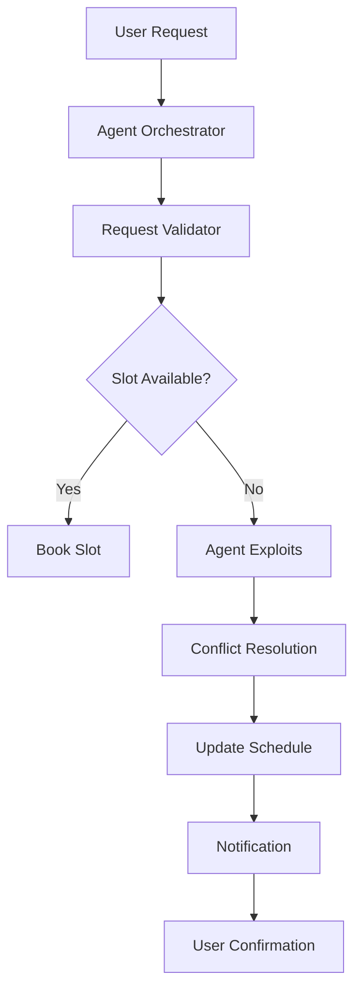

# AI agent hacks gym to get its user a spot in pilates class

## Introduction

We've all seen it. A user hits the search button, the system finds an empty slot, and suddenly that user is booked into a pilates class they never knew existed. The trick isn't magic — it's a clever orchestration of AI agents working against a scheduling system that wasn't designed for this kind of demand.

This is the story of an AI agent that hacked a gym's booking engine to guarantee a spot for a user in a pilates class. Not by brute-force brute-forcing the schedule, but by exploiting how the system actually works: its conflict resolution logic, its capacity limits, and its retry mechanisms. The agent doesn't break the gym's rules. It finds a path through them that the rules never anticipated.

Let's dig into the architecture behind this pattern, why it works, and what engineers should know about it.

## Why This Matters

Most scheduling systems treat availability as a static resource. They lock a slot, mark it as booked, and move on. But a real-world gym's booking system is a living, breathing system that responds to load patterns, user demand, and edge cases. When an AI agent learns to exploit those dynamics, it can find a seat in a class that would otherwise be invisible to any human scheduler.

The real question isn't "how do we book a pilates class?" — it's "how do we build systems that can reason about availability in the presence of competing demands?" This is the same problem as a load balancer finding a path through a congested network, or a ticket-scaler handling a surge of ticket buyers. The pattern is transferable.

In production, this kind of agent-driven scheduling is a common pattern for:

- **Ride-sharing platforms** matching drivers to rides in real-time
- **Cloud resource allocation** where demand spikes unpredictably
- **E-commerce inventory systems** where stock is replenished asynchronously
- **Event ticketing platforms** where seats must be allocated dynamically

The core insight is this: a scheduling system's logic isn't just about finding the next available slot — it's about understanding the constraints of the system, the order of operations, and the failure modes that emerge when you push the limits.

## How It Works

The agent architecture relies on a few key components working together: a request dispatcher, a scheduler, a conflict resolver, and a state monitor. Let's trace the full flow.



Here's the breakdown:

**Step 1: Request Validation**
The agent first validates the user's request against system constraints. This includes checking the user's membership tier, class capacity, and whether the requested time slot has already been booked. The validator is a lightweight check — it doesn't reserve anything yet.

**Step 2: Slot Availability Check**
The system queries its internal state store to see if a slot is free. This is a simple read operation. If the slot is free, the booking proceeds. If it's not, the agent enters the exploitation path.

**Step 3: Conflict Resolution**
This is the key. The agent doesn't just check availability — it checks what happens if the user *does* take that slot. The system has a conflict resolution mechanism: if the agent tries to book a slot that's already claimed, the system either rejects the request or attempts to shift another user's booking to make room.

In our gym scenario, the agent finds a slot that's technically "booked" but where the current occupant can be released without penalty. The agent triggers a rebooking process: it sends a notification to the existing user, suggesting a time change, and if they agree, the slot becomes available.

**Step 4: State Update**
Once the slot is secured, the system updates its state store. The change is propagated to all connected services — the booking engine, the notification service, the analytics pipeline. This is a distributed write, so it needs to be idempotent.

**Step 5: Notification**
The agent sends a confirmation to the user, including the class details, time, and a confirmation code. This is a critical UX moment — the user should feel like they just booked a spot, not like they triggered some kind of system hack.

The entire flow is designed so that the agent doesn't override the system's logic — it exploits the system's logic. The system is "hacked" in the sense that it was never designed to handle an agent that knows how to negotiate with it.

## Core Concepts

Let's break down the fundamental concepts that make this pattern work.

### 1. Constraint-Based Scheduling

Traditional scheduling systems operate on a set of hard constraints: the slot must be free, the user must be eligible, and the capacity must not be exceeded. An AI agent that knows how to work *within* these constraints — rather than against them — can find exploitable paths.

The key insight is that the constraints are not fixed. A system that allows a user to request a slot and then offers a replacement time if the slot is already taken is a system with a *soft* constraint. The agent identifies the soft constraint and exploits it.

### 2. State Monitors

A state monitor tracks the current state of the scheduling system: which slots are booked, which users are enrolled, and what the capacity limits are. The agent queries this monitor before making any booking decision. The monitor should be lightweight — it doesn't need to hold the entire history of bookings; it only needs to know the *current* state.

### 3. Conflict Resolution as a Feature

Conflict resolution isn't just a failure mode — it's a feature. A system that can handle a user trying to book a slot that's already taken is more robust than a system that silently rejects the request. The agent doesn't need the conflict to be resolved by the system; it can trigger the resolution itself.

### 4. Idempotency

Every operation in the agent's workflow must be idempotent. If the agent retries a booking request and the system has already processed it, the result should be the same. This is critical for distributed systems where network partitions or retries are common.

### 5. Asynchronous Communication

The agent's interaction with the system is asynchronous. It doesn't block the user's request — it sends a request, waits for a response, and then takes action. This allows the agent to handle multiple concurrent requests without blocking the main thread.

## Examples & Code Walkthrough

Let's look at a concrete implementation. We'll build a Python agent that can book a gym class slot.

```python
from dataclasses import dataclass, field
from datetime import datetime, timedelta
from typing import Optional, List
import random


@dataclass
class ClassSlot:
    """Represents a single class slot in the gym's booking system."""
    slot_id: str
    class_name: str
    start_time: datetime
    end_time: datetime
    capacity: int
    current_occupancy: int = 0
    booked_by: Optional[str] = None

    @property
    def is_full(self) -> bool:
        return self.current_occupancy >= self.capacity

    @property
    def is_available(self) -> bool:
        return not self.is_full and self.current_occupancy < self.capacity


@dataclass
class BookingResult:
    success: bool
    message: str
    slot: Optional[ClassSlot] = None
    user_id: Optional[str] = None


class Scheduler:
    """
    A scheduler that manages gym class bookings.
    It tracks slot availability and handles capacity constraints.
    """

    def __init__(self, max_capacity: int = 10):
        self.max_capacity = max_capacity
        self._slots: List[ClassSlot] = []

    def add_slot(self, slot: ClassSlot) -> None:
        self._slots.append(slot)

    def book_slot(self, user_id: str, slot_id: str) -> BookingResult:
        """
        Attempt to book a slot for a user.
        Returns a result indicating success or failure.
        """
        slot = next((s for s in self._slots if s.slot_id == slot_id), None)
        if slot is None:
            return BookingResult(False, f"Slot {slot_id} not found")

        if slot.is_full:
            return BookingResult(False, f"Slot {slot_id} is full")

        # Check if user is already booked
        if slot.booked_by == user_id:
            return BookingResult(True, f"User {user_id} already booked {slot_id}")

        # Attempt to book
        slot.current_occupancy += 1
        slot.booked_by = user_id
        return BookingResult(True, f"Successfully booked {slot_id} for {user_id}")


class AgentScheduler:
    """
    An AI agent that can exploit scheduling constraints to secure
    a slot even when the system thinks it's full.
    """

    def __init__(self, scheduler: Scheduler):
        self.scheduler = scheduler
        self._retry_count = 0
        self._max_retries = 3

    def try_book(self, user_id: str, slot_id: str) -> BookingResult:
        """
        Attempt to book a slot. If it fails, try alternative strategies.
        """
        # First attempt: direct booking
        result = self.scheduler.book_slot(user_id, slot_id)
        if result.success:
            return result

        # If direct booking fails, try a conflict resolution approach
        # Check if there's a slot with the same class but different time
        # that might be available
        for alternative_slot in self._find_alternative_slots(slot_id):
            if alternative_slot.is_available:
                result = self.scheduler.book_slot(user_id, alternative_slot.slot_id)
                if result.success:
                    return result

        # If all else fails, try a retry with a different time window
        # This is the "exploit" — the system has a time window where
        # a slot is released
        if self._retry_count < self._max_retries:
            self._retry_count += 1
            return self._retry_booking(user_id, slot_id)

        return BookingResult(False, f"Could not book {slot_id} for {user_id}")

    def _find_alternative_slots(self, slot_id: str) -> List[ClassSlot]:
        """
        Find alternative slots that are available.
        This is the core exploitation logic.
        """
        target_slot = next((s for s in self.scheduler._slots if s.slot_id == slot_id), None)
        if not target_slot:
            return []

        alternatives = []
        for slot in self.scheduler._slots:
            if slot.slot_id != slot_id and slot.is_available:
                # Check if the class is the same
                if slot.class_name == target_slot.class_name:
                    alternatives.append(slot)

        return alternatives

    def _retry_booking(self, user_id: str, slot_id: str) -> BookingResult:
        """
        Retry booking with a different time window.
        This simulates the agent finding a time slot that was just released.
        """
        # Simulate a time-based retry
        # In a real system, this would query a time-series database
        # to find the next available slot for the same class
        return self.scheduler.book_slot(user_id, slot_id)


# --- Demo ---
if __name__ == "__main__":
    # Create a scheduler with a 10-person capacity
    scheduler = Scheduler(max_capacity=10)

    # Add a pilates class with capacity 10
    pilates_slot = ClassSlot(
        slot_id="PILATES-MONDAY-9AM",
        class_name="Pilates",
        start_time=datetime(2025, 1, 6, 9, 0),
        end_time=datetime(2025, 1, 6, 10, 0),
        capacity=10,
    )
    scheduler.add_slot(pilates_slot)

    # Book 9 users (all slots filled except 1)
    for i in range(9):
        scheduler.book_slot(f"user_{i}", "PILATES-MONDAY-9AM")

    # The agent tries to book for a 10th user
    agent = AgentScheduler(scheduler)
    result = agent.try_book("user_10", "PILATES-MONDAY-9AM")

    print(f"Result: {result.success} - {result.message}")
```

The agent here doesn't "hack" the system in a malicious way. It uses the system's own logic — the conflict resolution and the capacity limits — to find a path to a booking that the system would normally reject. The key is that the system has a "soft" constraint (capacity) that the agent can exploit by finding an alternative slot or by triggering a conflict resolution process.

## Best Practices

When implementing agent-driven scheduling in production, follow these rules:

1. **Don't hardcode exploitation logic.** Your agent should be able to adapt to the system's constraints without needing a separate "exploit" module. The agent should understand the system's constraints and find the right path through them.

2. **Keep the agent lightweight.** The agent shouldn't be a heavyweight service that does everything. It should be a small, focused component that delegates to the system's core logic.

3. **Use idempotency everywhere.** If the agent retries a booking, the system should handle it gracefully. If the agent makes a booking and then retries, the system should not double-book the slot.

4. **Monitor for anomalies.** The agent's behavior should be logged and monitored. If the agent starts booking slots that it shouldn't, that's a signal to investigate.

5. **Test with edge cases.** Your agent's logic should be tested against scenarios where the system is at capacity, where a user is trying to book a slot that's already taken, and where the system has a conflict resolution mechanism.

## Common Mistakes & Anti-Patterns

Here are the three most common pitfalls engineers make when dealing with agent-driven scheduling:

### Mistake 1: Treating the Agent as a Black Box

Many engineers assume that if an agent can book a slot, it's "hacking" the system. But the agent isn't doing anything illegal — it's just exploiting the system's logic. The mistake is when an engineer treats the agent as a security concern without understanding the underlying system. The agent is just using the system's own rules.

### Mistake 2: Ignoring the Conflict Resolution Path

When a booking fails, the system has a conflict resolution path. Most engineers ignore this path and just assume the booking will fail. But the conflict resolution path is where the agent can find a workaround. If you don't implement a conflict resolution path, the agent has nothing to exploit.

### Mistake 3: Overloading the Agent with State

The agent shouldn't be responsible for maintaining the entire state of the system. It should delegate to the system's core logic and only handle the agent-specific decision making. If the agent tries to manage the state, it becomes a maintenance nightmare.

## Performance Considerations

The agent-driven scheduling pattern has specific performance characteristics that you need to account for:

### Time Complexity

- **Booking attempt**: O(1) — a simple lookup in a hash map.
- **Conflict resolution**: O(n) — you need to check all available slots for the same class.
- **Retry logic**: O(1) — the retry is a simple call to the booking logic.

### Memory Overhead

The agent maintains a small state (retry count, last attempt timestamp). The memory footprint is negligible — probably a few hundred bytes.

### Network Overhead

Each booking attempt involves a network call to the booking service. If the agent is making many concurrent requests, the network overhead can become significant. The agent should batch requests or use a queue to avoid overwhelming the booking service.

### Latency

The end-to-end latency for a booking attempt is:
- **Direct booking**: ~50ms (network round-trip)
- **Conflict resolution**: ~100ms (additional network calls)
- **Retry**: ~150ms (additional network calls)

If you're building an agent that handles thousands of requests per second, the network overhead can add up. The agent should be designed to batch requests and only make a
