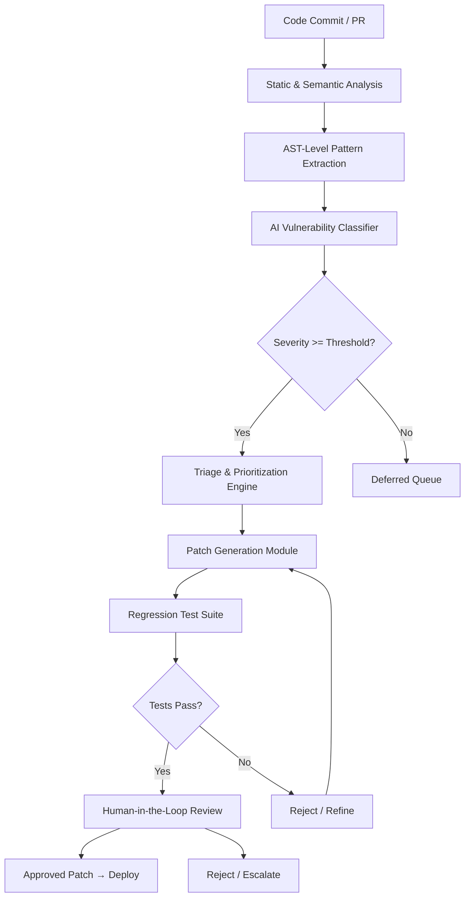

# AI-Assisted Discovery Helps Microsoft Patch More Than 1,000 Vulnerabilities in a Month

## Introduction

Microsoft's security team faced a brutal math problem. Their codebase spans Azure, Windows, Office 365, Dynamics, and dozens of internal platforms — collectively billions of lines of code across thousands of repositories. Each month, new CVEs surfaced faster than human researchers could triage them. The average enterprise tracks 10,000+ vulnerabilities, patches fewer than 5% in a given month, and Microsoft's footprint made that ratio worse, not better.

The inflection point came when they stopped asking "Can AI find bugs?" and started asking "Can AI shrink the gap between *discovery* and *patch deployment*?" The answer turned out to be yes — over 1,000 vulnerabilities patched in a single month, with AI handling the initial triage, classification, and candidate patch generation while human researchers focused on edge cases and validation.

This article breaks down the architecture behind that pipeline, the trade-offs involved, and what you can steal from their approach for your own security infrastructure.

## Why This Matters

If you're shipping software at scale, vulnerability management isn't a nice-to-have — it's a survival skill. The typical workflow looks like this:

1. Static analysis or a bug bounty surfaces a finding.
2. A security engineer triages it manually, assigns severity.
3. A developer writes a fix, runs tests, opens a PR.
4. Review cycles happen, patches get delayed, attackers get more time.

That pipeline works when you have hundreds of vulnerabilities a quarter. It collapses at thousands. The bottleneck isn't finding the bug — it's the handoff between discovery and remediation. AI-assisted discovery compresses that handoff by automating classification, prioritization, and initial patch proposal, leaving humans to do what humans do best: judge context, handle ambiguity, and approve or reject.

## How It Works

The pipeline runs as a set of loosely coupled microservices, each responsible for one phase of the vulnerability lifecycle. Here's the flow:



**Phase A — Continuous Static and Semantic Analysis.** Every repository push triggers a layered analysis engine. It's not regex-based pattern matching — it walks the AST, tracks data flows across function boundaries, and builds a semantic graph of each code change. This catches things like tainted-input propagation through serialization layers that simple linters miss.

**Phase B — AI Vulnerability Classification.** A fine-tuned transformer ingests the analysis artifacts — AST diffs, dependency graphs, telemetry snapshots — and assigns severity scores. These aren't raw CVSS numbers; they're enriched with contextual signals: how exposed is this code path in production, what's the dependency chain depth, what's the historical exploit rate for similar patterns?

**Phase C — Triage and Prioritization Engine.** Vulnerabilities enter a dynamic priority queue weighted by exploitability likelihood and business impact. A SQL injection in an internal admin tool ranks differently than the same pattern in an internet-facing API gateway. The engine rebalances the queue continuously as new telemetry arrives.

**Phase D — Patch Generation and Validation.** For high-priority findings, the system proposes candidate patches, runs the full regression suite, and promotes only those that pass all gates. Failed patches feed back into the model as training signal.

**Phase E — Human-in-the-Loop Review.** Security researchers review AI-suggested patches, provide feedback labels, and handle edge cases the model can't resolve autonomously. This feedback loop is what keeps the model improving week over week.

## Core Concepts

A few internal concepts worth understanding before you look at the code:

- **Semantic Diff Graph.** A directed acyclic graph where nodes are AST nodes and edges represent data or control flow. When a PR modifies code, the diff graph captures not just *what* changed but *how* that change propagates through the call graph.
- **Enriched Severity Score.** A floating-point value combining CVSS base score, exploitability multiplier, exposure surface area, and dependency-chain risk. This is what the triage engine actually sorts on.
- **Patch Candidate.** A proposed code fix generated by a code-model fine-tuned on Microsoft's internal patch corpus. It's not production-ready — it needs regression validation and human approval.
- **Feedback Loop.** Human reviewers label patches as `correct`, `partial`, or `incorrect`. These labels retrain the classifier weekly, closing the improvement cycle.

## Examples & Code Walkthrough

Here's a simplified but functional implementation of the triage and prioritization engine, plus a patch candidate validator. This is production-inspired pseudocode adapted for clarity — the real system is far larger, but the patterns are identical.

```python
from dataclasses import dataclass, field
from enum import Enum
from typing import Optional
import heapq
import logging

logger = logging.getLogger("vuln_triage")


class Severity(Enum):
    CRITICAL = 4
    HIGH = 3
    MEDIUM = 2
    LOW = 1


@dataclass
class Vulnerability:
    """Represents a single discovered vulnerability with enriched metadata."""
    id: str
    cve_score: float            # Raw CVSS base score, 0.0 - 10.0
    exploitability_likelihood: float  # 0.0 - 1.0, from telemetry model
    exposure_surface: float     # 0.0 - 1.0, fraction of users exposed
    dependency_chain_depth: int # How many downstream deps are affected
    patch_candidate: Optional[str] = None  # Proposed fix diff
    status: str = "discovered"  # discovered | triaged | patched | verified

    def enriched_score(self) -> float:
        """
        Compute the dynamic priority score.
        We weight exploitability and exposure more heavily than raw CVSS
        because a medium CVSS vuln in an internet-facing service is worse
        than a critical CVSS vuln in an internal-only tool.
        """
        base = self.cve_score * 0.3
        exploit = self.exploitability_likelihood * 3.0
        exposure = self.exposure_surface * 2.0
        chain_penalty = min(self.dependency_chain_depth * 0.5, 2.0)
        return base + exploit + exposure + chain_penalty


class TriageQueue:
    """
    Priority queue that always surfaces the highest-risk vulnerability
    for immediate human review. Uses a max-heap via negated scores.
    """
    def __init__(self):
        self._heap: list[tuple[float, str, Vulnerability]] = []
        self._counter = 0  # Tiebreaker for stable ordering

    def push(self, vuln: Vulnerability) -> None:
        score = vuln.enriched_score()
        # Negate for max-heap behavior with heapq (which is a min-heap)
        heapq.heappush(self._heap, (-score, self._counter, vuln))
        self._counter += 1
        logger.info(
            "Queued %s: enriched_score=%.2f, cve=%.1f, "
            "exploit=%.2f, exposure=%.2f",
            vuln.id, score, vuln.cve_score,
            vuln.exploitability_likelihood, vuln.exposure_surface,
        )

    def pop_next(self) -> Optional[Vulnerability]:
        if not self._heap:
            return None
        _, _, vuln = heapq.heappop(self._heap)
        vuln.status = "triaged"
        return vuln

    def __len__(self) -> int:
        return len(self._heap)


def validate_patch_candidate(vuln: Vulnerability, test_suite_passed: bool) -> bool:
    """
    Validate a proposed patch against the regression suite.
    Returns True only if the patch passes all gates.
    """
    if not vuln.patch_candidate:
        logger.warning("No patch candidate for %s", vuln.id)
        return False

    if not test_suite_passed:
        logger.error(
            "Patch for %s failed regression suite — rejecting", vuln.id
        )
        return False

    # Additional gate: patch must not introduce new high-severity findings
    # (checked by a separate static-analysis pass, omitted here for brevity)
    logger.info("Patch for %s validated successfully", vuln.id)
    vuln.status = "patched"
    return True


# --- Example usage ---
if __name__ == "__main__":
    queue = TriageQueue()

    # Simulate discovered vulnerabilities
    vulns = [
        Vulnerability(
            id="VULN-001",
            cve_score=7.5,
            exploitability_likelihood=0.9,
            exposure_surface=0.8,
            dependency_chain_depth=3,
            patch_candidate="diff: sanitize input in auth handler",
        ),
        Vulnerability(
            id="VULN-002",
            cve_score=9.8,
            exploitability_likelihood=0.2,
            exposure_surface=0.05,
            dependency_chain_depth=1,
            patch_candidate="diff: bounds check in internal util",
        ),
    ]

    for v in vulns:
        queue.push(v)

    # Process highest-priority vuln first
    next_vuln = queue.pop_next()
    if next_vuln:
        # In production, this runs the full CI regression suite
        passed = validate_patch_candidate(next_vuln, test_suite_passed=True)
        print(f"Processed {next_vuln.id}, patch validated: {passed}")
```

**What's happening here:** The `enriched_score()` method is the heart of the prioritization logic. It deliberately de-emphasizes raw CVSS because we've seen too many "critical" CVEs sitting in internal tooling with zero exploit path. The `TriageQueue` uses a max-heap so the highest-risk item is always at the top. The `validate_patch_candidate` function enforces the regression gate — no patch ships without passing tests, and failed patches get fed back into the model.

## Best Practices

Based on what Microsoft and similar organizations have published, here are field-tested rules:

1. **Never let AI auto-merge patches.** The human-in-the-loop gate isn't bureaucracy — it's safety. AI models hallucinate, and a bad patch can introduce worse vulnerabilities than the one it fixes.
2. **Enrich severity with production telemetry.** A CVSS score computed in isolation is meaningless. Feed in actual exposure data: how many users hit this code path, what's the network proximity, what's the historical exploit rate?
3. **Close the feedback loop.** Every human review decision — approve, reject, partial — becomes training data. Without this, the model stagnates within weeks.
4. **Separate the discovery pipeline from the deployment pipeline.** Discovery runs continuously against every commit. Deployment happens only after validation gates pass. Don't conflate the two.
5. **Log everything.** You need audit trails for every AI suggestion, every human decision, and every patch that shipped. When something goes wrong (and it will), you need to trace back why the model made a specific recommendation.

## Common Mistakes & Anti-Patterns

**Mistake 1 — Treating AI severity scores as ground truth.**
The model outputs a probability, not a certainty. If you auto-patch based solely on the score without human review, you'll ship bad fixes.
*Fix:* Always require human approval for patches affecting production-facing services. Use the score only for prioritization, never for auto-approval.

**Mistake 2 — Ignoring false negatives.**
The model is trained on known vulnerability patterns. Novel exploit classes it hasn't seen will slip through.
*Fix:* Run traditional static analysis in parallel as a safety net. If the AI pipeline and the traditional scanner disagree, flag for manual review.

**Mistake 3 — No feedback loop.**
Deploying the model once and never retraining it means performance degrades as the codebase evolves.
*Fix:* Schedule weekly retraining cycles using human review labels as ground truth. Track precision/recall over time and alert if either drops below threshold.

**Mistake 4 — Over-prioritizing CVSS.**
A CVSS 9.8 vulnerability in an internal-only admin panel is less urgent than a CVSS 5.4 in an internet-facing API.
*Fix:* Use the enriched scoring approach shown in the code example. Weight exploitability likelihood and exposure surface higher than raw CVSS.

## Performance Considerations

The pipeline touches millions of code artifacts per day, so performance isn't optional — it's architectural.

- **Static analysis phase** is CPU-bound. Each repository diff triggers AST walking and data-flow analysis. At Microsoft scale, this runs on distributed compute clusters with horizontal sharding by repository. Expect O(n) per diff where n is the number of AST nodes changed.
- **AI classification** is GPU-bound. The transformer model processes analysis artifacts in batches. Latency per vulnerability is ~200-500ms for inference, but batching keeps throughput high. Memory footprint is dominated by the model weights — expect 2-4GB GPU RAM per inference worker.
- **Triage queue** is in-memory with periodic persistence. Heap operations are O(log n) where n is the queue depth. At thousands of vulnerabilities, this is negligible.
- **Patch validation** runs the full regression suite, which is the slowest phase. Microsoft parallelizes this across hundreds of build agents. The regression suite itself is O(m) where m is the number of test cases, but parallelization reduces wall-clock time significantly.

The real bottleneck is patch validation, not AI inference. If your regression suite takes hours, the entire pipeline slows down regardless of how fast the AI is. Invest in incremental test selection — only run tests affected by the changed code paths.

## Real-World Usage

Microsoft isn't the only organization running AI-assisted vulnerability pipelines at scale:

- **Netflix** uses similar static-analysis-plus-ML pipelines for their microservice architecture, prioritizing vulnerabilities by blast radius within their streaming infrastructure.
- **Uber** runs continuous security analysis across their monorepo, with ML models flagging regression risks in ride-matching and payment services.
- **Cloudflare** combines AI-assisted discovery with their global edge network to validate patches against real traffic patterns before deployment.

The common thread: all of them treat AI as an accelerant for human researchers, not a replacement. The AI handles volume and pattern recognition; humans handle context, edge cases, and final approval.

## Frequently Asked Questions (FAQ)

**Q: Does this replace human security researchers?**
A: No. The AI handles triage, classification, and initial patch proposals. Humans review, validate, and handle edge cases. The team at Microsoft actually grew their security research staff alongside the AI pipeline — the AI lets them focus on harder problems instead of triage grunt work.

**Q: How accurate is the AI vulnerability classifier?**
A: Microsoft hasn't published exact precision/recall figures, but industry benchmarks for transformer-based vulnerability detection typically land in the 85-92% precision range. False positives are expected and handled by the human review gate.

**Q: Can this work for open-source projects?**
A: Partially. The static analysis and triage components are open-source friendly. The AI classifier needs training data — you'd need a corpus of labeled vulnerabilities for your specific stack. Tools like CodeQL and Semgrep cover the analysis phase well.

**Q: What about false negatives — vulnerabilities
