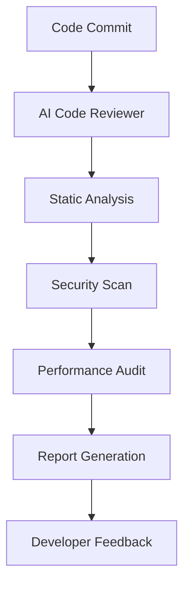

# AI Code Reviewer: Never Ship Bugs Again

## Introduction
When I reflect on my years of experience as a software engineer, I'm reminded of the countless hours spent debugging code, only to find that a simple mistake had slipped through the cracks. The frustration is palpable, and the consequences can be severe. That's why the concept of an AI code reviewer resonates deeply with me. Imagine having a vigilant companion that scrutinizes your code, identifying potential issues before they become major problems. This is precisely what an AI code reviewer promises to deliver.

## Why This Matters
The importance of reliable code review cannot be overstated. As software systems grow in complexity, the likelihood of errors and bugs increases exponentially. Manual code reviews, while essential, are time-consuming and prone to human error. An AI code reviewer acts as a safety net, augmenting human capabilities to ensure that code is robust, maintainable, and free from defects. By leveraging AI in code review, development teams can significantly reduce the risk of shipping buggy code, thereby protecting their reputation, reducing support overhead, and enhancing user satisfaction.

## How It Works
At its core, an AI code reviewer is a sophisticated tool that analyzes source code to detect anomalies, security vulnerabilities, and performance issues. The process involves several key steps:
1. **Code Ingestion**: The AI tool ingests the source code, which can be written in various programming languages.
2. **Analysis**: Advanced algorithms, often powered by machine learning, analyze the code against a set of predefined rules, best practices, and known patterns of errors or inefficiencies.
3. **Reporting**: The tool generates a detailed report highlighting potential issues, complete with recommendations for improvement.



## Core Concepts
Understanding the core concepts behind an AI code reviewer is crucial for effective utilization. Key terms include:
- **Static Analysis**: The process of analyzing code without executing it, to find errors or improve code quality.
- **Machine Learning**: AI code reviewers often employ machine learning algorithms to learn from existing codebases and improve their detection capabilities over time.
- **Code Smells**: Suboptimal code structures that, while not causing errors, can make code harder to understand or maintain.

## Examples & Code Walkthrough
Consider a scenario where a developer has written a function to handle user authentication. An AI code reviewer might flag this function for potential issues, such as lack of input validation or insecure password storage. Here's an example in Python:

```python
def authenticate_user(username, password):
    # AI code reviewer might suggest improvements here
    if username in users and users[username] == password:
        return True
    return False
```

Upon review, the AI tool could recommend enhancements for security and performance, such as using a secure hashing algorithm for passwords and implementing rate limiting to prevent brute-force attacks.

## Best Practices
To get the most out of an AI code reviewer, follow these best practices:
- **Integrate Early**: Incorporate the AI code reviewer into your CI/CD pipeline as early as possible to catch issues before they become ingrained.
- **Customize Rules**: Tailor the analysis rules to your project's specific needs and coding standards.
- **Address All Issues**: Treat warnings and suggestions with the same gravity as errors to maintain high code quality.

## Common Mistakes & Anti-Patterns
Several pitfalls can undermine the effectiveness of an AI code reviewer:
- **Overreliance**: Relying solely on AI without human oversight can lead to missed issues or false positives.
- **Ignoring Feedback**: Failing to address suggestions and warnings can render the tool ineffective.
- **Inadequate Configuration**: Not customizing the tool to the project's needs can result in irrelevant feedback.

## Performance Considerations
The performance impact of an AI code reviewer is generally minimal, as analysis occurs statically and does not affect runtime performance. However, considerations include:
- **Analysis Time**: Large codebases can take significant time to analyze.
- **Resource Usage**: Running the AI tool requires computational resources, which can add to the overall CI/CD pipeline time.

## Real-World Usage
Industry leaders are already leveraging AI code reviewers to enhance their software development processes. For instance, companies like Google and Microsoft use AI-powered tools to review code changes, ensuring that their vast and complex codebases remain robust and secure.

## Frequently Asked Questions (FAQ)
1. **Q: Can an AI code reviewer replace human code review?**
   A: No, AI code reviewers augment human review by catching obvious errors and freeing humans to focus on complex issues.
2. **Q: How accurate are AI code reviewers?**
   A: Accuracy varies by tool and configuration but generally improves over time as the AI learns from the codebase.
3. **Q: Do AI code reviewers support all programming languages?**
   A: Most support popular languages, but coverage can vary; it's essential to check the tool's compatibility with your project's languages.

## Conclusion
The integration of AI code reviewers into software development workflows represents a significant step forward in the pursuit of defect-free code. By understanding how these tools work, their benefits, and their limitations, developers can harness their power to improve code quality, reduce debugging time, and ultimately, ship better software. As the technology continues to evolve, we can expect even more sophisticated capabilities, further blurring the lines between human and artificial intelligence in code review.
