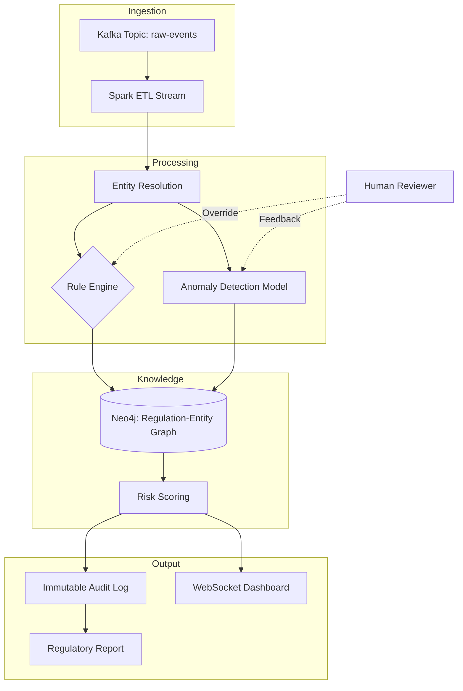

# AI Compliance Automation Software: Features, Architecture & Development Cost

## Introduction

Two years ago, our team spent three weeks manually mapping customer data fields against GDPR Article 30 requirements. We missed three fields. A third-party audit caught them, and the resulting remediation effort cost more in engineering hours than the software would have cost to build. That failure drove the decision to automate.

Regulatory frameworks like GDPR, CCPA, and SOX are not static documents. They are living systems of rules that intersect with data pipelines, user consent flows, and transaction logs. When you scale that intersection across an enterprise, manual checks break. Humans get tired; scripts get stale.

This article breaks down how to build AI-driven compliance automation software. I am not talking about a SaaS wrapper. I am talking about the architecture, the feature set, and the actual budget required to build a system that holds up under audit pressure. We built this in production, and this is what we learned about the trade-offs between deterministic rules and probabilistic machine learning models.

## Why This Matters

Engineers often treat compliance as a legal department problem. That is a dangerous assumption. Compliance is fundamentally a data plumbing problem. You cannot prove you are compliant if you do not know where the data lives or how it moves.

The production pain point is visibility. When a regulator asks, "Show me all user data processed without consent in Q2," a standard relational query returns nothing useful unless your schema has been tagged for lineage. AI helps bridge the gap between raw data and regulatory intent. Natural Language Processing (NLP) reads the regulation text and extracts rules. Stream processing watches the data. A knowledge graph connects the two.

Without this automation, you rely on point-in-time snapshots. With it, you get continuous assurance. The cost of inaction is no longer just a fine; it is the loss of customer trust when a breach lands in the news.

## How It Works

The core mechanism is a pipeline that converts unstructured regulatory text and structured transaction data into a verified compliance score. It is event-driven. When a user action occurs, it flows through ingestion, gets normalized, gets evaluated against rules and models, and lands in an immutable audit log.

Here is the architecture flow we settled on after two failed prototypes. The first used a monolithic Python script; it broke under load. The second used microservices but suffered from distributed tracing latency. This version balances decoupling with observability.

Step one is ingestion. We use Apache Kafka because it allows us to replay events. If a rule changes or a model drifts, we can reprocess historical events without rebuilding the dataset. Kafka is the single source of truth for "what happened."

Step two is preprocessing. Spark normalizes the schema. Different services send user IDs in different formats (UUIDs, hashed emails, device IDs). Entity resolution merges these into a single subject before evaluation. If you skip this, your risk score will be fragmented across duplicate identities.

Step three is evaluation. This is split into two paths. The Rule Engine handles deterministic logic (e.g., "Is consent timestamp after 2018-05-25?"). The Anomaly Detection Model handles probabilistic logic (e.g., "Does this transaction volume look like a data exfiltration attempt?").

Step four is the Knowledge Graph. Neo4j maps relationships: Regulation X applies to Entity Y, which has Incident Z. This makes querying "what regulations does this incident violate?" trivial compared to joining six SQL tables.

Step five is output. The audit log must be append-only. Once a record is written, it cannot be altered. The dashboard updates via WebSockets so compliance officers see violations as they happen, not the next morning.

## Core Concepts

### Component Stack

Building this requires specific tools chosen for durability, not novelty.

- **Data Ingestion:** Apache Kafka. High throughput, durable replay.
- **Preprocessing:** Apache Spark Structured Streaming. Handles schema evolution better than Flink for our team's skill set.
- **Rule Engine:** Drools or a custom Python DSL. We built our own DSL to avoid the complexity of managing Drools state across distributed nodes.
- **Anomaly Detection:** Isolation Forest for tabular data, LSTM networks for time-series sequences.
- **Knowledge Graph:** Neo4j. Essential for relationship mapping between regulations and entities.
- **Frontend:** React with WebSocket-driven updates for real-time alerting.

### Budgeting the Build

The cost varies wildly based on whether you buy a GRC platform or build. Building gives you control over the data model and the rule logic, but it requires significant capital. Based on our hiring and infrastructure spend, here is the realistic breakdown.

**Team Composition**

| Role | Count | Annual Salary Range |
| :--- | :--- | :--- |
| Senior AI/ML Engineer | 2 | $180k–$220k |
| Full-Stack Developer | 3 | $120k–$150k |
| DevOps Engineer | 1 | $140k–$170k |
| Compliance Domain Expert | 1 | $100k–$130k |

**Infrastructure Costs (Monthly)**

- **Cloud (AWS/GCP):** $5k–$15k. This covers compute, storage, and ML training cycles.
- **Databases (Neo4j, Kafka):** $2k–$5k. Managed
