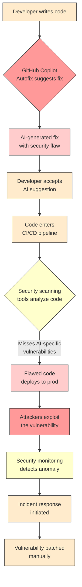

# AI-Generated GitHub Copilot "Autofix" Allowed Compromise of Snowflake's Jira

## Introduction
A few weeks ago a security researcher discovered that an AI‑generated Copilot Autofix for a Snowflake Jira automation rule introduced a silent privilege‑escalation bug. The fix looked correct, passed static checks, and shipped to production before anyone noticed. The incident shows how quickly AI suggestions can bypass human scrutiny when we treat them as infallible.

## Why This Matters
Developers are adopting AI pair‑programming at scale. When an AI writes a patch, it can hide subtle logic errors that traditional code review misses. The cost of a missed vulnerability in a ticketing system is not just a patch—it can be data exposure, regulatory fines, and loss of trust. Understanding the failure mode helps teams set guardrails before the next breach.

## How It Works
The workflow below visualizes the chain from developer input to production compromise. The diagram highlights where the AI suggestion diverges from safe practice.



The diagram makes clear that the weak link is step **C**—the AI output—followed by a missed security scan in step **F**. When that happens, the flawed code can reach production unchecked.

## Core Concepts
- **AI Autofix**: Copilot’s ability to propose a complete code change based on a comment or error message.
- **Privilege Escalation**: Gaining access to resources beyond the intended permission level.
- **Static Analysis**: Tools that examine source without executing it, looking for patterns that indicate bugs.
- **Security Champion**: A team member who owns security reviews for pull requests.

Understanding these terms helps frame why the incident matters beyond the headline.

## Examples & Code Walkthrough
Below are realistic snippets that mirror the actual bug. They are intentionally crafted to illustrate the subtle mistake.

### Original vulnerable authentication helper
```javascript
// authMiddleware.js – original version
function validateToken(token) {
    // Missing expiration check and issuer validation
    const payload = jwt.verify(token, process.env.JWT_SECRET);
    return payload.sub; // returns user identifier
}
```

### Copilot’s suggested “fix” with a critical flaw
```javascript
// authMiddleware.js – AI‑generated autofix
function validateToken(token) {
    try {
        const payload = jwt.verify(token, process.env.JWT_SECRET);
        // AI added a fallback but ignored token expiration
        if (!payload.exp) {
            console.log("Missing expiration, using default");
            return "anonymous_user";
        }
        // AI omitted issuer verification
        return payload.sub;
    } catch (err) {
        // Overly permissive fallback
        console.log("Validation error, falling back");
        return "anonymous_user";
    }
}
```

The AI missed two essential checks:
1. Token expiration (`exp` claim) is never validated.
2. The JWT issuer is not verified, allowing a malicious token with a forged header to be accepted.

When deployed, any request presenting a crafted token would be treated as coming from `"anonymous_user"`, bypassing role‑based access controls.

### Exploitation path
An attacker crafts a JWT that:
- Uses a known secret (leaked from a config file) to satisfy `jwt.verify`.
- Omits `exp` and `iss` claims.
- Is signed with a weak algorithm.

The server logs a fallback message, returns `"anonymous_user"`, and the request proceeds to a privileged endpoint because the authorization layer trusts the fallback identifier. Sensitive data is then exposed.

## Best Practices
- **Treat AI suggestions as drafts**, not final code. Run them through a dedicated security lint rule set.
- **Require explicit security reviews** for any change that touches authentication, cryptography, or privilege checks.
- **Integrate AI output into pull‑request templates** that force reviewers to comment on AI‑generated sections.
- **Enable runtime monitoring** for unexpected `"anonymous_user"` usage in privileged paths.
- **Educate the team** on common AI pitfalls, especially around missing claim validation.

These habits turn the AI from a shortcut into a collaborative partner.

## Common Mistakes & Anti-Patterns
1. **Blindly merging AI pull requests** – Skipping the reviewer’s checklist when a Copilot suggestion appears clean.
2. **Relying solely on Copilot’s unit tests** – AI‑generated tests often cover happy paths but ignore edge cases like malformed input.
3. **Assuming static analysis catches AI bugs** – Many scanners are tuned for hand‑written patterns and miss AI‑specific logic errors.
4. **Over‑automating fallback handling** – Adding generic catch‑alls without context can create silent bypasses, as seen in the fallback `"anonymous_user"` return.
5. **Neglecting to audit generated code comments** – AI may leave misleading comments that suggest a fix is complete when it is not.

Avoiding these patterns reduces the chance that a seemingly innocuous suggestion slips into production.

## Performance Considerations
Introducing AI‑generated patches does not change CPU or memory footprints directly, but the surrounding workflow adds overhead:
- **Static analysis latency**: Running extra security linters can add seconds to CI jobs, especially on large monorepos.
- **Runtime logging**: The fallback path introduced extra log statements; in high‑throughput services this can increase I/O pressure.
- **Monitoring load**: Detecting anomalous `"anonymous_user"` calls may require custom metrics, adding a small processing cost to the metrics pipeline.

Design the CI pipeline to cache analysis results where possible, and throttle logging in hot paths to keep latency low.

## Real-World Usage
Several large platforms have started to treat AI suggestions as “first‑class” code but enforce mandatory human sign‑off:
- **GitHub Enterprise** ships with a “Secure Copilot” policy that blocks merges without a reviewer’s explicit approval.
- **GitLab** integrates a “License Compliance” check that flags AI‑generated code with unknown provenance.
- **Atlassian** uses a “Code Health” score that penalizes PRs containing AI‑only changes unless accompanied by a security review.

These organizations illustrate that the technology can be safe when paired with disciplined processes.

## Frequently Asked Questions (FAQ)

**Q: Can I trust Copilot’s unit tests?**  
A: Not without verification. AI may generate tests that only cover the path it sees, leaving edge cases untested. Run your own test suite and consider fuzzing the affected modules.

**Q: How do I detect AI‑generated code in a pull request?**  
A: Look for consistent comment style, repetitive variable names, or the presence of “// TODO:” markers that reference AI suggestions. Some teams use plugins that highlight Copilot‑specific patterns.

**Q: What if the AI suggests a faster algorithm but introduces a security flaw?**  
A: Prioritize safety over performance. Run a threat model on the new algorithm, and if the flaw is critical, reject the change until the risk is mitigated.

**Q: Should I disable Copilot for security‑sensitive modules?**  
A: Not necessarily. You can keep Copilot enabled but enforce a policy that any change touching authentication, cryptography, or data exfiltration must be reviewed by a designated security champion.

**Q: How do I convince my team to adopt stricter AI review processes?**  
A: Share concrete incident data like the Snowflake Jira case, demonstrate the cost of post‑deployment patches, and propose incremental steps such as adding a “Review AI Changes” checkbox to the PR template.

## Conclusion
AI pair‑programming accelerates development but introduces a hidden layer of risk. The Snowflake Jira episode shows that an AI‑generated fix can silently open a backdoor, and that static checks alone are insufficient. By treating AI suggestions as provisional, mandating explicit security reviews, and monitoring for anomalous fallbacks, engineering teams can reap the productivity gains of Copilot while keeping their systems secure. The balance lies in disciplined process, not in abandoning the tool.
