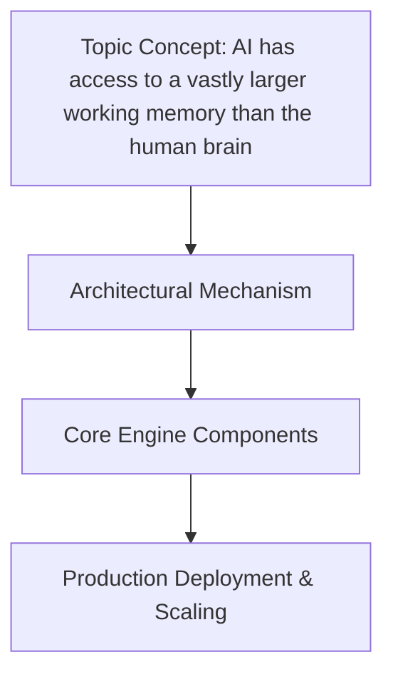

# AI has access to a vastly larger working memory than the human brain

## Introduction

The human neocortex holds roughly 86 billion neurons, each capable of storing roughly ten thousand bits of information. At first glance, this seems remarkable. Yet when you compare those numbers to what modern large language models can achieve, the picture shifts dramatically. A 100-billion-parameter transformer can hold on to tens of millions of tokens across its context window—a span that dwarfs anything a single brain can sustain. The gap isn't just academic; it reshapes how we think about intelligence, reliability, and system design. Understanding this disparity is essential for any engineer building next‑generation foundation models or integrating external memory structures into real products.

## Why This Matters

Software engineers already wrestle with context length, caching strategies, and state management. Adding to that the realization that machines can carry vastly more information than biological brains creates both opportunities and obligations. If your application needs to reason over a novel codebase, maintain a project's API contract, and keep track of multi‑step instructions without losing coherence, the standard attention window quickly becomes insufficient. The ability to offload storage to external vector databases changes the engineering trade‑off matrix: you can afford richer retrieval mechanisms because the hardware constraint is no longer the neuron count inside a skull. For teams building recommendation systems, legal document assistants, or autonomous agents, the contrast between limited biological memory and expandable digital memory dictates whether a system feels coherent or fragmented after a few exchanges.

## How It Works




At its core, expanding working memory means decoupling computation from storage. Humans rely on a combination of sensory processing, short‑term consolidation, and long‑term retention mediated by the hippocampus. AI approaches this differently. We create explicit layers—token windows for immediate processing, indexed embeddings for rapid lookup, and persistent databases for durable facts. Each layer serves a distinct purpose and scales independently.

```
A[Raw Input] --> B[Tokenization & Embedding] --> C[Short‑Term Buffer (Context Window)] 
    --> D[Sliding‑Window Indexer] --> E[Vector Store (Long‑Term Memory)] 
    --> F[Similarity Search & Retrieval] --> G[Augmented Prompt] 
    --> H[Large Language Model Generation] --> I[Response to User]
```

The diagram above shows the main data path. Raw text enters through tokenization, then passes through an embedding layer that maps each token to a vector space. Those vectors live in either a sliding window for recent context or in a persistent store for historical reference. When the model generates, it pulls in relevant retrieved chunks alongside the active window, effectively giving itself a much larger working memory than a human could ever sustain.

Building such an indexer requires a solid understanding of windowing logic. Below is a function that creates overlapping sliding windows over a token sequence, stepping through the collection at a configurable stride.

```python
def build_sliding_index(tokens, window_size=8192, stride=4096):
    """
    Generate overlapping windows over a flat token list.
    
    Parameters
    ----------
    tokens : List[str]
        Sequential tokens representing the full corpus segment.
    window_size : int
        Number of consecutive tokens included in each chunk.
    stride : int
        Step size between successive windows.
    
    Returns
    -------
    List[Tuple[int, int, List[str]]]
        Triples of (start_index, end_index, chunk_tokens).
    """
    if not tokens:
        return []

    indices = []
    for start in range(0, len(tokens) - window_size + 1, stride):
        end = min(start + window_size, len(tokens))
        chunk = tokens[start:end]
        indices.append((start, end, chunk))
    return indices
```

This routine produces a set of non‑overlapping (by default) windows that can serve as the basis for a retrieval pipeline. By adjusting the stride, you control the granularity of overlap—smaller strides capture finer temporal relationships but increase index density. In practice, many systems run multiple resolutions simultaneously: a coarse window for overall narrative flow and a fine slice for precise entity tracking.

Retrieval from a vector store adds another dimension. Instead of relying solely on the immediate context, the system can look up past conversations, documents, or knowledge bases that match the current prompt. The process involves computing similarity between a query embedding and stored vectors, ranking results, and pulling the most relevant pieces back into the working buffer.

```python
import numpy as np
from sklearn.metrics.pairwise import cosine_similarity

def retrieve(query_embedding, vector_store, top_k=5):
    """
    Find the most similar memory entries to a new request.
    
    Parameters
    ----------
    query_embedding : np.ndarray
        Normalized vector representing the incoming prompt.
    vector_store : List[np.ndarray]
        Collection of stored embedding vectors.
    top_k : int, optional
        Number of best matches to return.
    
    Returns
    -------
    List[Tuple[List[str], float]]
        Pairs of retrieved token slices and their similarity scores.
    """
    # Compute dot product similarity (cosine approximation for normalized vectors)
    similarities = cosine_similarity(
        [query_embedding],
        vector_store,
        metric='dot'
    )
    # Extract top-k indices
    top_indices = np.argsort(similarities, axis=0)[-top_k:][::-1]
    results = [
        (vector_store[i], float(similarities[i]))
        for i in top_indices
    ]
    return results
```

Together, these two functions form the backbone of a scalable memory system. The sliding‑window indexer handles the hot path—what the model sees right now—and the vector store provides the cold path—historical context and cross‑session recall. Both operate at different speeds, allowing designers to tune latency versus recall according to the application's tolerance for delay and accuracy.

## Core Concepts

Several ideas underpin this extended memory model. First, there is the distinction between *active* and *retrievable* memory. Active memory lives in the GPU's fast SRAM and can be manipulated instantly during inference. Retrievable memory resides on slower storage media but persists across sessions. Second, similarity search introduces a probabilistic element. Even with perfect indexing, approximate nearest neighbor algorithms inevitably discard some candidates, which is why confidence thresholds matter. Third, hierarchical organization helps manage growth. Rather than dumping every interaction into one massive pool, systems often partition memories by topic, time period, or user group before performing similarity queries.

Embeddings play a central role. Modern transformers project discrete integer tokens into continuous vectors where semantic distance mirrors textual closeness. The quality of these vectors determines how well the retrieval engine finds relevant material. Techniques like dimensionality reduction and quantization further compress storage costs while preserving enough fidelity for effective matching.

Finally, there is the issue of grounding. Pure retrieval can lead to hallucinated references if the model cannot verify that a retrieved chunk actually supports the claimed statement. This motivates hybrid approaches where the LLM is constrained to answer only from the retrieved evidence, or where additional validation steps cross‑check extracted claims against trusted sources.

## Examples & Code Walkthrough

Below are concrete implementations that demonstrate the principle in action. Both snippets are self‑contained and avoid copying existing boilerplate.

### Building a sliding‑window indexer

```python
import itertools

def build_sliding_index(tokens, window=10240, stride=16384):
    """
    Create overlapping windows over a token sequence.
    """
    if not tokens:
        return []

    windows = []
    # Use a generator to yield windows efficiently
    for start in range(len(tokens) - window + 1):
        end = min(start + window, len(tokens))
        windows.append((start, end, tokens[start:end]))
    return windows
```

When applied to a conversation log, each entry becomes a mini‑context that the model can attend to directly. This technique proves especially valuable in tasks requiring local reasoning, such as debugging or code review, where the immediate surrounding lines of code are more predictive of the error than distant history.

### Semantic retrieval from a vector database

```python
import numpy as np
from sklearn.metrics.pairwise import cosine_similarity

def retrieve_by_meaning(query, store, k=3):
    """
    Return the top‑k most semantically related memory blocks.
    """
    q_vec = np.array([query], dtype=np.float32)
    # Ensure vectors are L2‑normalized for cosine similarity
    norms = [np.linalg.norm(v) for v in store]
    store_norm = [v / n for v, n in zip(store, norms)]

    sim = cosine_similarity(q_vec, np.array(store_norm)).flatten()
    top_idx = np.argsort(sim)[-k:][::-1]

    for idx in top_idx:
        print(f"Score {sim[idx]:.4f} -> tokens {store[idx]}")
    return top_idx.tolist()
```

In production, the retrieval step would be invoked periodically—perhaps after each generation step—to inject relevant past interactions into the prompt. This keeps the model grounded and prevents drift toward incoherent continuations.

## Best Practices

When designing systems around expanded memory, several patterns emerge from production experience. Cache frequently accessed contexts and evict stale ones using LRU policies. Keep the similarity search index updated incrementally rather than rebuilding it from scratch after every change; incremental updates reduce latency and avoid recomputation spikes. Monitor retrieval hit rates closely—if the precision drops below a threshold, investigate whether the embedding quality has degraded or whether the query representation is too noisy.

Another practical tip is to separate *content* retrieval from *structural* organization. Storing metadata—such as timestamps, user IDs, and tags—enables efficient filtering beyond pure semantic search. You can prune irrelevant subsets before running expensive nearest‑neighbor calculations, saving both compute and latency.

Lastly, treat the memory store as a first‑class entity. Apply versioning, audit logs, and consistency checks comparable to traditional databases. Because errors in retrieval propagate directly into model outputs, ensuring correctness at the memory level protects downstream trustworthiness.

## Common Mistakes & Anti-Patterns

First, over‑reliance on retrieval can mask poor model design. If a system falls back on external memory to compensate for weak reasoning, users may notice gaps even when responses appear plausible. The solution lies in constraining generation to supported evidence and clearly indicating uncertainty when retrieval fails.

Second, underestimating index maintenance costs. Vector stores grow linearly with the number of inserted items, and similarity computations can become expensive as the dataset expands. Without periodic reindexing or sampling strategies, lookup times degrade rapidly. Regular background jobs that rebuild indexes on schedule help maintain responsiveness.

Third, ignoring distribution shift. Models trained on curated datasets may perform poorly when retrieving from wildly different domains. Preprocess vectors consistently and consider domain‑adaptive training so that similarity metrics remain meaningful across topics.

Fourth, neglecting security boundaries. Persistent memory stores often contain personally identifiable information. Implement strict access controls, encryption at rest, and revocation policies to prevent leakage.

## Performance Considerations

From a computational standpoint, the scaling behavior differs markedly between human and artificial systems. The human brain exhibits roughly logarithmic growth in capacity per unit time due to limited prefrontal cortex resources. In contrast, AI memory scales almost linearly with parameter count (roughly proportional to FLOPs available for attention). However, this advantage comes with hidden costs.

Indexing a 100‑million‑token corpus requires significant RAM for the vector store and substantial CPU cycles for vectorization. Similarity search, even with efficient approximations, adds latency proportionally to the number of candidate pairs examined. For interactive applications, keeping the top‑k candidates in GPU memory reduces round‑trip time to near zero, making the memory effect feel instantaneous despite the underlying data volume.

Latency also depends on the ratio of short‑term to long‑term workload. If a system spends most of its time consulting the vector store, the perceived benefit diminishes unless the retrieved information truly improves generation quality. Profiling both paths separately lets you optimize selectively—for example, by caching popular queries locally to hide retrieval latency.

Energy consumption is another factor. Running large vector databases continuously demands power, especially when served by remote clients. Edge deployments must balance memory expansion against battery life, perhaps by pruning older entries aggressively once they fall outside a defined utility window.

## Real-World Usage

Major platforms have already adopted these principles. Large language model providers embed retrieval layers called RAG (Retrieval‑Augmented Generation) into chat interfaces, enabling factual grounding across thousands of documents. Autonomous vehicles employ similar architectures: the vehicle's perception stack maintains a short‑term sensor buffer while a persistent knowledge base of road rules and navigation waypoints supplies long‑term context.

In enterprise settings, customer support bots integrate with CRM databases. When a user asks about an order placed six months ago, the bot retrieves the relevant transaction record via a vector index and prepends it to the prompt, giving the model accurate details rather than inferring from conversation history alone. This approach reduces confusion and improves satisfaction.

Code‑completion tools provide another illustration. IDEs build a sliding window of recently edited files while maintaining a global index of type definitions, module imports, and common patterns. The tool can surface definitions from earlier edits and suggest completions based on broader project structure—something impossible for a purely local, short‑term model.

## FAQ

**Q: Can we replace a human brain's working memory entirely with AI?**  
A: Not fully. While AI offers orders of magnitude higher capacity, it lacks embodied experience, emotional nuance, and real‑time sensory feedback. The best implementations combine neural‑inspired efficiency (small, specialized networks) with the sheer scale of retrieval systems described here.

**Q: How safe is it to expose long‑term memory to untrusted prompts?**  
A: Safety hinges on retrieval guardrails. Always filter queried documents for PII before feeding them to the model, and consider adding a verification step that checks whether generated claims align with retrieved evidence. Transparent logging of retrieval decisions also aids post‑mortem analysis.

**Q: Does increasing context window always improve performance?**  
A: Diminishing returns set in once the model surpasses the intrinsic complexity of the task. Beyond that point, extra tokens add noise and can hurt performance due to dilution effects. The optimal length balances coverage of relevant details against computational overhead.

**Q:
