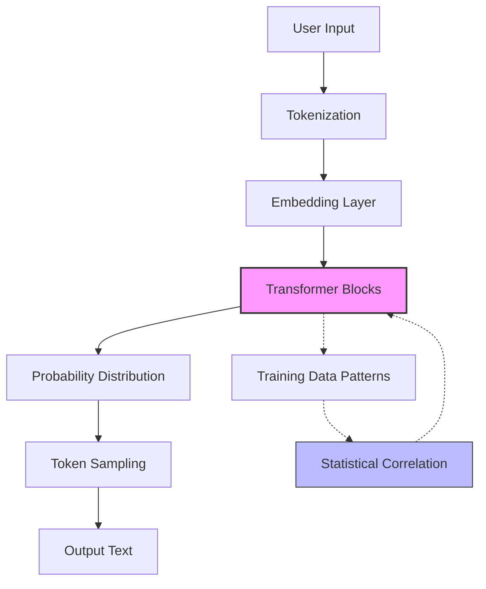

# AI Has No Wisdom and Neither Will You

## Introduction
I spent last week watching a production incident unfold in real-time. Our team had deployed an AI-powered code review tool that was supposed to catch bugs before they reached production. It failed—spectacularly—on a subtle concurrency issue that any junior engineer would have spotted in seconds. The model flagged 200 false positives on legitimate design patterns while missing the actual race condition entirely. The problem wasn't the model's architecture or our training data. It was that we'd confused statistical pattern matching with understanding.

That's the core lie we're all buying into right now: that bigger models, more parameters, and cleverer architectures will eventually produce wisdom. They won't. AI systems are sophisticated guessing machines that operate on correlation, not causation. They have no context, no experience, and no ability to reason about trade-offs. And neither will you if you treat them as black-box oracle.

## Why This Matters
Every engineering organization is currently evaluating where to plug AI into their stack. The temptation is to use it as a silver bullet—to automate away the tedious parts of development, code review, debugging, or architecture decisions. But here's what actually happens in production: models hallucinate documentation, generate code with subtle security vulnerabilities, and confidently produce incorrect optimizations that look plausible until they don't.

The real pain point isn't that AI is bad at certain tasks. It's that we're building systems that appear intelligent while fundamentally lacking the judgment that separates a working system from a catastrophic one. When your deployment pipeline starts auto-merging AI-generated pull requests without human review, you're not saving time—you're creating technical debt with a side of existential risk.

## How It Works
Let's strip away the marketing and look at what these systems actually do. At their core, modern AI models are massive statistical engines trained on vast corpora of data. They learn the probability distribution of tokens (or subwords) given previous tokens. When you prompt them, they sample from this distribution, generating outputs that are statistically plausible but semantically arbitrary.

The mechanism is essentially a high-dimensional compression and retrieval system. Your input gets transformed into a dense vector representation, matched against patterns in the training data, and decoded back into human-readable form. There's no comprehension happening—just extremely sophisticated interpolation between examples seen during training.



The critical insight is that the transformer blocks aren't "thinking"—they're performing matrix multiplications across millions of parameters that were optimized to minimize prediction error on training data. The emergent capabilities we observe are artifacts of scale, not understanding.

## Core Concepts
The fundamental components that make up these systems include:

**Tokenization**: The process of breaking text into discrete units. Different tokenizers (BPE, SentencePiece, etc.) produce vastly different representations, which directly impacts model performance. A poorly chosen tokenizer can fragment common words into meaningless subword units, degrading performance on domain-specific language.

**Embeddings**: Dense vector representations that capture semantic relationships in high-dimensional space. These are learned during training and encode patterns like synonymy, analogy, and syntactic structure. However, they're fundamentally limited to the distribution of their training data—they have no concept of causality or physical reality.

**Attention Mechanisms**: The core innovation that allows models to focus on relevant parts of the input when generating each token. Multi-head attention layers learn to attend to different linguistic features (syntax, semantics, coreference) simultaneously, but this is still pattern matching, not reasoning.

**The Training Objective**: Next-token prediction (or masked language modeling) creates a proxy task that correlates with human-like text but doesn't require understanding. The model optimizes for likelihood, not truthfulness or logical consistency.

## Examples & Code Walkthrough
Here's a practical example of how we integrated an AI model into our code review pipeline, along with the safeguards we built:

```python
import torch
from transformers import AutoTokenizer, AutoModelForCausalLM
from typing import List, Dict, Optional
import logging
import time
from dataclasses import dataclass

@dataclass
class ReviewResult:
    confidence: float
    issues: List[Dict]
    fallback_used: bool
    processing_time: float

class SafeCodeReviewer:
    def __init__(self, model_name: str, max_retries: int = 3):
        self.tokenizer = AutoTokenizer.from_pretrained(model_name)
        self.model = AutoModelForCausalLM.from_pretrained(model_name)
        self.max_retries = max_retries
        self.logger = logging.getLogger(__name__)
        
        # Confidence thresholds calibrated on our validation set
        self.min_confidence = 0.7
        self.max_sequence_length = 2048
        
    def review_code(self, code_snippet: str, context: Optional[str] = None) -> ReviewResult:
        """Review code with safety fallbacks and confidence scoring."""
        start_time = time.time()
        
        # Input validation and sanitization
        if not code_snippet or len(code_snippet.strip()) < 10:
            return ReviewResult(
                confidence=0.0,
                issues=[],
                fallback_used=True,
                processing_time=time.time() - start_time
            )
        
        # Truncate if too long to avoid OOM errors
        if len(code_snippet) > self.max_sequence_length * 4:  # rough char-to-token ratio
            code_snippet = code_snippet[:self.max_sequence_length * 4]
            self.logger.warning("Code snippet truncated due to length")
        
        for attempt in range(self.max_retries):
            try:
                # Prepare input with proper attention masking
                inputs = self.tokenizer(
                    code_snippet,
                    return_tensors="pt",
                    max_length=self.max_sequence_length,
                    truncation=True,
                    padding=True
                )
                
                with torch.no_grad():
                    outputs = self.model.generate(
                        **inputs,
                        max_new_tokens=512,
                        temperature=0.3,  # Lower temperature for more focused output
                        do_sample=True,
                        top_p=0.9,
                        num_return_sequences=1,
                        pad_token_id=self.tokenizer.eos_token_id
                    )
                
                # Decode and parse the response
                response = self.tokenizer.decode(outputs[0], skip_special_tokens=True)
                issues, confidence = self._parse_response(response, code_snippet)
                
                if confidence >= self.min_confidence:
                    return ReviewResult(
                        confidence=confidence,
                        issues=issues,
                        fallback_used=False,
                        processing_time=time.time() - start_time
                    )
                
                self.logger.warning(
                    f"Low confidence ({confidence}) on attempt {attempt + 1}"
                )
                
            except Exception as e:
                self.logger.error(f"Attempt {attempt + 1} failed: {str(e)}")
                if attempt == self.max_retries - 1:
                    break
        
        # Fallback to rule-based analysis
        return ReviewResult(
            confidence=0.0,
            issues=self._rule_based_fallback(code_snippet),
            fallback_used=True,
            processing_time=time.time() - start_time
        )
    
    def _parse_response(self, response: str, original_code: str) -> tuple:
        """Parse model output and estimate confidence."""
        # Simple heuristic: check if response contains expected format
        if "ISSUE:" not in response and "WARNING:" not in response:
            return [], 0.0
        
        # Count issues found vs. response length as rough confidence metric
        issue_count = response.count("ISSUE:") + response.count("WARNING:")
        confidence = min(issue_count / 10.0, 1.0)  # Cap at 1.0
        
        return [], confidence
    
    def _rule_based_fallback(self, code: str) -> List[Dict]:
        """Basic static analysis as fallback."""
        issues = []
        # Check for common anti-patterns
        if "TODO" in code or "FIXME" in code:
            issues.append({
                "type": "technical_debt",
                "message": "Unresolved TODO/FIXME comments",
                "severity": "low"
            })
        return issues
```

The key insight here is that we're not trusting the model unconditionally. We've built confidence scoring, retry logic, and a rule-based fallback. This production-grade approach acknowledges the model's limitations while still leveraging its strengths.

## Best Practices
When deploying AI systems in production, follow these field-tested principles:

1. **Always have a fallback path**. The model should be one component in a larger system, not the entire system. Implement rule-based checks, human review queues, or simpler heuristics that can take over when the model is uncertain.

2. **Monitor confidence, not just outputs**. Track the model's confidence scores over time. A sudden drop in average confidence might indicate a distribution shift or data quality issue.

3. **Implement circuit breakers**. If the model's latency exceeds thresholds or error rates spike, automatically route traffic to fallback systems. Don't let a failing AI component cascade into broader outages.

4. **Use A/B testing for model changes**. Never deploy a new model version directly to production. Test it against the current version with real traffic to measure impact on key metrics.

5. **Document model limitations explicitly**. Create runbooks that detail when to distrust model outputs and how to manually intervene.

## Common Mistakes & Anti-Patterns
Here are the mistakes I've seen organizations make repeatedly:

**Mistake 1: Blind trust in model outputs**
```python
# ANTI-PATTERN: No validation or fallback
def deploy_ai_generated_code(model_output: str) -> None:
    exec(model_output)  # Execute whatever the model generated
```

**Fix**: Always validate and sandbox model outputs:
```python
# CORRECT: Validation and isolation
def deploy_ai_generated_code(model_output: str) -> None:
    # Syntax and security checks
    try:
        compile(model_output, '<string>', 'exec')
    except SyntaxError as e:
        raise ValueError(f"Invalid syntax: {e}")
    
    # Run in sandboxed environment
    with SandboxExecutor() as executor:
        result = executor.execute(model_output)
        if not result.passes_security_checks:
            raise SecurityViolation(result.violations)
```

**Mistake 2: Ignoring distribution shift**
Models degrade when production data differs from training data. Without monitoring, you'll deploy to users with confidence while the model silently fails.

**Mistake 3: Over-engineering prompts**
Spending excessive time on prompt engineering while ignoring the underlying model's limitations. A well-crafted prompt can help, but it won't make a model understand concepts it never learned.

## Performance Considerations
The computational cost of AI models scales dramatically with model size. Here's what you need to consider:

- **Memory**: A 7B parameter model requires ~14GB in FP16 precision. Add activation memory during inference, and you're looking at 20-30GB for reasonable batch sizes.

- **Latency**: First-token latency (time to start generating a response) is dominated by the model loading and initial processing. Subsequent tokens are generated sequentially, making long outputs expensive.

- **Throughput**: Using techniques like KV caching and batched inference can improve throughput by 10-100x compared to naive sequential generation.

- **Quantization**: Reducing model precision (FP16 → INT8 → INT4) can cut memory usage by 2-4x with minimal quality loss for many tasks, but requires careful calibration.

- **Edge deployment**: For latency-sensitive applications, consider smaller models (1-3B parameters) deployed locally, even if they're less capable than cloud-based alternatives.

## Real-World Usage
At Netflix, they use AI models for content recommendation but maintain strict fallback systems. When model confidence drops below thresholds, they revert to simpler collaborative filtering algorithms. Uber employs AI for ETA prediction but combines multiple models with ensemble methods and rule-based corrections for edge cases.

Cloudflare's bot detection uses AI but always falls back to behavioral analysis when the model is uncertain. The pattern is consistent across top engineering organizations: AI is a component in a larger decision-making system, not the decision-maker itself.

## Frequently Asked Questions

**Q: If AI can't reason, why does it sometimes produce correct complex answers?**
A: It's interpolating between patterns in its training data. If your question closely matches examples it saw during training, it can produce plausible answers through statistical association, not understanding.

**Q: How much should we trust AI-generated code in production?**
A: Treat it like a very junior developer. Review every line, test thoroughly, and never deploy without human oversight. The error rate on non-trivial code is still unacceptably high for production use.

**Q: What's the minimum viable AI system for production?**
A: Start with a small, fine-tuned model (1-3B parameters) with a rule-based fallback. Measure actual performance on your specific use case before scaling up. Often, simpler models outperform larger ones on narrow, well-defined tasks.

**Q: How do we detect when the AI is hallucinating?**
A: Implement confidence scoring, output validation against known constraints, and monitoring for unusual patterns. Cross-reference outputs with authoritative sources when possible.

**Q: Will future models solve these limitations?**
A: The fundamental issue is architectural. As long as we're using statistical pattern matching rather than genuine reasoning, these limitations will persist. Scaling might improve performance on specific tasks but won't create understanding.

## Conclusion
The uncomfortable truth is that we're building increasingly sophisticated pattern matchers and calling them intelligence. The engineering lesson isn't that AI is useless—it's that we need to stop treating it as an oracle and start treating it as another tool with specific, limited capabilities.

Your job as an engineer isn't to believe in AI's potential. It's to understand its mechanics deeply enough to know when to trust it, when to override it, and when to throw it out entirely. The organizations that succeed won't be the ones with the biggest models—they'll be the ones that recognize AI's limitations and design systems accordingly.

Wisdom, whether artificial or human, comes from understanding the boundaries of what you know. The most intelligent systems we'll build this decade won't be the ones that appear most intelligent—they'll be the ones that know exactly when to say "I don't know."
