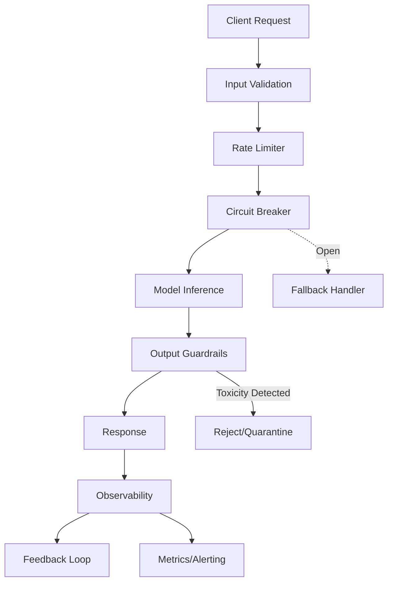

# AI in Production: What Breaks, What Works, and Who Approves It? | InfoQ Webinar

## Introduction

Last quarter, our inference pipeline started returning 503s at 3 AM. The model was fine. The GPU was fine. The rate limiter we forgot to configure was saturating the queue and killing connections. That's the reality of AI in production: the model is rarely the problem. The plumbing around it is.

This article breaks down what actually breaks when you ship LLMs to production, what patterns survive contact with real traffic, and who in the org needs to sign off before you flip the switch.

## Why This Matters

Teams are shipping AI features fast, but production incidents are moving faster. A single unbounded generation call can burn $2,000 in API costs during a retry storm. A prompt injection can leak PII. A silent model drift can degrade output quality for weeks before anyone notices.

The engineering challenge isn't the transformer architecture—it's building guardrails, observability, and governance that survive at scale.

## How It Works

Production AI systems aren't just inference endpoints. They're layered pipelines with validation, fallback, and feedback loops. Here's the architecture we use:



**Step-by-step:**

1. **Input Validation** strips PII and checks prompt length before it hits the model.
2. **Rate Limiter** prevents retry storms from cascading.
3. **Circuit Breaker** trips after N failures, failing fast instead of queuing.
4. **Model Inference** runs with timeout enforcement—no hanging requests.
5. **Output Guardrails** scan for toxicity, hallucination markers, or PII leaks.
6. **Observability** captures latency percentiles, token counts, and error rates.
7. **Feedback Loop** feeds human corrections back into evaluation datasets.

## Core Concepts

**Latency Percentiles.** P50 lies. You care about P99 and P999. A single slow GPU can spike your tail latency by 10x.

**Token Economics.** Input tokens cost money. Output tokens cost more. Unbounded generation is a budget hole.

**Drift.** The model doesn't change; the data distribution does. Your production inputs diverge from training data silently.

**Human-in-the-Loop.** Critical decisions need a reviewer. The model suggests; the human approves.

## Examples & Code Walkthrough

Here's a production-grade inference client with circuit breaking, retries, and output validation:

```python
import asyncio
import logging
from typing import Optional, Dict, Any, List
from dataclasses import dataclass, field
from enum import Enum
import httpx
import re

class CircuitState(Enum):
    CLOSED = "closed"
    OPEN = "open"
    HALF_OPEN = "half_open"

@dataclass
class InferenceConfig:
    max_retries: int = 3
    timeout_ms: int = 8000
    circuit_threshold: int = 5
    max_output_tokens: int = 500
    allowed_domains: List[str] = field(default_factory=lambda: ["support", "billing"])

class ProductionAIClient:
    def __init__(self, endpoint: str, api_key: str, config: InferenceConfig):
        self.endpoint = endpoint
        self.config = config
        self._api_key = api_key
        self._failures = 0
        self._state = CircuitState.CLOSED
        self._logger = logging.getLogger(__name__)
        self._pii_pattern = re.compile(r'\b\d{3}-\d{2}-\d{4}\b')  # SSN detector
    
    def _validate_input(self, prompt: str) -> None:
        """Reject prompts containing PII or out-of-domain requests."""
        if self._pii_pattern.search(prompt):
            raise ValueError("PII detected in prompt")
        
        domain = prompt.split()[0].lower() if prompt else ""
        if domain not in self.config.allowed_domains:
            raise ValueError(f"Domain '{domain}' not in allowed list")
    
    def _check_guardrails(self, output: str) -> bool:
        """Basic output validation—extend with your classifier."""
        toxic_keywords = ["hate", "violence", "illegal"]  # Simplified example
        return not any(kw in output.lower() for kw in toxic_keywords)
    
    async def predict(self, prompt: str, request_id: Optional[str] = None) -> Dict[str, Any]:
        """Execute inference with full production safeguards."""
        self._validate_input(prompt)
        
        if self._state == CircuitState.OPEN:
            self._logger.warning("Circuit breaker open—rejecting request")
            raise RuntimeError("Service unavailable—circuit breaker tripped")
        
        headers = {
            "Authorization": f"Bearer {self._api_key}",
            "X-Request-ID": request_id or "unknown"
        }
        
        for attempt in range(self.config.max_retries):
            try:
                timeout = self.config.timeout_ms / 1000.0
                async with httpx.AsyncClient(timeout=timeout) as client:
                    payload = {
                        "prompt": prompt,
                        "max_tokens": self.config.max_output_tokens,
                        "temperature": 0.7
                    }
                    resp = await client.post(
                        self.endpoint,
                        json=payload,
                        headers=headers
                    )
                    resp.raise_for_status()
                    result = resp.json()
                    
                    # Validate response structure
                    if "choices" not in result or not result["choices"]:
                        raise ValueError("Malformed model response")
                    
                    output_text = result["choices"][0]["text"]
                    
                    # Post-inference guardrails
                    if not self._check_guardrails(output_text):
                        raise ValueError("Output violated content policy")
                    
                    # Reset failure count on success
                    self._failures = 0
                    return result
                    
            except (httpx.TimeoutException, httpx.ConnectError, ValueError) as e:
                self._failures += 1
                self._logger.warning(f"Attempt {attempt + 1} failed: {e}")
                
                if self._failures >= self.config.circuit_threshold:
                    self._state = CircuitState.OPEN
                    self._logger.error("Circuit breaker tripped after %d failures", self._failures)
                
                # Exponential backoff with jitter
                await asyncio.sleep((2 ** attempt) + (asyncio.get_event_loop().time() % 1))
        
        raise RuntimeError("All retry attempts exhausted")
    
    def half_open_test(self) -> None:
        """Allow one test request through when recovering."""
        if self._state == CircuitState.OPEN:
            self._state = CircuitState.HALF_OPEN
```

**Key defensive choices:**
- Input validation before network call (saves cost and latency).
- Circuit breaker state machine prevents cascading failures.
- Exponential backoff with jitter avoids thundering herd on recovery.
- Guardrails run post-inference to catch model hallucinations or policy violations.

## Best Practices

1. **Shadow Deploy First.** Route 5% of traffic to the new model alongside the old one. Compare outputs before switching.
2. **Hard Limits on Tokens.** Set `max_tokens` and budget caps per user per day.
3. **Observe the Tail.** Alert on P99 latency, not averages.
4. **Version Your Prompts.** Prompt engineering is code—store it in Git with tests.
5. **Kill Switch.** Every deployment needs a circuit breaker that ops can trigger manually.

## Common Mistakes & Anti-Patterns

**Mistake 1: No Timeout on HTTP Calls**
```python
# BAD: hangs forever if model hangs
resp = await client.post(endpoint, json=payload)

# FIX: always set timeout
async with httpx.AsyncClient(timeout=5.0) as client:
    resp = await client.post(endpoint, json=payload)
```

**Mistake 2: Trusting Raw Model Output**
```python
# BAD: passes through hallucinations
return result["choices"][0]["text"]

# FIX: validate structure and content
if "choices" not in result:
    raise ValueError("Malformed response")
if not self._check_guardrails(output_text):
    raise ValueError("Policy violation")
```

**Mistake 3: Unlimited Retries**
```python
# BAD: retry storm during outage
for _ in range(100):
    await call_model()

# FIX: bounded retries with backoff
for attempt in range(config.max_retries):
    await asyncio.sleep(2 ** attempt)
```

**Mistake 4: No Input Sanitization**
```python
# BAD: prompt injection possible
payload = {"prompt": user_input}

# FIX: strip PII, check length, validate domain
self._validate_input(user_input)
```

## Performance Considerations

- **Memory:** Model weights dominate GPU memory. Quantization (INT8/FP16) cuts RAM by 2-4x with minimal quality loss.
- **CPU Overhead:** Tokenization and guardrail checks run on CPU. Profile these—they're often the bottleneck, not the GPU.
- **Network Latency:** Cross-region calls add 50-150ms. Co-locate inference close to your app.
- **Scalability:** Async I/O is mandatory. Synchronous blocking calls will deadlock your event loop under load.
- **Big-O:** Generation is O(tokens × layers). Long contexts explode cost quadratically with attention mechanisms.

## Real-World Usage

**Netflix** uses shadow deployments for recommendation models, comparing offline metrics before routing live traffic.

**Uber** runs internal LLMs with strict token budgets per ride request, hard-capped to prevent cost overruns during surge pricing.

**Cloudflare** deploys AI gateway with global rate limiting and circuit breaking, failing over to smaller models when primary endpoints saturate.

The pattern is consistent: guardrails first, model second.

## Frequently Asked Questions (FAQ)

**Q: How do we handle model drift in production?**
A: Log input distributions weekly. Run statistical tests (KS-test) on feature drift. If drift exceeds threshold, trigger retraining or rollback.

**Q: What's the right fallback when the LLM is down?**
A: Cached responses, rule-based heuristics, or a smaller/faster model. Never return 500 to the user—degrade gracefully.

**Q: Who approves AI features in the org?**
A: Security reviews prompt injection risks. Legal reviews
