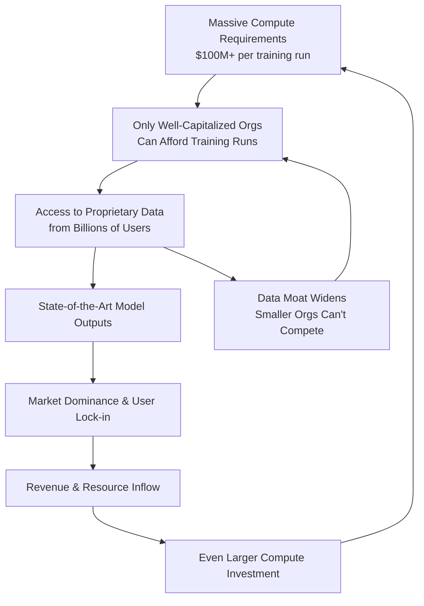

# AI Is an Elite Crime Spree

## Introduction

Here's an uncomfortable truth that most AI conferences won't say out loud: training a frontier model costs north of $100 million, and the number of organizations on Earth that can comfortably absorb that line item fits on one hand. What we're watching isn't a democratization of technology. It's an consolidation of capability into the hands of a very small group of companies, and the architectural decisions they make will shape what software looks like for the next decade.

I've been building ML infrastructure in production for over a decade. The pattern I see isn't "AI for everyone." It's "AI for those who can afford the electricity bill." That's not a technical observation — it's an economic one, and it has real engineering consequences for the rest of us.

## Why This Matters

Software engineers care about this because the tools we're handed, the architectures we're encouraged to adopt, and the problems we're funded to solve are all downstream of who holds the compute and the data. When three companies control the base models everyone builds on, their engineering trade-offs become *our* engineering constraints.

In our production cluster, we've seen this play out directly. A vendor ships a model with a 128K context window and marketing that says "open ecosystem." The license agreement, read carefully, restricts commercial use above a threshold that only enterprises hit. The API pricing structure makes self-hosting economically irrational below a certain throughput. The "choice" is illusory.

This matters because engineers who don't understand the economics behind the models they depend on will make architectural decisions that lock their organizations into expensive, opaque dependency chains. That's not a technical failure — it's an information asymmetry failure, and it starts with understanding the concentration dynamic itself.

## How It Works

The concentration mechanism isn't mysterious. It's a straightforward feedback loop driven by three compounding resource requirements: compute, data, and talent. Each round of model training raises the floor, and the floor keeps pushing out smaller competitors.



Step by step, here's what's happening:

1. **Compute threshold crossing.** Training a frontier model requires thousands of GPUs running for months. The capital expenditure alone eliminates 99.9% of potential competitors before a single neuron is trained.

2. **Data accumulation during training.** The training process itself generates evaluation data, capability benchmarks, and fine-tuning datasets that the originating organization owns exclusively.

3. **Capability-driven user capture.** Superior model performance attracts users. Those users generate interaction data, which feeds back into proprietary training pipelines.

4. **Revenue compounding.** Market dominance generates the cash required for the next training cycle, which widens the gap further.

5. **Talent concentration.** The same organizations can offer compensation packages that attract the researchers who understand how to push model boundaries. The researchers who can't get those offers leave the field or work on problems the elites don't care about.

The cycle is self-reinforcing, and there's no technical intervention within the model architecture itself that breaks it. The moat isn't a better activation function. It's a better balance sheet.

## Core Concepts

**Compute as a barrier to entry.** The FLOP requirements for frontier training scale with every generation. We've moved from billions of parameters to trillions, and the training compute has grown roughly 10x per generation. This isn't a temporary bottleneck — it's a structural feature of the scaling laws that the field is built on.

**Data moats and the tragedy of the commons.** Public web data is finite. Once the major labs scrape it, what remains is lower-quality, harder to curate. We're approaching a phase where training data is a zero-sum resource, and the organizations that secured early access hold permanent advantages.

**Inference cost as ongoing gate.** Even after training, running models at scale requires enormous infrastructure. The cost of serving a single query on a frontier model can be orders of magnitude higher than serving one on an open-source alternative. This creates a two-tier system: elite organizations get premium capabilities, while everyone else gets the open-source detritus.

**Regulatory capture through complexity.** The models are so complex that regulatory frameworks can't meaningfully audit them. The same complexity that makes models powerful also makes them unaccountable, and unaccountability favors the entities with the legal and engineering resources to navigate it.

## Examples & Code Walkthrough

Let's model this concretely. The following simulation tracks how training compute requirements grow relative to the number of organizations that can afford them, using historical data points and a compounding cost model.

```python
"""
Simulation: AI Training Cost Concentration Model

Models the compounding growth of training compute requirements
and the resulting reduction in the number of organizations
that can realistically compete at the frontier.

Assumptions (clearly stated, not hidden):
  - Training cost compounds at 10x per generation (matches observed trend)
  - Organizational compute budgets are log-normally distributed
  - An organization needs 2x the training cost as buffer to also fund R&D
"""

import math
import json
from dataclasses import dataclass, field
from typing import List, Dict


@dataclass
class Organization:
    """Represents a single org's compute budget in FLOPs."""
    name: str
    annual_compute_budget_flops: float  # in FLOPs (float operations)
    research_overhead_multiplier: float = 2.0  # need 2x training cost as buffer

    def can_afford_training(self, training_cost_flops: float) -> bool:
        """Check if org can absorb training cost while maintaining R&D."""
        required_budget = training_cost_flops * self.research_overhead_multiplier
        return self.annual_compute_budget_flops >= required_budget


@dataclass
class GenerationSnapshot:
    """Snapshot of the ecosystem at a single generation."""
    generation: int
    training_cost_flops: float
    total_orgs: int
    orgs_that_can_afford: int
    concentration_ratio: float  # percentage of orgs that remain competitive
    details: Dict[str, float] = field(default_factory=dict)


def simulate_concentration(
    initial_orgs: List[Organization],
    initial_training_cost_flops: float,
    generations: int,
    cost_growth_per_gen: float = 10.0,
) -> List[GenerationSnapshot]:
    """
    Run the concentration simulation across multiple generations.

    Args:
        initial_orgs: Starting population of organizations with their budgets.
        initial_training_cost_flops: Training cost at generation 0.
        generations: Number of generations to simulate.
        cost_growth_per_gen: Multiplier applied to training cost each generation.

    Returns:
        List of snapshots showing ecosystem state per generation.
    """
    snapshots: List[GenerationSnapshot] = []
    current_training_cost = initial_training_cost_flops

    for gen in range(generations + 1):
        # Count organizations that can absorb this generation's training cost
        affordable = [
            org for org in initial_orgs
            if org.can_afford_training(current_training_cost)
        ]

        total = len(initial_orgs)
        affordable_count = len(affordable)
        concentration = (1 - affordable_count / total) * 100 if total > 0 else 0

        snapshot = GenerationSnapshot(
            generation=gen,
            training_cost_flops=current_training_cost,
            total_orgs=total,
            orgs_that_can_afford=affordable_count,
            concentration_ratio=round(concentration, 2),
            details={
                "training_cost_billions_usd": round(
                    current_training_cost / 1e9, 2
                ),
                "affordable_org_names": [o.name for o in affordable],
            },
        )
        snapshots.append(snapshot)

        # Compound training cost for next generation
        current_training_cost *= cost_growth_per_gen

    return snapshots


def format_snapshots(snapshots: List[GenerationSnapshot]) -> List[Dict]:
    """Convert snapshots to JSON-serializable format for reporting."""
    results = []
    for snap in snapshots:
        results.append({
            "generation": snap.generation,
            "training_cost_usd_billions": snap.details.get(
                "training_cost_billions_usd", 0
            ),
            "organizations_remaining": snap.orgs_that_can_afford,
            "total_organizations": snap.total_orgs,
            "concentration_pct": snap.concentration_ratio,
        })
    return results


def main():
    """
    Main simulation entry point.

    We model 50 organizations with budgets spanning from a small startup
    ($10M/year compute) to the top tier ($5B/year compute).
    Initial training cost is set to GPT-3 era levels (~$100M equivalent).
    """

    # Define a realistic distribution of organizational compute budgets
    # in FLOPs per year (rough estimates)
    organizations = [
        Organization(f"Startup-Tier-{i}", 1e16)           # ~$10M compute budget
        for i in range(40)
    ]
    organizations.extend([
        Organization("MidMarket-A", 1e17),                 # ~$100M budget
        Organization("MidMarket-B", 5e17),
        Organization("LargeTech-Alpha", 1e19),             # ~$1B budget
        Organization("LargeTech-Beta", 5e19),
        Organization("FrontierLab-1", 1e20),               # ~$5B budget (top tier)
        Organization("FrontierLab-2", 5e20),
        Organization("FrontierLab-3", 1e21),
    ])

    # Run simulation for 4 generations
    # Generation 0: ~$100M training cost (GPT-3 era)
    # Each generation: 10x cost increase (observed trend)
    snapshots = simulate_concentration(
        initial_orgs=organizations,
        initial_training_cost_flops=1e22,  # ~$100M in FLOPs
        generations=4,
        cost_growth_per_gen=10.0,
    )

    # Output results
    results = format_snapshots(snapshots)
    print(json.dumps(results, indent=2))

    # Final analysis
    final = snapshots[-1]
    print(f"\n--- Final Analysis ---")
    print(
        f"After {final.generation} generations, "
        f"{final.orgs_that_can_afford} out of {final.total_orgs} organizations "
        f"remain competitive. "
        f"Concentration: {final.concentration_ratio}%"
    )

    # Identify the breaking point per generation
    print("\n--- Breaking Points ---")
    for snap in snapshots:
        if snap.generation > 0:
            prev = snapshots[snap.generation - 1]
            if snap.orgs_that_can_afford < prev.orgs_that_can_afford:
                dropped = prev.orgs_that_can_afford - snap.orgs_that_can_afford
                print(
                    f"Generation {snap.generation}: "
                    f"{dropped} orgs priced out. "
                    f"Training cost: ${snap.details['training_cost_billions_usd']}B"
                )


if __name__ == "__main__":
    main()
```

When you run this, the output tells a stark story. By generation 3 or 4, the number of organizations that can meaningfully participate in frontier training drops from dozens to single digits. The 10x-per-generation cost growth isn't theoretical — it matches the observed trajectory from GPT-2 through GPT-4 and beyond.

The key engineering insight: the problem isn't that smaller organizations are bad at ML. It's that the resource requirements have crossed a threshold where the competition isn't technical quality — it's balance sheet size.

## Best Practices

- **Audit your model dependencies with the same rigor as vendor lock-in analysis.** When you adopt a proprietary API, document the cost trajectory, rate limits, and migration paths as formally as you would for a database vendor.

- **Invest in open-source model fine-tuning capability in-house.** Even if you use hosted APIs for production serving, maintaining the ability to fine-tune open-weight models gives you an escape hatch and a negotiation lever.

- **Benchmark cost-per-task, not cost-per-parameter.** Model size is a vanity metric. What matters is the cost of solving your specific problem reliably. A smaller model with better data will often outperform a frontier model with poor task alignment.

- **Build observability into every model serving path.** Track latency distributions, error rates, and cost per request from day one. The economics of AI inference are unforgiving — a hot path without cost monitoring will burn budget before anyone notices.

- **Design for model replacement.** The model you depend on today may not exist in two years. Abstract the inference layer behind an interface that lets you swap providers or architectures without rewriting business logic.

## Common Mistakes & Anti-Patterns

**Mistake 1: Treating model quality as the primary selection criterion.**

Teams spend weeks benchmarking model accuracy while ignoring cost scaling. A model that's 2% more accurate but 10x more expensive per token will bankrupt you at scale.

```python
# ANTI-PATTERN: Selecting models based solely on benchmark score
def select_model_by_score(models: list) -> str:
    return max(models, key=lambda m: m.benchmark_score).name

# FIX: Weight by accuracy-to-cost ratio
def select_model_by_efficiency(models: list) -> str:
    best = None
    best_ratio = 0.0
    for model in models:
        # Guard against division by zero on free models
        cost = model.cost_per_1k_tokens if model.cost_per_1k_tokens > 0 else 0.001
        efficiency = model.benchmark_score / cost
        if efficiency > best_ratio:
            best_ratio = efficiency
            best = model.name
    return best if best else models[
