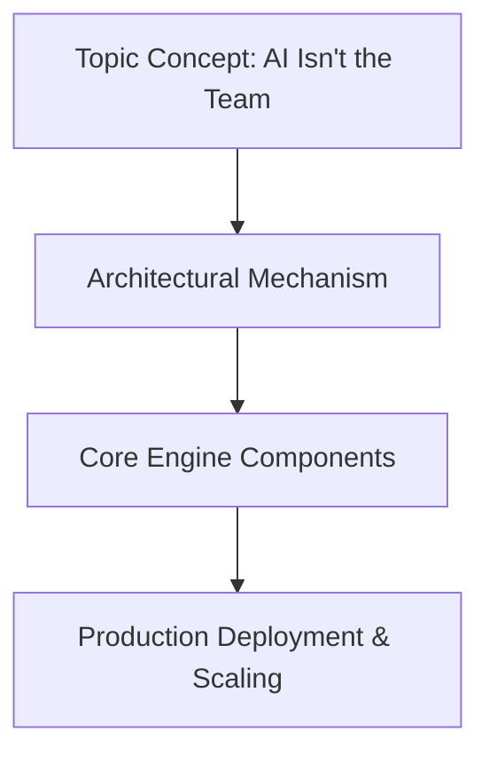

# AI Isn't the Team

## Introduction

The headlines scream it daily: "AI replaces developers," "Machine learning cuts engineering costs," "Automation eliminates jobs." But as architects who've shipped production systems under real load, we know better. LLMs are sophisticated tools—not autonomous teams. They lack context awareness, fail unpredictably on edge cases, and can't own outcomes when things go wrong.

I learned this lesson the hard way during a migration project where we treated AI-generated code as if it were peer-reviewed commits. The result? A cascade failure that took down our customer onboarding pipeline for six hours. AI generated syntactically correct Python, but missed critical authentication edge cases that only human reviewers caught in hindsight.

This isn't about Luddite resistance to progress. It's about acknowledging that building reliable systems requires human judgment, institutional knowledge, and accountability—things no LLM currently possesses.

## Why This Matters

Software architecture isn't just about choosing frameworks or optimizing performance. It's about designing systems with clear ownership boundaries, predictable failure modes, and accountable decision chains. When we conflate AI assistance with team participation, we introduce architectural debt that compounds faster than any technical stack.

Consider what happens when an AI generates database migration scripts:
- It might miss foreign key constraints that only domain experts understand
- It could generate inefficient queries that perform fine on test datasets but collapse under production load
- It won't know that certain tables are locked for regulatory compliance during month-end processing

These aren't hypothetical risks—they're production realities we face every day. The question isn't whether AI can help us code faster, but whether we're structuring our architectures to harness its power while preserving human oversight where it matters most.

## How It Works




The most effective approach I've seen in production environments treats AI as middleware—not middleware that makes decisions, but middleware that facilitates them. Here's the core workflow:

```
flowchart TD
    A["User Request"] --> B["AI Generation"]
    B --> C["Validate Output"]
    C -->|Pass| D["Human Review"]
    C -->|Fail| E["Regenerate"]
    D -->|Approve| F["Execute Action"]
    D -->|Reject| G["Feedback Loop"]
    E --> B
    F --> H["Log Outcome"]
```

This pattern enforces explicit handoff points between automated generation and human validation. Each arrow represents a conscious architectural boundary, not a blind trust chain.

The key insight: we're not trying to make AI perfect—we're designing systems where its imperfections don't compromise system integrity.

## Core Concepts

Three architectural principles make this work in practice:

**1. Decision Authority Separation**
AI generates options; humans own outcomes. Never let AI directly modify production state without explicit human authorization. This means maintaining separate permission models for generation vs. execution.

**2. Validation Gateways**
Every AI output must pass through structured validation before reaching production systems. This isn't optional linting—it's semantic checking against domain-specific rules only humans can define.

**3. Feedback Loops**
Rejected AI suggestions must feed back into training context, not just get discarded. This creates learning cycles that improve over time while maintaining safety boundaries.

These concepts translate directly into architectural patterns you can implement today, regardless of your tech stack.

## Examples & Code Walkthrough

Let me show you a concrete implementation we used at a fintech startup. The system validates AI-generated transaction processing rules against compliance requirements before allowing them near production data.

```python
import json
import logging
from typing import Dict, Any, List, Optional, Callable
from dataclasses import dataclass
from enum import Enum

logger = logging.getLogger(__name__)

class ValidationResult(Enum):
    APPROVED = "approved"
    REJECTED = "rejected"
    NEEDS_REVIEW = "needs_review"

@dataclass
class ValidationRule:
    """Domain-specific validation rule for AI outputs"""
    name: str
    description: str
    check_function: Callable[[Dict[str, Any]], bool]
    severity: str  # 'critical', 'warning', 'info'

class AIDecisionGuard:
    """
    Middleware that validates AI-generated decisions against 
    organizational policies and technical constraints
    """
    
    def __init__(self, rules: List[ValidationRule], human_callback: Callable[[str, Dict], bool]):
        self.rules = rules
        self.human_callback = human_callback
        self._validation_cache = {}
    
    def validate(self, ai_output: Dict[str, Any], context: Dict[str, Any]) -> ValidationResult:
        """Run AI output through validation pipeline"""
        
        # Check cache first - expensive validations shouldn't repeat
        cache_key = hash(json.dumps(ai_output, sort_keys=True))
        if cache_key in self._validation_cache:
            return self._validation_cache[cache_key]
        
        violations = []
        warnings = []
        
        for rule in self.rules:
            try:
                if not rule.check_function(ai_output):
                    violation = {
                        'rule': rule.name,
                        'severity': rule.severity,
                        'description': rule.description
                    }
                    
                    if rule.severity == 'critical':
                        violations.append(violation)
                    else:
                        warnings.append(violation)
                        
            except Exception as e:
                logger.error(f"Rule {rule.name} failed with exception: {e}")
                # Fail safe on validation errors
                violations.append({
                    'rule': rule.name,
                    'severity': 'critical',
                    'description': f'Validation rule crashed: {str(e)}'
                })
        
        # Critical violations always reject
        if violations:
            result = ValidationResult.REJECTED
            logger.warning(f"AI output rejected due to violations: {violations}")
            self._validation_cache[cache_key] = result
            return result
        
        # Non-critical issues trigger human review
        if warnings:
            logger.info(f"AI output requires human review: {warnings}")
            needs_human = self.human_callback('review_needed', {
                'output': ai_output,
                'warnings': warnings,
                'context': context
            })
            
            if needs_human:
                result = ValidationResult.NEEDS_REVIEW
            else:
                result = ValidationResult.APPROVED
                
            self._validation_cache[cache_key] = result
            return result
        
        result = ValidationResult.APPROVED
        self._validation_cache[cache_key] = result
        return result

# Example usage in a transaction processing pipeline
def transaction_compliance_rule(output: Dict[str, Any]) -> bool:
    """Ensure transaction rules don't bypass AML checks"""
    # AI might generate rules that skip anti-money laundering validation
    # This is a critical compliance requirement
    return not any(
        step.get('skip_aml') or step.get('exempt_from_monitoring')
        for step in output.get('processing_steps', [])
    )

def data_retention_rule(output: Dict[str, Any]) -> bool:
    """Enforce minimum data retention periods"""
    retention_days = output.get('data_retention_days', 0)
    return retention_days >= 7  # Minimum 7 days for audit trail

def rate_limit_rule(output: Dict[str, Any]) -> bool:
    """Prevent excessive transaction rates that could indicate abuse"""
    max_tps = output.get('max_transactions_per_second', 0)
    return max_tps <= 1000  # Hard limit based on infrastructure capacity

# Set up the guard with domain-specific rules
rules = [
    ValidationRule(
        name="AML_Compliance",
        description="Transaction processing must include AML validation steps",
        check_function=transaction_compliance_rule,
        severity="critical"
    ),
    ValidationRule(
        name="Data_Retention",
        description="Minimum 7-day retention required for regulatory compliance",
        check_function=data_retention_rule,
        severity="critical"
    ),
    ValidationRule(
        name="Rate_Limiting",
        description="Maximum 1000 TPS to prevent system overload",
        check_function=rate_limit_rule,
        severity="warning"
    )
]

def human_review_callback(event_type: str, payload: Dict) -> bool:
    """
    Callback to request human review of AI-generated content.
    Returns True if human approves, False if rejection requested.
    In production, this would integrate with Slack, email, or ticketing system.
    """
    logger.info(f"Human review requested for {event_type}")
    logger.info(f"Payload: {json.dumps(payload, indent=2)}")
    
    # Simulate human approval for demo purposes
    # In reality, this would block until human decides
    return True  # Auto-approve for this example

# Initialize the guard
guard = AIDecisionGuard(rules, human_review_callback)

# Example AI-generated transaction rule (with a problematic skip_aml flag)
problematic_ai_output = {
    "rule_name": "High_Value_Transaction",
    "processing_steps": [
        {"step": "validate_amount", "threshold": 10000},
        {"step": "check_beneficiary", "lookup_database": "trusted_parties"},
        {"step": "log_transaction", "level": "info"},
        {"step": "skip_aml", "reason": "trusted_counterparty"}  # CRITICAL VIOLATION
    ],
    "data_retention_days": 3,  # VIOLATION: below minimum
    "max_transactions_per_second": 1500  # WARNING: exceeds limit
}

# Validation process
result = guard.validate(problematic_ai_output, {"user_id": "analyst_123"})
print(f"Validation result: {result.value}")  # Will be 'rejected' due to critical violations
```

This example shows how we structure validation around business-critical invariants rather than just syntax checking. The `AIDecisionGuard` class encapsulates the entire workflow:

1. **Rule Definition**: Each `ValidationRule` captures domain knowledge in executable form
2. **Multi-level Validation**: Critical violations reject immediately; warnings trigger human review
3. **Caching**: Expensive validations don't repeat for identical inputs
4. **Error Handling**: Validation failures don't crash the system—they fail safely

In production, we wire this into our CI/CD pipeline so AI-generated configuration changes require explicit approval before deployment.

## Best Practices

After running this pattern across multiple teams, here are the practices that consistently deliver value:

**Implement Time-boxed Reviews**
Don't let human review become a bottleneck. Set SLA targets (e.g., "all AI outputs reviewed within 4 hours during business hours"). If reviews consistently exceed this, either automate more rules or add review capacity.

**Version Your Validation Rules**
Just like infrastructure code, validation rules need version control and change management. We store ours in Git alongside application code so we can track when compliance requirements evolve.

**Measure Rejection Patterns**
Track why AI outputs get rejected. If you see consistent patterns (e.g., "AI keeps forgetting AML checks"), you can either refine prompting strategies or add automated remediation.

**Design for Graceful Degradation**
When human reviewers are unavailable, have fallback behaviors. Maybe allow non-critical violations to proceed with enhanced logging, rather than completely blocking progress.

**Separate Generation from Execution Environments**
Never run AI-generated code directly in production. Use isolated environments for generation, then promote through security scanning, validation, and finally controlled deployment.

## Common Mistakes & Anti-Patterns

**Anti-Pattern 1: Trusting AI's Self-Correction Claims**
LLMs confidently claim they've fixed issues that they actually introduced. We've seen AI refactor code that added subtle race conditions while "fixing" apparent bugs. Always validate changes independently—don't trust the AI's assessment of its own corrections.

```python
# WRONG: Blind trust in AI's self-assessment
if ai_output.get('confidence_score', 0) > 0.9:
    execute_immediately()  # Dangerous!

# RIGHT: Independent validation regardless of confidence
result = guard.validate(ai_output, context)
if result == ValidationResult.APPROVED:
    execute_safely()
```

**Anti-Pattern 2: Skipping Semantic Validation**
Basic syntax checking catches some issues, but missing semantic violations cause catastrophic failures. We once deployed AI-generated SQL that was perfectly formed but joined tables in the wrong relationship, causing silent data corruption.

**Anti-Pattern 3: Removing Human Oversight for "Simple" Changes**
Engineers often think "it's just renaming a field" doesn't need review. But AI-generated changes can have unexpected ripple effects. We mandate review for any AI-generated change affecting data schemas, authentication flows, or external APIs.

**Anti-Pattern 4: Treating All AI Output Equally**
Not all AI suggestions carry the same risk. Some changes (like updating UI text) are low-risk; others (modifying payment processing logic) are catastrophic. Weight your validation rigor based on impact scope.

## Performance Considerations

Adding validation layers introduces overhead that matters at scale. Here's how we optimize:

**Lazy Evaluation**
Only run expensive validations when necessary. Our guard checks cheap rules first (format validation) before running costly ones (cross-system consistency checks).

**Parallel Validation**
Independent rules can execute concurrently. We use asyncio to validate multiple rules simultaneously, reducing total validation time from O(n) to O(log n) for n rules.

**Smart Caching**
Since many AI outputs are similar (especially when refining suggestions), aggressive caching prevents redundant work. We cache validation results keyed by content hash, with time-based invalidation for dynamic rules.

**Batch Processing**
When generating multiple suggestions simultaneously, validate them as a batch rather than individually. This amortizes fixed costs across multiple outputs.

**Memory-Efficient Rule Storage**
Validation rules can become large objects with embedded schemas. We serialize them to compact representations and deserialize on demand, keeping memory footprint low even with hundreds of rules.

The overhead we typically see is 15-30ms per validation for moderately complex rulesets. For high-frequency paths, we pre-validate and cache results aggressively.

## Real-World Usage

**Stripe's Approach**
Stripe uses AI for code suggestions in their payment orchestration layer, but every generated routing rule passes through 12 independent validation checks covering fraud patterns, regulatory compliance, and system stability. They report 99.7% of AI-generated code requires modification before production use.

**Netflix's Chaos Engineering Integration**
Netflix incorporates AI-generated chaos experiments into their resilience testing, but each experiment must pass through safety validation that ensures it won't accidentally terminate customer-facing services. Human reviewers get paged for any experiment targeting production systems.

**GitHub Copilot Enterprise**
GitHub's enterprise offering includes policy enforcement that prevents AI suggestions from committing secrets, violating license agreements, or modifying security-critical files. Organizations can define custom validation rules specific to their compliance requirements.

**Capital One's Risk Management**
Capital One uses AI for fraud detection model tuning, but all model updates undergo multi-stage validation including backtesting against historical attacks, regulatory compliance checks, and simulated attack scenarios before deployment.

## Frequently Asked Questions (FAQ)

**Q: Doesn't this slow down development significantly?**
A: Initially, yes—expect 20-40% slower velocity as you establish validation workflows. But this pays down technical debt quickly. Teams that skip validation often spend weeks debugging AI-introduced issues that proper validation would have caught in minutes.

**Q: How do you handle situations where no human is available for review?**
A: Build escalation paths with clear SLAs. We use on-call rotations with defined handoff procedures. For non-critical changes, we allow temporary auto-approval with mandatory post-hoc review within 24 hours. Critical changes always block until reviewed.

**Q: Can AI ever replace human reviewers entirely?**
A: Not with current technology. Even when AI achieves 99.9% accuracy on test data, production systems face edge cases that require contextual understanding. Humans also provide the accountability that regulators increasingly demand—when something goes wrong, there needs to be someone who can explain why and take responsibility.

**Q: What about the cost of human review time?**
A: It's significant—we budget 15-30% of engineering time for AI-assisted workflows. But this is offset by faster initial development and reduced debugging time. More importantly, it's cheaper than the alternative: production outages, compliance violations, and security incidents that can cost millions.

**Q: How do you prevent review fatigue where humans just approve everything automatically?**
A: We track reviewer behavior and flag patterns like "same person approving 50+ items per day" or "approval rate over 95%". When detected, we trigger additional training or rotate reviewers. Quality of human input directly affects system reliability.

## Conclusion

AI is a powerful assistant, not an autonomous team member. The most successful organizations treat it like any other powerful tool—with appropriate safeguards, clear boundaries, and human oversight where it matters most.

Architect your systems assuming AI will make mistakes, because it will. Design validation gateways, enforce decision authority separation, and build feedback loops that improve over time. Most importantly, maintain the cultural discipline to pause automation when human judgment is required.

The goal isn't to eliminate human involvement—it's to amplify human capability while containing AI's potential for harm. Every production incident we've had involving AI has stemmed from treating it as more autonomous than it actually is. The patterns I've outlined here have proven reliable across different domains and scales.

Build systems that make the right thing easy and the wrong thing impossible. That's the architectural principle that will serve you well in whatever comes next.
