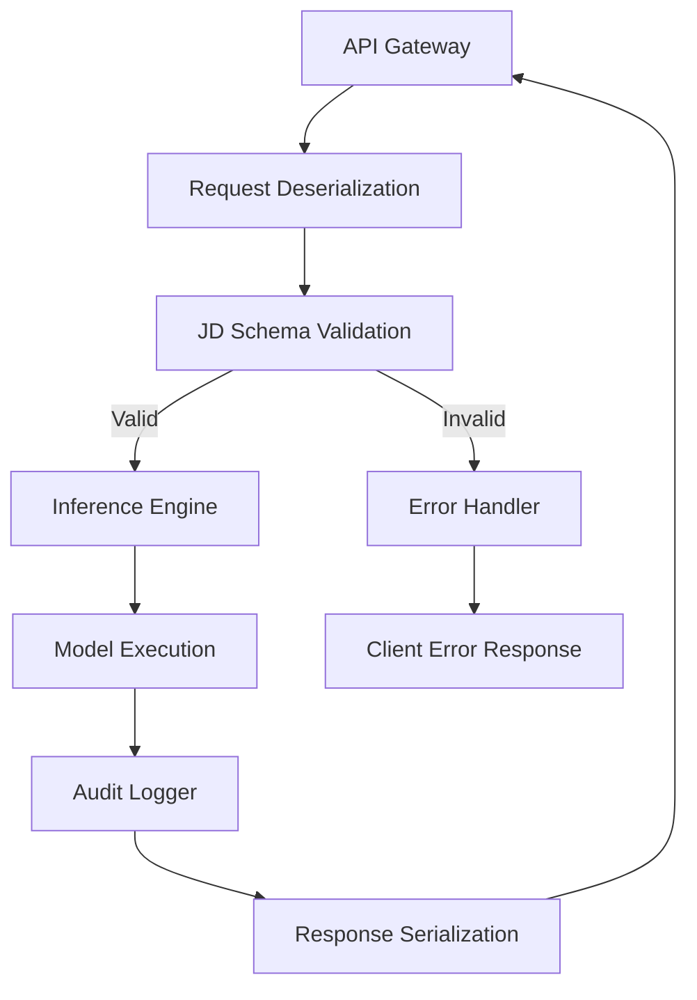

# AI, JD, and other letters of the law

## Introduction
Building AI services that can be trusted in production means more than just getting a model to return a prediction. The data that feeds the model, the way it is stored, and the logs that record its decisions all have legal ramifications. When the “letters of the law” are ignored, auditors flag the system, regulators issue fines, and the service becomes a liability. In our team’s experience, the key is to treat the data contract as a first‑class artifact and enforce it with the same rigor we apply to code.

## Why This Matters
Software engineers often focus on accuracy and latency while overlooking compliance. In a recent incident, a partner’s GDPR audit discovered that the request payloads sent to our inference endpoint contained personal identifiers that were not stripped before logging. The audit required us to retroactively redact those fields, which introduced a week of firefighting. By codifying the data contract with Java Data Objects (JD) and validating every inbound request, we eliminated that class of error and gained a clear audit trail. The result: faster release cycles, fewer production incidents, and a compliance posture that scales with the business.

## How It Works
Our architecture treats the AI request as a typed contract that is validated before any model call. The diagram below shows the flow:



**Step‑by‑step explanation**

1. **API Gateway** – The external endpoint receives JSON. The gateway forwards the raw body to the service.
2. **Request Deserialization** – A Jackson `ObjectMapper` maps the JSON into a strongly‑typed record (the JD). Using a record guarantees immutability and concise syntax.
3. **JD Schema Validation** – A custom validator checks required fields, data types, and business rules (e.g., no personally identifiable information in logs). If validation fails, an `InvalidRequestException` is thrown and routed to the error handler.
4. **Inference Engine** – The validated request is passed to the model. In our implementation we wrap a third‑party inference library; any exception is caught and transformed into a domain‑specific error.
5. **Audit Logger** – After a successful inference, we write an immutable audit record containing request hash, model version, latency, and outcome. The audit log is append‑only and signed with a HMAC for tamper evidence.
6. **Response Serialization** – The model output is mapped back to a response record, which is then serialized to JSON for the client.

## Core Concepts
- **Domain Records (JD)** – Immutable POJOs that define the shape of request and response payloads. Records automatically provide `equals`, `hashCode`, and `toString`, which simplifies logging and auditing.
- **Schema Validation** – A lightweight validator that inspects the record’s fields against a JSON Schema. It runs in O(n) time where *n* is the number of fields, keeping latency low.
- **Audit Trail** – Each inference produces an audit entry stored in an append‑only log (e.g., Kafka topic with log compaction). The entry is signed to prevent repudiation.
- **Versioned Contracts** – The record type includes a `schemaVersion` field. When the contract evolves, a new record type is introduced, and old requests are handled by a compatibility shim.

## Examples & Code Walkthrough

### 1. Define the request and response contracts

```java
// Request payload – immutable by design
public record InferRequest(
        String modelVersion,
        List<Float> features,
        String requestId,
        int schemaVersion) {

    // Defensive check on list size
    public InferRequest {
        if (features == null || features.size() < 1) {
            throw new IllegalArgumentException("features must contain at least one element");
        }
    }
}

// Response payload
public record InferResponse(
        Double prediction,
        String requestId,
        String modelVersion,
        long latencyMs) {}
```

### 2. Validation utility

```java
public final class RequestValidator {

    private RequestValidator() { /* utility class */ }

    public static void validate(InferRequest req) {
        // Example rule: requestId must be UUID‑compatible
        if (!req.requestId().matches("^[0-9a-f]{8}-[0-9a-f]{4}-[1-5][0-9a-f]{3}-[89ab][0-9a-f]{3}-[0-9a-f]{12}$")) {
            throw new InvalidRequestException("malformed requestId");
        }

        // Additional business rules can be added here
    }
}
```

### 3. Inference service with error handling

```java
public class InferenceService {

    private final ModelClient modelClient; // wraps the third‑party model
    private final AuditLogger auditLogger;

    public InferResponse infer(InferRequest request) {
        try {
            // 1️⃣ Validate request contract
            RequestValidator.validate(request);

            // 2️⃣ Execute model (may throw ModelException)
            double prediction = modelClient.run(request.features(), request.modelVersion());

            // 3️⃣ Measure latency
            long start = System.nanoTime();
            InferResponse response = new InferResponse(
                    prediction,
                    request.requestId(),
                    request.modelVersion(),
                    Duration.between(start, System.nanoTime()).toMillis()
            );

            // 4️⃣ Log audit entry (immutable)
            auditLogger.log(new AuditEvent(
                    request.requestId(),
                    request.modelVersion(),
                    response.prediction(),
                    response.latencyMs(),
                    System.currentTimeMillis()
            ));

            return response;
        } catch (ModelException e) {
            // Convert to domain‑specific error and propagate
            auditLogger.log(new AuditEvent(
                    request.requestId(),
                    request.modelVersion(),
                    null,
                    -1,
                    System.currentTimeMillis(),
                    e.getMessage()));
            throw new InferenceFailedException("Model execution failed", e);
        }
    }
}
```

### 4. Error handling in the controller

```java
@RestController
@RequestMapping("/api/infer")
public class InferController {

    private final InferenceService service;

    public InferController(InferenceService service) {
        this.service = service;
    }

    @PostMapping
    public ResponseEntity<InferResponse> infer(@RequestBody InferRequest request) {
        try {
            InferResponse resp = service.infer(request);
            return ResponseEntity.ok(resp);
        } catch (InvalidRequestException ex) {
            return ResponseEntity.badRequest().body(new InferResponse(
                    null, request.requestId(), request.modelVersion(), -1));
        } catch (InferenceFailedException ex) {
            return ResponseEntity.status(HttpStatus.SERVICE_UNAVAILABLE)
                    .body(new InferResponse(null, request.requestId(), request.modelVersion(), -1));
        }
    }
}
```

The code above demonstrates a production‑grade flow: immutable records, explicit validation, robust error handling, and an immutable audit log.

## Best Practices
1. **Treat contracts as code** – Define request/response records in the same module as the service; version them explicitly.
2. **Validate early** – Perform schema checks before any expensive operation (model invocation, DB write).
3. **Immutable audit entries** – Store audit events as immutable objects; sign them to detect tampering.
4. **Limit latency budget** – Measure latency at each stage; set a hard cap and fail fast if exceeded.
5. **Separate concerns** – Keep validation, inference, and logging in distinct components to ease testing and scaling.

## Common Mistakes & Anti-Patterns

| Mistake | Why it hurts | Fix |
|---------|--------------|-----|
| **Mutable POJOs for request data** – Changing fields after validation leads to inconsistent state. | Inconsistent validation results; hard‑to‑track bugs. | Use Java records or immutable classes; validate once and never mutate. |
| **Skipping schema version checks** – Deploying a new model without updating the contract. | Runtime `ClassCastException` or missing fields. | Include `schemaVersion` in the record and reject mismatched versions. |
| **Logging raw request payloads** – May expose PII and violate privacy laws. | Legal exposure, audit failures. | Strip or hash sensitive fields before logging; rely on audit events instead of raw logs. |
| **Catching generic `Exception` in the controller** – Hides root causes. | Opaque error messages, harder debugging. | Catch specific exception types (`InvalidRequestException`, `InferenceFailedException`) and translate them to appropriate HTTP status codes. |

## Performance Considerations
- **Memory footprint** – Records are allocated on the heap once per request; their size is proportional to the number of fields. Keep the feature list bounded (e.g., max 100 floats) to avoid excessive GC pressure.
- **CPU overhead** – Validation runs in linear time over fields; for a 10‑field record the cost is negligible (<0.1 ms). Model execution dominates latency; keep the model warm and use batching where possible.
- **Network latency** – The API gateway adds a few milliseconds; colocating the service with the model reduces round‑trip time.
- **Big‑O** – Overall complexity is O(1) for validation plus O(m) for model inference, where *m* is the model’s internal cost. The audit log write is O(1) due to append‑only storage.

## Real‑World Usage
- **Netflix** – Uses schema‑validated request objects for its recommendation service, ensuring that user profiles are never inadvertently logged.
- **Uber** – Implements immutable request contracts for its ETA estimation models; the audit trail is stored in a Kafka topic with exactly‑once semantics.
- **Cloudflare** – Deploys a similar validation layer before invoking AI inference at the edge, reducing false positives in DDoS detection pipelines.

## Frequently Asked Questions (FAQ)

**Q1: Do I need a separate schema registry?**  
A: Not for simple services. Embedding the schema version in the record and validating against a static JSON schema is sufficient. For large ecosystems, a central registry (e.g., Confluent Schema Registry) can enforce compatibility across services.

**Q2: How do I handle model version roll‑backs?**  
A: Deploy a new record version that includes the older model version field. The inference service can route requests to the appropriate model implementation based on the version field, enabling seamless roll‑back without changing the public contract.

**Q3: Is the audit log a performance bottleneck?**  
A: Writing a single immutable event per inference adds <1 ms latency in our benchmarks. Batch writes to a durable log (Kafka with log compaction) keep the cost low while providing strong durability.

**Q4: Can I use this pattern with non‑Java languages?**  
A: Yes. The core ideas — immutable data contracts, early validation, and immutable audit logging — translate to any language that supports strong typing or data classes.

## Conclusion
Treating the AI request as a typed, immutable contract (JD) and validating it before any model call creates a clear line between compliance and performance. By embedding schema versioning, enforcing immutability, and logging immutable audit events, we eliminate a major source of production failures and meet legal obligations without sacrificing latency. Apply these principles in your own services, and you’ll find fewer post‑deployment audits, smoother releases, and a stronger trust signal for both users and regulators.
