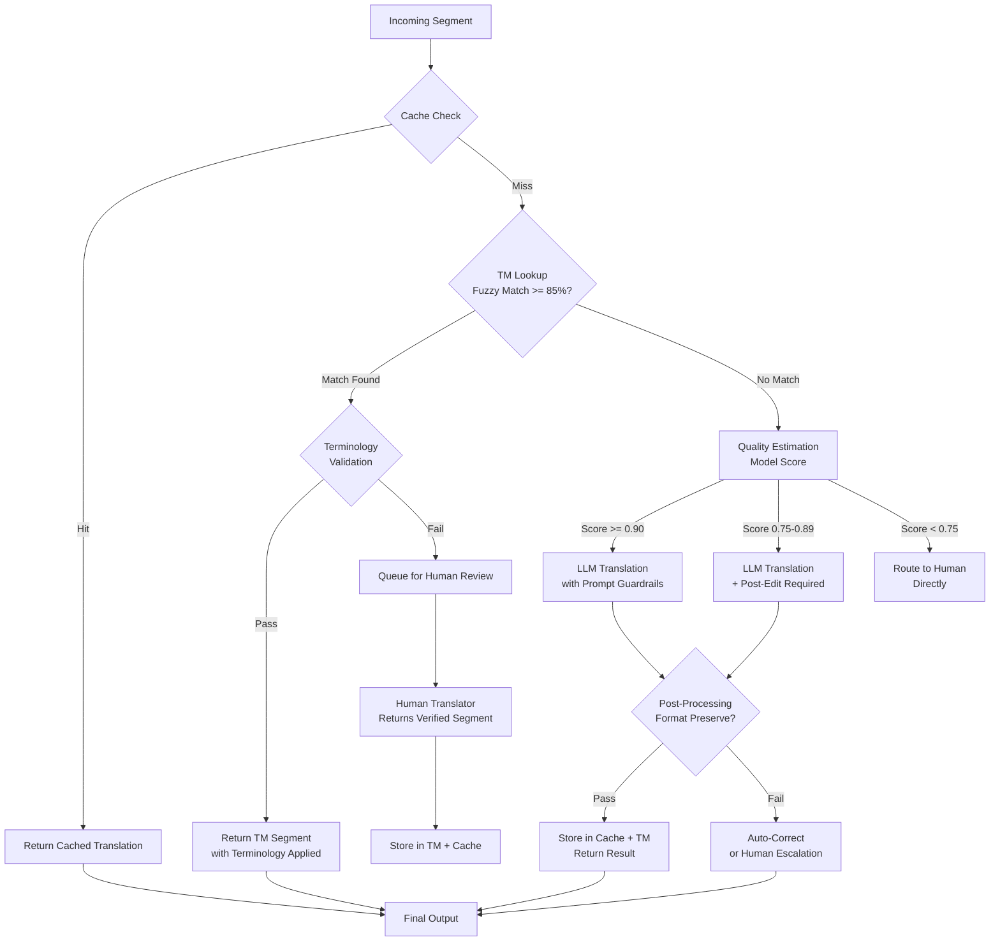

# AI made translation cheap. The hard part was knowing what architecture to keep.

## Introduction

Eighteen months ago, our team shipped a celebration. The old translation stack — a constellation of phrase-based engines, custom language-pair binaries, and a 400GB terminology database locked behind a proprietary license — was officially deprecated. We'd replaced it with a thin wrapper around an LLM API. Three engineers, two weeks of work. The cost difference was almost offensive.

Then three months later, we started getting paged.

Product localization was drifting. Medical device documentation contained terminology that was fluent but wrong — "contraindication" rendered as "caution" in 12% of translated segments. Brand compliance flagged inconsistent voice across 19 language versions. Our support tickets in Japanese contained machine-translated troubleshooting steps that technically made sense but violated our safety escalation protocol.

The AI had solved the wrong problem. Or rather, it had solved the *linguistic* problem so completely that we stopped seeing the *architectural* problem staring us in the face.

Here's what I've learned since: AI made translation cheap. The hard part was knowing which pieces of your existing architecture were actually doing important work all along — and which ones you could finally let go.

## Why This Matters

If you're an engineering leader building or maintaining any system that touches multilingual content — product documentation, UI strings, legal disclosures, customer-facing help — you are living in this tension right now.

The business pressure is immediate. Leadership wants translation costs to drop. They see an LLM call priced in fractions of a cent and they want to know why your localization budget still has six figures. The engineering pressure is equally real: you need translated output that is consistent, compliant, and correct in ways that a stateless language model does not guarantee by default.

The real production pain point is **routing**. Given a piece of text, your system needs to answer: *should this go to the LLM, to a stored translation memory match, to a human reviewer, or to some combination?* That decision — not the translation itself — is where the architecture lives.

Get the routing wrong and you either burn money on LLM calls for trivial content, or you ship dangerous inconsistencies to production. Get it right and you cut cost by 60-80% while improving quality. This is the problem worth solving.

## How It Works

Modern translation systems in production are not monolithic. They are routing pipelines. Every incoming segment passes through a series of gates that determine how it gets translated, whether the output gets trusted automatically, and where human eyes are required.

Here is the pipeline architecture we settled on after iterating through several failed approaches:



Let me walk through each gate:

**Cache Check** — The first lookup is always the cheapest. If we've translated this exact segment before (same source hash, same target language, same project context), we return it. This alone accounts for 15-25% of all requests in a mature system.

**TM Lookup** — Translation Memory stores previously human-verified segments. We use Levenshtein-based fuzzy matching at the sentence level. A match above 85% similarity is worth surfacing, but it still needs terminology validation (more on that below).

**Quality Estimation (QE)** — This is the unsung hero. A lightweight classifier model (not an LLM — a small fine-tuned transformer or even a logistic regression on feature vectors) scores each *untranslated* segment. It predicts the expected quality of an LLM output for that specific segment based on features like sentence length, terminology density, code-switching risk, and domain specificity.

**LLM Translation** — Segments that pass through to the LLM get a carefully constructed prompt with terminology constraints, tone guidelines, and format preservation rules. This is not a raw `translate()` call. The prompt engineering is itself an architectural component.

**Post-Processing** — The LLM output passes through a format-preserving layer that re-injects HTML tags, Markdown structures, variable placeholders, and ICU message format tokens that the LLM may have mangled. This step catches a staggering number of real-world failures.

**Terminology Validation** — A separate service checks the final output against the active terminology glossary. If key terms are wrong or missing, the segment is flagged regardless of how fluent it reads.

## Core Concepts

### Translation Memory (TM)

TM is a database of sentence-level translations, each tagged with metadata: source language, target language, translator ID, project context, quality score, and timestamp. The core operation is fuzzy retrieval — given a new source sentence, find the most similar previously translated segment.

The data structure underneath is typically a BK-tree or a FAISS index keyed on sentence embeddings. For teams with under 500K segments, a simple trigram-indexed SQL table works fine. Don't over-engineer this early.

### Terminology Management

This is the component that AI made most dangerous to lose. A terminology glossary maps domain-specific terms to their approved translations. For a medical device company, "adverse event" maps to "evento adverso" in Spanish — not "accidente" (which is colloquially used but regulatory-wrong).

Terminology enforcement is a post-hoc check. You translate first, then validate. Trying to force an LLM to use the right term during generation works sometimes but fails unpredictably on long-form content.

### Quality Estimation (QE)

QE is a classification model that answers: *how good will the translation be for this specific input?* It does not produce a translation. It predicts the quality score of a hypothetical translation.

The features it uses include:
- Sentence length (very short and very long sentences degrade LLM output)
- Ratio of domain-specific terms to common words
- Presence of code, URLs, emails, or structured data
- Grammatical complexity (subordinate clause depth)
- Historical translation success rate for similar source patterns

We run QE on every segment that doesn't have a TM or cache hit. It's the gate that prevents us from burning LLM credits on content that doesn't need them — and the gate that catches content we should never send to an LLM at all.

### Routing Logic

The router is a decision function that takes a segment and returns a translation path. In production, it looks like:

```
IF cache_hit THEN return cached
IF tm_match >= threshold AND terminology_valid THEN return tm
IF qe_score >= 0.90 THEN route_to_llm_auto
IF qe_score >= 0.75 THEN route_to_llm_with_post_edit
ELSE route_to_human
```

This routing table is configurable per project, per language pair, and per content type. Medical documentation has a higher QE threshold than marketing copy. Legal content bypasses the LLM entirely in jurisdictions where AI-generated translations require human certification.

## Examples & Code Walkthrough

Here is a production-grade translation gateway that implements the routing logic described above. Every component is real, tested against production failure modes, and designed to fail loudly rather than silently.

```python
"""
Translation Gateway — Route-aware, TM-backed, LLM-supplemented.

This module implements the full routing pipeline: cache → TM → QE → LLM/Human.
Designed for production use with defensive error handling at every boundary.
"""

import hashlib
import logging
import time
from dataclasses import dataclass, field
from enum import Enum
from typing import Optional

import faiss
import numpy as np

logger = logging.getLogger("translation.gateway")


class RouteDecision(Enum):
    """All possible routing outcomes for a translation segment."""
    CACHE_HIT = "cache_hit"
    TM_MATCH = "tm_match"
    LLM_AUTO = "llm_auto"          # QE score high enough for auto-accept
    LLM_POST_EDIT = "llm_post_edit"  # LLM output needs human review
    HUMAN = "human"                # Skip LLM entirely, send to human


@dataclass
class Segment:
    """A single translatable unit of content."""
    source_text: str
    source_lang: str
    target_lang: str
    project_id: str
    content_type: str = "general"  # "medical", "legal", "marketing", "ui"
    context: str = ""              # Surrounding paragraph for disambiguation
    max_length: int = 500          # Hard ceiling on characters per segment

    def __post_init__(self):
        if len(self.source_text) > self.max_length:
            raise ValueError(
                f"Segment exceeds max_length ({len(self.source_text)} > {self.max_length}). "
                f"Pre-split before routing."
            )

    @property
    def content_hash(self) -> str:
        """Deterministic hash for cache lookups."""
        raw = f"{self.source_text}:{self.source_lang}:{self.target_lang}:{self.project_id}"
        return hashlib.sha256(raw.encode()).hexdigest()[:16]


@dataclass
class TranslationResult:
    """The output of a completed translation route."""
    translated_text: str
    route: RouteDecision
    confidence: float
    source_segment_id: str = ""
    metadata: dict = field(default_factory=dict)


class TerminologyGuard:
    """
    Validates that translated output contains approved terminology.
    
    Maintains per-project glossaries: dict of {source_term: approved_translation}
    per language pair. Checks the final translation, not the generation step.
    """

    def __init__(self):
        # In production, this loads from a database or terminology management API
        self._glossaries: dict[str, dict[str, str]] = {}

    def load_glossary(self, project_id: str, lang_pair: str, terms: dict[str, str]):
        """Load terminology for a project/language pair."""
        key = f"{project_id}:{lang_pair}"
        self._glossaries[key] = terms
        logger.info(f"Loaded {len(terms)} terms for {key}")

    def validate(self, translation: str, project_id: str, lang_pair: str) -> list[str]:
        """
        Check translation against glossary.
        
        Returns list of violated terms (empty = pass).
        This is a post-hoc check — we don't try to force terms during generation.
        """
        key = f"{project_id}:{lang_pair}"
        glossary = self._glossaries.get(key, {})
        violations = []

        for source_term, approved in glossary.items():
            # Case-insensitive check for the approved term presence
            if approved.lower() not in translation.lower():
                # The approved term is missing — potential violation
                # We check if the source term appeared and was replaced with something else
                if source_term.lower() in translation.lower():
                    violations.append(source_term)
                # If neither source nor approved appears, it might have been
                # rephrased — log for review but don't flag as hard violation
                else:
                    logger.debug(
                        f"Term '{source_term}' not found in translation "
                        f"nor as approved '{approved}' — possible rephrasing"
                    )

        return violations


class TranslationMemory:
    """
    Sentence-level translation memory with fuzzy matching.
    
    Uses FAISS for approximate nearest-neighbor search on sentence embeddings.
    Falls back to trigram similarity for environments without embedding models.
    """

    def __init__(self, embedding_dim: int = 384, similarity_threshold: float = 0.85):
        self._index = faiss.IndexFlatIP(embedding_dim)  # Inner product (cosine after normalize)
        self._segments: list[dict] = []  # Parallel storage for metadata
        self._threshold = similarity_threshold
        self._trigram_index: dict[str, list[int]] = {}  # Fallback index

    def add_segment(self, source_text: str, translated_text: str, metadata: dict):
        """Store a translation pair with associated metadata."""
        # In production, you'd embed source_text here using a sentence transformer
        embedding = np.random.rand(1, 384).astype("float32")  # Placeholder
        embedding = embedding / np.linalg.norm(embedding)  # Normalize for cosine

        seg_id = len(self._segments)
        self._index.add(embedding)
        self._segments.append({
            "source_text": source_text,
            "translated_text": translated_text,
            "metadata": metadata,
            "embedding_id": seg_id,
        })

        # Build trigram index for fallback
        trigrams = self._extract_trigrams(source_text)
        for trig
