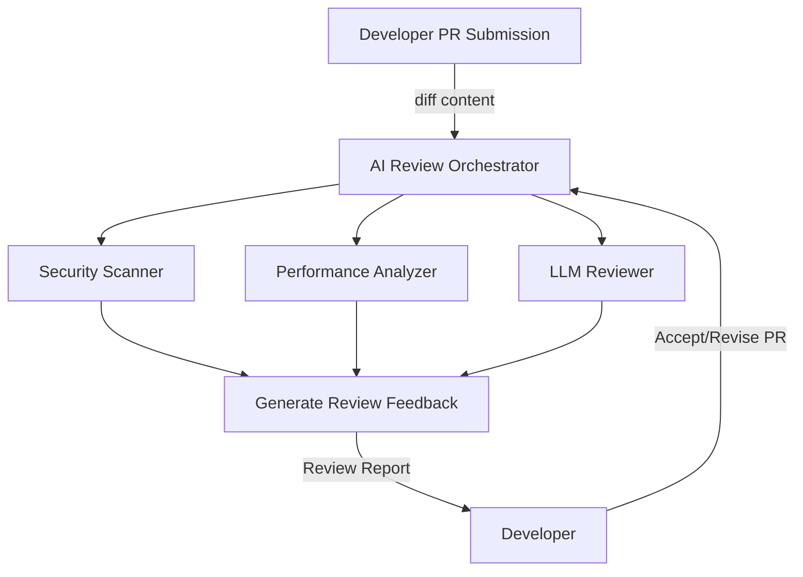

# AI Usage Patterns in Software Teams

## Introduction

The integration of artificial intelligence into software development has moved beyond novelty status. Engineering teams at scale are actively designing systems where AI agents collaborate directly with human developers, automate quality gates, and maintain system health. This shift isn't about replacing developers but about augmenting their capacity to handle modern software complexity. Traditional advice about "integrating AI" often misses the nuanced realities of team workflows, tooling friction, and the psychological impact of automation. We'll examine four emergent patterns that reflect how teams are practically deploying AI today.

## Why This Matters

Modern software teams face three persistent challenges: inconsistent code quality, knowledge fragmentation, and reactive maintenance cycles. AI agents that specialize in review automation, contextual assistance, knowledge synthesis, and predictive maintenance offer concrete solutions to these problems. For example, a team handling 100+ daily pull requests can reduce manual review overhead by 30% using AI-first review patterns. These implementations aren't theoretical exercises - they're operational requirements for teams managing systems with millions of daily users.

## How It Works

AI integration in software teams follows a three-layered architecture:
1. **Perception Layer**: Context gathering from code repositories, CI/CD pipelines, and team communication channels
2. **Processing Layer**: Specialized AI models operating within constrained contexts (code reviews, documentation gaps, system telemetry)
3. **Action Layer**: Automated feedback loops, documentation generation, and alerting systems

The key differentiator is operationalizing AI within existing development ecosystems rather than creating isolated tooling.



## Core Concepts

### Pattern 1: AI as the First Reviewer
**Purpose**: Automate quality gates before human review
**Key Components**:
- Pre-commit static analysis
- LLMs analyzing semantic code changes
- Integration with CI/CD systems

### Pattern 2: Collaborative Pair Programmer
**Purpose**: Real-time code suggestion with context awareness
**Key Requirements**:
- Development context tracking
- Conversation history management
- Coding standard enforcement

### Pattern 3: Knowledge Synthesizer
**Purpose**: Transform fragmented knowledge into system documentation
**Critical Technologies**:
- Graph-based knowledge stores
- Cross-source information extraction
- RAG-based query interfaces

### Pattern 4: Predictive Maintenance Agent
**Purpose**: Anomaly detection and root cause analysis
**System Requirements**:
- Real-time metrics collection
- Historical incident correlation
- ML model retraining pipelines

## Examples & Code Walkthrough

### AI Review Pipeline Implementation

```python
class AIReviewOrchestrator:
    def __init__(self, repo_config):
        self.quality_gates = [
            SecurityScanner(),
            PerformanceAnalyzer(),
            StyleEnforcer(repo_config.style_guide)
        ]
        self.llm_reviewer = LLMPoweredReviewer(
            model_endpoint="internal-llm.company.com",
            context_window=8000
        )

    def process_pull_request(self, pr_metadata):
        automated_results = []
        for gate in self.quality_gates:
            result = gate.analyze(pr_metadata.diff_content)
            if result.severity == "BLOCKER":
                return self._block_pr(result)
            automated_results.append(result)
            
        ai_feedback = self.llm_reviewer.review_semantic_changes(
            diff=pr_metadata.diff_content,
            file_context=self._build_file_context(pr_metadata.changed_files),
            historical_patterns=self._fetch_similar_changes(pr_metadata.author)
        )
        
        return self._compile_review_report(automated_results, ai_feedback)

    def _block_pr(self, result):
        alert_system.trigger_blocked_pr(result)
        return PRVerdict(blocked=True, reason=result.message)
```

This implementation demonstrates layered quality gates with escalation paths. The orchestrator coordinates multiple specialized tools while maintaining context about the PR lifecycle.

## Best Practices

1. **Context is King**: Always provide sufficient code/environment context to AI components
2. **Human-in-the-Loop**: Use AI to reduce workload, not replace judgment
3. **Feedback Loops**: Track acceptance/rejection rates to improve model relevance
4. **Local First**: Prefer private LLMs over public APIs for code-sensitive work
5. **Performance Budgeting**: Monitor inference latency impact on CI/CD pipelines

## Common Mistakes & Anti-Patterns

1. **Over-Automation**: Blocking PRs for trivial style issues creates friction
2. **Context Poverty**: AI suggestions without code context lead to "hallucinated" fixes
3. **Stale Models**: Failing to retrain models on current codebases reduces effectiveness
4. **Alert Spam**: Poor anomaly detection thresholds create noise fatigue
5. **Documentation Blind Spots**: Synthesizers that ignore architectural decision records

## Performance Considerations

| Component | Latency Impact | Resource Considerations |
|-----------|----------------|--------------------------|
| Static Scanners | <100ms | Minimal |
| LLM Review | 1-3s | GPU instance required |
| Knowledge Graph | 500ms-2s | Redis cluster recommended |
| Anomaly Detection | 2-5s | Time-series DB required |

Consider running LLM components in async workers during peak CI load. Cache frequently used code context patterns to reduce inference overhead.

## Real-World Usage

Spotify uses AI review agents to maintain code quality across 100+ daily PRs per developer. Their implementation blocks PRs with security vulnerabilities but flags performance issues for human evaluation. ThoughtSpot employs knowledge synthesizers to maintain system documentation across 500+ microservices, automatically generating API documentation from code comments and incident reports.

## Frequently Asked Questions

**Q: How do we handle false positives in AI reviews?**  
A: Implement a "flag for review" mechanism that preserves human override capability. Track false positive rates per model version.

**Q: Can AI assistants replace junior developers?**  
A: No. They augment capacity but require human validation for architectural decisions and edge case handling.

**Q: What's the cost of running private LLMs?**  
A: Expect $0.50-$2.00 per 1k tokens depending on model size and deployment architecture. Optimize through quantization and batch processing.

**Q: How do you measure ROI on AI tooling?**  
A: Track engineering velocity metrics (PRs/day, deployment frequency) and quality metrics (bug escape rate, review cycle time).

## Conclusion

The most successful AI implementations in software teams are those that deeply integrate with existing workflows while respecting human cognitive architecture. These patterns represent the next evolution in engineering tooling - not just automation, but intelligent collaboration that elevates the entire team's capability. As these systems mature, the focus will shift from individual tool effectiveness to ecosystem coherence and sustained velocity gains.
