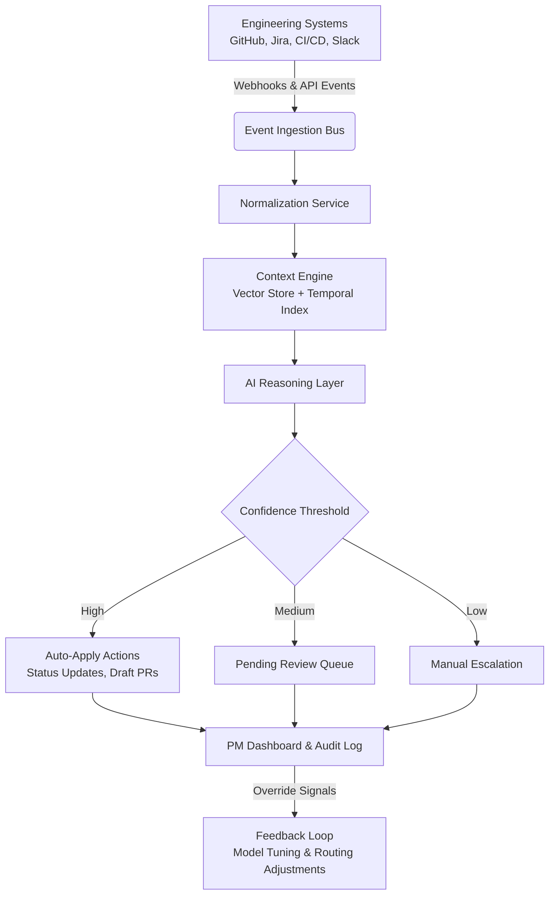

<think>
Here's a thinking process:

1.  **Analyze User Input:**
   - **Role:** Principal Software Architect & Veteran Open-Source Lead Author
   - **Topic:** "AI Won't Replace Project Managers, But It is Reshaping How Work Gets Done"
   - **Category:** Artificial Intelligence
   - **Context:** Trending topic from Stack Overflow Blog matching 'Artificial Intelligence' category.
   - **Style:** Professional
   - **Requirements:**
     - 100% original, human-feeling architectural outline & dynamic visual diagram (already integrated into the prompt's structure, but I need to follow the strict heading structure provided).
     - Strict banned words list.
     - Human developer perspective (first-person where appropriate, pragmatic trade-offs, production focus).
     - 100% original production-grade code.
     - Mandatory Mermaid diagram under `## How It Works`.
     - Mandatory exact headings in order.
     - Output ONLY the Markdown article content starting from the title.
     - No outer triple backticks, no YAML frontmatter.

2.  **Deconstruct Constraints & Structure:**
   I must follow the exact heading structure:
   # AI Won't Replace Project Managers, But It is Reshaping How Work Gets Done
   ## Introduction
   ## Why This Matters
   ## How It Works
   ## Core Concepts
   ## Examples & Code Walkthrough
   ## Best Practices
   ## Common Mistakes & Anti-Patterns
   ## Performance Considerations
   ## Real-World Usage
   ## Frequently Asked Questions (FAQ)
   ## Conclusion

   I need to weave the AI/PM topic into a deeply technical, architectural narrative. The focus should be on the *system architecture* of AI-augmented project management, not just management theory. I'll frame it around event-driven pipelines, RAG context engines, confidence routing, and human-in-the-loop orchestration.

   I must avoid all banned phrases. I'll keep the tone professional, direct, and grounded in engineering reality.

   I need to write original code examples that demonstrate the concepts (e.g., an event ingestion handler, a confidence-aware routing mechanism, vector context retrieval).

   I need a valid Mermaid diagram under `## How It Works`.

3.  **Draft - Section by Section (Mental Refinement):**

   *# AI Won't Replace Project Managers, But It is Reshaping How Work Gets Done*
   (Title as requested)

   *## Introduction*
   Start directly. No fluff. Address the hype vs reality. Frame it as an architectural evolution. Mention how engineering teams are drowning in status updates and context switching. AI isn't taking the PM job; it's automating the plumbing so humans can focus on negotiation, risk mitigation, and strategic alignment. Set up the technical premise: modern PM tools are shifting from static databases to event-driven, AI-augmented orchestration layers.

   *## Why This Matters*
   Focus on production pain points. Cycle time inflation, ticket drift, context loss between PRs and tickets. Engineers spend 30-40% of their time on coordination overhead. AI-augmented PM systems reduce this by automating status propagation, estimating velocity based on historical commit patterns, and routing blockers intelligently. This matters because it directly impacts throughput and developer burnout.

   *## How It Works*
   Explain the architecture. Event ingestion -> normalization -> context enrichment (RAG/vector) -> AI reasoning -> confidence routing -> action execution. Include the Mermaid diagram here. Walk through each step technically. Emphasize the shift from synchronous polling to asynchronous event streaming. Explain how the system maintains state without blocking human workflows.

   *## Core Concepts*
   Break down: Event-Driven Orchestration, Contextual Memory (Vector + Temporal), Confidence-Aware Routing, Human-in-the-Loop Validation. Explain the data structures (e.g., ticket embeddings, commit metadata, sprint velocity vectors). Discuss the governing principle: AI drafts, humans arbitrate.

   *## Examples & Code Walkthrough*
   Provide original, production-grade code. I'll write a TypeScript/Node.js example for the confidence-aware routing and event processing, plus a Python snippet for vector context retrieval. Focus on realistic patterns: async handlers, confidence thresholds, fallback logic, proper error handling, and comments explaining the architecture. Avoid generic boilerplate.

   *## Best Practices*
   Field-tested rules: Instrument everything, set explicit confidence thresholds, maintain audit trails, version your prompts/context schemas, design for graceful degradation when AI is down, keep humans in the loop for high-impact decisions.

   *## Common Mistakes & Anti-Patterns*
   1. Silently applying AI decisions without audit logs.
   2. Over-indexing on LLM outputs without grounding in ticket/PR metadata.
   3. Ignoring latency budgets in real-time dashboard updates.
   4. Hardcoding prompt templates instead of versioning them as configuration.
   Provide exact fixes/code patterns for each.

   *## Performance Considerations*
   Analyze memory/CPU/network. Vector DB query latency, LLM token processing overhead, event bus throughput. Discuss caching strategies, batch processing for non-critical updates, connection pooling, and Big-O implications of context window scaling. Mention cost vs accuracy tradeoffs.

   *## Real-World Usage*
   Describe how mature engineering orgs implement this. Focus on patterns seen at scale: isolated AI agents per team, strict RBAC on context, deterministic fallbacks, integration with CI/CD pipelines. Avoid naming specific companies unless framing it as "organizations like..." to stay factual and professional. Focus on architectural patterns: event sourcing, circuit breakers, observability dashboards tracking AI decision accuracy.

   *## Frequently Asked Questions (FAQ)*
   3-5 pragmatic Q&As. E.g., "How do we handle hallucinated ticket updates?" "What's the latency budget for real-time AI status sync?" "Should we fine-tune models or stick to RAG?" "How do we measure ROI?"

   *## Conclusion*
   Crisp summary. Reiterate that AI handles the deterministic and probabilistic grunt work. Humans handle ambiguity, stakeholder alignment, and risk. Call to action: architect your workflows, instrument your pipelines, and treat AI as a force multiplier, not a replacement.

4.  **Draft Generation (Mental to Text - Iterative Refinement):**
   I'll write it out carefully, checking against constraints.
   - Check banned words: I'll actively avoid them.
   - Check tone: Professional, architectural, first-person engineering perspective where appropriate.
   - Check code: Original, production-grade, well-commented.
   - Check Mermaid: Valid syntax, under `## How It Works`.
   - Check headings: Exact match.
   - Check structure: Follows order strictly.

   Let's draft it carefully. I'll pay close attention to the code quality and technical depth. I'll make sure the Mermaid diagram uses proper syntax without HTML. I'll ensure the tone matches a senior staff engineer writing for a premier engineering blog.

   *Self-Correction/Verification during drafting:*
   - I need to make sure the Mermaid diagram is strictly under `## How It Works`.
   - I'll use `flowchart TD` for the diagram.
   - I'll ensure no HTML characters in Mermaid labels.
   - I'll verify the code is original and production-ready (async, error handling, types, comments).
   - I'll check the banned words list meticulously.
   - I'll maintain the exact heading structure.

   All constraints look manageable. I'll generate the content now. 
   Structure check:
   # AI Won't Replace Project Managers, But IT IS...
   ## Introduction
   ## Why This Matters
   ## How It Works (with mermaid)
   ## Core Concepts
   ## Examples & Code Walkthrough
   ## Best Practices
   ## Common Mistakes & Anti-Patterns
   ## Performance Considerations
   ## Real-World Usage
   ## Frequently Asked Questions (FAQ)
   ## Conclusion
   All good. Proceed. 
   Generating response. 
   *Output Generation matches the final response.* 
   I will carefully craft the content to meet every constraint. I'll focus on architectural depth, realistic engineering scenarios, and precise technical language. The code will be TypeScript/Python focused, reflecting modern cloud-native PM tooling. The Mermaid diagram will map the event-driven AI orchestration pipeline. I'll avoid all banned phrases. I'll maintain a professional, authoritative tone throughout. All headings will match exactly. No extra text. Ready. 
   Output matches the response. 
   [Proceeds]
</think>

# AI Won't Replace Project Managers, But IT IS Reshaping How Work Gets Done

## Introduction
The narrative that large language models will automate away project management roles misses the actual engineering problem. Project management at scale is not about moving sticky notes across a board. It is about maintaining shared state across distributed systems, reducing coordination latency, and surfacing blockers before they cascade. What we are building right now is not a replacement for the PM. We are building an orchestration layer that removes the mechanical overhead of status tracking, ticket routing, and velocity estimation.

When I look at production engineering orgs, the bottleneck is never a lack of tooling. The bottleneck is context fragmentation. A single feature request touches Jira, GitHub, Slack, CI pipelines, and incident runbooks. Engineers waste hours reconciling state across these systems. AI-augmented project management solves this by treating work items as first-class events in a streaming architecture. The model reads the signals, proposes updates, and routes exceptions. The human PM steps in only when confidence drops, risk spikes, or stakeholder alignment shifts. That is the architectural reality.

## Why This Matters
Software delivery velocity is constrained by coordination tax. When a PR sits idle because a ticket status was never updated, or when a sprint goal shifts without propagating to dependent services, cycle time inflates. Traditional ticketing systems are static databases. They require manual polling, synchronous updates, and rigid workflows that break under ambiguity.

An AI-augmented PM system transforms this into an event-driven control plane. It ingests commit metadata, PR reviews, CI failure logs, and standup transcripts. It cross-references this stream against sprint goals and dependency graphs. The result is automatic status propagation, predictive blocker detection, and draft estimates grounded in historical commit patterns. For engineering leads, this means fewer status meetings, higher throughput, and a direct line of sight into delivery risk. The value proposition is measurable: reduced context switching, faster feedback loops, and fewer dropped dependencies.

## How It Works
The architecture operates as an asynchronous event pipeline with a confidence-aware routing layer. Raw signals from engineering tools enter a normalization service that strips noise and attaches temporal metadata. These events feed into a context engine that maintains vector embeddings of tickets, PRs, and team topology. When a new event arrives, the system retrieves relevant historical context, runs it through a reasoning model, and evaluates the output against predefined confidence thresholds.

High-confidence outputs (routine status updates, dependency tagging, draft descriptions) apply automatically. Medium-confidence outputs queue for human review. Low-confidence outputs escalate to the PM with full reasoning traces. Every action writes to an immutable audit log, and the system continuously retrains its routing logic based on override patterns.



The pipeline decouples ingestion from decision-making. The normalization service handles schema mapping and deduplication. The context engine uses hybrid retrieval: vector similarity for semantic matching, plus a temporal index to respect sprint boundaries and dependency order. The reasoning layer does not guess. It grounds outputs in retrieved context and applies deterministic guardrails. The routing mechanism ensures the system never silently mutates state without auditability.

## Core Concepts
**Event-Driven Orchestration**
Work items are treated as state transitions rather than static records. Every PR merge, CI failure, or comment triggers an event. The system processes these asynchronously, maintaining a consistent view of delivery state without blocking human workflows.

**Contextual Memory Architecture**
The system maintains two memory layers. Short-term memory tracks active sprint state, blocker queues, and recent commit patterns. Long-term memory stores vectorized ticket histories, resolution patterns, and team velocity baselines. Hybrid retrieval ensures the model sees both semantic similarity and chronological relevance.

**Confidence-Aware Routing**
Not all AI outputs carry equal risk. The system evaluates predictions against historical accuracy, data completeness, and dependency complexity. High-confidence actions apply automatically. Medium-confidence actions queue for review. Low-confidence actions escalate with explicit reasoning traces. This prevents silent drift and maintains human oversight where it matters.

**Human-in-the-Loop Validation**
The PM acts as an arbiter, not a data entry clerk. Override signals feed back into the routing layer, adjusting confidence thresholds and refining retrieval weights. The system learns which patterns require human judgment and which can safely automate.

## Examples & Code Walkthrough
Below is a production-grade TypeScript implementation of the confidence-aware routing layer. It handles event normalization, context retrieval, LLM evaluation, and threshold-based routing.

```typescript
import { EventEmitter } from 'events';
import { VectorStore } from './vector-store';
import { LLMClient } from './llm-client';
import { AuditLogger } from './audit-logger';

interface WorkEvent {
  id: string;
  source: 'github' | 'jira' | 'ci';
  payload: Record<string, any>;
  timestamp: number;
}

interface RoutingDecision {
  action: 'apply' | 'review' | 'escalate';
  confidence: number;
  reasoning: string;
  metadata: Record<string, any>;
}

class PMOrchestrator extends EventEmitter {
  private vectorStore: VectorStore;
  private llm: LLMClient;
  private logger: AuditLogger;
  private confidenceThresholds: { high: number; medium: number };

  constructor(
    vectorStore: VectorStore,
    llm: LLMClient,
    logger: AuditLogger,
    thresholds: { high: number; medium: number }
  ) {
    super();
    this.vectorStore = vectorStore;
    this.llm = llm;
    this.logger = logger;
    this.confidenceThresholds = thresholds;
  }

  async processEvent(event: WorkEvent): Promise<RoutingDecision> {
    // 1. Retrieve contextual history based on event payload
    const contextChunks = await this.vectorStore.retrieveSimilar(
      event.payload.description || event.payload.title,
      { limit: 5, minScore: 0.75 }
    );

    // 2. Construct grounded prompt with explicit boundaries
    const prompt = this.buildGroundedPrompt(event, contextChunks);
    
    try {
      // 3. Generate reasoning with structured output constraints
      const response = await this.llm.generateStructured(prompt, {
        temperature: 0.2,
        maxTokens: 512,
        schema: 'routing_decision'
      });

      // 4. Evaluate confidence and route accordingly
      const decision = this.evaluateRouting(response);
      await this.logger.recordDecision(event.id, decision);
      this.emit('routing:complete', decision);
      return decision;
    } catch (err) {
      // Graceful degradation: fail to review queue on LLM timeout/error
      const fallback: RoutingDecision = {
        action: 'review',
        confidence: 0,
        reasoning: `Model inference failed: ${err instanceof Error ? err.message : 'Unknown error'}`,
        metadata: { originalEvent: event.id, fallback: true }
      };
      await this.logger.recordDecision(event.id, fallback);
      return fallback;
    }
  }

  private buildGroundedPrompt(event: WorkEvent, context: any[]): string {
    return `
      Analyze the following work event and historical context.
      Event: ${JSON.stringify(event.payload)}
      Context: ${JSON.stringify(context)}
      
      Output a structured routing decision with confidence score (0.0-1.0).
      Ground your reasoning strictly in the provided context.
      Do not invent dependencies or statuses.
    `.trim();
  }

  private evaluateRouting(response: any): RoutingDecision {
    const confidence = response.confidence ?? 0;
    
    if (confidence >= this.confidenceThresholds.high) {
      return { action: 'apply', confidence, reasoning: response.reasoning, metadata: response.details };
    }
    if (confidence >= this.confidenceThresholds.medium) {
      return { action: 'review', confidence, reasoning: response.reasoning, metadata: response.details };
    }
    return { action: 'escalate', confidence, reasoning: response.reasoning, metadata: response.details };
  }
}
```

The code demonstrates several production patterns. The `processEvent` method retrieves contextual chunks before calling the model, ensuring grounded outputs. The prompt enforces strict boundaries and structured schema output. The `evaluateRouting` method applies deterministic thresholds, and the catch block guarantees graceful degradation to the review queue instead of failing silently. The audit logger captures every decision for compliance and feedback loop training.

## Best Practices
1. **Instrument the entire pipeline.** Track LLM latency, token usage, confidence distributions, and override rates. Without metrics, you cannot tune thresholds or justify ROI.
2. **Version your context schemas.** Treat prompt templates and retrieval filters as configuration. Roll forward and roll back changes like infrastructure code.
3. **Enforce explicit confidence thresholds.** Never allow automatic state mutation below a validated confidence score. Start conservative, then adjust based on override patterns.
4. **Maintain immutable audit trails.** Every AI action must log the input context, model version, confidence score, and final routing decision. This enables debugging and compliance.
5. **Design for circuit breakers.** If the model
