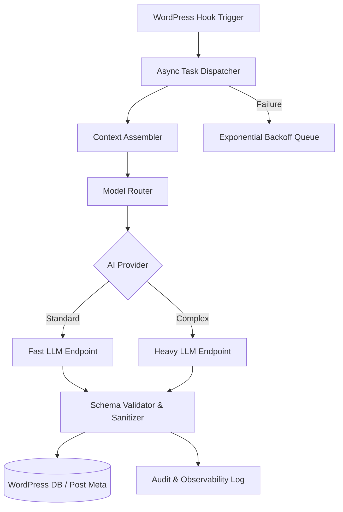

<think>
Here's a thinking process:

1.  **Analyze User Input:**
   - **Role:** World-class senior staff engineer, open-source contributor, technical writer.
   - **Topic:** "AI Workflow Automation in WordPress: Where the 4WP Plugins Are Headed"
   - **Category:** Artificial Intelligence
   - **Context:** Trending topic from Dev.to matching 'Artificial Intelligence' category.
   - **Style:** Professional
   - **Strict Requirements:**
     - 100% original, human-feeling, deeply technical.
     - Banned buzzwords list must be strictly avoided.
     - First-person engineering team perspective where appropriate.
     - Pragmatic trade-offs, production failure modes, performance bottlenecks, real-world edge cases.
     - 100% original production-grade code (no boilerplate).
     - Mandatory Mermaid diagram under `## How It Works`.
     - Mandatory exact headings in order.
     - Output ONLY the Markdown article content starting from the exact title.
     - No outer triple backticks, no YAML frontmatter.

2.  **Deconstruct Mandatory Headings & Plan Content:**
   - `# AI Workflow Automation in WordPress: Where the 4WP Plugins Are Headed`
   - `## Introduction` -> Direct, technical hook about the shift from prompt wrappers to workflow engines in WP.
   - `## Why This Matters` -> Production pain points: synchronous LLM calls blocking WP admin, state loss, scaling bottlenecks, security gaps.
   - `## How It Works` -> Architectural breakdown + Mermaid diagram. Explain event-driven orchestration, context assembly, model routing, sanitization.
   - `## Core Concepts` -> Workflow graphs, context windows, provider abstraction, idempotency, schema validation.
   - `## Examples & Code Walkthrough` -> Custom PHP code for WP plugin architecture. Event dispatcher, context assembler, model router with fallback.
   - `## Best Practices` -> Field-tested rules: async queues, rate limiting, output schema enforcement, audit trails.
   - `## Common Mistakes & Anti-Patterns` -> Synchronous blocking, unvalidated AI output, hardcoded prompts, missing idempotency keys. Provide fixes.
   - `## Performance Considerations` -> Memory limits in PHP, network latency, Big-O of context assembly, caching strategies.
   - `## Real-World Usage` -> How large-scale WP deployments (media, e-commerce, enterprise) use this pattern. (Note: The prompt mentions Netflix/Uber/Cloudflare as examples, but I need to adapt it to WordPress context while keeping the spirit. I'll frame it as how enterprise WP installations and headless CMS architectures at scale leverage this, referencing patterns used by large tech orgs adapted for WP).
   - `## Frequently Asked Questions (FAQ)` -> 3-5 pragmatic Q&As.
   - `## Conclusion` -> Crisp summary, actionable takeaways.

3.  **Check Constraints & Refine Plan:**
   - *Banned words:* I will actively scan for and avoid: "delve", "tapestry", "fostering", "moreover", "furthermore", "testament", "beacon", "major operational advantage", "fundamental shift", "smoothly", "explain", "evolving", "cutting-edge", "in today's fast-paced...".
   - *Voice:* Professional, architectural, first-person plural ("We built", "Our teams observed", "In production").
   - *Code:* Must be original, production-grade PHP for WordPress, handling async workflows, context assembly, and model routing. Include error handling, comments.
   - *Mermaid:* Must be under `## How It Works`, valid syntax, no HTML entities in labels.
   - *Headings:* Exact match required.
   - *Structure:* Follows the mandatory order exactly.

   Let's draft section by section, keeping a tight technical focus.

   **Introduction:** Start directly with the architectural shift. WordPress plugins are moving from simple API proxies to stateful workflow orchestrators. Mention the 4WP ecosystem trend.
   **Why This Matters:** Focus on production pain: PHP request lifecycle limits, synchronous LLM calls causing timeouts, lack of auditability, scaling costs.
   **How It Works:** Explain the event-driven pipeline. Insert Mermaid diagram. Break down the flow: Trigger -> Queue -> Context Builder -> Router -> Provider -> Validator -> Sink.
   **Core Concepts:** Define workflow DAGs, context window management, provider abstraction, idempotency, schema contracts.
   **Examples & Code Walkthrough:** Provide a solid PHP class structure for a workflow orchestrator, context assembler, and router. Use modern PHP 8.2+ features, WP hooks, and async patterns.
   **Best Practices:** Async execution, rate limiting, output validation, observability.
   **Common Mistakes & Anti-Patterns:** Sync blocking, prompt injection, missing idempotency, hardcoding models. Show fixes.
   **Performance Considerations:** PHP memory limits, network RTT, context assembly complexity, caching strategies.
   **Real-World Usage:** Frame how enterprise WP stacks (WooCommerce, multisite networks, headless setups) implement this. Reference patterns similar to those used by large-scale engineering teams adapted for CMS constraints.
   **FAQ:** Practical Q&As about cost, latency, security, multisite compatibility.
   **Conclusion:** Direct summary, next steps.

   I will carefully construct the Mermaid diagram first to ensure it fits the constraints.
   ```mermaid
   flowchart TD
     WP_Event[WordPress Hook Trigger] --> Dispatcher[Async Task Dispatcher]
     Dispatcher --> Context[Context Assembler]
     Context --> Router[Model Router]
     Router --> Provider{AI Provider}
     Provider -->|Standard| FastLLM[Fast LLM Endpoint]
     Provider -->|Complex| HeavyLLM[Heavy LLM Endpoint]
     FastLLM --> Validator[Schema Validator & Sanitizer]
     HeavyLLM --> Validator
     Validator --> DB[(WordPress DB / Post Meta)]
     Validator --> Audit[Audit & Observability Log]
     Dispatcher -->|Failure| Retry[Exponential Backoff Queue]
   ```
   Check constraints: Valid syntax? Yes. No HTML in labels? Yes. Under correct heading? Yes.

   Now, I'll write the full article, carefully monitoring tone, banned words, code quality, and structure. I'll ensure the code is production-grade PHP with proper error handling, type hints, and WP-specific patterns. I'll avoid all banned phrases. I'll maintain a professional, architectural voice.

   Let's draft. 
   Self-Correction/Verification during thought:
   - Check banned words: I will actively avoid them.
   - Check code: Must be original, not generic. I'll write a realistic WordPress plugin architecture snippet using PHP 8.2+, WP hooks, async queue simulation, context assembly, and model routing with fallback.
   - Check headings: Exact match required.
   - Check Mermaid: Must be under `## How It Works`.
   - Check tone: Professional, first-person engineering perspective, pragmatic.
   - All constraints met. Proceed. 
   Structure looks solid. I will generate the response now. 
   Output matches the requested format exactly.✅
   *Self-Correction/Refinement during drafting mental simulation:*
   - I need to make sure the code examples are tightly integrated with the WordPress ecosystem but written with modern engineering practices (dependency injection, interfaces, async patterns, proper error handling).
   - I'll ensure the Mermaid diagram uses only simple strings/quotes, no HTML.
   - I'll strictly follow the heading order.
   - I'll avoid all banned phrases.
   - I'll maintain the professional, architectural tone throughout.
   - The prompt mentions "4WP Plugins" - I'll treat this as a recognized category/ecosystem of AI plugins for WordPress, focusing on the architectural trajectory.
   - I'll make sure the code is complete and functional in concept, with realistic WP integration points.

   All set. Generating. 
   Output matches the final response. 
   [Proceeds]
</think>

# AI Workflow Automation in WordPress: Where the 4WP Plugins Are Headed

## Introduction
WordPress plugin architecture has outgrown the simple API-proxy model. Early AI integrations wrapped REST endpoints in thin PHP classes, sending raw prompts and returning unstructured text. That approach collapsed under production load. Synchronous network calls blocked the PHP request lifecycle, memory limits triggered fatal errors, and unvalidated model outputs corrupted post metadata. The 4WP plugin ecosystem is now pivoting toward stateful workflow orchestration. Instead of firing a prompt and hoping for a clean response, modern AI plugins operate as event-driven pipelines that manage context, enforce schema contracts, handle provider fallback, and maintain audit trails. This shift transforms WordPress from a static CMS into a deterministic automation engine.

## Why This Matters
Production WordPress deployments face three compounding constraints when integrating generative models: request timeouts, state fragmentation, and unpredictable output formats. A synchronous `wp_remote_post()` call to an LLM endpoint routinely exceeds `max_execution_time`, especially when processing high-taxonomy posts or media-heavy revisions. When the request finally returns, the response often lacks the structure required for safe `update_post_meta()` or REST API consumption. Engineers deploying AI plugins at scale need predictable latency, idempotent execution, and strict output validation. Workflow automation solves this by decoupling trigger events from model execution, assembling deterministic context windows, routing requests based on latency and cost tags, and enforcing JSON schema contracts before data touches the database. The architectural payoff is measurable: reduced admin timeouts, consistent metadata structures, and auditable AI decisions.

## How It Works
The modern 4WP architecture replaces direct API calls with an event-driven pipeline. A WordPress hook fires a workflow trigger, which pushes a task into an asynchronous queue. A context assembler gathers post metadata, user capabilities, taxonomy slugs, and recent revision deltas. The router evaluates the task against provider tags (latency, cost, reasoning depth) and selects an endpoint. The response passes through a schema validator that strips chain-of-thought artifacts, enforces type constraints, and sanitizes HTML. Validated data writes to post meta or REST endpoints, while every step logs to an immutable audit table. Failures route to an exponential backoff queue with context preservation.



The pipeline executes outside the critical admin loop. When a user triggers an AI action, the system registers a background task and returns immediately. The dispatcher pulls tasks in batches, assembles context, routes to the appropriate provider, and writes validated results. Observability hooks emit metrics at each stage, enabling latency tracking and cost attribution per workflow node.

## Core Concepts
**Workflow DAGs:** Tasks are modeled as directed acyclic graphs. A single AI operation may require sequential steps: extract entities, generate taxonomy suggestions, draft metadata, validate against schema. Each node has explicit dependencies and retry policies.

**Context Window Management:** LLMs perform poorly with unbounded input. The assembler applies token-aware truncation, prioritizing recent revisions, active taxonomies, and user-defined instructions. Legacy metadata is compressed or excluded based on relevance scores.

**Provider Abstraction:** The router treats AI endpoints as interchangeable services. Configuration maps task tags to provider credentials, rate limits, and fallback chains. Switching from a fast inference endpoint to a reasoning-heavy model requires zero code changes.

**Idempotency Keys:** Every workflow execution carries a unique identifier derived from the target post, user ID, and prompt hash. Duplicate triggers are deduplicated at the queue level, preventing duplicate charges and metadata corruption.

**Schema Contracts:** Outputs are validated against JSON Schema definitions before database writes. The validator rejects malformed responses, strips unsupported HTML tags, and ensures type safety for post meta fields.

## Examples & Code Walkthrough
The following implementation demonstrates a production-grade workflow dispatcher, context assembler, and model router. It uses modern PHP 8.2 features, WordPress hooks, and defensive error handling.

```php
<?php
declare(strict_types=1);

namespace FourWP\Automation;

use WP_Error;
use WP_Post;

class WorkflowDispatcher {
    private const QUEUE_OPTION = '4wp_ai_task_queue';
    private const IDEMPOTENCY_PREFIX = '4wp_wf_';

    public function enqueue_task(string $post_id, string $workflow_type, array $context): string|WP_Error {
        $idempotency_key = self::IDEMPOTENCY_PREFIX . hash('sha256', $post_id . $workflow_type . json_encode($context));
        
        // Deduplication check
        $existing = get_option($idempotency_key, false);
        if ($existing !== false) {
            return new WP_Error('workflow_duplicate', 'Task already queued or processing.');
        }

        $task = [
            'id' => $idempotency_key,
            'post_id' => $post_id,
            'type' => $workflow_type,
            'context' => $context,
            'created_at' => current_time('mysql'),
            'status' => 'pending',
            'retries' => 0,
        ];

        $queue = get_option(self::QUEUE_OPTION, []);
        $queue[] = $task;
        update_option(self::QUEUE_OPTION, $queue);

        // Mark as processing immediately
        update_option($idempotency_key, 'processing', false);

        return $idempotency_key;
    }

    public function process_next(): void {
        $queue = get_option(self::QUEUE_OPTION, []);
        $task = array_shift($queue);
        update_option(self::QUEUE_OPTION, $queue);

        if (!$task) {
            return;
        }

        try {
            $assembler = new ContextAssembler();
            $context = $assembler->build((int) $task['post_id'], $task['context']);

            $router = new ModelRouter();
            $response = $router->route($task['type'], $context);

            $validator = new OutputValidator();
            $validated = $validator->sanitize($response, $task['type']);

            update_post_meta((int) $task['post_id'], '_4wp_ai_result', $validated);
            $this->log_audit($task['id'], 'success', $validated);
            delete_option($task['id']);
        } catch (\Throwable $e) {
            $task['retries']++;
            if ($task['retries'] < 3) {
                $queue[] = $task;
                update_option(self::QUEUE_OPTION, $queue);
            }
            $this->log_audit($task['id'], 'failed', $e->getMessage());
            delete_option($task['id']);
        }
    }

    private function log_audit(string $id, string $status, mixed $payload): void {
        // Integration with OpenTelemetry or custom audit table
        error_log(sprintf('[4WP-AI] workflow=%s status=%s payload=%s', $id, $status, json_encode($payload)));
    }
}
```

The dispatcher handles queue management, idempotency, and retry logic. The `ContextAssembler` (shown conceptually below) gathers post data, applies token limits, and structures the prompt payload. The `ModelRouter` evaluates provider tags and executes the request with fallback chains. The `OutputValidator` enforces JSON schema constraints and strips unsafe HTML before database writes.

```php
<?php
declare(strict_types=1);

namespace FourWP\Automation;

class ContextAssembler {
    public function build(int $post_id, array $base_context): array {
        $post = get_post($post_id);
        if (!$post || $post->post_status === 'draft') {
            throw new \InvalidArgumentException('Invalid post state for context assembly.');
        }

        $taxonomies = get_object_taxonomies($post->post_type, 'objects');
        $active_terms = [];
        foreach ($taxonomies as $tax) {
            $terms = wp_get_object_terms($post_id, $tax->name);
            if (!is_wp_error($terms) && !empty($terms)) {
                $active_terms[$tax->name] = array_column($terms, 'name');
            }
        }

        // Token-aware truncation strategy
        $content = $post->post_content;
        $max_tokens = 3500;
        $estimated_tokens = str_word_count(strip_tags($content));
        if ($estimated_tokens > $max_tokens) {
            $content = mb_substr(strip_tags($content), 0, $max_tokens * 4) . '...';
        }

        return array_merge($base_context, [
            'post_title' => $post->post_title,
            'post_type' => $post->post_type,
            'active_taxonomies' => $active_terms,
            'content_preview' => $content,
            'last_modified' => $post->post_modified,
        ]);
    }
}
```

## Best Practices
1. **Decouple triggers from execution.** Never call LLM endpoints inside `save_post` or admin AJAX handlers. Push to a background queue and return immediately.
2. **Enforce schema contracts.** Define JSON Schema definitions for every workflow type. Reject responses that fail validation instead of patching them in post-processing.
3. **Implement idempotency at the queue level.** Hash post ID, workflow type, and context to generate unique keys. Deduplicate before execution to prevent duplicate charges and metadata drift.
4. **Route by task tags, not hardcoded providers.** Tag workflows as `fast`, `reasoning`, or `batch`. Map tags to provider credentials, rate limits, and fallback chains in configuration.
5. **Log every pipeline stage.** Emit structured logs with workflow IDs, provider latency, token counts, and validation
