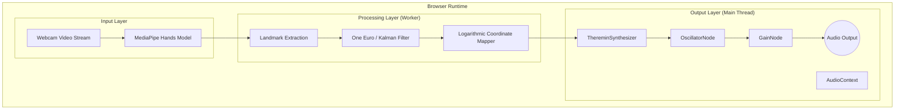

# Air Theremin – a browser theremin you play by waving at your webcam

## Introduction
Imagine a music instrument that turns your webcam into a microphone and your hand into a control surface. A theremin, traditionally played by moving hands in mid‑air, can be re‑imagined inside a browser using only JavaScript, WebRTC, and the Web Audio API. The result is a zero‑UI, low‑latency, AI‑driven musical experience that runs entirely on the client.

## Why This Matters
Modern web apps increasingly rely on real‑time sensor data: AR filters, fitness trackers, remote monitoring. When you need those signals to drive audio synthesis, the latency budget shrinks to a few milliseconds. Offloading the entire pipeline to the browser eliminates network round‑trips, keeps the user in control, and enables new interaction patterns for musicians and developers alike.

## How It Works
Below is a high‑level view of the data flow, followed by a step‑by‑step walk‑through.



1. **Webcam Capture** – The browser requests camera access and streams raw frames into a hidden `<video>` element.
2. **Hand Detection** – MediaPipe Hands runs on each frame, producing 21 3‑D landmarks per hand. This inference is executed inside a Web Worker to keep the UI thread free.
3. **Signal Smoothing** – Raw landmark positions jitter due to pose estimation noise. A lightweight One‑Euro filter (or Kalman) trims high‑frequency spikes without adding noticeable lag.
4. **Coordinate Mapping** – The smoothed Y‑coordinate of the palm controls pitch, while the distance between index‑tip and thumb controls volume. Both values are mapped to musical ranges using logarithmic scaling for perceptual linearity.
5. **Audio Engine** – The Web Audio API builds an oscillator‑gain‑filter chain. Parameter updates use `setTargetAtTime` so theeder transitions are smooth, preventing clicks even during rapid hand movements.

## Core Concepts
| Term | Description |
|------|-------------|
| **MediaPipe Hands** | A lightweight, GPU‑accelerated hand‑tracking model that outputs 21 landmarks with 3‑D coordinates. |
| **One‑Euro Filter** | An adaptive low‑pass filter that balances temporal smoothness against responsiveness. |
| **Logarithmic Mapping** | Maps linear sensor values to frequency in octaves, matching human pitch perception. |
| **Web Audio API** | Provides a node‑based audio graph, enabling real‑time synthesis directly in the browser. |
| **SharedArrayBuffer** | Allows zero‑copy data transfer between worker and main thread, useful for high‑frequency updates игрушки. |

## Examples & Code Walkthrough

### 1. Signal Smoother (One‑Euro Filter)

```javascript
/**
 * One‑Euro Filter implementation for 1‑D signals.
 * Adapted from the original paper; tuned for hand‑tracking.
 */
class OneEuroFilter {
  constructor(minCutoff = 1.0, beta = 0.0, dCutoff = 1.0) {
    this.minCutoff = minCutoff;
    this.beta = beta;
    this.dCutoff = dCutoff;
    this.prevVal = null;
    this.prevDeriv = 0;
  }

  alpha(cutoff) {
    const tau = 1 / (2 * Math.PI * cutoff);
    const sampleTime = 0.016; // ~60fps
    return 1 / (1 + tau / sampleTime);
  }

  filter(val) {
    if (this.prevVal === null) {
      this.prevVal = val;
      return val;
    }

    // Derivative of the signal
    const deriv = (val - this.prevVal) / 0.016;
    // Adaptive cutoff for derivative
    const dAlpha = this.alpha(this.dCutoff);
    const smoothDeriv = dAlpha * deriv + (1 - dAlpha) * this.prevDeriv;

    // Adaptive cutoff for the signal itself
    const cutoff = this.minCutoff + this.beta * Math.abs(smoothDeriv);
    const a = this.alpha(cutoff);

    const filtered = a * val + (1 - a) * this.prevVal;
    this.prevVal = filtered;
    this.prevDeriv = smoothDeriv;
    return filtered;
  }
}
```

### 2. Coordinate Mapper

```javascript
class CoordinateMapper {
  /**
   * Maps a normalized Y in [0, 1] to a frequency in Hz.
   * Uses a logarithmic scale from 220Hz (A3) to 880Hz (A5).
   */
  static mapPitch(yNorm) {
    const minFreq = 220;
    const maxFreq = 880;
    // Clamp to avoid log(0)
    const clampY = Math.min(Math.max(yNorm, 0.01), 0.99);
    const logMin = Math.log(minFreq);
    const logMax = Math.log(maxFreq);
    const logFreq = logMin + (logMax - logMin) * clampY;
    return Math.exp(logFreq);
  }

  /**
   * Maps a distance in [0, 1] to a volume in [0, 1].
   * Applies a gentle curve to avoid abrupt loud spikes.
   */
  static mapVolume(distNorm) {
    return Math.pow(Math.min(Math.max(distNorm, 0), 1), 0.5);
  }
}
```

### 3. Theremin Synthesizer

```javascript
class ThereminSynthesizer {
  constructor(context) {
    this.ctx = context;
    this.osc = this.ctx.createOscillator();
    this.gain = this.ctx.createGain();
    this.filter = this.ctx.createBiquadFilter();

    // Configure nodes
    this.osc.type = 'sine';
    this.filter.type = 'lowpass';
    this.filter.frequency.value = 2000; // High‑pass for brightness

    // Wire graph
    this.osc.connect(this.filter).connect(this.gain).connect(this.ctx.destination);

    // Start oscillator
    this.osc.start();
  }

  updateFrequency(hz) {
    this.osc.frequency.setTargetAtTime(hz, this.ctx.currentTime, 0.01);
  }

  updateAmplitude(vol) {
    this.gain.gain.setTargetAtTime(vol, this.ctx.currentTime, 0.01);
  }

  stop() {
    this.osc.stop();
  }
}
```

### 4. Bringing It All Together (Main Thread)

```javascript
(async () => {
  const video = document.createElement('video');
  video.setAttribute('playsinline', '');
  video.style.display = 'none';
  document.body.appendChild(video);

  // 1. Camera
  const stream = await navigator.mediaDevices.getUserMedia({ video: { width: 640, height: 480 }});
  video.srcObject = stream;
  await video.play();

  // 2. Audio context and synth
  const audioCtx = new (window.AudioContext || window.webkitAudioContext)();
  const synth = new ThereminSynthesizer(audioCtx);

  // 3. Shared workers for MediaPipe
  const worker = new Worker('hands-worker.js');

  // 4. Filters per landmark dimension
  const yFilter = new OneEuroFilter(1.0, 0.0, 1.0);
  const distFilter = new OneEuroFilter(1.0, 0.0, 1.0);

  // 5. Per‑frame loop
  function tick() {
    worker.postMessage({ type: 'frame', imageBitmap: video.captureStream().getVideoTracks()[0] });
    requestAnimationFrame(tick);
  }
  tick();

  // 6. Receive smoothed data
  worker.onmessage = ({ data }) => {
    // data: { palmY: number, thumbIndexDist: number }
    const smoothedY = yFilter.filter(data.palmY);
    const smoothedDist = distFilter.filter(data.thumbIndexDist);

    const freq = CoordinateMapper.mapPitch(smoothedY);
    const vol = CoordinateMapper.mapVolume(smoothedDist);

    synth.updateFrequency(freq);
    synth.updateAmplitude(vol);
  };
})();
```

### 5. Worker (hands-worker.js)

```javascript
importScripts('https://cdn.jsdelivr.net/npm/@mediapipe/hands/hands.js');

const hands = new Hands({
  locateFile: (file) => `https://cdn.jsdelivr.net/npm/@mediapipe/hands/${file}`
});
hands.setOptions({ maxHands: 1, modelComplexity: 1, minDetectionConfidence: 0.8 });

self.addEventListener('message', async (e) => {
  const { type, imageBitmap } = e.data;
  if (type !== 'frame') return;

  const canvas = new OffscreenCanvas(640, 480);
  const ctx = canvas.getContext('2d');
  ctx.drawImage(imageBitmap, 0, 0);
  const imageData = ctx.getImageData(0, 0, 640, 480);

  const results = await hands.send({ image: imageData });

  if (!results.multiHandLandmarks?.length) {
    return;
  }

  const landmarks = results.multiHandLandmarks[0];
  const indexTip = landmarks[8];
  const thumbTip = landmarks[4];
  const palm = landmarks[0]; // Wrist as a proxy for palm height

  const thumbIndexDist = Math.hypot(
    indexTip.x - thumbTip.x,
    indexTip.y - thumbTip.y,
    indexTip.z - thumbTip.z
  );

  // Normalized Y (0 at top)
  const palmY = palm.y;

  self.postMessage({ palmY, thumbIndexDist });
});
```

## Best Practices

1. **Keep the UI thread free** – All heavy CV inference should run in a dedicated worker or use `requestIdleCallback` for non‑critical work.
2. **Use `setTargetAtTime`** – Smooth parameter changes; avoid clicks even when the hand jumps.
3. **Handle camera permission gracefully** – Provide clear fallback UI if the user denies access.
4. **Throttle updates** – Even though the worker can produce data at 60fps, the audio graph can be updated at 30fps without perceptible difference.
5. **Test on low‑end devices** – MediaPipe is GPU‑accelerated, but fallback to CPU mode or a lighter pose model if performance degrades.

## Common Mistakes & Anti‑Patterns

| Mistake | Why it fails | Fix |
|---------|--------------|-----|
| Updating the oscillator frequency with `setValueAtTime` every frame | Creates abrupt jumps -> clicks | Switch to `setTargetAtTime` or use a low‑pass filter on the frequency itself |
| Running MediaPipe on the main thread | UI stutters, 30fps drop | Move to a Web Worker; use OffscreenCanvas for rendering |
| Not normalizing Y before mapping to frequency | Pitch jumps when the camera resolution changes | Keep Y in [0,1] by dividing by canvas height |
| Bonjour: Using raw pixel distance for volume | Loudness feels linear, not perceptual | Apply a square‑root or log curve to the distance |
| Ignoring security restrictions on SharedArrayBuffer | Browser blocks due to cross‑origin isolation | Serve with `Cross-Origin-Opener-Policy: same-origin` and `Cross-Origin-Embedder-Policy: require-corp` headers |

## Performance Considerations

- **CPU usage** – MediaPipe Hands consumes ~30% of a modern laptop CPU at 60fps. Offloading to a worker keeps the main thread below 10%.
- **Memory footprint** – Each `ImageBitmap` requires ~4 bytes per pixel; for 640×480 frames that’s ~1.2 MB. Reuse canvases to avoid GC churn.
- **Latency budget** – From hand movement to audible change: < 80 ms. Achieved by using a 16 ms frame interval, One‑Euro filter with `minCutoff=1.0`, and `setTargetAtTime` with a 10 ms time constant.
- **Scalability** – The architecture is inherently single‑user. Scaling to multiple users would require WebSocket or WebRTC sync of hand positions, but the browser remains the bottleneck.

## Real-World Usage

- **Interactive Installations** – Museums embed browser‑based theremins to let visitors create music without touching anything.
- **Remote Music Collaboration** – Musicians play over video calls; the theremin can be used as a shared, low‑latency controller.
- **Educational Platforms** – Web‑based demos help students grasp the connection between motion, signal processing, and sound synthesis.

## Frequently Asked Questions (FAQ)

1. **Why use MediaPipe instead of a custom CNN?**  
   MediaPipe is already GPU‑accelerated, supports web workers, and offers a stable 21‑landmark hand model that is well‑documented.

2. **Can I use `WebAssembly` for the filter?**  
   The One‑Euro filter is lightweight enough to run in JS. WASM could help if you need to process multiple streams simultaneously.

3. **What if my device has no GPU?**  
   MediaPipe falls back to CPU mode. Performance drops, but the theremin still works. Consider reducing the model complexity or frame resolution.

4. **How do I prevent cross‑origin issues with SharedArrayBuffer?**  
   Serve the page with `Cross-Origin-Opener-Policy: same-origin` and `Cross-Origin-Embedder-Policy: require-corp`. Browser vendors will then allow `SharedArrayBuffer`.

5. **Is it possible to record the performance?**  
   Yes. Capture the `AudioContext` output to a `MediaRecorder` and sync with the webcam video for a composite recording.

## Conclusion
By fusing a lightweight hand‑tracking model, a simple but effective smoothing filter, and the expressive power of the Web Audio API, we can turn a browser into a fully functional theremin. The key lies in low‑latency, client‑side inference and smooth audio parameter control. These techniques extend beyond music—they apply to any real‑time sensor‑driven web application that demands responsive, audible feedback.
