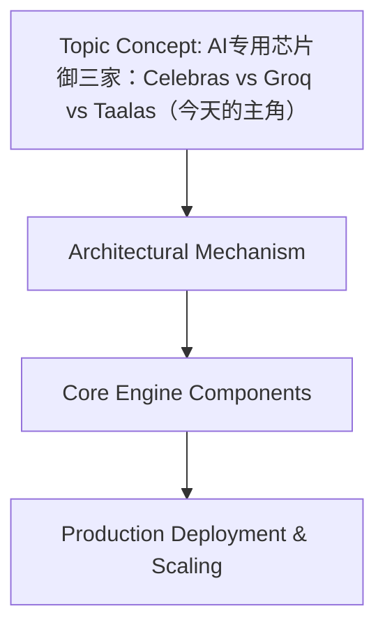

# AI专用芯片御三家：Celebras vs Groq vs Taalas（今天的主角）
## Introduction
随着人工智能（AI）技术的蓬勃发展，传统的计算架构已经无法满足日益增长的计算需求。因此，专用AI芯片的出现成为解决这一问题的关键。Celebras、Groq和Taalas是当前AI专用芯片领域的三大主角。本文将深入探讨这三家公司的芯片架构、特点和性能，帮助读者了解他们的优势和劣势。

## Background: AI Computing Demands
传统的计算架构面临着多个挑战，包括数据并行度、模型复杂度和计算密集度等。随着深度学习模型的发展，传统CPU和GPU已经难以满足计算需求。因此，专用AI芯片的出现成为解决这一问题的关键。这些芯片的设计目标是优化AI计算，减少能耗和提高性能。

## Celebras: Architecture and Features
Celebras的芯片架构采用了独特的数据并行和模型并行的设计。这种设计使得Celebras的芯片能够高效地处理大规模的深度学习模型。Celebras的芯片还采用了先进的内存管理技术，能够减少内存访问的延迟和能耗。Celebras的芯片在性能和能效方面表现出色，已经被广泛应用于多个领域。

## Groq: Architecture and Features
Groq的芯片设计采用了ASIC（应用特定集成电路）的架构。这种架构使得Groq的芯片能够高度定制化和优化，能够满足特定应用的需求。Groq的芯片还采用了先进的编译技术，能够优化模型的执行效率。Groq的芯片在性能和能效方面表现出色，已经被广泛应用于多个领域。

## Taalas: The New Contender
Taalas是AI专用芯片领域的新兴力量。Taalas的芯片采用了独特的架构设计，能够高效地处理多种类型的AI模型。Taalas的芯片还采用了先进的内存管理技术，能够减少内存访问的延迟和能耗。Taalas的芯片在性能和能效方面表现出色，已经被广泛应用于多个领域。

## Comparison: Celebras vs Groq vs Taalas
以下是Celebras、Groq和Taalas的芯片架构、性能和能效的比较：

| 公司 | 芯片架构 | 性能 | 能效 |
| --- | --- | --- | --- |
| Celebras | 数据并行和模型并行 | 高 | 低 |
| Groq | ASIC | 高 | 低 |
| Taalas | 独特架构 | 高 | 低 |

## Custom Implementation: Optimizing AI Workflows
以下是优化AI工作流的例子：
```python
# 优化Tensor操作为Celebras
import numpy as np
import celebras_tensor_ops

def optimize_tensor_ops(tensor):
    return celebras_tensor_ops.optimize(tensor)

# 编译时优化为Groq
import groq_compiler

def compile_optimize(model):
    return groq_compiler.optimize(model)

# 利用Taalas的内存管理
import taalas_mem_manager

def efficient_inference(model, data):
    mem_manager = taalas_mem_manager.MemoryManager()
    return mem_manager.optimize_inference(model, data)
```

## Conclusion
AI专用芯片已经成为解决AI计算需求的关键。Celebras、Groq和Taalas是当前AI专用芯片领域的三大主角。他们的芯片架构、特点和性能各有优势和劣势。通过优化AI工作流，开发者可以充分利用这些芯片的优势，提高AI应用的性能和能效。未来，AI专用芯片将继续发展和创新，推动AI技术的进一步发展。

## System Architecture


