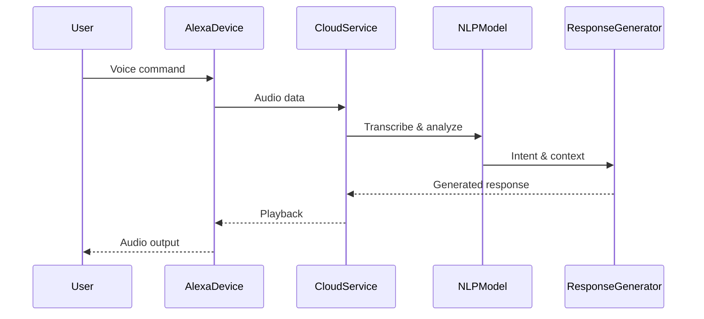

# Alexa, Are You Testifying Against Me?

## Introduction  
Imagine this: You’re home alone, asking Alexa to set a timer for your dinner. Later, during an investigation, authorities pull up that voice recording. The timer command is misheard as a criminal confession. Suddenly, Alexa isn’t just a convenience tool—it’s a potential witness in a legal drama. This scenario isn’t science fiction. It’s a growing concern as AI systems like Alexa accumulate vast amounts of personal data, blurring the line between assistant and investigator.  

## Why This Matters  
Software engineers must care because AI systems like Alexa operate at the intersection of privacy, autonomy, and liability. If an AI’s response or action inadvertently incriminates a user, who’s responsible? The engineer who trained the model? The company deploying it? The user who didn’t review permissions? Real-world pain points include:  
- **Misinterpreted commands** leading to unintended actions (e.g., locking doors, transferring funds).  
- **Data leaks** where sensitive conversations become accessible to third parties.  
- **Algorithmic bias** causing unfair or harmful recommendations.  
Engineers build these systems, so we’re complicit in their risks. Ignoring this isn’t an option.  

## How It Works  
Alexa’s interaction pipeline is deceptively simple but fraught with complexity. Here’s a breakdown:  



The flow starts with a voice command. Alexa’s microphone captures audio, which is sent to the cloud for transcription. Natural Language Processing (NLP) models parse intent, context, and entities. A response is crafted and sent back to the device for playback.  

The real danger lies in what happens *after* the response. If the NLP model misclassifies a request (e.g., “play music” vs. “send money”), the error propagates. Worse, if the cloud service logs every interaction, that data could be subpoenaed. Engineers must design for transparency: Can users audit how their data is processed? Can they revoke permissions retroactively?  

## Core Concepts  
1. **Intent Ambiguity**: Alexa’s NLP models often rely on probabilistic matching. A command like “turn off the lights” could map to smart bulbs, HVAC systems, or even a metaphorical “emotional state.”  
2. **Data Retention Policies**: Cloud providers store voice snippets for varying durations. A breach or legal request could expose private moments.  
3. **Bias in Training Data**: If Alexa’s model was trained on skewed datasets, it might fail for non-native speakers or specific dialects, leading to harmful misinterpretations.  
4. **Third-Party Integrations**: Skills (apps) tied to Alexa can act as backdoors. A compromised skill could manipulate responses or harvest data.  

## Examples & Code Walkthrough  
Let’s simulate a scenario where Alexa misinterprets a command:  

```python  
class AlexaSkill:  
    def __init__(self, nlp_model):  
        self.nlp_model = nlp_model  

    async def handle_command(self, text):  
        intent = self.nlp_model.extract_intent(text)  # Simplified  
        if intent == "transfer_money":  
            return self.execute_transfer()  
        elif intent == "play_music":  
            return self.play_song()  
        else:  
            return "I’m sorry, I didn’t understand."  

# Usage  
skill = AlexaSkill(NLPModel())  
response = await skill.handle_command("Send $500 to Alice")  
```  

If the NLP model misclassifies “Send $500 to Alice” as “play music,” the user’s funds could be transferred unintentionally. The fix? Add explicit context checks:  

```python  
if "money" in text and "transfer" in text:  
    # Proceed with caution  
```  

## Best Practices  
- **Explicit Consent**: Never assume users understand what data is stored. Add clear opt-in prompts for sensitive actions.  
- **Local Processing**: Handle non-sensitive commands on-device to reduce cloud dependency.  
- **Audit Trails**: Log all interactions with timestamps and user IDs for accountability.  
- **Fail-Safe Mechanisms**: Require multi-factor confirmation for high-risk actions (e.g., financial transfers).  

## Common Mistakes & Anti-Patterns  
1. **Over-Reliance on NLP Accuracy**: Assuming the model will never fail. Always validate outputs.  
2. **Ignoring Data Retention**: Storing audio indefinitely increases breach risks. Implement auto-deletion.  
3. **Third-Party Trust**: Vetting skills is critical. A malicious skill could mimic Alexa’s voice or redirect commands.  

## Performance Considerations  
Latency in cloud processing can delay responses, creating a false sense of real-time interaction. For example, a 500ms delay might make Alexa seem unresponsive during critical moments. Optimize by:  
- Caching frequent commands locally.  
- Using edge computing for latency-sensitive tasks.  
- Prioritizing commands based on urgency (e.g., “call 911” vs. “play jazz”).  

## Real-World Usage  
Companies like Amazon face scrutiny over Alexa’s data practices. In 2021, a user sued after Alexa recorded a private conversation and sent it to a contact without consent. Engineers at companies like Google and Apple now build “privacy modes” that delete data after use. Meanwhile, startups like Voicebox develop AI that operates entirely offline to mitigate risks.  

## Frequently Asked Questions (FAQ)  
**Q: Can Alexa be used as legal evidence against me?**  
A: Yes. If your voice data is subpoenaed, any recorded commands or responses could be admissible. Always review privacy settings.  

**Q: How do I prevent Alexa from logging my conversations?**  
A: Disable cloud storage in settings. Note: This may reduce functionality for certain features.  

**Q: What if Alexa gives harmful advice?**  
A: Escalate to a human. Build fallbacks in your code to route critical queries to human agents.  

**Q: Can biased training data affect Alexa’s responses?**  
A: Absolutely. If the model wasn’t trained on diverse dialects or accents, it may fail specific users. Advocate for inclusive datasets.  

**Q: Should I trust third-party Alexa skills?**  
A: Only enable skills from reputable sources. Review permissions carefully—they can access your microphone, contacts, or location.  

## Conclusion  
Alexa’s potential to “testify” against users isn’t a hypothetical. It’s a reminder that AI systems aren’t neutral—they reflect our design choices. As engineers, we must prioritize privacy, transparency, and resilience. Build with the assumption that every line of code could be scrutinized. The goal isn’t to eliminate risk entirely but to minimize harm. After all, the next time someone asks Alexa to “set a timer,” we should ask: *What happens if that timer is misheard?*  

The answer shapes how we build—and trust—AI tomorrow.
