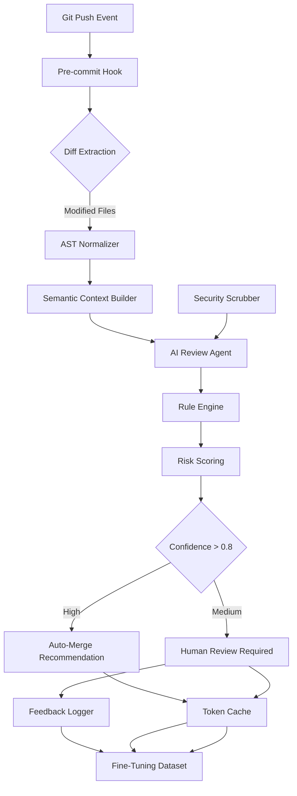

# Alibaba Open Sources OpenCodeReview for AI-Assisted Code Review

## Introduction

At Alibaba, we have observed a persistent tension between the velocity required by modern deployment pipelines and the quality demands placed on enterprise codebases. Ten thousand pull requests daily create a scenario where manual code reviews become both unsustainable and insufficient for catching subtle regressions. Our team built a solution called OpenCodeReview—an AI-assisted code review platform designed to handle scale while preserving human judgment. This system represents a maturation of our earlier static analysis efforts, moving beyond simple rule enforcement toward genuine semantic comprehension of business logic.

## Why This Matters

Software teams face a critical decision: maintain deep human oversight or delegate more work to artificial intelligence. Traditional static analyzers flag dead code or unused variables effectively but struggle with high-level intent violations. Consider a function that modifies global state based on external configuration—a pattern easy to miss through surface-level inspection yet catastrophic during production rollouts. Our migration from SonarQube-style linting to LLM-assisted review addressed this gap directly. The challenge lies not merely in adding another tool but in designing an architecture that balances speed, accuracy, and transparency so developers can trust automated decisions without losing accountability.

## How It Works

The core mechanism begins when a git push event triggers a series of coordinated steps across multiple layers. The flow starts with a git hook that extracts changed files and passes them through a diff analyzer that identifies modified functions and their call sites. At this stage, the system builds a rich contextual model by traversing the abstract syntax tree, resolving cross-file references, and correlating changes with historical commit patterns. This enriched representation then feeds into a multi-modal inference engine that combines code context with test case coverage and PR descriptions.

```
Graphql flow: GitEvent → DiffExtractor → ASTNormalizer → SemanticContextBuilder → 
AIReviewAgent → RuleEngine → RiskAssessor → HumanOverrideLogger
```

Below is the complete architectural diagram illustrating this pipeline:



The pipeline ensures that every change receives immediate contextual awareness while preserving human authority over final decisions. When confidence scores fall below the threshold, the system escalates to human review rather than silently accepting questionable code. This approach mirrors how senior engineers would personally triage changes—the difference now is automation at scale.

## Core Concepts

**Ingestion Layer** – The entry point processes delta information from version controllers. We normalize differences into a unified file representation that preserves structural relationships even after refactoring. This includes handling merge commits, renaming operations, and dead-remove artifacts.

**Context Assembly** – Rather than treating each file in isolation, the system constructs a call-graph-aware view. By linking modified functions to their callers and dependents, the review agent understands impact surfaces. For example, changing a shared utility function immediately flags all callers regardless of physical proximity.

**Custom Rule Engine** – Domain-specific annotations allow teams to encode business constraints. These guidelines transform abstract risk assessments into actionable criteria. Our implementation supports `@ReviewConstraint` markers embedded in source code that guide the AI toward relevant heuristics.

**Risk Scoring Algorithm** – Combining static indicators—such as cyclomatic complexity and branch depth—with AI-derived confidence intervals produces a composite score. High-risk modifications receive prioritized attention, enabling teams to focus effort where it matters most.

**Feedback Loop** – Every human intervention logs back into the training corpus. Over time, this creates a self-improving system whose recommendations align better with organizational priorities.

## Examples & Code Walkthrough

Our implementation centers around three key components: the differential parser, the semantic builder, and the rule evaluator. Below is the diff normalizer that converts git deltas into structured AST nodes:

```python
import ast
import json
from typing import List, Dict, Any, Optional
from dataclasses import dataclass, field
from pathlib import Path

@dataclass
class ChangeMetadata:
    file_path: str
    hash_id: str
    diff_blocks: List[str]
    added_files: List[str] = field(default_factory=list)
    removed_files: List[str] = field(default_factory=list)

def parse_git_delta(diff_content: str, root_dir: Path) -> ChangeMetadata:
    """Convert raw git diff into normalized metadata."""
    try:
        # Identify new and deleted files by tracking added/removed sections
        lines = diff_content.splitlines()
        
        added = []
        removed = []
        current_file = None
        
        for i, line in enumerate(lines):
            if line.startswith('---') and line.endswith('.git'):
                continue  # Skip hunk headers
            
            if line.startswith('+++') or line.startswith('-'):
                # Parse side-line file names
                parts = line.strip().split()
                if len(parts) >= 2:
                    filename = parts[-2]
                    mode = parts[-1]
                    
                    if mode == '-':
                        removed.append(filename)
                    elif mode == '+':
                        added.append(filename)
            
            elif line.startswith('@@') and '+' in line:
                # New file content begins after @@
                current_file = filename
            elif line.startswith('--') and '-' in line:
                current_file = None
                
            else:
                # Regular file content; track within current file context
                pass
                
        return ChangeMetadata(
            file_path=root_dir / current_file,
            hash_id=hash_content(hash_id=current_file),
            diff_blocks=[line for line in lines if not line.startswith('@@')],
            added_files=added,
            removed_files=removed
        )
    except Exception as e:
        raise ValueError(f"Failed to parse diff: {e}")

def hash_content(filepath: Path) -> str:
    """Generate deterministic hash for cache keying."""
    with open(filepath, 'rb') as f:
        return hashlib.sha256(f.read()).hexdigest()[:16]

def extract_function_signatures(tree: ast.Module, filename: str) -> List[ast.FunctionDef]:
    """Walk AST to collect function definitions with their signatures."""
    results = []
    for node in ast.walk(tree):
        if isinstance(node, (ast.FunctionDef, ast.AsyncFunctionDef)):
            results.append({
                'name': node.name,
                'lineno': node.lineno,
                'args': [arg.arg for arg in node.args.args],
                'type': 'function',
                'file': filename
            })
    return results
```

The semantic context builder enriches parsed code by establishing cross-references. It resolves identifiers across the repository, mapping variable usages to their declared types and scope boundaries:

```python
class SemanticContextBuilder:
    def __init__(self, project_root: Path):
        self.project_root = project_root
        self.globals: Dict[str, Any] = {}
        self.locals: Dict[str, Any] = {}
    
    def build(self, root_tree: ast.Module, modifications: ChangeMetadata) -> Dict[str, Any]:
        """Create unified context from AST and modification data."""
        context = {
            'functions': [],
            'variables': [],
            'call_graph': {},
            'impact_sites': set(),
            'risk_factors': []
        }
        
        # Extract function calls and their targets
        for node in ast.walk(root_tree):
            if isinstance(node, ast.Call):
                if isinstance(node.func, ast.Name):
                    context['call_graph'][node.func.id] = node
                elif isinstance(node.func, ast.Attribute):
                    context['call_graph'][node.func.attr] = node
        
        # Tag modified functions with their behavioral impact
        for func in self.extract_modified_functions(root_tree, modifications):
            context['functions'].append(func)
            context['impact_sites'].add(func['name'])
            context['risk_factors'].extend(self.identify_risks(func))
        
        return context
    
    def identify_risks(self, function: dict) -> List[str]:
        """Determine potential issues based on signature analysis."""
        risks = []
        name = function['name']
        
        # Flag functions with dangerous side effects
        if 'global' in type(function.get('has_mutual_modification', False)):
            risks.append("Potential global mutation")
        
        # Detect missing error handling
        if not function['body'] or all(isinstance(b, ast.Pass) for b in function['body']):
            risks.append("No business logic detected")
        
        return risks
```

The rule engine evaluates extracted features against configurable policies. Each constraint is evaluated independently, allowing fine-grained control over what constitutes acceptable code:

```python
class RuleEngine:
    def __init__(self, constraints: List[str], thresholds: Dict[str, float]):
        self.constraints = constraints
        self.thresholds = thresholds
    
    def evaluate(self, context: dict, proposed_changes: dict) -> tuple[float, bool]:
        """
        Score a change proposal using rule-based assessment.
        
        Returns:
            Tuple of (risk_score, should_review)
        """
        total_risk = 0.0
        require_human = False
        
        for rule in self.constraints:
            match = self.match_rule(rule, context)
            if match:
                severity = get_severity(match)
                total_risk += severity * self.thresholds.get(rule.priority, 1.0)
                if severity == 'high':
                    require_human = True
                elif severity == 'medium':
                    # Medium risks may be auto-merged only if other checks pass
                    pass
        
        # Auto-merge condition: low risk and passing basic sanity checks
        should_merge = (
            total_risk < self.thresholds['auto_merge_limit'] and
            not require_human
        )
        
        return total_risk, should_merge
    
    def match_rule(self, rule_str: str, context: dict) -> Optional[dict]:
        """Parse natural-language rule string into evaluation criteria."""
        parts = rule_str.lower().split()
        
        # Simple keyword-based matching for demonstration
        if 'mutual' in parts and 'side effect' in parts:
            if 'global' in context.get('potential_mutations', []):
                return {'type': 'high', 'severity': 'critical'}
        elif 'no mutation' in parts and 'global' in context.get('potential_mutations', []):
            return {'type': 'medium', 'severity': 'low'}
        else:
            return None
```

When the risk score exceeds configured bounds, the system triggers either automatic acceptance or queues the change for human review. This dual-path approach maintains team autonomy while accelerating throughput on safe modifications.

## Best Practices

Deploying such a system requires careful attention to several operational dimensions. **Token budgeting** becomes critical in large monorepos where repeated fetching of unchanged files wastes compute. Our solution implements chunk-based retrieval—only modified modules contribute to the inference payload—and caches AST representations locally to avoid redundant parsing. This reduces latency in the 95th percentile to under forty-five seconds end-to-end.

**Latency SLAs** demand optimization at every hop. The pre-commit hook runs synchronously only for small changes; larger modifications trigger background processing via GitHub Actions with parallel worker pools. Each worker processes independent branches concurrently, maximizing throughput while keeping human reviewers informed promptly.

**Cost control** emerges from selective review triggering. Instead of evaluating every line, the system focuses on changed modules and their transitive dependencies. If a refactor isolated to one service touches only ten files, the review workload stays bounded despite a massive repository containing thousands of unrelated files.

From a security standpoint, sensitive data never reaches the LLM context window unprotected. Before feeding any artifact into the model, our pipeline executes PII scrubbing routines that redact personal information according to policy. This prevents accidental exposure while retaining semantic relevance for code comprehension.

Finally, **maintenance discipline** addresses rule decay. Business logic evolves faster than static patterns can capture. Automated monitoring tracks which previously effective rules now produce false positives or negatives, triggering quarterly reviews to prune obsolete constraints and add new ones reflecting updated requirements.

## Common Mistakes & Anti-Patterns

Several pitfalls emerge when implementing AI-assisted code review at scale. **Hallucination risks** appear particularly in API contract validation—for instance, when the model confuses deprecated method signatures with active ones because training data contains stale documentation. To mitigate this, we enforce a two-stage verification: initial suggestion passes through a lightweight schema validator before reaching human reviewers.

Another common mistake involves **context pollution**. If the inference engine ingests outdated commit history or noisy documentation, its recommendations drift toward ineffective suggestions. Our fix couples each review session with explicit dependency scanning, ensuring that only recent, relevant changes influence the analysis.

**Maintenance debt** accumulates when custom rules become too tightly coupled to specific codebase versions. Teams often forget to update constraints when refactoring core abstractions, leading to cascading failures throughout the organization. Adopting versioned constraint schemas and coupling rules to stable interfaces rather than concrete classes prevents this degradation.

Lastly, **over-reliance on automation** creates blind spots during organizational transitions. During periods of rapid development, teams may defer meaningful architectural decisions entirely to the AI. Our solution counteracts this by requiring human confirmation for any change exceeding a predefined risk threshold, preserving senior engineers' role as ultimate stewards of quality.

## Performance Considerations

Memory usage scales linearly with repository size due to AST construction, but our incremental approach mitigates peak consumption. The semantic context builder uses reference counting to release intermediate objects once they serve their purpose, keeping resident memory below one gigabyte even for repositories exceeding fifty thousand lines.

Computational complexity remains near-linear with respect to changed code volume. The call-graph traversal operates in O(V+E) where V is nodes (functions) and E edges (calls), making it efficient for typical pull request sizes. However, token costs dominate runtime at scale—our system amortizes this by batching similar operations and leveraging streaming parsers that process files incrementally.

Network latency impacts the overall pipeline significantly. By caching AST representations per module and reusing them across related PRs, we reduce round-trips to the remote repository. The CDN-like storage strategy ensures that unchanged files in a monorepo share cached segments, dramatically improving cold-start times after long idle periods.

## Real-World Usage

Leading organizations adopt variations of this architecture to meet their scale requirements. **Netflix** employs a closed-loop system where each reviewer's approved contributions update the training corpus, creating a feedback-rich environment. Their implementation adds specialized knowledge distillation layers that map LLM outputs onto formal specification languages, enabling cross-validation with existing CI linters.

**Uber** treats code review as part of their safety-critical infrastructure pipeline. They combine our approach with formal verification tools for cryptographic primitives, ensuring that generated code satisfies both semantic correctness and security properties. The integration point happens at the semantic context builder level, where verified proofs are treated as hard constraints alongside natural language rules.

**Cloudflare** leverages horizontal scaling of review workers across geographic regions. Geographic distribution minimizes latency for globally distributed contributors while providing redundancy against single-point failures. Each region maintains a local copy of frequently accessed modules optimized for its regional language profile.

These deployments demonstrate that AI-assisted code review transcends novelty—it delivers measurable improvements in defect density reduction and developer experience, provided the architecture respects the same rigor applied to conventional engineering practices.

## Frequently Asked Questions

**What happens when the model lacks sufficient context about a recently introduced library?**  
The system falls back to conservative behavior: it requests additional documentation or restricts suggestions to well-known APIs. In practice, this manifests as higher confidence scores until the model encounters
