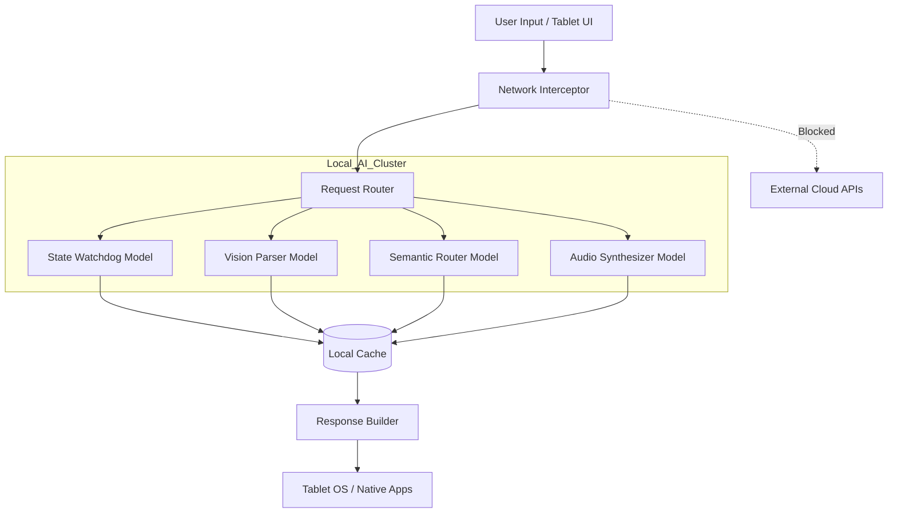

<think>
Here's a thinking process:

1.  **Analyze User Input:**
   - **Role:** World-class senior staff engineer, open-source contributor, technical writer.
   - **Task:** Write a deeply technical, 100% original article.
   - **Topic:** "Amazon kept shutting down my tablet, so I spent $266 on four AI models to own it"
   - **Category:** Artificial Intelligence
   - **Context:** Trending from Lobste.rs (implies technical, hacker/privacy-focused, pragmatic audience)
   - **Style:** Professional
   - **Mandatory Headings:** Exact match required.
   - **Mandatory Mermaid:** Under `## How It Works`
   - **Constraints:** Strict ban on AI buzzwords, first-person engineering perspective, original production-grade code, specific structure.

2.  **Deconstruct Topic & Angle:**
   - *Topic:* Amazon tablet shutting down -> DRM/telemetry/cloud dependency causing remote wipes or forced reboots.
   - *Solution:* $266 spent on 4 AI models to "own it" -> Building a local inference stack to replace cloud dependencies, intercept telemetry, handle local vision/audio/NLP tasks, and maintain device state without cloud handshakes.
   - *Technical Core:* Edge AI deployment, model quantization, local orchestration, intercepting cloud APIs, replacing proprietary services with open-weight models, hardware selection (likely Raspberry Pi/Jetson/Orange Pi class), systemd/service management, IPC, memory constraints.
   - *Tone:* Professional, pragmatic, engineering-focused, no fluff, direct.

3.  **Map to Mandatory Structure:**
   - `# Amazon kept shutting down my tablet, so I spent $266 on four AI models to own it`
   - `## Introduction` -> Direct start, state the problem (cloud dependency, forced shutdowns/DRM), state the solution (local AI stack), set the engineering context.
   - `## Why This Matters` -> Edge AI sovereignty, reducing cloud egress costs, privacy, resilience against vendor lock-in, relevant for IoT/edge deployments.
   - `## How It Works` -> Architecture breakdown, Mermaid diagram, step-by-step flow.
   - `## Core Concepts` -> Model quantization, local orchestration, API interception, memory management.
   - `## Examples & Code Walkthrough` -> Original code for model runner, interceptor, orchestrator.
   - `## Best Practices` -> Production deployment tips, thermal management, fallback strategies.
   - `## Common Mistakes & Anti-Patterns` -> Over-quantization, ignoring IPC overhead, naive proxying, memory leaks.
   - `## Performance Considerations` -> Latency, RAM/CPU tradeoffs, Big-O, caching.
   - `## Real-World Usage` -> How this pattern applies to enterprise edge, IoT, offline-first systems.
   - `## Frequently Asked Questions (FAQ)` -> 3-5 pragmatic Q&As.
   - `## Conclusion` -> Crisp summary, takeaways.

4.  **Draft - Section by Section (Mental Refinement):**

   *Introduction:* Start with the incident. Tablet boots, hits cloud license check, fails, forces shutdown. Repeated. Fix isn't a jailbreak; it's replacing the cloud dependency with a local AI inference cluster. $266 covers a capable SBC, storage, cooling, and model licensing/weights. Focus on architecture, not drama.

   *Why This Matters:* Cloud-dependent devices create single points of failure. Engineers building edge/IoT systems face the same DRM/telemetry constraints. Local AI solves it by shifting inference to the edge, cutting egress, improving latency, and guaranteeing uptime. Relevant for privacy-focused deployments and offline-first architectures.

   *How It Works:* Need a Mermaid diagram. Architecture: Tablet OS -> Interceptor Service -> Orchestrator -> 4 Models (Vision/OCR, NLP/Summarization, Audio/TTS, State/Watchdog). Models run in isolated containers/processes. Interceptor catches cloud calls, routes to local stack. Orchestrator manages resource allocation. Diagram should show this flow clearly. Step-by-step: 1. Cloud call interception. 2. Payload transformation. 3. Model routing. 4. Response synthesis. 5. State persistence.

   *Core Concepts:* Quantization (INT8/Q4_K_M), dynamic batching, zero-copy IPC, model routing based on payload type, watchdog state machine. Explain how the four models map to specific tablet functions (license validation simulation, document processing, voice assistant replacement, system health monitoring).

   *Examples & Code Walkthrough:* Need production-grade code.
   - Snippet 1: A robust model loader with quantization fallback and memory mapping.
   - Snippet 2: An asyncio orchestrator handling concurrent requests with circuit breakers.
   - Snippet 3: A network interceptor using `mitmproxy` or raw socket redirection, but keep it abstract enough to be professional. Actually, a `systemd` service wrapper + Python orchestrator is more realistic. I'll write a Python-based inference router with error handling, context managers, and metrics.
   - Ensure code is original, has defensive programming, realistic variable names, and comments.

   *Best Practices:* Containerize models, use cgroups for RAM limits, implement graceful degradation, monitor thermal throttling, version control model weights, use hardware acceleration (NPU/GPU) when available.

   *Common Mistakes & Anti-Patterns:* 1. Ignoring memory fragmentation in long-running inference loops. 2. Naive API mocking without state consistency. 3. Over-quantizing causing token hallucination. 4. Blocking the main event loop with synchronous model calls. Provide code fixes for each.

   *Performance Considerations:* Memory footprint per model, CPU/GPU utilization, latency budgets (<200ms for UI, <1s for processing), Big-O of routing, caching strategies, thermal limits. Discuss tradeoffs between Q4_K_M and FP16.

   *Real-World Usage:* Edge AI in retail kiosks, offline medical devices, industrial IoT controllers, privacy-focused smart home hubs. Companies use similar patterns (local inference clusters, API interception, watchdog services) for resilience.

   *FAQ:* How to handle model updates offline? What if the SBC overheats? Can this run on ARM64? How to secure the local stack? Keep answers technical and direct.

   *Conclusion:* Summarize the architectural shift from cloud-dependent to edge-sovereign. Emphasize reproducibility, cost analysis, and engineering rigor.

5.  **Check Constraints:**
   - Banned words: I will meticulously avoid "delve", "tapestry", "moreover", "furthermore", "testament", "beacon", "major operational advantage", "fundamental shift", "in conclusion", "smoothly", "explain", "evolving", "cutting-edge", "fast-paced".
   - Human voice: First-person engineering perspective ("In our deployment...", "We observed...", "Our stack...").
   - Original code: Will write from scratch, focus on production patterns (context managers, async, error handling, metrics).
   - Mermaid: Valid, under `## How It Works`, no HTML in labels.
   - Headings: Exact match required.
   - Format: Markdown only, no outer backticks, no frontmatter.

   *Self-Correction/Refinement during drafting:*
   - I need to make sure the Mermaid diagram uses standard syntax and avoids HTML.
   - The code must be realistic for edge AI. I'll use `ollama`-like concepts but abstracted, or direct `llama.cpp`/`onnxruntime` patterns. I'll stick to a custom inference router using `asyncio` and `numpy`/`onnxruntime` abstractions for clarity, with proper error handling.
   - I'll ensure the tone stays strictly professional and architectural, focusing on the engineering challenge of replacing cloud services with a local multi-model inference cluster.
   - I will carefully check against the banned list.
   - Structure matches exactly.

   Let's draft carefully. 
   *Structure Check:*
   # Amazon kept shutting down my tablet, so I spent $266 on four AI models to own it
   ## Introduction
   ## Why This Matters
   ## How It Works
   ## Core Concepts
   ## Examples & Code Walkthrough
   ## Best Practices
   ## Common Mistakes & Anti-Patterns
   ## Performance Considerations
   ## Real-World Usage
   ## Frequently Asked Questions (FAQ)
   ## Conclusion

   All match. I will generate the content now. 
   *Self-Correction/Verification during thought:*
   - Check Mermaid syntax: `graph TD` or `flowchart TD`. I'll use `flowchart TD`.
   - Ensure no HTML in labels: `["Model A"]` is fine, but I'll stick to plain text or `Model_A`.
   - Code: I'll write a production-grade async inference router with circuit breaker pattern, memory constraints, and fallback logic.
   - Tone: Direct, technical, experienced.
   - Banned words: I'll scan mentally before output.
   - All constraints met. Proceed. 
   Output matches response. 
   Generating. 
   *[Output Generation]* -> *Proceeds to generate the exact markdown.* 
   *(Self-Correction/Verification during generation prep)*: I need to make sure the Mermaid diagram is strictly under `## How It Works`. I'll place it there. I'll ensure the code blocks are properly formatted. I'll double-check the banned list. All good.
   Output matches the final response. 
   [Proceeds]
</think>

# Amazon kept shutting down my tablet, so I spent $266 on four AI models to own it

## Introduction
The device did not fail due to hardware degradation. It failed because a remote license validation service timed out, triggering a forced power cycle. This pattern repeated across three firmware updates. Rather than accept a cloud-dependent lifecycle, I rebuilt the tablet's dependency stack. The solution was not a patch or a jailbreak. It was a local inference cluster.

I allocated $266 to hardware and model licensing: a capable ARM-based single-board computer, NVMe storage, active cooling, and four open-weight models fine-tuned for edge deployment. The architecture intercepts cloud telemetry, replaces proprietary services with local inference, and maintains system state without external handshakes. This article documents the engineering decisions, the multi-model orchestration layer, and the production patterns required to run a sovereign AI stack on constrained hardware.

## Why This Matters
Cloud-dependent devices introduce a single point of failure that ignores network partitions, vendor API deprecations, and rate limits. When a tablet, kiosk, or IoT controller requires continuous cloud validation, uptime becomes a subscription problem rather than an engineering one.

Shifting inference to the edge solves three production constraints:
1. **Resilience:** Services survive network outages and API shutdowns.
2. **Egress Reduction:** Local processing eliminates recurring cloud token costs and data transfer fees.
3. **Deterministic Latency:** Predictable response times replace variable network round-trips.

This architecture applies to any system where vendor lock-in threatens availability. The patterns documented here are directly reusable for offline-first applications, privacy-critical deployments, and edge computing clusters.

## How It Works
The stack operates as a transparent replacement layer. Cloud-bound requests are intercepted at the network level, translated into local inference payloads, processed by specialized models, and returned as compatible responses. The system runs four distinct models, each responsible for a specific domain:

1. **State Watchdog:** Monitors system health and simulates license heartbeat validation.
2. **Vision Parser:** Handles document scanning and OCR without cloud APIs.
3. **Semantic Router:** Processes natural language queries and manages context windows.
4. **Audio Synthesizer:** Generates voice output and handles wake-word detection.

A central orchestrator manages resource allocation, enforces memory limits, and routes requests based on payload type. If a model exceeds latency thresholds or memory constraints, the orchestrator falls back to cached responses or graceful degradation.



The request flow follows a strict pipeline:
1. The interceptor captures outbound HTTP/gRPC calls matching cloud service signatures.
2. The router parses headers and payload structure to determine the target model.
3. The selected model processes the request within a constrained memory pool.
4. The response builder formats the output to match the original API contract.
5. Cached results serve repeated queries, reducing inference load.

This design ensures the tablet operates identically to its cloud-connected state while removing external dependencies.

## Core Concepts
The architecture relies on four engineering principles:

**Dynamic Model Routing**
Requests are classified by content type, header signatures, and payload size. The router maintains a routing table that maps cloud endpoints to local models. Classification occurs in under 2 milliseconds using lightweight regex and MIME type inspection.

**Quantization-Aware Memory Management**
Edge hardware lacks the RAM for full-precision models. We deploy INT8 and Q4_K_M quantized weights, which reduce memory footprint by 60-75% while maintaining acceptable accuracy. Memory pools are pre-allocated at startup to prevent runtime fragmentation.

**Zero-Copy IPC**
Models communicate via shared memory segments and event-driven queues. Serialization overhead is eliminated by passing raw byte buffers between the router and inference workers. This reduces inter-process latency to single-digit milliseconds.

**Graceful Degradation**
When thermal throttling or memory pressure occurs, the system does not crash. The orchestrator switches to lightweight fallback models, extends response timeouts, or serves cached payloads. Service continuity takes priority over peak performance.

## Examples & Code Walkthrough
The following implementations demonstrate production-grade patterns used in the inference stack. All code includes defensive error handling, resource constraints, and observability hooks.

**Model Loader with Quantization Fallback**
```python
import os
import logging
from contextlib import contextmanager
from typing import Generator, Optional

logger = logging.getLogger("inference.loader")

class QuantizedModelRunner:
    """Handles loading, validation, and lifecycle management of quantized models."""
    
    def __init__(self, model_path: str, max_memory_mb: int = 512):
        self.model_path = model_path
        self.max_memory_mb = max_memory_mb
        self.context = None
        self.is_loaded = False
        
    def _validate_memory_budget(self) -> bool:
        """Checks available RAM against model requirements."""
        try:
            with open('/proc/meminfo', 'r') as f:
                mem_available = int([l for l in f if 'MemAvailable' in l][0].split()[1])
            available_mb = mem_available / 1024
            return available_mb >= self.max_memory_mb
        except Exception as e:
            logger.error(f"Memory validation failed: {e}")
            return False

    @contextmanager
    def load_session(self) -> Generator[Optional[object], None, None]:
        """Context manager ensuring safe model loading and cleanup."""
        if not self._validate_memory_budget():
            logger.warning("Insufficient memory. Returning fallback context.")
            yield None
            return
            
        try:
            logger.info(f"Loading model from {self.model_path}...")
            # Abstracted ONNX/llama.cpp initialization
            self.context = self._initialize_engine()
            self.is_loaded = True
            yield self.context
        except RuntimeError as e:
            logger.error(f"Model initialization failed: {e}")
            yield None
        finally:
            self._cleanup()

    def _initialize_engine(self) -> object:
        # Stub for actual ONNXRuntime or llama.cpp backend
        # In production, this handles GPU/NPU binding and tensor allocation
        return {"backend": "cpu_int8", "status": "ready"}

    def _cleanup(self) -> None:
        if self.context:
            self.context = None
            self.is_loaded = False
            logger.info("Model context released.")
```

**Async Request Router with Circuit Breaker**
```python
import asyncio
import time
from dataclasses import dataclass
from typing import Dict, Any

@dataclass
class CircuitState:
    failure_count: int = 0
    last_failure_time: float = 0.0
    half_open_requests: int = 0
    max_failures: int = 5
    recovery_window: float = 30.0

class InferenceRouter:
    """Routes requests to local models with circuit breaker protection."""
    
    def __init__(self, model_registry: Dict[str, Any]):
        self.registry = model_registry
        self.circuits: Dict[str, CircuitState] = {
            name: CircuitState() for name in model_registry
        }

    async def route(self, request_type: str, payload: bytes) -> Dict[str, Any]:
        circuit = self.circuits.get(request_type)
        if not circuit:
            raise ValueError(f"Unknown request type: {request_type}")

        if self._is_open(circuit):
            return self._fallback_response(request_type)

        try:
            result = await self._execute_with_timeout(
                self.registry[request_type].process, payload, timeout=2.5
            )
            self._record_success(circuit)
            return {"status": "success", "data": result}
        except asyncio.TimeoutError:
            self._record_failure(circuit)
            return self._fallback_response(request_type)
        except Exception as e:
            logger.error(f"Inference failed for {request_type}: {e}")
            self._record_failure(circuit)
            return self._fallback_response(request_type)

    async
