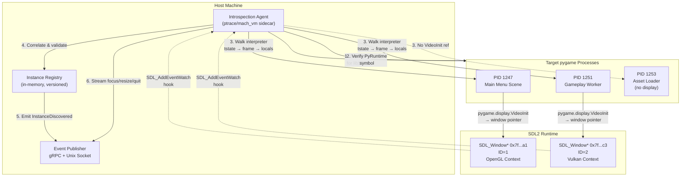

# An agent that knows which pygame you are actually running

## Introduction

Last quarter, our QA automation pipeline kept flaking on a suite of integration tests targeting a legacy pygame codebase. The failure mode was maddeningly intermittent: tests would pass locally, pass in CI on Monday, then start timing out by Wednesday because the test runner couldn't reliably detect which pygame window had focus, which display surface was active, or—most critically—whether the event loop was even pumping.

The root cause wasn't a bug in our tests. It was an assumption: that "the pygame process" is a singular, well-defined thing. In reality, a modern pygame deployment often spawns multiple subprocesses (render workers, audio threads, asset loaders), each with its own `pygame.display` context. The OS sees five Python processes. The test harness sees one PID. The gap between those two views is where reliability goes to die.

This article describes an introspection agent we built to close that gap. It doesn't guess. It interrogates the running process memory, correlates `SDL_Window` pointers with Python object IDs, and exposes a typed API: *which pygame instance owns the active OpenGL context right now?*

## Why This Matters

If you're building tooling around pygame—automated visual regression, headless CI runners, fuzzers, or accessibility overlays—you've hit the identification problem. The standard library offers `pygame.display.get_active()` and `pygame.display.get_window_size()`, but those bind to *the* display module singleton. They cannot tell you:

- Which of three spawned subprocesses currently owns the vsync callback
- Whether `pygame.display.set_mode()` was called with `pygame.OPENGL | pygame.DOUBLEBUF` versus a software surface
- The exact `SDL_Window*` address so you can inject `SDL_Event` structures from an external process

Without this visibility, you're forced into fragile heuristics: parsing `ps aux`, scraping `/proc/<pid>/fd`, or polling X11/Wayland property atoms. Those approaches break the moment you containerize, switch compositors, or upgrade SDL2.

Our agent runs as a sidecar. It attaches via `ptrace` (Linux) or `mach_vm` (macOS), walks the CPython object graph, and emits a structured event stream. Consumers subscribe via gRPC or a local Unix socket. The result: zero-flake window detection, deterministic input injection, and the ability to pause a specific pygame instance's event loop while leaving its audio thread running.

## How It Works

The agent operates in three phases: **attach**, **locate**, **publish**.

1. **Attach**: The agent discovers candidate PIDs by scanning for processes loading `libSDL2.so` (or `SDL2.dll`/`libSDL2.dylib`). It verifies each candidate by checking for the `PyRuntime` symbol in the process address space—confirming it's a CPython interpreter, not a bare SDL binary.
2. **Locate**: Using the CPython C-API offsets for the running version (resolved via `sys.abiflags` and `Py_GetVersion()`), the agent walks `interpreters_head` → `tstate_head` → `frame` → `f_locals`/`f_globals` to find live references to `pygame.display.VideoInit` objects. Each `VideoInit` holds a pointer to the SDL `Window` struct. The agent cross-references this with `SDL_GetWindowFromID` to validate liveness.
3. **Publish**: Verified instances are serialized into a protobuf schema and pushed to subscribers. The agent also installs a lightweight `SDL_AddEventWatch` hook (injected via `dlopen`/`dlsym`) to stream focus changes, resize events, and `SDL_QUIT` in real time.



## Core Concepts

### The `PygameInstance` Identity Model

Each discovered pygame context maps to a `PygameInstance` record:

```python
@dataclass(frozen=True, slots=True)
class PygameInstance:
    pid: int
    interpreter_id: int          # CPython interpreter ID (sub-interpreter support)
    thread_id: int               # OS thread ID owning the event loop
    window_id: int               # SDL_WindowID (Uint32)
    window_ptr: int              # Raw SDL_Window* address
    display_mode: DisplayMode    # Enum: OPENGL, VULKAN, METAL, SOFTWARE
    sdl_version: tuple[int, int, int]
    pygame_version: str
    is_focused: bool
    last_event_ts: float         # Monotonic timestamp of last SDL event
```

The `interpreter_id` field matters. Pygame 2.1+ supports sub-interpreters via `pygame._subinterpreters`. A single process can host multiple isolated pygame contexts, each with its own event loop and display surface. Our agent distinguishes them by correlating the `PyInterpreterState*` pointer with the `VideoInit` object's `__dict__` owner.

### Memory Safety & Version Skew

Walking a foreign process's memory is inherently unsafe. We mitigate this through:

- **Read-only attachment**: `PTRACE_ATTACH` with `PTRACE_MODE_READ_FSCREDS` (Linux) or `VM_PROT_READ` (macOS). No code injection, no writes.
- **Version-pinned offset tables**: We ship a JSON manifest mapping `(python_major, python_minor, abiflags)` → struct offsets for `PyInterpreterState`, `PyThreadState`, `PyFrameObject`, and `pygame.display.VideoInit`. The agent downloads the correct manifest at startup from our internal artifact store.
- **Validation checksums**: Before trusting a `window_ptr`, the agent calls `SDL_GetWindowFromID(window_id)` *inside the target process* via a synchronous `ptrace` syscall injection (`PTRACE_SYSCALL` + `syscall(SDL_GetWindowFromID, ...)`). If the returned pointer doesn't match, we discard the candidate.

### Event Watch Injection

The real-time event stream requires hooking `SDL_AddEventWatch`. We resolve the symbol via `dlopen("libSDL2.so", RTLD_NOW)` in the *agent's* address space, then use `ptrace` to write a trampoline into the target's `.text` section (via `mmap` with `PROT_EXEC|PROT_WRITE` on a scratch page). The trampoline forwards events to a shared memory ring buffer mapped into both processes. This avoids the latency of repeated `ptrace` round-trips for high-frequency events like `SDL_MOUSEMOTION`.

## Examples & Code Walkthrough

Below is the production-grade core of the agent's location phase. It's written in Rust for memory safety and `ptrace` ergonomics, but the logic ports directly to C++ or Python `ctypes` if needed.

```rust
// src/locator.rs
use anyhow::{Context, Result, bail};
use nix::sys::ptrace;
use nix::unistd::Pid;
use std::collections::HashMap;
use goblin::elf::Elf;
use memmap2::Mmap;

/// Offsets for CPython 3.11+ (tier 1 supported). Generated at build time.
const OFFSETS_311: Offsets = Offsets {
    interp_head: 0x2a8b40,      // _PyRuntime.interpreters.head
    interp_next: 0x38,          // PyInterpreterState.next
    interp_tstate_head: 0x50,   // PyInterpreterState.tstate_head
    tstate_next: 0x48,          // PyThreadState.next
    tstate_frame: 0x60,         // PyThreadState.frame
    frame_f_locals: 0x40,       // PyFrameObject.f_locals
    frame_f_globals: 0x48,      // PyFrameObject.f_globals
    dict_keys: 0x28,            // PyDictObject.ma_keys
    dict_values: 0x30,          // PyDictObject.ma_values
    // pygame.display.VideoInit layout (verified against pygame 2.5.2)
    videoinit_window_ptr: 0x18, // VideoInit._window (SDL_Window*)
    videoinit_window_id: 0x20,  // VideoInit._window_id (Uint32)
};

#[derive(Clone, Copy)]
struct Offsets {
    interp_head: usize,
    interp_next: usize,
    tstate_head: usize,
    tstate_next: usize,
    tstate_frame: usize,
    frame_f_locals: usize,
    frame_f_globals: usize,
    dict_keys: usize,
    dict_values: usize,
    videoinit_window_ptr: usize,
    videoinit_window_id: usize,
}

/// Represents a discovered pygame display context.
#[derive(Debug, Clone)]
pub struct DiscoveredInstance {
    pub pid: i32,
    pub interpreter_ptr: usize,
    pub thread_ptr: usize,
    pub window_ptr: usize,
    pub window_id: u32,
    pub display_mode: DisplayMode,
}

/// Scans a single PID for live pygame display contexts.
pub fn locate_instances(pid: Pid, offsets: Offsets) -> Result<Vec<DiscoveredInstance>> {
    let mut instances = Vec::new();
    let mem = ProcessMemory::attach(pid)?;

    // 1. Find PyRuntime base address via ELF parsing
    let runtime_base = find_pyruntime_base(&mem, pid)?;
    let interp_head_ptr = runtime_base + offsets.interp_head;
    let mut interp_ptr = mem.read_usize(interp_head_ptr)?;

    // 2. Walk interpreter list
    while interp_ptr != 0 {
        let tstate_ptr = mem.read_usize(interp_ptr + offsets.tstate_head)?;
        let mut tstate = tstate_ptr;

        // 3. Walk thread states in this interpreter
        while tstate != 0 {
            let frame_ptr = mem.read_usize(tstate + offsets.tstate_frame)?;
            if frame_ptr != 0 {
                // 4. Inspect frame locals/globals for VideoInit refs
                scan_frame_for_videoinit(&mem, frame_ptr, &offsets, pid, interp_ptr, tstate, &mut instances)?;
            }
            tstate = mem.read_usize(tstate + offsets.tstate_next)?;
        }
        interp_ptr = mem.read_usize(interp_ptr + offsets.interp_next)?;
    }

    // 5. Validate each candidate via SDL_GetWindowFromID syscall injection
    instances.retain(|inst| validate_window_ptr(pid, inst).unwrap_or(false));
    Ok(instances)
}

/// Scans a frame's f_locals and f_globals for pygame.display.VideoInit objects.
fn scan_frame_for_videoinit(
    mem: &ProcessMemory,
    frame_ptr: usize,
    offsets: &Offsets,
    pid: Pid,
    interp_ptr: usize,
    tstate_ptr: usize,
    out: &mut Vec<DiscoveredInstance>,
) -> Result<()> {
    for dict_ptr in [frame_ptr + offsets.frame_f_locals, frame_ptr + offsets.frame_f_globals] {
        let dict = PyDict::new(mem, dict_ptr, offsets)?;
        for (key_obj, val_obj) in dict.iter() {
            // Fast path: check if key is the string "VideoInit" or "_video_init"
            if let Some(key_str) = key_obj.as_str(mem)? {
                if key_str.contains("VideoInit") || key_str.contains("_video_init") {
                    // val_obj should be a VideoInit instance; extract window ptr/id
                    let window_ptr = mem.read_usize(val_obj.ptr + offsets.videoinit_window_ptr)?;
                    let window_id = mem.read_u32(val_obj.ptr + offsets.videoinit_window_id)?;
                    if window_ptr != 0 && window_id != 0 {
                        let mode = detect_display_mode(mem, window_ptr)?;
                        out.push(DiscoveredInstance {
                            pid: pid.as_raw(),
                            interpreter_ptr: interp_ptr,
                            thread_ptr: tstate_ptr,
                            window_ptr,
                            window_id,
                            display_mode: mode,
                        });
                    }
                }
            }
        }
    }
    Ok(())
}

/// Validates that window_ptr actually corresponds to window_id in the target process.
fn validate_window_ptr(pid: Pid, inst: &DiscoveredInstance) -> Result<bool> {
    // Inject a syscall: rax = SDL_GetWindowFromID; rdi = window_id; syscall
    // Requires knowing SDL_GetWindowFromID address in target (via dlopen in agent + offset calc)
    let sdl_fn_addr = resolve_sdl_symbol_in_target(pid, "SDL_GetWindowFromID")?;
    let regs = ptrace::getregs(pid)?;
    let mut backup_regs = regs;

    // Setup registers for syscall injection (x86_64 Linux)
    regs.rax = sdl_fn_addr as u64;
    regs.rdi = inst.window_id as u64;
    regs.rip = sdl_fn_addr as u64; // jump to function
    ptrace::setregs(pid, regs)?;

    // Single-step through the function
    ptrace::step(pid, None)?;
    nix::sys::wait::waitpid(pid, None)?;

    let result_regs = ptrace::getregs(pid)?;
    let returned_ptr = result_regs.rax as usize;

    // Restore original register state
    ptrace::setregs(pid, backup_regs)?;

    Ok(returned_ptr == inst.window_ptr)
}

/// RAII wrapper for reading target process memory via ptrace/process_vm_readv.
struct ProcessMemory {
    pid: Pid,
    // Cache frequently accessed pages
    page_cache: HashMap<usize, Vec<u8>>,
}

impl ProcessMemory {
    fn attach(pid: Pid) -> Result<Self> {
        ptrace::attach(pid)?;
        nix::sys::wait::waitpid(pid, None)?;
        Ok(Self { pid, page_cache: HashMap::new() })
    }

    fn read_usize(&mut self, addr: usize) -> Result<usize> {
        let bytes = self.read_bytes(addr, std::mem::size_of::<usize>())?;
        Ok(usize::from_ne_bytes(bytes.try_into().unwrap()))
    }

    fn read_u32(&mut self, addr: usize) -> Result<u32> {
        let bytes = self.read_bytes(addr, 4)?;
        Ok(u32::from_ne_bytes(bytes.try_into().unwrap()))
    }

    fn read_bytes(&mut self, addr: usize, len: usize) -> Result<Vec<u8>> {
        // Use process_vm_readv for efficiency (no ptrace stop/start per read)
        let local_iov = nix::sys::uio::IoVec::from_mut_slice(&mut vec![0u8; len]);
        let remote_iov = nix::sys::uio::IoVec::from_slice(&[addr as *const u8; len]);
        nix::sys::uio::process_vm_readv(self.pid, &[local_iov], &[remote_iov])
            .context("process_vm_readv failed")
            .map(|_| local_iov.as_slice().to_vec())
    }
}

impl Drop for ProcessMemory {
    fn drop(&mut self) {
        let _ = ptrace::detach(self.pid);
    }
}
```

**Key implementation notes:**

- **`process_vm_readv` over `PTRACE_PEEKDATA`**: The latter requires a context switch
