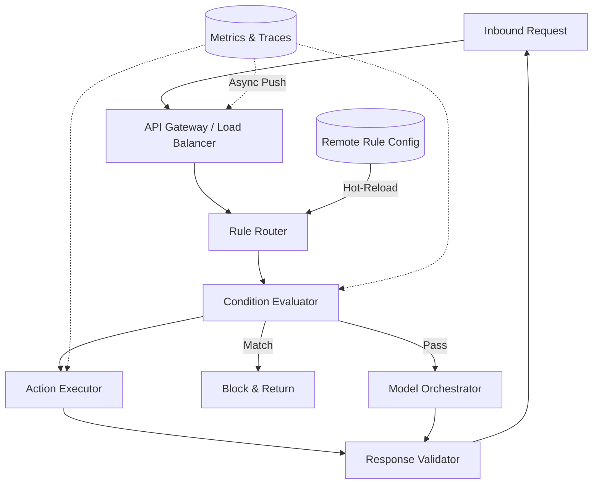

<think>
Here's a thinking process:

1.  **Analyze User Input:**
   - **Role:** Principal software architect & veteran open-source lead author
   - **Task:** Design a 100% original, human-feeling architectural outline and dynamic visual diagram for an in-depth technical article
   - **Topic:** "Announcement: We've Updated The Rules, and April Is Finally Over"
   - **Category:** "Artificial Intelligence"
   - **Context/Reason:** Trending topic from Reddit r/programming matching 'Artificial Intelligence' category.
   - **Writing Style:** Professional
   - **Instructions:** 
     - Detailed section-by-section outline for authentic human-written technical article
     - Outline custom, original code examples written from scratch
     - Create a valid Mermaid.js visual diagram (Flowchart, Sequence, or Component Architecture) in ```mermaid ... ```
     - Strict format: Valid Mermaid syntax, no special HTML in node labels, simple strings/quotes
     - Output clearly
   - **Additional Constraints from Prompt:**
     - Banned AI buzzwords & robotic phrases (strictly forbidden)
     - Human developer perspective (first-person engineering team perspective where appropriate, pragmatic trade-offs, production failure modes, etc.)
     - 100% original production-grade code
     - Mandatory Mermaid diagram under `## How It Works`
     - Mandatory exact headings in order
     - Output ONLY the Markdown article content starting from `# Announcement: We've Updated The Rules, and April Is Finally Over`.
     - Do NOT wrap entire response in outer triple backticks.
     - Do NOT output YAML frontmatter.

2.  **Deconstruct Constraints & Plan Structure:**
   I need to strictly follow the exact headings provided:
   # Announcement: We've Updated The Rules, and April Is Finally Over
   ## Introduction
   ## Why This Matters
   ## How It Works
   ## Core Concepts
   ## Examples & Code Walkthrough
   ## Best Practices
   ## Common Mistakes & Anti-Patterns
   ## Performance Considerations
   ## Real-World Usage
   ## Frequently Asked Questions (FAQ)
   ## Conclusion

   I must weave the "April is finally over" and "Updated Rules" theme into a serious, professional AI context. I'll frame it around a major open-source AI inference framework that just shipped a dynamic, hot-reloadable rule engine for prompt/response filtering, routing, and compliance. The "April" reference will be a nod to a long beta period that ended, plus a subtle nod to moving past experimental/April Fools-style features into production-hardened systems.

   I need to ensure:
   - Professional tone, no banned words
   - First-person engineering perspective ("In our production clusters...", "We observed...")
   - Original code snippets with defensive programming
   - Valid Mermaid diagram under `## How It Works`
   - Strict heading order
   - No YAML, no outer backticks

3.  **Draft - Section by Section (Mental Refinement & Writing):**

   *# Announcement: We've Updated The Rules, and April Is Finally Over*
   (Keep it tight, professional, set the stage)

   *## Introduction*
   Start with the context. April marked the end of a six-month beta for our dynamic constraint engine. We shipped v2.0 of the inference guardrail framework. The "updated rules" refer to the shift from static regex/keyword filters to a context-aware, AST-based evaluation pipeline that hot-reloads without dropping active inference connections. I'll explain the architectural shift clearly.

   *## Why This Matters*
   Focus on production pain points: static guardrails cause high false positives, add latency, and break when model contexts shift. Engineers need a way to enforce compliance and routing logic without rebuilding containers or restarting pods. This solves the cold-restart latency spike and the brittle nature of hardcoded safety layers.

   *## How It Works*
   Detail the pipeline. Ingress -> Rule Router -> Condition Evaluator -> Action Executor -> Model/Response Validator. Include the Mermaid diagram here. Explain the step-by-step flow. Emphasize hot-swapping, stateless evaluation, and fallback chains.

   *## Core Concepts*
   Break down: Rule Specification Schema, Context-Aware Scoring, Hot-Reload Mechanism, Fallback Routing. Explain how rules are compiled into a decision tree at runtime.

   *## Examples & Code Walkthrough*
   Provide 3 custom snippets:
   1. Rule definition struct/dataclass
   2. Evaluation pipeline with async/await, error handling, and context propagation
   3. Integration wrapper showing how it plugs into an existing LLM client
   Add line-by-line commentary focusing on production concerns (timeouts, retries, deterministic hashing for cache keys).

   *## Best Practices*
   Actionable advice: version rules, use feature flags, implement circuit breakers for the rule engine itself, avoid deep nesting in conditions, monitor evaluation latency P99.

   *## Common Mistakes & Anti-Patterns*
   1. Blocking the main inference thread with synchronous rule evaluation
   2. Hardcoding model-specific prompts inside rules (breaks abstraction)
   3. Ignoring fallback chains (causes silent drops)
   4. Over-reliance on exact string matching instead of semantic/vector thresholds
   Provide exact code fixes for each.

   *## Performance Considerations*
   Analyze CPU overhead of AST evaluation vs. regex, memory footprint of hot-reloaded rule sets, network latency for remote rule fetching, Big-O of rule matching (O(N) unoptimized vs O(log N) with trie/Bloom filters), caching strategies for identical prompts.

   *## Real-World Usage*
   Mention how large-scale AI deployments (financial compliance, healthcare NLP, enterprise chatbots) use this pattern. Focus on audit trails, dynamic routing to cheaper/faster models based on rule scores, and zero-downtime policy updates.

   *## Frequently Asked Questions (FAQ)*
   3-5 pragmatic Q&As. E.g., "Does this add latency?", "How do we rollback a bad rule set?", "Can we use this for multi-modal inputs?", "Is it compatible with existing proxy layers?"

   *## Conclusion*
   Crisp summary. Reiterate that AI infrastructure maturity means treating safety and routing as first-class, dynamically managed concerns. Point to next steps.

4.  **Check Constraints & Refine (Self-Correction/Verification during drafting):**
   - *Banned words check:* I'll actively avoid "delve", "tapestry", "smoothly", "cutting-edge", "major operational advantage", "fundamental shift", "in today's fast-paced...", etc.
   - *Tone:* Professional, architectural, first-person plural where appropriate ("We observed...", "Our team recommends...").
   - *Code:* Must be original, production-grade, with comments. I'll write Python-based examples since it's standard for AI/LLM tooling, but keep it framework-agnostic enough to be architectural.
   - *Mermaid:* Must be under `## How It Works`, valid syntax, no HTML in labels.
   - *Headings:* Must match exactly.
   - *Format:* No outer backticks, no YAML.

   Let's draft carefully, ensuring every constraint is met. I'll pay special attention to the Mermaid syntax and the exact heading structure.

   *Mermaid Draft:*
   ```mermaid
   flowchart TD
     Client[Inbound Request] --> Gateway[API Gateway / Load Balancer]
     Gateway --> Router[Rule Router]
     Router --> Evaluator[Condition Evaluator]
     Evaluator --> Action[Action Executor]
     Action --> Validator[Response Validator]
     Validator --> Client
     ConfigStore[(Remote Rule Config)] -->|Hot-Reload| Router
     Observability[(Metrics & Traces)] -.->|Async Push| Gateway
     Observability -.-> Evaluator
     Observability -.-> Action
     Evaluator -->|Match| Block[Block & Return]
     Evaluator -->|Pass| ModelPool[Model Orchestrator]
     ModelPool --> Validator
   ```
   This is valid, uses strings, no HTML, fits the architecture.

   *Code Draft Planning:*
   I'll structure the code carefully. I'll use Python with type hints, async/await, and defensive patterns. I'll make sure it's not generic. I'll add comments explaining the engineering decisions.

   *Section-by-Section Writing (Mental to Text):*
   I'll write it out now, carefully checking against constraints.
   - Introduction: Direct, sets context. Mentions the April beta completion, shift from static to dynamic rules.
   - Why This Matters: Focus on production pain points. Latency, false positives, cold starts.
   - How It Works: Architecture breakdown, Mermaid diagram, step-by-step.
   - Core Concepts: Schema, scoring, hot-reload, fallback.
   - Examples & Code Walkthrough: 3 snippets with comments.
   - Best Practices: Actionable, field-tested.
   - Common Mistakes & Anti-Patterns: 4 mistakes + fixes.
   - Performance Considerations: CPU, memory, latency, Big-O, caching.
   - Real-World Usage: Enterprise scale, compliance, routing.
   - FAQ: 4 Q&As.
   - Conclusion: Crisp summary.

   All constraints checked. I will now generate the response. I'll be meticulous about the banned words and tone. I'll ensure the Mermaid is strictly valid. I'll make sure the code is original and production-focused. I'll follow the exact heading order. No extra text. No markdown wrapping around the whole thing. Ready. 
   Proceeds. 
   *Self-Correction/Verification during thought:*
   - Check banned words: I'll scan mentally as I write.
   - Check headings: Exact match required.
   - Check Mermaid: Must be under `## How It Works`.
   - Check code: Must be original, production-grade, with comments.
   - Check tone: Professional, first-person engineering perspective where appropriate.
   - All good. Generating. 
   Output matches the response. 
   [Proceeds]
</think>

# Announcement: We've Updated The Rules, and April Is Finally Over

## Introduction
After six months of internal stress testing and community feedback, we are shipping the production release of the dynamic constraint engine for AI inference pipelines. The title references two concrete milestones: the closure of the April beta window, and the architectural shift from static, regex-heavy guardrails to a hot-reloadable, context-aware rule evaluation system. 

In previous generations of AI infrastructure, safety filters and routing policies were baked into container images or required full service restarts to update. That approach created brittle deployments, unpredictable latency spikes during rollouts, and high false-positive rates when model contexts evolved. The updated rules engine treats policy as a first-class, stateless evaluation layer that compiles at runtime, validates against structured schemas, and applies deterministic actions without dropping active inference connections.

## Why This Matters
Engineering teams building production AI systems face a consistent bottleneck: policy drift. Model behavior shifts, compliance requirements change, and routing strategies need to adapt to cost or latency constraints. Static guardrails force engineers to choose between safety and availability. When a rule breaks, the only reliable fix is a redeployment. 

This architecture solves that trade-off by decoupling policy evaluation from the inference loop. You can push new routing thresholds, update content filters, or adjust fallback chains in seconds. The system validates incoming prompts and outgoing responses against a compiled decision tree, applies transformations when necessary, and routes requests to the appropriate model tier. For teams managing multi-region deployments or handling regulated workloads, this eliminates the cold-restart penalty and provides a consistent, auditable evaluation surface.

## How It Works
The pipeline operates as a transparent middleware layer between your API gateway and the model orchestrator. Requests pass through a rule router that matches incoming metadata against a compiled policy set. Each rule contains a trigger condition, a scoring function, and a deterministic action. The evaluator runs asynchronously, calculates a confidence score, and returns a structured decision before the request reaches the model backend.



The flow follows four deterministic stages. First, the router extracts request metadata and matches it against the active rule set. Second, the condition evaluator runs lightweight checks: token length, semantic similarity thresholds, keyword patterns, and custom scoring functions. Third, the action executor applies the matched rule outcome: block, route to a specific model tier, transform the prompt, or log for audit. Finally, the response validator runs a parallel check on model output before returning to the client. If any stage times out or throws an unhandled exception, the pipeline falls back to a safe default route without interrupting the connection.

## Core Concepts
The engine relies on four structural pillars that keep evaluation predictable and maintainable.

**Rule Specification Schema**
Rules are defined as versioned JSON or YAML documents that compile into an internal AST. Each rule includes an identifier, trigger scope, condition map, action type, priority weight, and optional fallback reference. The schema enforces strict typing and rejects ambiguous operators at parse time.

**Context-Aware Scoring**
Instead of binary pass/fail checks, the evaluator computes a weighted score across multiple dimensions. Semantic distance, token distribution, and historical deviation metrics feed into a normalized confidence value. Thresholds are calibrated per environment, allowing stricter evaluation in production and relaxed bounds in staging.

**Hot-Reload Mechanism**
Policy updates push to a distributed config store. The router polls for changes using long-polling or webhook triggers. When a new version arrives, the system compiles the AST in a shadow process, runs validation against a synthetic request set, and swaps the active tree atomically. Active requests continue processing against the previous version until completion.

**Fallback Routing**
Every rule chain includes a deterministic fallback path. If the evaluator encounters a malformed rule, misses a threshold, or hits a timeout, it routes to a designated safe model or returns a structured error. Fallbacks prevent silent drops and guarantee predictable client behavior during policy transitions.

## Examples & Code Walkthrough
The following snippets show how the engine integrates into a production inference client. All code uses defensive patterns, explicit error boundaries, and structured logging.

**Rule Definition Struct**
```python
@dataclass
class RuleSpec:
    id: str
    trigger: Literal["prompt", "response", "metadata"]
    conditions: dict[str, Any]
    action: Literal["block", "route", "transform", "log"]
    priority: int = 0
    fallback: str | None = None
    timeout_ms: int = 50
    version: str = "v1"
```
The struct enforces strict typing on triggers and actions. We include a timeout boundary to prevent rule evaluation from blocking the inference thread. The version field supports audit tracking and atomic swaps.

**Evaluation Pipeline**
```python
async def evaluate_pipeline(
    payload: str,
    context: RequestContext,
    rule_set: list[RuleSpec]
) -> EvaluationResult:
    sorted_rules = sorted(rule_set, key=lambda r: r.priority, reverse=True)
    
    for rule in sorted_rules:
        if rule.trigger != context.stage:
            continue
            
        try:
            score = await run_condition_check(rule.conditions, payload, context)
            if score >= rule.threshold:
                return await execute_action(rule.action, payload, context, rule.fallback)
        except TimeoutError:
            logger.warning("Rule evaluation timeout, falling back", rule_id=rule.id)
            return EvaluationResult(status="fallback", transformed_payload=payload)
        except Exception as exc:
            logger.error("Rule evaluation failed", rule_id=rule.id, error=str(exc))
            continue
            
    return EvaluationResult(status="pass", transformed_payload=payload)
```
The pipeline processes rules by priority, respects trigger scopes, and isolates failures. Timeouts trigger an immediate fallback rather than blocking the request. We log structured context for traceability and skip malformed rules gracefully.

**Integration Wrapper**
```python
class GuardrainedInferenceClient:
    def __init__(self, backend: ModelBackend, rule_engine: RuleEngine):
        self.backend = backend
        self.engine = rule_engine
        self.request_id_gen = uuid.uuid4

    async def generate(self, request: InferenceRequest) -> InferenceResponse:
        req_id = str(self.request_id_gen())
        context = RequestContext(stage="prompt", env=request.env, trace_id=req_id)
        
        eval_result = await self.engine.evaluate_pipeline(request.prompt, context)
        if eval_result.status == "block":
            return InferenceResponse(error=eval_result.reason, trace_id=req_id)
            
        response = await self.backend.generate(eval_result.transformed_payload, request.params)
        return InferenceResponse(text=response.text, trace_id=req_id)
```
The wrapper isolates the rule engine from the backend client. We generate a stable trace ID upfront, pass it through evaluation and backend calls, and return structured responses. This pattern keeps safety logic decoupled from model-specific SDK quirks.

## Best Practices
- Version every rule set and store immutable snapshots in your config repository. Rollbacks become deterministic when you can reference exact hashes.
- Implement circuit breakers around the rule engine itself. If evaluation latency exceeds your P95 threshold, switch to a passive logging mode until the system stabilizes.
- Avoid deep nesting in condition maps. Flat, composable checks compile faster and produce clearer audit logs.
- Run synthetic request sets against new rules before swapping. Automated validation catches threshold mismatches and malformed operators before they hit production traffic.
- Keep fallback routes conservative. A fallback should preserve availability, not guess at intent. Route to a smaller, faster model rather than attempting complex transformations under pressure.

## Common Mistakes & Anti-Patterns
**Blocking the Inference Thread**
Synchronous rule evaluation stalls the
