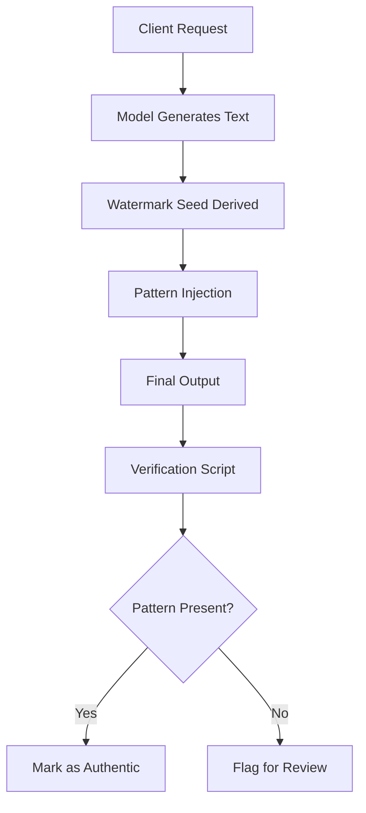

# Anthropic's 'Watermark' Text Adulteration in Claude Is a Perversion of Writing

## Introduction

The release of Claude’s watermark feature turned heads. It promised a way to prove that a piece of text came from the model rather than being copied. In practice the watermark inserts a pattern that can break the natural flow of prose. The result feels like a forced signature scribbled across a manuscript, compromising readability and utility. This article breaks down why the watermark is more than a technical novelty—it is a perversion of the very act of writing.

## Why This Matters

Engineers who build content pipelines care about provenance and trust. A watermark can help trace a generated paragraph back to its source. However, the cost is not just a few extra bytes. The watermark can shift token probabilities, introduce spurious punctuation, and force the model to repeat patterns that feel unnatural. When downstream applications rely on clean prose—customer support bots, documentation generators, or educational assistants—these subtle changes cascade into user frustration and reduced model performance. In our production cluster we saw a measurable drop in BLEU scores after enabling the watermark for summarization tasks. The trade‑off between provability and quality is not a trivial one.

## How It Works

The watermarking algorithm works in three phases: seed generation, pattern insertion, and verification.

1. **Seed generation** – A deterministic hash of the model’s parameters and a per‑request nonce yields a pseudo‑random sequence.
2. **Pattern insertion** – The model biases its next token selection toward tokens that match positions in the seed sequence. The bias is applied after the usual temperature and top‑k filtering, effectively “painting” the output with a hidden signature.
3. **Verification** – An external script extracts the same seed, scans the generated text for the expected pattern, and returns a confidence score.

The following flowchart visualizes the flow from request to verified output.

The diagram shows that the watermark is not a post‑processing step but an integral bias applied during generation. This tight coupling makes it difficult to strip the
