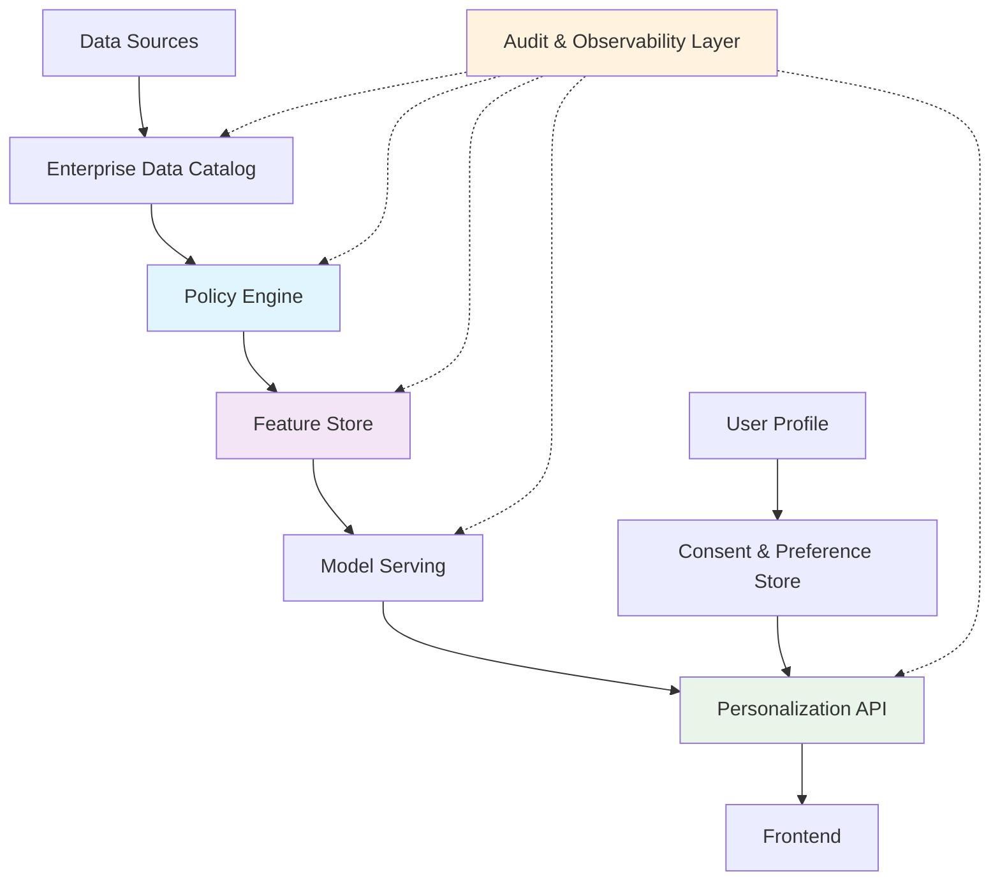

# Article: Beyond Relevance: A Governance-First Architecture for Enterprise Personalization

## Introduction

Enterprise personalization has long been driven by relevance algorithms—click-through rates, session duration, conversion funnels. But when I led the personalization initiative at a Fortune 500 retailer, we hit a wall: our models were getting better at recommending products, yet we faced increasing regulatory scrutiny and customer complaints about unwanted exposure to certain categories.

The issue wasn't just performance—it was governance. Every time we updated our recommendation logic, we had to manually audit for compliance with GDPR's data minimization principles, CCPA's right to opt-out, and industry-specific regulations around sensitive content. This manual process slowed innovation to a crawl.

That's when we realized: personalization without governance isn't sustainable. The future belongs to architectures where compliance is baked in, not bolted on.

## Why This Matters

Software engineers building personalization systems face an uncomfortable reality: a single compliance violation can cost millions in fines and irreparable brand damage. In 2023, a major streaming service faced a $25M settlement after regulators found their recommendation engine was inadvertently exposing users to inappropriate content due to inadequate policy enforcement.

Beyond legal risk, governance gaps create technical debt that compounds over time. Teams end up building custom compliance layers for each model, each data source, each deployment environment. This fragmentation makes it impossible to scale personalization across an enterprise.

The solution isn't to reduce personalization—it's to make governance a first-class architectural concern. When done right, a governance-first approach actually improves model performance by ensuring higher-quality training data, reducing bias, and increasing user trust.

## How It Works



The architecture consists of seven core layers:

1. **Data Catalog**: Central metadata repository that tracks data lineage, sensitivity classifications, and retention policies
2. **Policy Engine**: Evaluates access requests against RBAC, ABAC, and purpose-based policies before data is accessed
3. **Feature Store**: Serves both online and offline features with built-in policy compliance
4. **Model Serving**: Deploys models with canary releases and shadow traffic for safe experimentation
5. **Personalization API**: Aggregates model outputs and applies final governance checks
6. **Consent & Preference Store**: Maintains user-level opt-ins/opt-outs that override automated decisions
7. **Audit Layer**: Immutable logging of all data access, policy evaluations, and model decisions

Each layer operates independently but communicates through well-defined interfaces. This separation allows teams to evolve individual components without breaking the entire system.

## Core Concepts

### Policy-as-Code Architecture

Policies aren't stored in databases or configuration files—they're versioned code repositories. Our team uses a Git-based workflow where policy changes require pull requests, peer reviews, and automated testing.

```python
class PolicyRule:
    def __init__(self, name: str, description: str):
        self.name = name
        self.description = description
        self.version = "1.0.0"
    
    def evaluate(self, context: Dict[str, Any]) -> bool:
        raise NotImplementedError

class GDPRDataMinimizationRule(PolicyRule):
    """Only allow access to data necessary for the declared purpose"""
    
    def evaluate(self, context: Dict[str, Any]) -> bool:
        required_fields = context.get('purpose_required_fields', [])
        requested_fields = context.get('requested_fields', [])
        
        # All requested fields must be in the required set
        return all(field in required_fields for field in requested_fields)
```

This approach gives us the same benefits as infrastructure-as-code: audit trails, rollback capabilities, and automated testing.

### Consent-Driven Feature Usage

Every feature served to a model must pass a consent check. If a user has opted out of behavioral tracking, we cannot use clickstream data as a feature, even if it would improve predictions.

The feature store maintains a consent matrix that maps features to consent categories. When a feature is requested, the system checks the user's consent status and either serves the feature or substitutes a compliant alternative.

### Auditable Model Decisions

Every model prediction includes not just the output, but also the policy IDs that were evaluated, the consent status at prediction time, and a confidence score. This metadata travels with the prediction through the entire stack.

## Examples & Code Walkthrough

Let's examine how policy evaluation works in practice:

```python
import asyncio
from typing import Dict, List, Any, Optional
from dataclasses import dataclass
from enum import Enum
import hashlib

@dataclass
class PolicyContext:
    user_id: str
    purpose: str
    requested_data: List[str]
    consent_status: Dict[str, bool]
    request_timestamp: float

class PolicyEngine:
    def __init__(self):
        self.rules: Dict[str, PolicyRule] = {}
        self.policy_cache: Dict[str, bool] = {}
    
    async def evaluate_access_request(self, context: PolicyContext) -> Dict[str, Any]:
        """
        Evaluate whether a data access request complies with all applicable policies.
        Returns detailed decision information including which policies passed/failed.
        """
        cache_key = self._generate_cache_key(context)
        
        # Check cache first to avoid expensive recomputation
        if cache_key in self.policy_cache:
            return {"allowed": self.policy_cache[cache_key], "cached": True}
        
        # Evaluate all active policies
        results = []
        for policy_name, rule in self.rules.items():
            try:
                passed = rule.evaluate(context.__dict__)
                results.append({
                    "policy": policy_name,
                    "passed": passed,
                    "error": None
                })
            except Exception as e:
                results.append({
                    "policy": policy_name,
                    "passed": False,
                    "error": str(e)
                })
        
        # Decision is allowed only if ALL policies pass
        overall_decision = all(r["passed"] for r in results)
        
        # Cache result for 5 minutes
        self.policy_cache[cache_key] = overall_decision
        
        return {
            "allowed": overall_decision,
            "cached": False,
            "policy_results": results,
            "decision_id": hashlib.sha256(str(overall_decision).encode()).hexdigest()[:16]
        }
    
    def _generate_cache_key(self, context: PolicyContext) -> str:
        """Generate deterministic cache key from context"""
        key_parts = [
            context.user_id,
            context.purpose,
            str(sorted(context.requested_data)),
            str(sorted(context.consent_status.items()))
        ]
        return hashlib.md5("|".join(key_parts).encode()).hexdigest()

# Usage example
async def demonstrate_policy_evaluation():
    engine = PolicyEngine()
    
    # Add a sample rule
    engine.rules["gdpr_minimization"] = GDPRDataMinimizationRule(
        "GDPR Data Minimization",
        "Ensure only necessary data is accessed"
    )
    
    # Create a policy context
    context = PolicyContext(
        user_id="user_12345",
        purpose="recommendation_personalization",
        requested_data=["purchase_history", "browsing_behavior", "demographics"],
        consent_status={
            "behavioral_tracking": True,
            "personalization": True,
            "data_sharing": False
        },
        request_timestamp=1701234567.0
    )
    
    # Evaluate the request
    result = await engine.evaluate_access_request(context)
    print(f"Access decision: {result}")

# Feature extraction wrapper with policy enforcement
class FeatureExtractor:
    def __init__(self, policy_engine: PolicyEngine):
        self.policy_engine = policy_engine
    
    async def extract_features(self, user_id: str, purpose: str) -> Dict[str, Any]:
        """Extract features for a user, ensuring policy compliance"""
        
        # Define what data is required for this purpose
        required_data_map = {
            "recommendation_personalization": ["purchase_history", "demographics"],
            "content_moderation": ["user_reports", "content_flags"],
            "fraud_detection": ["transaction_history", "account_age"]
        }
        
        required_fields = required_data_map.get(purpose, [])
        
        # Build policy context
        context = PolicyContext(
            user_id=user_id,
            purpose=purpose,
            requested_data=required_fields,
            consent_status=await self._get_user_consent(user_id),
            request_timestamp=time.time()
        )
        
        # Check policy compliance
        policy_result = await self.policy_engine.evaluate_access_request(context)
        
        if not policy_result["allowed"]:
            # Log policy violation and raise exception
            raise PermissionError(f"Policy violation: {policy_result}")
        
        # Extract compliant features
        features = {}
        for field in required_fields:
            features[field] = await self._fetch_field(user_id, field)
        
        return features
    
    async def _get_user_consent(self, user_id: str) -> Dict[str, bool]:
        """Fetch user consent status from consent store"""
        # In production, this would query a distributed cache or database
        return {
            "behavioral_tracking": True,
            "personalization": True,
            "data_sharing": False
        }
    
    async def _fetch_field(self, user_id: str, field: str) -> Any:
        """Fetch a specific field for a user"""
        # Placeholder for actual data fetching logic
        return f"value_for_{field}_user_{user_id}"

# Consent decorator for endpoint-level enforcement
def require_consent(consent_category: str):
    """
    Decorator that enforces consent requirements at the API endpoint level.
    Usage: @require_consent('behavioral_tracking')
    """
    def decorator(func):
        async def wrapper(*args, **kwargs):
            # Extract user_id from function arguments (implementation-specific)
            user_id = kwargs.get('user_id') or (args[0] if args else None)
            
            if not user_id:
                raise ValueError("User ID required for consent check")
            
            # Check consent status
            consent_store = ConsentStore()
            has_consent = await consent_store.has_consent(user_id, consent_category)
            
            if not has_consent:
                raise PermissionError(
                    f"Missing required consent: {consent_category}"
                )
            
            # Proceed with original function
            return await func(*args, **kwargs)
        
        # Preserve function metadata
        wrapper.__name__ = func.__name__
        wrapper.__doc__ = func.__doc__
        return wrapper
    return decorator

class ConsentStore:
    async def has_consent(self, user_id: str, category: str) -> bool:
        """Check if user has given consent for a specific category"""
        # In production, query distributed key-value store
        # This is a simplified example
        consent_matrix = {
            "user_123": {"behavioral_tracking": True, "personalization": True},
            "user_456": {"behavioral_tracking": False, "personalization": True}
        }
        return consent_matrix.get(user_id, {}).get(category, False)

# Audit logger decorator
def audit_log(operation: str):
    """
    Decorator that creates immutable audit records for sensitive operations.
    """
    def decorator(func):
        async def wrapper(*args, **kwargs):
            start_time = asyncio.get_event_loop().time()
            
            # Capture context
            context = {
                "function": func.__name__,
                "operation": operation,
                "args": str(args)[:200],  # Truncate for safety
                "timestamp": start_time
            }
            
            try:
                result = await func(*args, **kwargs)
                context["status"] = "success"
                context["duration_ms"] = (asyncio.get_event_loop().time() - start_time) * 1000
                
                return result
            except Exception as e:
                context["status"] = "error"
                context["error"] = str(e)
                context["duration_ms"] = (asyncio.get_event_loop().time() - start_time) * 1000
                raise
            finally:
                # Write to immutable audit log
                await AuditLogger.log(context)
        
        return wrapper
    return decorator

class AuditLogger:
    @staticmethod
    async def log(record: Dict[str, Any]):
        """Write audit record to append-only store"""
        # In production, write to immutable log store (e.g., AWS CloudTrail, GCP Audit Logs)
        # For demonstration, we'll just print
        print(f"AUDIT: {record}")
```

## Best Practices

### Start with Minimal Viable Policies

Don't try to codify every possible regulation upfront. Begin with core policies around data minimization and consent, then expand based on actual compliance requirements. We started with just two policies and added more as we encountered real scenarios.

### Maintain Low-Latency Policy Evaluation

Policy evaluation happens on every data access request, so performance is critical. Implement caching strategies and consider JIT compilation for complex rules. Our policy engine uses a two-tier cache: in-memory for hot policies, Redis for cold storage.

```python
class CachedPolicyEngine(PolicyEngine):
    def __init__(self):
        super().__init__()
        self.hot_cache = {}  # In-memory LRU cache
        self.cold_cache = RedisClient()  # Distributed cache
        self.cache_ttl = 300  # 5 minutes
    
    async def evaluate_access_request(self, context: PolicyContext) -> Dict[str, Any]:
        cache_key = self._generate_cache_key(context)
        
        # Check hot cache first
        if cache_key in self.hot_cache:
            return self.hot_cache[cache_key]
        
        # Check cold cache
        cached_result = await self.cold_cache.get(cache_key)
        if cached_result:
            self.hot_cache[cache_key] = cached_result
            return cached_result
        
        # Evaluate and cache
        result = await super().evaluate_access_request(context)
        
        # Update caches
        self.hot_cache[cache_key] = result
        await self.cold_cache.setex(cache_key, self.cache_ttl, result)
        
        return result
```

### Version and Test Policies

Treat policy changes like code changes. Use semantic versioning, write unit tests for each policy, and run integration tests in staging environments. We maintain a policy test suite that validates behavior against regulatory requirements.

## Common Mistakes & Anti-Patterns

### 1. Treating Policies as Afterthoughts

**Mistake**: Adding compliance checks after models are trained
**Fix**: Integrate policy evaluation during feature engineering phase

```python
# WRONG: Post-hoc compliance check
def generate_recommendations_wrong(user_id):
    features = fetch_all_possible_features(user_id)
    predictions = model.predict(features)
    # Manual filtering afterward
    return filter_compliant_results(predictions)

# RIGHT: Proactive policy enforcement
async def generate_recommendations_right(user_id):
    features = await feature_extractor.extract_features(
        user_id, 
        purpose="recommendation_personalization"
    )
    return model.predict(features)
```

### 2. Over-Caching Policy Decisions

**Mistake**: Caching policy decisions for too long, missing consent revocations
**Fix**: Include consent timestamps in cache keys and set short TTLs

```python
def _generate_cache_key(self, context: PolicyContext) -> str:
    # Include consent timestamp for fresh evaluations
    consent_hash = hashlib.md5(
        str(sorted(context.consent_status.items()))
    ).hexdigest()
    
    key_parts = [
        context.user_id,
        context.purpose,
        str(sorted(context.requested_data)),
        consent_hash,
        str(int(context.request_timestamp / 60))  # Minute-level granularity
    ]
    return hashlib.md5("|".join(key_parts).encode()).hexdigest()
```

### 3. Blocking All Non-Compliant Features

**Mistake**: Completely blocking features when consent is missing
**Fix**: Provide compliant alternatives or default values

```python
async def extract_features_with_fallback(self, user_id: str, purpose: str) -> Dict[str, Any]:
    """Extract features with fallback behavior for non-consented data"""
    
    features = {}
    required_fields = self._get_required_fields(purpose)
    
    for field in required_fields:
        try:
            # Try to get feature with full consent
            features[field] = await self._fetch_field_with_consent_check(
                user_id, field, purpose
            )
        except PermissionError:
            # Fall back to default or synthetic value
            features[field] = self._get_default_value(field)
            # Log the substitution for
