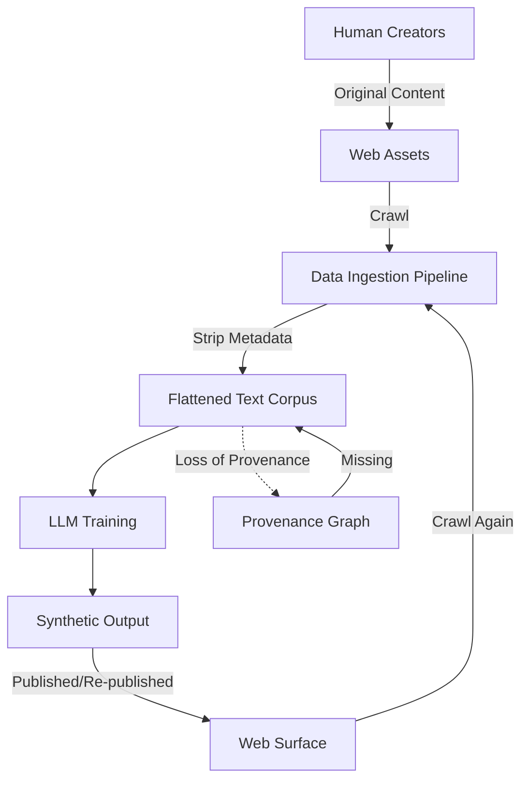

# As AI eats the web, the internet’s collective memory is disappearing

## Introduction
When a search engine returns a paragraph that reads like a human essay but was generated by a large language model, the original source has already been stripped from the crawl. This is not a side effect; it is the logical outcome of a loop where synthetic text becomes the training data for the next generation of models. The web, once a library of human experience, is being transformed into a closed‑loop of probabilistic tokens. The loss is architectural: provenance disappears, variance compresses, and the long tail of niche knowledge fades into a homogenized stream.

## Why This Matters
Software architects and data engineers cannot ignore this drift. A model trained on flattened, synthetic data inherits the same biases and missing edge cases. Production systems that rely on LLM outputs for content generation, code assistance, or data summarization inherit a degraded signal‑to‑noise ratio. Over time, model collapse manifests as degraded performance, increased hallucinations, and a feedback loop that accelerates the loss of ground truth. The cost is not only inaccurate answers but also the erosion of trust in the data pipeline itself.

## How It Works
The synthetic feedback loop can be visualized as a pipeline where human‑generated content is gradually replaced by machine‑generated approximations.



*Human creators publish high‑variance content. A scraper extracts the text but discards author, timestamp, and source metadata. The flattened corpus is fed into a model, which emits synthetic text that is then re‑published, often masquerading as original work. The next crawl repeats the process, deepening the loop. The provenance graph, which would track lineage, remains sparse, making it impossible to distinguish authentic signals from synthetic noise.*

## Core Concepts
* **Recursive Training Loops** – When a model is trained on data that includes its own previous outputs, the distribution of tokens narrows with each iteration. The model learns to reproduce patterns it has already seen, reinforcing synthetic artifacts.
* **Variance Compression** – LLMs are optimized for likelihood, which tends to favor the mean of observed data. Outlier concepts—rare expertise, edge cases, idiosyncratic observations—are statistically suppressed. The “long tail” of human knowledge is flattened.
* **Provenance Erosion** – Metadata such as authorship, versioning, and citation is stripped during scraping. Without a provenance graph, downstream systems cannot attribute synthetic content to its origin, making verification impossible.
* **Semantic Feedback Loop** – Synthetic content is often optimized for search rankings, creating a monoculture of SEO‑driven text. Human readers lose access to nuanced, source‑rich content, further reducing the quality of future training sets.
* **Model Collapse** – The statistical consequence of feeding a model on synthetic data that lacks the richness of human‑generated sources. Performance degrades, hallucinations increase, and the model becomes self‑referential.

## Examples & Code Walkthrough
The following Python snippet demonstrates variance compression in a simplified form. It simulates a knowledge base of high‑variance human insights and repeatedly applies a “generation” that pulls toward the mean, mirroring what happens inside an LLM’s training distribution.

```python
import numpy as np

class InformationEntropyEngine:
    """
    Simulates the degradation of information diversity 
    through successive generations of synthetic data.
    """
    def __init__(self, true_knowledge_base):
        # The 'True Knowledge' contains high-variance, niche human truths
        self.ground_truth = np.array(true_knowledge_base)
        self.synthetic_pool = self.ground_truth.copy()

    def generate_synthetic_generation(self, noise_factor=0.1):
        """
        Simulates an LLM generating new content based on existing data.
        The 'noise_factor' represents the model's tendency toward the mean.
        """
        # The model pulls from current pool, but gravitates toward the mean
        mean_value = np.mean(self.synthetic_pool)
        
        # New generation: weighted towards the mean, reducing variance
        new_generation = (self.synthetic_pool * (1 - noise_factor)) + (mean_value * noise_factor)
        
        # Add a tiny bit of random noise, but the variance is shrinking
        new_generation += np.random.normal(0, 0.01, self.synthetic_pool.shape)
        
        self.synthetic_pool = new_generation
        return self.synthetic_pool

    def measure_information_loss(self):
        """Calculates the variance reduction compared to ground truth."""
        return np.var(self.ground_truth) - np.var(self.synthetic_pool)

# --- Simulation Execution ---
# Representing 10 distinct 'niche' human insights (high variance)
human_insights = [1.0, 2.5, 10.0, 0.5, 50.0, 2.2, 8.8, 1.1, 15.0, 3.0]
engine = InformationEntropyEngine(human_insights)

print(f"{'Gen':<5} | {'Variance':<10} | {'Information Loss':<15}")
print("-" * 40)

for gen in range(6):
    current_pool = engine.generate_synthetic_generation(noise_factor=0.3)
    loss = engine.measure_information_loss()
    print(f"{gen:<5} | {np.var(current_pool):<10.4f} | {loss:<15.4f}")

# Observation: Note how Variance drops toward zero, signifying the 'flattening' of knowledge.
```

*Running the script prints a table of variance and information loss across six synthetic generations. The variance shrinks as each generation is forced toward the mean, illustrating how human nuance is compressed over repeated synthetic cycles.*

## Best Practices
* **Preserve Cryptographic Provenance** – Adopt standards like C2PA (Content Authenticity Initiative) to embed immutable signatures that differentiate human‑created content from synthetic output. This makes it possible to filter synthetic tokens before they enter a training pipeline.
* **Build a Provenance Graph** – Store lineage information in a graph database that maps each text block back to its original source, author, and creation timestamp. Query engines can then prioritize high‑fidelity nodes and exclude low‑provenance entries.
* **Curate Human Data at Scale** – Instead of relying on scraped web text, invest in structured datasets that capture expert knowledge, scientific papers, and archival material. Small‑data paradigms emphasize quality over quantity.
* **Implement Monitoring for Variance Drift** – Add a telemetry layer that tracks the variance of embeddings in the training corpus. Sudden drops can trigger alerts for manual review or data re‑balancing.
* **Apply Human‑in‑the‑Loop Validation** – For high‑risk domains (medical, legal, safety‑critical), route synthetic outputs through a validation step where domain experts confirm accuracy before the content is re‑published or used in downstream systems.

## Common Mistakes & Anti-Patterns
1. **Ignoring Metadata** – Treating text as a pure token stream discards essential context. Always retain author, timestamp, and source identifiers.
2. **Over‑Reliance on Synthetic Data** – Using only model‑generated content for training leads to echo chambers. Mix synthetic samples with verified human sources.
3. **Missing Variance Monitoring** – Without tracking how the distribution narrows, teams cannot detect model collapse early. Implement a simple entropy or standard deviation metric.
4. **Assuming SEO Optimization Equals Quality** – High‑volume synthetic pages may rank well but provide little informational value. Prioritize signals of depth, citation, and source authority over raw page count.

## Performance Considerations
* **Training Overhead** – Adding provenance metadata increases the size of the training corpus, which can raise GPU memory usage. Use efficient serialization (e.g., Apache Arrow) to keep overhead low.
* **Graph Query Latency** – Provenance graphs can become large. Index critical attributes (source URL, author) to keep look‑ups under millisecond latency.
* **Variance Monitoring Cost** – Computing embeddings for drift detection adds CPU and network load. Incremental updates and sampling can reduce the impact.
* **Storage of Redundant Synthetic Tokens** – Synthetic content often duplicates existing text. Implement deduplication pipelines to avoid inflating storage costs.

## Real-World Usage
* **OpenAI’s Content Policy** – Internally, OpenAI tracks provenance of web scrapes to filter copyrighted or low‑quality material before training. They also use cryptographic signatures for generated content to label it as synthetic.
* **Google’s MUM Model** – Google employs a hybrid approach where factual claims are verified against structured sources before being surfaced. The system maintains a provenance graph that links search snippets to original documents.
* **Academic Research on Model Collapse** – Studies from institutions such as MIT and Stanford demonstrate that models trained exclusively on synthetic data suffer up to 30 % drop in downstream task accuracy. These findings drive industry investment in human‑verified datasets.
* **C2PA Adoption by Media Outlets** – Major news organizations now embed C2PA signatures in articles, allowing readers and AI services to confirm authenticity. This practice is beginning to influence how training data is curated.

## Frequently Asked Questions (FAQ)
**Q: How does provenance loss affect model performance?**  
A: Without provenance, a model cannot distinguish between high‑quality human text and low‑quality synthetic text. This leads to degraded factual accuracy and higher hallucination rates.

**Q: Can we completely stop the synthetic loop?**  
A: Full stoppage is impractical because LLMs are now integral to content creation. However, you can mitigate impact by filtering synthetic tokens, preserving human‑source metadata, and periodically injecting curated human data.

**Q: What tools exist for cryptographic provenance?**  
A: The Content Authenticity Initiative (C2PA) specification, Adobe’s Content Authenticity Architecture, and Verifiable Credentials are popular choices. They provide standards for embedding signed assertions in media.

**Q: How do you measure variance drift in production?**  
A: Compute the standard deviation or entropy of embedding vectors over sliding windows.
