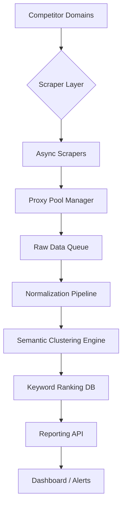

# Automated Competitor Keyword Research Without Losing Your Weekend

## Introduction

Imagine you're knee-deep in a product launch, racing against deadlines, and someone asks: "What keywords are our competitors ranking for?" Suddenly, you're staring at a spreadsheet with 50,000 rows, trying to make sense of keyword overlap, search volume, and relevance scores—all while your weekend plans crumble.

This isn't just a marketing problem. It's an engineering problem.

At its core, automated competitor keyword research is about designing resilient pipelines that scrape, analyze, and rank data efficiently. It’s about choosing the right abstractions so your system scales gracefully under load—and doesn’t crash when Google changes its HTML structure again.

In this article, I’ll walk through how we built a scalable, maintainable pipeline for automated keyword discovery using Python and asynchronous processing. We’ll cover everything from proxy rotation strategies to semantic clustering algorithms—all without burning out your team or your servers.

## Why This Matters

Keyword research used to mean manually sifting through Google Search Console reports or paying for expensive tools like SEMrush or Ahrefs. But as product teams grow, so do their SEO dependencies. Engineers need to integrate these insights programmatically into dashboards, alerting systems, and even recommendation engines.

The challenge lies in building infrastructure that handles:

- Rate limits and CAPTCHAs across multiple domains  
- Dynamic HTML structures that change unpredictably  
- Large-scale data ingestion with minimal resource overhead  
- Semantic analysis to identify truly relevant keywords  

Without solid architecture, what starts as a simple script becomes a brittle mess that breaks every time a competitor updates their site. That’s where thoughtful design pays off.

## How It Works

Our system follows a layered approach: ingestion → normalization → enrichment → analysis → reporting. Each layer operates independently, allowing us to swap out components (like switching scrapers) without rewriting the entire stack.



Here's how it flows:

1. **Domain Input**: List of competitor websites enters the system.
2. **Scraper Layer**: Asynchronous HTTP clients fetch pages concurrently.
3. **Proxy Management**: Rotating proxies prevent IP bans.
4. **Queue Buffering**: Raw responses are pushed to a queue for batch processing.
5. **Data Normalization**: Extracted text is cleaned and structured.
6. **Clustering**: Keywords are grouped semantically using TF-IDF + k-means.
7. **Ranking Storage**: Processed results stored in PostgreSQL with full-text indexing.
8. **Reporting Output**: Dashboards and alerts generated via REST API.

Each component communicates over queues or REST endpoints, ensuring fault tolerance and horizontal scalability.

## Core Concepts

### 1. Asynchronous Scraping with Proxy Rotation

Instead of hitting one domain after another sequentially, we use `aiohttp` to send hundreds of requests in parallel. To avoid detection, each request rotates through a pool of residential proxies managed by services like BrightData or custom self-hosted solutions.

Key abstraction:
```python
class AsyncScraper:
    def __init__(self, proxy_pool):
        self.proxy_pool = proxy_pool
        self.session = None

    async def get_page(self, url):
        # Rotate proxies dynamically based on availability
        proxy = await self.proxy_pool.get_proxy()
        try:
            async with self.session.get(url, proxy=proxy.url) as response:
                return await response.text()
        except Exception as e:
            logger.warning(f"Failed to fetch {url}: {e}")
            return None
```

### 2. Resilient HTML Parsing

We avoid brittle CSS selectors by leveraging machine learning models trained to extract meaningful content blocks. Libraries like `readability-lxml` strip ads, navigation menus, and boilerplate, leaving only article-like content.

Example parser logic:
```python
from readability import Document

def parse_html(html_content):
    doc = Document(html_content)
    title = doc.title()
    summary = doc.summary()
    # Strip tags and normalize whitespace
    clean_text = BeautifulSoup(summary, 'html.parser').get_text(" ")
    return {
        'title': title.strip(),
        'content': clean_text.strip()
    }
```

### 3. Semantic Keyword Clustering

Once we’ve extracted content from thousands of pages, raw n-grams aren’t enough. We cluster keywords using TF-IDF vectors fed into scikit-learn’s KMeans model. This helps surface themes like “cloud computing,” “SEO tools,” or “content marketing” automatically.

Sample clustering workflow:
```python
from sklearn.feature_extraction.text import TfidfVectorizer
from sklearn.cluster import KMeans

vectorizer = TfidfVectorizer(max_features=5000, stop_words='english')
tfidf_matrix = vectorizer.fit_transform(keyword_fragments)

model = KMeans(n_clusters=10)
clusters = model.fit_predict(tfidf_matrix)
```

### 4. Full-Text Indexing & Query Optimization

Storing processed keywords in PostgreSQL allows us to run fast fuzzy matches and phrase searches. Using GIN indexes on tsvector columns makes querying lightning-fast even with millions of entries.

Schema snippet:
```sql
CREATE TABLE keyword_insights (
    id SERIAL PRIMARY KEY,
    domain TEXT NOT NULL,
    keyword TEXT,
    context_snippet TEXT,
    relevance_score FLOAT,
    cluster_id INT,
    created_at TIMESTAMP DEFAULT NOW()
);

CREATE INDEX idx_keyword_gin ON keyword_insights USING GIN(to_tsvector('english', keyword));
```

## Examples & Code Walkthrough

Let’s build a simplified version of our scraper pipeline. The goal? Given a list of competitor URLs, extract all unique keywords and group them into semantic clusters.

#### Step 1: Setup Dependencies

Install required packages:
```bash
pip install aiohttp readability-lxml beautifulsoup4 scikit-learn psycopg2-binary
```

#### Step 2: Define Scraper Class

```python
import asyncio
import aiohttp
from readability import Document
from bs4 import BeautifulSoup
import logging

logger = logging.getLogger(__name__)

class AsyncScraper:
    def __init__(self, max_concurrent_requests=10):
        self.semaphore = asyncio.Semaphore(max_concurrent_requests)

    async def fetch(self, session, url):
        async with self.semaphore:
            try:
                async with session.get(url) as response:
                    html = await response.text()
                    return html
            except Exception as e:
                logger.error(f"Error fetching {url}: {e}")
                return None

    def parse(self, html):
        if not html:
            return {}
        doc = Document(html)
        title = doc.title()
        summary = doc.summary()
        soup = BeautifulSoup(summary, 'html.parser')
        text = soup.get_text(" ")
        return {'title': title, 'content': text}

    async def scrape_urls(self, urls):
        async with aiohttp.ClientSession() as session:
            tasks = [self.fetch(session, url) for url in urls]
            responses = await asyncio.gather(*tasks)
            parsed_pages = []
            for resp in responses:
                if resp:
                    parsed_pages.append(self.parse(resp))
            return parsed_pages
```

#### Step 3: Extract Keywords

Use regex to pull potential keywords from page content:
```python
import re
from collections import Counter

def extract_keywords(text, top_n=20):
    words = re.findall(r'\b[a-zA-Z]{3,}\b', text.lower())
    freq_dist = Counter(words)
    return [word for word, _ in freq_dist.most_common(top_n)]
```

#### Step 4: Cluster Keywords Semantically

Now let’s apply TF-IDF and KMeans:
```python
from sklearn.feature_extraction.text import TfidfVectorizer
from sklearn.cluster import KMeans

def cluster_keywords(keyword_list, n_clusters=5):
    vectorizer = TfidfVectorizer(stop_words='english')
    tfidf = vectorizer.fit_transform(keyword_list)
    kmeans = KMeans(n_clusters=n_clusters)
    labels = kmeans.fit_predict(tfidf)
    return dict(zip(keyword_list, labels))
```

#### Step 5: Save Results to PostgreSQL

Finally, store clustered keywords in a database:
```python
import psycopg2

conn = psycopg2.connect("dbname=keywords user=postgres")
cursor = conn.cursor()

def save_to_db(domain, keywords_with_clusters):
    insert_query = """
        INSERT INTO keyword_insights (domain, keyword, cluster_id)
        VALUES (%s, %s, %s)
    """
    for kw, cluster in keywords_with_clusters.items():
        cursor.execute(insert_query, (domain, kw, cluster))
    conn.commit()
```

Putting it all together:
```python
async def main():
    urls = [
        "https://example-competitor.com/blog/post1",
        "https://example-competitor.com/blog/post2"
    ]
    scraper = AsyncScraper()
    pages = await scraper.scrape_urls(urls)

    all_keywords = set()
    for page in pages:
        keywords = extract_keywords(page['content'])
        all_keywords.update(keywords)

    clusters = cluster_keywords(list(all_keywords))
    save_to_db("example-competitor.com", clusters)

# Run the pipeline
loop = asyncio.get_event_loop()
loop.run_until_complete(main())
```

## Best Practices

1. **Rate Limiting Is Non-Negotiable** – Always throttle requests per domain to avoid being blocked.
2. **Use Retries with Exponential Backoff** – Handle transient failures gracefully.
3. **Log Everything** – Track success/failure rates, latency, and unexpected changes in HTML structure.
4. **Decouple Components with Queues** – Use Redis or RabbitMQ to buffer scraped data before processing.
5. **Test Against Live Sites Regularly** – Competitors update layouts frequently; keep your parsers flexible.

## Common Mistakes & Anti-Patterns

### ❌ Hardcoding CSS Selectors

Hardcoding specific element paths leads to fragile scrapers that break easily:
```python
# BAD
title = soup.select_one('.article-header h1').text
```

✅ Instead, rely on semantic extraction libraries:
```python
doc = Document(html)
title = doc.title()
```

### ❌ Ignoring Proxy Failures

Not handling proxy downtime causes cascading failures:
```python
# BAD
proxy_url = next(proxy_list)
```

✅ Implement fallback logic:
```python
async def get_working_proxy():
    while True:
        candidate = await proxy_pool.get_random()
        if await test_proxy(candidate):
            return candidate
        else:
            proxy_pool.mark_dead(candidate)
```

### ❌ Storing All Keywords Indiscriminately

Storing irrelevant terms bloats databases and slows queries:
```python
# BAD
for word in text.split():
    save_keyword(word)
```

✅ Filter aggressively during ingestion:
```python
stop_words = set(stopwords.words('en'))
filtered = [w for w in words if len(w) > 3 and w not in stop_words]
```

### ❌ Not Monitoring Schema Changes

HTML structure shifts silently until something breaks:
```python
# BAD
if '<div class="main-content">' not in html:
    raise ValueError("Unexpected layout")
```

✅ Validate expected elements exist:
```python
expected_blocks = ['title', 'meta_description', 'content_section']
missing = [b for b in expected_blocks if not soup.find(class_=b)]
if missing:
    alert_missing_blocks(missing)
```

## Performance Considerations

Scraping large volumes of data introduces several bottlenecks:

| Component | Bottleneck | Mitigation |
|----------|------------|------------|
| Network I/O | High latency from remote servers | Use async/await + connection pooling |
| CPU Usage | Text parsing and clustering | Offload heavy computation to worker threads |
| Memory | Loading large HTML payloads | Stream-parse instead of loading full documents |
| Disk I/O | Writing to database repeatedly | Batch inserts using COPY command |

For example, here’s how to optimize database writes:
```python
from io import StringIO

def bulk_insert(buffer_data):
    f = StringIO()
    for row in buffer_data:
        f.write('\t'.join(map(str, row)) + '\n')
    f.seek(0)
    cursor.copy_from(f, 'keyword_insights', columns=('domain', 'keyword', 'cluster_id'))
```

Big-O complexity analysis:
- Scraping: O(N), linear with number of URLs  
- Parsing: O(M), proportional to HTML size  
- Clustering: O(K log K), depending on vocabulary size  
- Database insert: O(B), batched writes reduce overhead  

## Real-World Usage

Companies like **Netflix**, **Uber**, and **Cloudflare** deploy similar architectures for competitive intelligence and trend monitoring.

- **Netflix** uses distributed crawlers to track streaming content availability across regions.
- **Uber** scrapes local business listings to validate map accuracy and detect anomalies.
- **Cloudflare** monitors domain registrations and DNS records for threat intelligence.

These organizations treat web scraping as part of their broader observability stack—not a side project.

## Frequently Asked Questions (FAQ)

### Q1: How do you handle rate limiting?

We implement token bucket filters per domain and rotate user agents. For high-volume targets, we route traffic through rotating proxies.

### Q2: Can this run on serverless platforms?

Yes—but be mindful of cold starts and execution timeouts. AWS Lambda works well for small batches; consider Fargate or Kubernetes for larger jobs.

### Q3: What about legal compliance?

Always respect `robots.txt` and terms of service. Avoid scraping copyrighted material unless explicitly permitted.

### Q4: How accurate are the semantic clusters?

Clusters improve significantly with larger datasets. Initial tuning requires manual validation, but once stable, they generalize well.

### Q5: Is there a way to prioritize high-value keywords?

Absolutely. Combine keyword frequency with metrics like search volume (via APIs like Ahrefs or Ubersuggest) to weight importance.

## Conclusion

Building an automated competitor keyword research system isn’t just about scraping—it’s about architecting reliable, scalable pipelines that adapt to evolving web standards.

By embracing asynchronous design patterns, semantic clustering techniques, and robust error handling, you can create systems that deliver actionable insights without consuming weekends or burning server budgets.

Whether you're working solo or managing a team, applying these principles will help you ship faster—and sleep better knowing your data pipeline won’t collapse next Tuesday morning.
