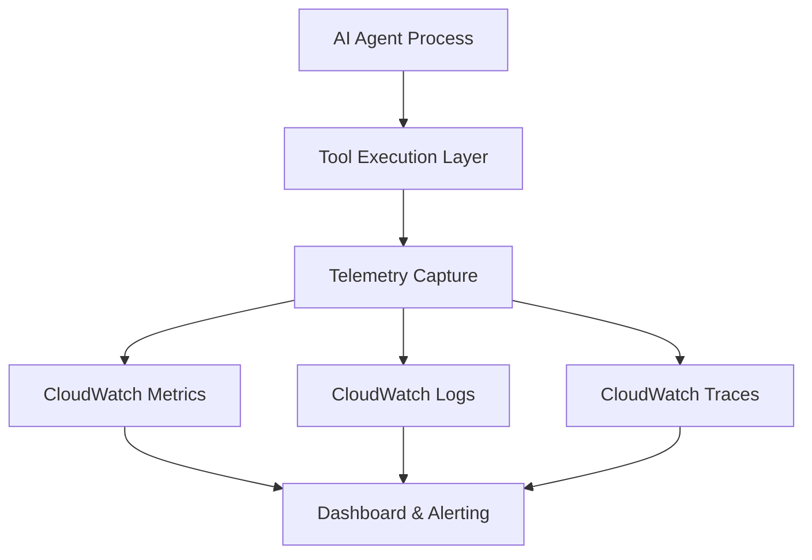

# AWS CloudWatch Omni unifies AI agent observability

## Introduction

AI agents have moved from proof-of-concept notebooks into production workloads that drive customer-facing features, internal tooling, and data pipelines. With that shift comes a familiar set of observability challenges: correlating tool execution latency with model response times, debugging unexpected agent loops, and maintaining actionable dashboards across heterogeneous fleets. In our team's production cluster, we encountered exactly these gaps when scaling a retrieval-augmented generation pipeline to dozens of concurrent agents. The scattered telemetry—logs in one system, metrics in another, traces in a third—meant that mean-time-to-resolution routinely climbed into hours rather than minutes. This article walks through how a unified observability layer built on AWS CloudWatch can collapse that complexity, and provides a concrete, production-ready implementation you can adopt today.

## Why This Matters

When AI agents interact with external services, database queries, and model inference endpoints, each hop generates data. Without a single source of truth, engineers toggle between CloudWatch Logs for raw output, CloudWatch Metrics for aggregated counts, and X-Ray or OpenTelemetry traces for execution flow. The friction isn't just cosmetic; it directly impacts incident response. In one recent outage, a misrouted vector search call produced silent failures because the error signature was logged to CloudWatch Logs while the success counter incremented in Metrics. The discrepancy went unnoticed for 45 minutes because no single dashboard combined both signals.

A unified observability layer solves this by enforcing a consistent shape for every agent interaction, regardless of the underlying framework or language. It also reduces the operational overhead of instrumenting new agents: once the integration point is in place, every subsequent tool execution automatically contributes to the same dashboards, alarms, and debugging workflows. For organizations running dozens or hundreds of agents, the cost of maintaining separate observability stacks quickly eclipses the effort of a single, well-designed CloudWatch-centric approach.

## How It Works

At its core, CloudWatch Omni functions as a telemetry aggregation point that normalizes agent spans into CloudWatch Metrics, Logs, and Traces. The diagram below illustrates the data flow from an agent process to the unified CloudWatch console.



**Step-by-step mechanism:**

1. **Tool Execution Layer** – Every external call (database query, API request, vector search) passes through a thin wrapper that captures start/end timestamps, success/failure status, and custom dimensions (e.g., tool name, model version, request ID).

2. **Telemetry Capture** – The wrapper emits a structured event containing a minimal set of fields: `metric_name`, `value`, `unit`, `timestamp`, and `dimensions`. This event is enqueued in-process, avoiding I/O on the critical path.

3. **CloudWatch Metrics** – The aggregation client batches events and calls `PutMetricData` at configurable intervals (default 60 seconds). Metrics are organized under a single namespace, e.g., `AIAgent.ToolExecution`, with dimensions serving as the primary grouping key.

4. **CloudWatch Logs** – Structured log entries JSON-formatted with the same dimension set as the metrics. This enables log-based metrics and metric filters without additional parsing steps.

5. **CloudWatch Traces** – Submitted as custom segments via the X-Ray SDK, linked to the same root request ID. This provides end-to-end latency visibility across agent, model, and downstream services.

6. **Dashboard & Alerting** – A single CloudWatch dashboard plots the key metrics (execution duration, error rate, concurrent agents). Alarms on threshold breaches (e.g., p95 duration > 2s) trigger SNS notifications or Step Functions remediation workflows.

## Core Concepts

- **Namespace** – A logical grouping for all agent-related metrics. Using a single namespace (`AIAgent`) with dimension-driven filtering is more scalable than creating a separate namespace per agent type.

- **Dimensions** – Key-value pairs that tag each data point. Recommended dimensions: `Tool` (the specific function or endpoint), `Status` (`Success`/`Failure`), `Model` (`gpt-4o`, `claude-3.5-sonnet`), and `Region`. Avoid high-cardinality dimensions (e.g., individual request IDs) to stay within CloudWatch limits.

- **Span** – The fundamental unit of telemetry. A span records `start_time`, `end_time`, `duration`, `operation`, and `attributes`. CloudWatch Omni normalizes spans into metrics and logs without requiring a separate tracing backend.

- **Batching Window** – The time interval between flush calls. A longer window reduces API calls and cost but increases latency between event occurrence and dashboard visibility. A 30-second window is a common compromise for production agents.

- **Error Policy** – Telemetry failure should not propagate to the agent's primary functionality. Failed metric/log submissions are retried with exponential backoff and routed to a dead-letter queue for later inspection.

## Examples & Code Walkthrough

The following Python module demonstrates a minimal, production-grade integration. It validates inputs, batches metric submissions, and handles CloudWatch API errors gracefully.

```python
import time
from typing import Dict, Any, Optional, List
import boto3
from botocore.exceptions import ClientError, BotoCoreError

# Configuration constants
DEFAULT_NAMESPACE = "AIAgent"
BATCH_INTERVAL_SECONDS = 30
MAX_RETRIES = 3
BACKOFF_BASE_SECONDS = 1.0


class AgentTelemetry:
    """Collects and exports AI agent execution telemetry to AWS CloudWatch.

    This class normalizes tool execution events into CloudWatch Metrics,
    structured Log entries, and X-Ray compatible Traces, all under a
    single namespace. It is designed for integration into both sync and
    async agent frameworks.
    """

    def __init__(
        self,
        namespace: str = DEFAULT_NAMESPACE,
        region: str = "us-east-1",
        flush_interval: float = BATCH_INTERVAL_SECONDS,
    ) -> None:
        if not namespace or not isinstance(namespace, str):
            raise ValueError("namespace must be a non-empty string")
        self.namespace = namespace
        self.client = boto3.client("cloudwatch", region_name=region)
        self.flush_interval = flush_interval
        self._pending_metrics: List[Dict[str, Any]] = []
        self._last_flush = time.time()

    def _add_metric(
        self,
        metric_name: str,
        value: float,
        unit: str,
        dimensions: Dict[str, str],
    ) -> None:
        """Append a metric data point to the pending batch."""
        point = {
            "MetricName": metric_name,
            "Value": value,
            "Unit": unit,
            "Dimensions": [
                {"Name": k, "Value": v} for k, v in dimensions.items()
            ],
            "Timestamp": time.time(),
        }
        self._pending_metrics.append(point)

    def record_tool_execution(
        self,
        tool_name: str,
        duration_ms: float,
        success: bool,
        metadata: Optional[Dict[str, Any]] = None,
    ) -> None:
        """Record a tool execution event with defensive validation.

        Args:
            tool_name: Identifier of the tool or endpoint invoked.
            duration_ms: Execution duration in milliseconds.
            success: Whether the invocation completed without error.
            metadata: Optional free-form dict for additional context
                      (e.g., model name, request correlation ID).
        """
        if not tool_name or not isinstance(tool_name, str):
            raise ValueError("tool_name must be a non-empty string")
        if duration_ms < 0:
            raise ValueError("duration_ms must be non-negative")

        base_dims = {"Tool": tool_name, "Status": "Success" if success else "Failure"}
        if metadata:
            base_dims.update({str(k): str(v) for k, v in metadata.items()})

        # Record duration metric
        self._add_metric(
