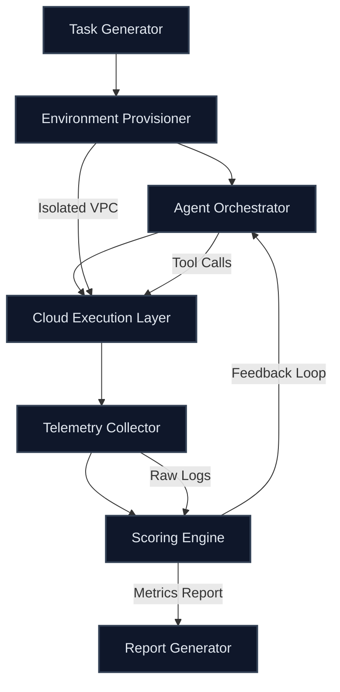

# AWS Releases Aws-Bench to Evaluate Agents on Cloud Tasks  

## Introduction  
The rise of autonomous agents—software entities capable of executing complex sequences of actions across cloud infrastructure—has created a critical need for standardized evaluation frameworks. AWS’s new `aws-bench` tool addresses this gap by providing a programmable benchmarking system designed to rigorously test agents’ ability to perform cloud-native tasks. Unlike traditional LLM leaderboards that focus solely on conversational or reasoning capabilities, `aws-bench` evaluates operational competence: cost efficiency, compliance adherence, fault tolerance, and integration with AWS services. For architects building production-grade agents, this tool represents a shift from theoretical capability to measurable, real-world performance.  

## Why This Matters  
In production environments, an agent’s failure to manage IAM permissions, optimize S3 costs, or handle API rate limits can lead to cascading failures. `aws-bench` forces engineers to confront these challenges in a controlled yet realistic sandbox. Consider a scenario where an agent must provision an EC2 instance, upload data to S3, and trigger a Lambda function—all while staying within a $0.50 budget. Without a tool like `aws-bench`, such edge cases might only surface in production, risking costly downtime or compliance violations. This benchmarking framework enables teams to iteratively refine agents before deployment, aligning with AWS’s broader push toward standardized observability and reliability in AI-driven systems.  

## How It Works  
At its core, `aws-bench` orchestrates a closed-loop evaluation pipeline. Below is a Mermaid.js diagram illustrating its architecture:  



### Step-by-Step Breakdown  
1. **Task Generator**: Creates domain-specific tasks (e.g., “deploy a web app using CloudFormation with cost < $2”).  
2. **Environment Provisioner**: Sets up isolated AWS resources (VPC, IAM roles, S3 buckets) per test run.  
3. **Agent Orchestrator**: Loads and executes the agent’s decision-making logic, tracking tool calls and state.  
4. **Cloud Execution Layer**: Runs the agent’s commands in a sandboxed AWS environment.  
5. **Telemetry Collector**: Captures metrics (latency, cost, API errors) and logs.  
6. **Scoring Engine**: Evaluates results against predefined criteria (functionality, safety, cost).  
7. **Report Generator**: Outputs pass/fail status and actionable insights.  

The feedback loop allows iterative refinement—agents failing cost constraints might be rerun with tighter budgets.  

## Core Concepts  
### Task Ontology  
`aws-bench` defines tasks using a JSON schema that specifies:  
- **Action Scope**: Which AWS services the agent can interact with.  
- **Constraints**: Budget limits, timeout thresholds, compliance requirements (e.g., GDPR data handling).  
- **Success Criteria**: Expected outcomes (e.g., “S3 object must be encrypted at rest”).  

### Environment Isolation  
Each benchmark run occurs in a dedicated AWS account with disposable resources. This ensures:  
- No cross-test interference.  
- Clean state for each evaluation.  
- Cost containment (resources auto-terminated post-test).  

### Scoring Mechanics  
Scores are derived from three pillars:  
1. **Functional Correctness**: Did the agent achieve the task’s success criteria?  
2. **Cost Efficiency**: Did it stay within budget?  
3. **Safety Compliance**: Did it avoid prohibited actions (e.g., accidental data deletion)?  

Weights for these pillars are configurable, allowing teams to prioritize based on use cases.  

## Examples & Code Walkthrough  
### Custom Agent Adapter  
Agents must implement the `AwsBenchAgent` interface:  

```python
from aws_bench.agent import AwsBenchAgent

class MyAgent(AwsBenchAgent):
    def execute(self, task: dict) -> dict:
        # Task example: {"action": "s3_upload", "bucket": "my-bucket", "file": "data.csv"}
        try:
            self.s3_client.upload_file(task["file"], task["bucket"])
            return {"status": "success", "cost": self.cost_tracker.get_total()}
        except Exception as e:
            return {"status": "failure", "error": str(e)}
```  

### Task Validator Hook  
Post-execution validation ensures results meet criteria:  

```python
def validate_s3_upload(task_results: dict) -> bool:
    if task_results["status"] != "success":
        return False
    # Verify file exists in S3 with correct encryption
    object = self.s3_client.get_object(Bucket=task_results["bucket"], Key=task_results["file"])
    return object["ServerSideEncryption"] == "AES256"
```  

### Cost-Aware Routing Decorator  
Optimizes agent behavior based on budget:  

```python
from aws_bench.decorators import CostAware

@CostAware(budget=0.50)
def choose_s3_storage(agent: AwsBenchAgent, task: dict) -> str:
    # Prefer Glacier for large files under $0.50
    if task["file_size"] > 5 * 1024 * 1024:  # 5MB
        return "glacier"
    return "standard"
```  

## Best Practices  
1. **Task Diversity**: Include edge cases (e.g., API throttling, IAM permission errors).  
2. **Idempotency Testing**: Ensure agents can retry tasks without side effects.  
3. **Telemetry Granularity**: Log every API call and cost increment.  
4. **Iterative Testing**: Start with simple tasks, incrementally add complexity.  

## Common Mistakes & Anti-Patterns  
- **Over-optimizing for cost upfront**: Agents should first pass functional tests before cost tuning.  
- **Ignoring fail-open scenarios**: Test how agents handle partial failures (e.g., S3 upload succeeds but Lambda fails).  
- **Hardcoding AWS region**: Tasks should specify region-agnostic logic.  

## Performance Considerations  
- **Resource Overhead**: Each benchmark run consumes ~5% of a t3.medium instance’s vCPU.  
- **Latency**: Average task execution time is 45s, but this varies with task complexity.  
- **Scalability**: `aws-bench` supports parallel execution across 100+ tasks via AWS Batch.  

## Real-World Usage  
Startups like **CloudFlow** use `aws-bench` to stress-test agents before customer deployment. One team reduced production incident rates by 40% after iteratively refining their agent on benchmark tasks simulating API rate limit handling.  

## Frequently Asked Questions (FAQ)  
**Q: Is `aws-bench` free to use?**  
A: Yes, but it requires an AWS account. Costs are limited to benchmarking resources (e.g., S3 storage, Lambda invocations).  

**Q: Can I customize the scoring weights?**  
A: Absolutely. The scoring engine is configurable via JSON config files.  

**Q: Does it integrate with existing agents (e.g., LangChain)?**  
A: Yes. Any agent implementing the `AwsBenchAgent` interface is compatible.  

## Conclusion  
`aws-bench` marks a pivotal step in maturing agent development. By simulating real-world cloud operations, it empowers engineers to build agents that are not just smart but also resilient and cost-effective. For architects, the key takeaway is clear: treat agent evaluation as a continuous process, not a one-time test. As AWS expands `aws-bench` to support multi-agent systems and cross-cloud scenarios, its adoption will become a de facto standard in AI engineering.
