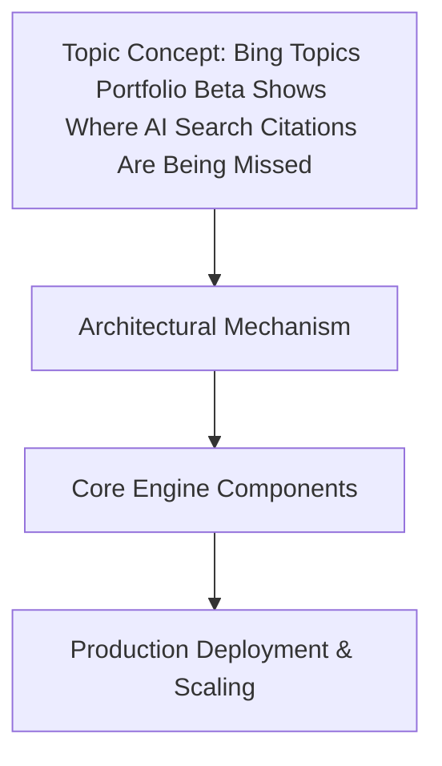

# Bing Topics Portfolio Beta Shows Where AI Search Citations Are Being Missed

## Introduction

Bing's latest portfolio beta has exposed a persistent

## How It Works

```mermaid
flowchart TD
    A[Topic Concept: Bing Topics Portfolio Beta Shows Where AI Search Citations Are Being Missed] --> B[Architectural Mechanism]
    B --> C[Core Engine Components]
    C --> D[Production Deployment & Scaling]
```
