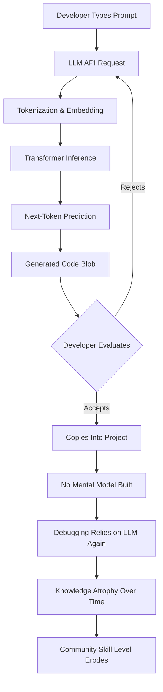

# Born Against, or why hobby programming communities are against LLM usage

## Introduction

Born Against was a straight-edge hardcore punk band from the mid-90s. They didn't just dislike the music industry — they actively rejected its entire infrastructure. No labels, no compromise, no handouts. Their ethos was raw: if you wanted to make something, you built it yourself, with your own hands, and you owned every inch of it.

Hobby programming communities — the folks building side projects on weekends, writing esoteric compilers for fun, maintaining tiny open-source utilities nobody asked for — share that same DNA. And right now, a significant chunk of them are pushing back hard against LLM-assisted coding. Not because they're luddites. Not because they don't understand the technology. But because they see LLMs as the record label of software: a powerful intermediary that extracts value from the craft while hollowing out the process that makes it meaningful.

This article isn't about whether LLMs are "good" or "bad." It's about understanding the cultural and technical tensions at play, and why they matter for every engineer working on small, personal, or community-driven projects today.

## Why This Matters

Software engineers should pay attention because the hobbyist layer of our ecosystem is where most innovation starts. The developer who builds a weird little Rust CLI tool on a Tuesday night isn't optimizing for venture capital. They're optimizing for learning, expression, and the quiet satisfaction of solving a problem with code they wrote themselves.

When LLMs flood forums like Hacker News, Reddit's r/programming, or indie hacking spaces with generated code, the feedback loop changes. A beginner sees a polished solution and copies it without understanding the trade-offs. An experienced hobbyist watches their carefully maintained repo get diluted by AI-generated pull requests that "work" but carry zero institutional knowledge in their commit messages. The craft — the part that actually makes us better engineers — erodes.

More concretely, here's what's happening in production-adjacent spaces right now:

- Junior developers are using LLMs as a crutch instead of a debugger, and they can't diagnose production incidents because they never built the mental model.
- Open-source maintainers are drowning in LLM-generated issues and PRs that look superficially correct but introduce subtle bugs.
- The knowledge-sharing culture on platforms like GitHub is degrading as commit messages and documentation become LLM-generated filler.

The pain point isn't that LLMs can write code. It's that they decouple the act of writing code from the act of understanding code, and hobby communities — which are fundamentally about understanding — feel that loss acutely.

## How It Works

To understand why hobbyists push back, you need to understand what's actually happening under the hood when an LLM generates code. It's not reasoning. It's pattern matching at an enormous scale, and the implications are more nuanced than most discussions acknowledge.

Here's the architectural flow of a typical LLM code-generation pipeline in a hobbyist's workflow:



The critical failure point is between steps G and I. When a developer accepts generated code without fully tracing through it mentally, they skip the cognitive load that's actually the entire point of programming as a craft. The code works today. But when it breaks at 3 AM in production, the developer has no internal model to debug against.

Compare this to the traditional learning loop:


The second loop is slower. It's frustrating. It's exactly how every good engineer actually gets good. LLMs shortcut the loop, and the shortcut has a cost that only shows up months later.

## Core Concepts

**Training Data Contamination.** LLMs are trained on public code repositories — GitHub, Stack Overflow, open-source projects. When a hobbyist writes original code, there's a non-trivial chance it gets absorbed into future training data. Their intellectual contribution becomes a data point in someone else's model, with no attribution, no compensation, and no opt-out mechanism.

**The "Works On My Machine" Feedback Loop.** LLM-generated code is optimized for syntactic correctness, not for the specific constraints of a given system. When a hobbyist drops AI-generated code into their project, it often works in the happy path but fails in edge cases unique to their architecture. The developer then has to debug it — but they don't understand it well enough to do so efficiently.

**Skill Atrophy vs. Skill Augmentation.** There's a real distinction between using an LLM as a junior pair programmer (you still think through the architecture) and using it as a code autocomplete on steroids (you stop thinking entirely). Hobby communities are largely concerned with the latter pattern because it's the default behavior for most users.

**Community Knowledge Erosion.** The value of a forum like Hacker News or a small open-source project's issue tracker isn't just the code — it's the discussion around the code. When LLMs generate responses that are technically correct but context-free, they pollute the knowledge base with answers that look right but carry no domain expertise or project-specific insight.

**Autonomy and Ownership.** This is the Born Against parallel. Hobby programmers value owning their stack — every dependency, every abstraction, every line. LLMs introduce a dependency on a black-box model whose training data and output quality are opaque and uncontrollable. That's fundamentally at odds with the DIY ethos.

## Examples & Code Walkthrough

Let's look at a concrete example. Say you're building a simple distributed task queue in Python for a hobby project. You need a retry mechanism with exponential backoff.

Here's what hand-written, deliberate code looks like:

```python
import time
import random
import logging

logger = logging.getLogger(__name__)

class RetryPolicy:
    def __init__(self, base_delay_ms: int = 100, max_delay_ms: int = 10_000, jitter: bool = True):
        self.base_delay_ms = base_delay_ms
        self.max_delay_ms = max_delay_ms
        self.jitter = jitter

    def compute_delay(self, attempt: int) -> float:
        """Calculate delay for a given retry attempt with optional jitter."""
        exponential = self.base_delay_ms * (2 ** attempt)
        capped = min(exponential, self.max_delay_ms)

        if self.jitter:
            # Full jitter: random value between 0 and capped delay
            capped = random.uniform(0, capped)

        delay_seconds = capped / 1000.0
        logger.debug(f"Retry attempt {attempt}: waiting {delay_seconds:.3f}s")
        return delay_seconds

    def execute_with_retry(self, func, max_attempts: int = 5):
        """Run a callable with exponential backoff retry logic."""
        last_exception = None

        for attempt in range(max_attempts):
            try:
                return func()
            except Exception as exc:
                last_exception = exc
                if attempt == max_attempts - 1:
                    raise
                delay = self.compute_delay(attempt)
                logger.warning(f"Attempt {attempt + 1} failed: {exc}. Retrying in {delay:.2f}s")
                time.sleep(delay)

        raise RuntimeError("Unreachable: retry loop exhausted without raising")
```

Now compare this to what a typical LLM might generate for the same prompt:

```python
import time

def retry_with_backoff(func, max_retries=5):
    for i in range(max_retries):
        try:
            return func()
        except Exception as e:
            if i == max_retries - 1:
                raise
            delay = min(2 ** i * 0.1, 10)
            time.sleep(delay)
```

The LLM version works. It looks clean. But here's what's missing:

- No logging. When this fails in production, you have no visibility.
- No jitter. Without jitter, concurrent retries from multiple instances will thunder-herd the same failing service.
- No configurable base delay or max delay. You're locked into hardcoded values.
- No separation of concerns. The retry logic and the delay computation are tangled together.
- No type hints. In a hobby project that grows over time, this becomes a maintenance trap.

The hand-written version is longer, yes. But it's longer because it's *thoughtful*. Every line represents a decision the developer made — and those decisions are what they'll carry into their next project.

Here's another example showing how LLM-generated code can silently introduce a concurrency bug in a hobby project's session cache:

```python
# LLM-generated: looks fine, has a race condition
class SessionCache:
    def __init__(self):
        self._store = {}

    def get_or_create(self, session_id: str, factory):
        if session_id not in self._store:
            self._store[session_id] = factory()
        return self._store[session_id]
```

The problem: `get_or_create` is not atomic. If two coroutines call it simultaneously with the same `session_id`, `factory()` gets called twice, and one result is discarded. In a hobby project running on a single thread, you'd never notice. But the habit of writing non-thread-safe code without thinking about it is exactly the erosion hobbyists are worried about.

The correct version requires explicit locking or a different data structure, and understanding *why* requires the kind of deep thinking that LLMs short-circuit:

```python
import asyncio

class SessionCache:
    def __init__(self):
        self._store = {}
        self._locks = {}
        self._global_lock = asyncio.Lock()

    async def get_or_create(self, session_id: str, factory):
        # Fast path: session already exists
        if session_id in self._store:
            return self._store[session_id]

        # Serialize creation for this session_id
        async with self._global_lock:
            if session_id in self._store:
                return self._store[session_id]

            if session_id not in self._locks:
                self._locks[session_id] = asyncio.Lock()

        async with self._locks[session_id]:
            if session_id not in self._store:
                self._store[session_id] = await factory()

        return self._store[session_id]
```

Notice the double-check pattern inside the lock. That's not something an LLM would typically produce on the first try — it requires understanding of the exact concurrency model. And that understanding is what gets lost when developers just accept the first generated response.

## Best Practices

If you're going to use LLMs in your workflow — and let's be honest, most of us are — here are field-tested rules that preserve the craft:

**1. Never accept generated code you can't explain line by line.** Before pasting any LLM output into your project, read every line and articulate what it does and why. If you can't, don't use it. This is the single most important rule.

**2. Use LLMs for boilerplate, not for architecture decisions.** Generating CRUD scaffolding or writing repetitive test fixtures? Fine. Letting an LLM design your caching strategy or your error handling hierarchy? That's where the real learning happens, and that's what you're outsourcing.

**3. Keep a "learning log" alongside your code.** When you use an LLM to solve a problem, write a brief note in a `LEARNING.md` file explaining what the LLM did and what you learned (or didn't learn) from the interaction. This turns a passive consumption into active knowledge retention.

**4. Audit LLM contributions to open-source projects with the same rigor as any other PR.** If you're maintaining a project and someone submits LLM-generated code, review it as if it came from a junior developer: test the edge cases, check for implicit assumptions, verify the commit message shows understanding.

**5. Run generated code through your own test suite before trusting it.** LLMs are confident in wrong answers. Your tests are the only honest validator.

## Common Mistakes & Anti-Patterns

**1. The "It Compiles, Ship It" Trap.** Developers run LLM-generated code, see it pass their happy-path tests, and merge it immediately. The bug surfaces weeks later in a production edge case that the LLM never considered. *Fix:* Treat every LLM-generated change as if it came from an unfamiliar codebase — read it, trace the execution paths, and write tests for the failure modes you *would* introduce if you were being malicious.

**2. Prompt-Driven Development.** Instead of thinking through a problem, developers write increasingly elaborate prompts to get the "right" output. The prompt becomes the design document, and the LLM becomes the architect. The developer never builds the mental model that would let them debug the result. *Fix:* Write the design doc yourself first, then use the LLM to fill in implementation details, not to replace the design thinking.

**3. Ignoring Training Data Bias in Small-Domain Problems.** LLMs are trained on mainstream open-source code. If your hobby project uses an obscure protocol, a niche library, or an unusual architectural pattern, the LLM's training data has very little coverage of it. The generated code will default to common patterns that may be actively wrong for your use case. *Fix:* When working outside mainstream domains, treat LLM output as a starting point, not a solution. Verify against the actual spec or source of whatever you're integrating with.

**4. Outsourcing Debugging to the LLM Instead of Learning the Root Cause.** The fastest way to grow as an engineer is to sit with a bug, form hypotheses, and test them. When developers paste an error into an LLM and accept the first fix, they skip the learning entirely. *Fix:* Spend at least 15 minutes trying to debug something yourself before consulting an LLM. If you still need help, use the LLM to understand the root cause, not just to get a fix.

## Performance Considerations

From a pure computational standpoint, LLM code generation has several overhead dimensions worth understanding:

**Latency.** A typical LLM inference call for code generation takes 1-10 seconds depending on model size and prompt complexity. For a hobbyist writing a quick script, this friction is negligible. But for developers who iterate rapidly — typing a line, getting a suggestion, deciding whether to accept — the cumulative latency adds up and changes the flow state.

**Token Costs.** At scale, API-based LLM usage gets expensive fast. A hobby project that processes 10,000 requests per day using LLM-generated code paths (e.g., dynamically generated queries or templates) can incur non-trivial API
