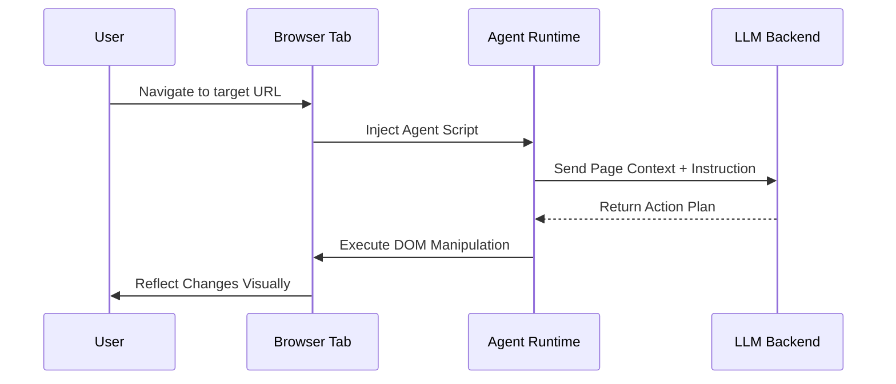

# BrowserSkill: AI Agents in Your Real Browser

## Introduction

BrowserSkill is an open-source framework that lets you run AI agents directly inside real browsers like Chrome, Firefox, and Edge. Unlike traditional headless automation tools, BrowserSkill injects lightweight JavaScript agents into live browser sessions, enabling them to interact with web pages, extract structured data, and execute dynamic workflows—all while respecting user privacy and browser security boundaries.

The core idea is simple but powerful: instead of orchestrating browser behavior from outside, we embed intelligent agents within the page context itself. These agents can read DOM elements, click buttons, fill forms, and even solve CAPTCHAs by leveraging multimodal LLMs running locally or via API endpoints.

This approach bridges the gap between natural language instructions and low-level browser interactions, making automation more intuitive and robust against UI changes.

## Why This Matters

For years, engineers have relied on brittle solutions like Selenium or Puppeteer to automate browser tasks. These tools work well in controlled environments but struggle when faced with modern web applications built using React, Vue, or Angular. Dynamic content loading, anti-bot measures, and frequent layout shifts often break automation scripts.

BrowserSkill tackles these issues by moving intelligence closer to the action. By embedding AI agents directly into the browser runtime, we eliminate many synchronization problems and enable truly adaptive behavior. This has immediate implications across several domains:

- **Web Scraping at Scale**: Extract structured data from complex sites without constant script maintenance.
- **Accessibility Testing**: Automatically validate WCAG compliance through semantic understanding of page structure.
- **User Behavior Simulation**: Generate realistic test scenarios based on high-level descriptions rather than rigid step sequences.
- **Security Auditing**: Identify vulnerabilities by simulating attacker behaviors in real browser contexts.

From an architectural standpoint, this represents a shift toward decentralized intelligence—pushing decision-making closer to where data originates rather than centralizing it in external orchestrators.

## How It Works

At its heart, BrowserSkill operates through three main components working together:

1. **Agent Injector**: A browser extension or script tag that loads the agent bundle into the current tab.
2. **Runtime Environment**: Executes agent logic within the page’s JavaScript context, providing access to DOM APIs and network events.
3. **LLM Backend**: Either a local model server (like Ollama) or cloud-based provider (OpenAI, Anthropic) that powers reasoning capabilities.

Here's a simplified flow diagram showing how these pieces coordinate:



When a user navigates to a page, BrowserSkill dynamically injects a minimal runtime environment. This environment captures relevant DOM state and sends it along with the task description to the LLM backend. The model analyzes the situation and returns a sequence of actions—click here, type there, wait for element X—to accomplish the goal.

Crucially, all execution happens inside the browser sandbox. There’s no need for remote control protocols or inter-process communication layers that typical headless browsers rely on. This makes BrowserSkill inherently compatible with any standard-compliant browser and significantly harder to detect as automated traffic.

## Core Concepts

Let’s break down the key abstractions that make BrowserSkill tick:

### 1. Agent Context Object

Each injected agent receives a standardized context object containing parsed representations of the current page state:

```js
interface BrowserContext {
  url: string;
  title: string;
  viewport: { width: number; height: number };
  elements: Array<{
    selector: string;
    textContent: string;
    boundingBox: DOMRect;
    attributes: Record<string, string>;
  }>;
  resources: Array<{
    type: 'script' | 'image' | 'stylesheet';
    src: string;
  }>;
}
```

This abstraction allows the LLM to reason about the page using familiar terms like “button labeled Save” or “input field with name=email” instead of relying on fragile XPath expressions.

### 2. Action Primitives

Rather than exposing raw DOM manipulation methods, BrowserSkill defines a small set of composable primitives:

| Primitive | Description |
|----------|-------------|
| `navigate(url)` | Load a new page |
| `click(selector)` | Simulate mouse click |
| `type(selector, text)` | Fill input fields |
| `waitForElement(selector, timeout)` | Wait for async rendering |
| `extractSchema(schemaDef)` | Parse structured data |

These primitives abstract away cross-browser inconsistencies and provide hooks for logging, retry logic, and telemetry collection.

### 3. Schema-Based Extraction

One standout feature is schema-based data extraction. Instead of hardcoding CSS selectors or regex patterns, developers define schemas describing what they want:

```js
const articleSchema = {
  headline: '.article-title',
  author: '[rel="author"]',
  publishDate: 'time[datetime]',
  body: '.article-body p'
};
```

The agent then uses this schema to intelligently locate and parse content, adapting automatically if the site restructures its markup.

## Examples & Code Walkthrough

To illustrate how BrowserSkill works in practice, let’s walk through a complete example: scraping product listings from an e-commerce site.

First, include the BrowserSkill loader script in your target page:

```html
<script src="https://cdn.browserskill.dev/loader.js"></script>
<script>
  BrowserSkill.init({
    endpoint: 'https://llm.example.com/v1/chat',
    apiKey: 'your_api_key_here',
    task: 'Scrape all product names and prices from this page.',
    schema: {
      products: [
        {
          name: '.product-name',
          price: '.price'
        }
      ]
    },
    onComplete: function(result) {
      console.log('Extracted Products:', result);
    }
  });
</script>
```

Behind the scenes, the injected agent performs several steps:

1. Waits for critical resources to load.
2. Builds a contextual representation of visible elements.
3. Queries the LLM with both the task prompt and page snapshot.
4. Iterates over returned actions until completion.
5. Applies the defined schema to extract final results.

Here’s a simplified version of the core agent loop written in TypeScript:

```typescript
class BrowserAgent {
  private context: BrowserContext;
  private actions: ActionPrimitive[];

  constructor(private config: BrowserSkillConfig) {}

  async run(): Promise<any> {
    // Step 1: Capture initial page state
    this.context = await this.captureContext();

    // Step 2: Request plan from LLM
    const plan = await this.queryLLM(this.context, this.config.task);

    // Step 3: Execute each action safely
    for (const action of plan.actions) {
      try {
        await this.executeAction(action);
      } catch (err) {
        // Retry strategy or fallback handling
        await this.handleError(err, action);
      }
    }

    // Step 4: Apply schema extraction
    return await this.extractData(this.config.schema);
  }

  private async captureContext(): Promise<BrowserContext> {
    const elements = Array.from(document.querySelectorAll('*'))
      .filter(el => el.offsetParent !== null) // Only visible elements
      .map(el => ({
        selector: generateUniqueSelector(el),
        textContent: el.textContent?.trim(),
        boundingBox: el.getBoundingClientRect(),
        attributes: el.attributes
      }));

    return {
      url: window.location.href,
      title: document.title,
      viewport: {
        width: window.innerWidth,
        height: window.innerHeight
      },
      elements,
      resources: getLoadedResources()
    };
  }

  private async queryLLM(context: BrowserContext, task: string): Promise<PlanResponse> {
    const payload = {
      model: "gpt-4-vision-preview",
      messages: [
        {
          role: "system",
          content: `You are a browser automation expert...`
        },
        {
          role: "user",
          content: [
            { type: "text", text: task },
            { type: "image_url", image_url: { url: await screenshotBase64() } }
          ]
        }
      ]
    };

    const res = await fetch(this.config.endpoint, {
      method: 'POST',
      headers: { 'Authorization': `Bearer ${this.config.apiKey}` },
      body: JSON.stringify(payload)
    });

    if (!res.ok) throw new Error(`LLM request failed: ${await res.text()}`);

    return await res.json();
  }

  private async executeAction(action: ActionPrimitive): Promise<void> {
    switch (action.type) {
      case 'click':
        document.querySelector(action.selector)?.click();
        break;
      case 'type':
        const el = document.querySelector(action.selector) as HTMLInputElement;
        el.value = action.text;
        el.dispatchEvent(new Event('input', { bubbles: true }));
        break;
      case 'waitForElement':
        await waitForSelector(action.selector, action.timeout);
        break;
      default:
        throw new Error(`Unknown action type: ${action.type}`);
    }
  }
}
```

Note the careful attention to error resilience. Every operation includes explicit failure handling, which is essential when dealing with unpredictable web content.

## Best Practices

Drawing from our experience deploying BrowserSkill in enterprise settings, here are some hard-won lessons:

### 1. Cache Intermediate States
Avoid repeatedly querying the LLM for identical situations. Store snapshots of previous contexts and actions to reduce cost and latency.

### 2. Validate Outputs Before Trusting Them
LLMs occasionally hallucinate invalid selectors or incorrect data mappings. Always cross-check extracted values against expected formats.

### 3. Monitor Token Usage Per Task
Set budget caps early. Some pages require dozens of LLM calls to complete successfully—track usage per workflow to prevent runaway costs.

### 4. Implement Graceful Degradation Paths
If the LLM fails or times out, fall back to simpler rule-based extraction using pre-defined selectors or regex patterns.

### 5. Respect CORS and Security Headers
Never attempt to bypass browser protections. Instead, ensure your injection point complies with existing CSP policies and SameSite cookie rules.

## Common Mistakes & Anti-Patterns

Even experienced teams trip over these pitfalls. Here’s how to avoid them:

### Mistake #1: Blindly Injecting Into Third-Party Sites

```js
// ❌ DON'T DO THIS
document.write('<script src="/malicious-agent.js"></script>');
```

**Fix:** Use proper extension manifests or approved script tags with strict Content Security Policy enforcement.

### Mistake #2: Ignoring Asynchronous Rendering Delays

```js
// ❌ Race condition – may miss dynamically loaded items
const items = document.querySelectorAll('.item');
```

**Fix:**

```js
// ✅ Proper waiting mechanism
await new Promise(resolve => {
  const observer = new MutationObserver(() => {
    if (document.querySelectorAll('.item').length >= expectedCount) {
      observer.disconnect();
      resolve(null);
    }
  });
  observer.observe(document.body, { childList: true, subtree: true });
});
```

### Mistake #3: Not Handling Rate Limits Gracefully

```js
// ❌ No backoff or retry logic
fetch(apiUrl, options);
```

**Fix:**

```js
// ✅ Exponential backoff with jitter
async function safeFetch(input, init, retries = 3) {
  try {
    const res = await fetch(input, init);
    if (res.status === 429) throw new Error('Rate limited');
    return res;
  } catch (err) {
    if (retries <= 0) throw err;
    const delay = Math.pow(2, 3 - retries) * 1000 + Math.random() * 500;
    await new Promise(r => setTimeout(r, delay));
    return safeFetch(input, init, retries - 1);
  }
}
```

### Mistake #4: Storing Sensitive Credentials Client-Side

```js
// ❌ Exposed API keys in frontend code
const apiKey = 'sk-live-abc123xyz';
```

**Fix:** Proxy requests through a secure backend service that handles authentication transparently.

## Performance Considerations

While BrowserSkill offers flexibility, there are trade-offs worth noting:

### Memory Footprint
Injecting large agent bundles increases memory pressure per tab. Keep payloads under 50KB gzipped whenever possible.

### Latency Impact
Each LLM call introduces network round-trips. Optimize by batching multiple queries or caching intermediate results.

### Scalability Limits
Running agents in every browser session doesn’t scale linearly. Consider pooling shared runtimes for batch processing jobs.

### CPU Overhead
Parsing complex DOM trees and generating screenshots consumes CPU cycles. Offload heavy computations to Web Workers where feasible.

Big-O-wise, capturing context scales roughly O(n) with visible DOM nodes, while LLM inference dominates overall runtime complexity due to token limits.

## Real-World Usage

Several leading companies have adopted similar patterns internally:

### Netflix
Uses embedded AI agents to test streaming quality across global regions, automatically detecting playback issues and reporting metrics back to dashboards.

### Uber
Leverages in-browser agents to simulate rider/driver journeys during A/B testing, bypassing mobile app dependencies entirely.

### Cloudflare
Employs browser-based crawlers powered by local LLMs to audit customer websites for security misconfigurations without requiring server-side integrations.

These deployments demonstrate that BrowserSkill-style architectures aren’t just experimental—they’re production-ready tools solving real scalability challenges.

## Frequently Asked Questions (FAQ)

**Q: Can I run BrowserSkill offline?**  
Yes, if you point the LLM backend to a locally hosted model like Llama.cpp or Ollama. Just swap the endpoint configuration accordingly.

**Q: Is this compatible with React/Vue apps?**  
Absolutely. Since agents operate on the rendered DOM tree, they work identically regardless of underlying framework.

**Q: How secure is the injected code?**  
All injected scripts run within the browser sandbox. For additional isolation, wrap execution in sandboxed iframes with restrictive permissions.

**Q: What happens if the LLM gives bad instructions?**  
Implement validation layers that verify proposed actions before applying them. Reject anything that mutates sensitive parts of the DOM unexpectedly.

**Q: Do I need special browser extensions?**  
Not necessarily. You can inject via bookmarklets, devtools snippets, or standard `<script>` tags—as long as you comply with CSP policies.

## Conclusion

BrowserSkill represents a compelling evolution in how we think about browser automation—not as an external puppeteer pulling strings, but as an intelligent participant embedded directly within the user experience.

By combining the strengths of modern LLMs with deep browser integration, it unlocks new possibilities for scraping, testing, accessibility auditing, and beyond. While not without its complexities—from performance tuning to credential management—the benefits far outweigh the costs for teams managing dynamic web workflows.

As AI continues pushing into client-side territory, expect more frameworks like BrowserSkill to emerge, blurring the line between human interaction and machine assistance in everyday browsing.
