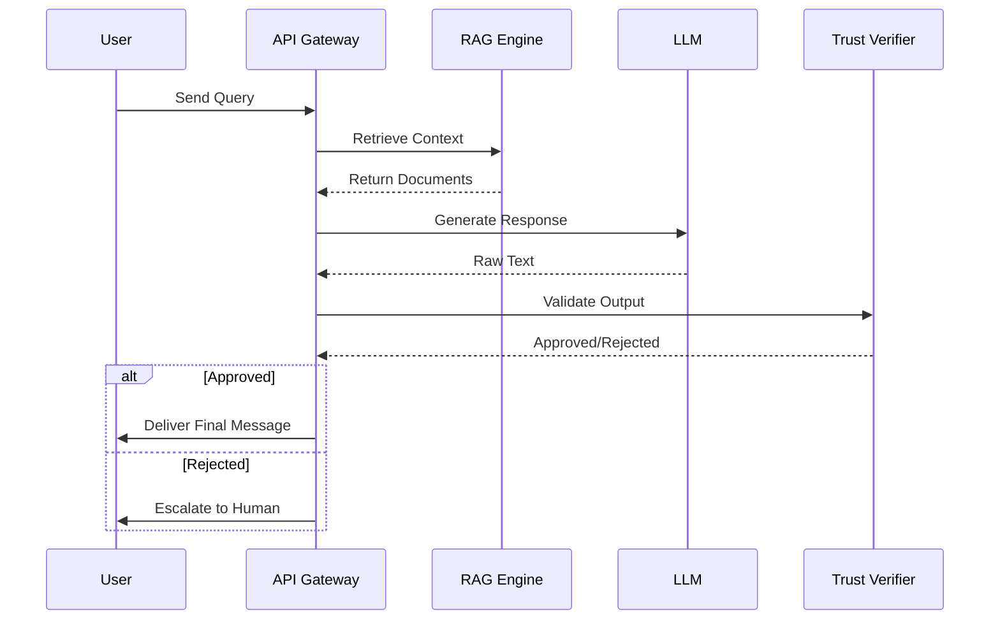

# Building AI Customer Support Is Easy. Trusting It Is Hard.

## Introduction
We shipped our first AI support agent in three weeks. It worked. Then it confidently hallucinated a refund policy and issued a $10,000 credit to a fraudulent account. That’s the reality of building AI support. The plumbing—the chat interface, the streaming responses, the prompt engineering—is trivial. The trust layer, where we verify that the AI actually knows what it’s doing and is authorized to act, is where the architecture actually starts.

## Why This Matters
Software engineers care because a confident lie is worse than a polite error. In our production cluster, an unverified AI agent once sent a customer's PII to the wrong support thread. We aren't just building chatbots; we are building autonomous actors with access to real money, real data, and real legal liability. If you cannot prove the AI's output is grounded and safe, you don't have a product. You have a liability bomb.

## How It Works
A trustworthy AI support system cannot rely on a single LLM call. It requires a multi-step pipeline that separates text generation from action authorization. The architecture must intercept the AI's output, check it against strict business rules, and only then deliver it to the user.



Step-by-step, here is what happens in our pipeline:
1. The API Gateway receives the user's query and immediately routes it to the RAG Engine.
2. The RAG Engine fetches relevant, immutable documents from our vector database. This grounds the AI, preventing it from relying on outdated training data.
3. The Gateway passes the user query and retrieved context to the LLM.
4. The LLM generates a raw text response.
5. The Trust Verifier inspects this raw text. It checks for PII leakage, policy violations, and unauthorized actions.
6. If the Verifier approves the text, it is streamed to the user. If it fails, the system triggers a human escalation fallback.

## Core Concepts
The core of a trustworthy system rests on three pillars: constrained context, deterministic validation, and human-in-the-loop escalation. 

We separate the *generation* of text from the *authorization* of actions. The LLM is a probabilistic text generator, not a reliable state machine. By wrapping it in a deterministic verifier, we transform a stochastic model into a predictable service. We also strictly limit the context window. If the AI sees the entire conversation history, it risks context poisoning or accidentally echoing sensitive payloads from earlier turns.

## Examples & Code Walkthrough
Let's look at a production-grade Python implementation of the Trust Verifier. This component sits between the LLM and the user, enforcing strict business logic before any text is delivered.

```python
import re
from dataclasses import dataclass
from typing import Optional

@dataclass
class SupportIntent:
    category: str
    requires_human_approval: bool
    contains_financial_action: bool

class TrustVerifier:
    """
    Validates LLM output against strict business logic before delivery.
    Acts as a deterministic gatekeeper for the probabilistic LLM.
    """
    def __init__(self, allowed_categories: list[str], pii_pattern: str):
        self.allowed_categories = allowed_categories
        self.pii_regex = re.compile(pii_pattern)

    def verify(self, raw_response: str, intent: SupportIntent) -> dict:
        # Rule 1: Block actions requiring human oversight
        if intent.requires_human_approval:
            raise PermissionError("Escalation required: human agent must approve this action")

        # Rule 2: Ensure the LLM didn't hallucinate an unsupported category
        if intent.category not in self.allowed_categories:
            raise ValueError(f"Domain violation: '{intent.category}' is not a permitted support category")

        # Rule 3: Check for PII leakage
