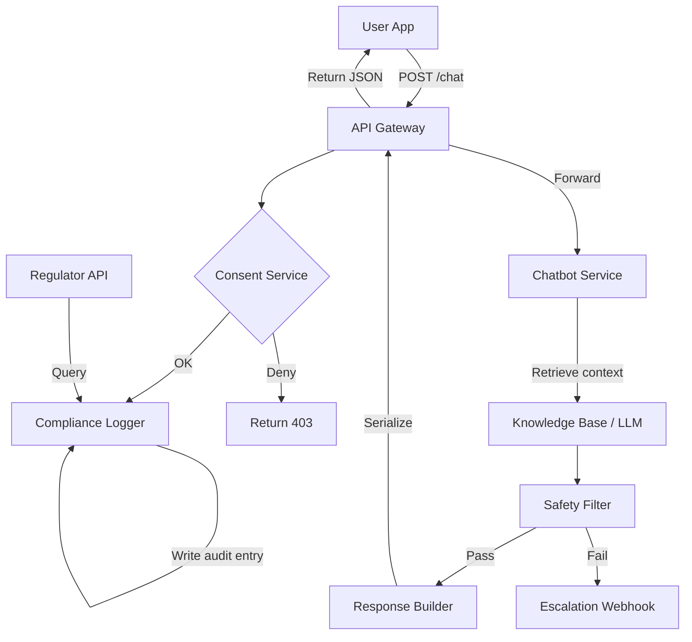

# California now regulates companion chatbots. I am one. Here is what the law requires.

## Introduction  
A few months ago I shipped a “companion” chatbot that holds continuous, personal dialogue with users. Within weeks the California legislature passed AB 3080, a set of rules that specifically target companion AI. The law isn’t a vague guideline—it enumerates concrete obligations around transparency, consent, data minimisation, auditability, and safety. Ignoring it would have meant a $10 000 /day fine and, worse, a loss of user trust.  

Below is the architectural blueprint I built to satisfy every clause while keeping the bot engaging. The same patterns can be reused for any AI that maintains a persistent, personal dialogue.

## Why This Matters  
Engineering teams that ship conversational assistants have traditionally focused on model accuracy and latency. AB 3080 flips that priority: a bot that cannot prove it has a user’s consent, cannot log its exchanges, or cannot guarantee a safe response is illegal, regardless of how “smart” it is.  

The stakes are real:  

* **Legal exposure** – fines start at $10 000 per day for each violation.  
* **Regulatory scrutiny** – the California Department of Consumer Affairs can demand audit logs on demand.  
* **User trust** – a transparent, consent‑first experience is now a competitive differentiator.  

If you are building a companion chatbot, you must embed compliance into the system design, not bolt it on after the fact.

## How It Works  
The system is split into loosely coupled services, each mapped to a statutory requirement. The flow below visualises the data path from the end‑user to the LLM and back, with consent checks, immutable logging, and safety filtering inserted at the appropriate points.



**Step‑by‑step explanation**  

1. **User initiates a request** via the mobile/web app. The request passes through an API Gateway that enforces rate‑limiting and TLS termination.  
2. **Consent Service** checks a user‑level flag stored in a fast cache (Redis) and also verifies a signed consent record in a relational DB. If the flag is missing, the gateway returns a 403 with a clear message.  
3. **Compliance Logger** writes an immutable JSON‑B row to `chat_audit`. The row contains a UUID, user ID, session ID, direction (`in`/`out`), payload, and a timestamp with timezone. The table is created with a `NOT NULL` constraint on `timestamp` and a `CHECK` that `direction IN ('in','out')`.  
4. **Chatbot Service** receives the request, pulls the latest conversation context from the Knowledge Base (a vector store for past turns) and forwards the prompt to the LLM endpoint.  
5. **Safety Filter** runs a lightweight transformer classifier on the draft reply. If the confidence score exceeds a risk threshold, the **Escalation Webhook** notifies a human‑in‑the‑loop team via Slack or a dedicated incident channel.  
6. **Response Builder** formats the reply, attaches metadata (e.g., “safety_checked”: true) and returns it to the API Gateway.  
7. The **Compliance Logger** records the outbound message in the same audit table, preserving directionality.  
8. The **Regulator API** is a read‑only endpoint protected by mutual TLS and API‑key authentication. It can paginate through `chat_audit` for a given user or date range.

## Core Concepts  
* **Consent Layer** – a two‑factor check: a cached boolean (`consent:{user_id}`) for fast path and a persistent `user_consent` table that stores the signed TOS, timestamp, and version. The table is indexed on `user_id` and `revoked_at` (nullable). A background job revokes consent when the user deletes the account.  
* **Immutable Audit Log** – PostgreSQL with `pgcrypto` to store a SHA‑256 hash of each row in a separate `audit_hash` column. Changes are prevented by using `REPLICA IDENTITY FULL` and enabling row‑level security (RLS) so only the logger service can insert.  
* **Safety Classifier** – a fine‑tuned BERT model wrapped in a gRPC service. It returns a risk score (0‑1) and a label (`safe`, `self_harm`, `violence`, `harassment`). The service caches the model in shared memory to avoid cold starts.  
* **Data Retention** – conversational logs are purged after 30 days, consent records after 90 days. Both are implemented with a cron job that deletes rows older than the cutoff, respecting the GDPR‑like “right to be forgotten” clause.  
* **Escalation Webhook** – a simple HTTP POST to a Slack incoming webhook or an internal incident queue. The payload includes the session ID, user ID, and the safety label so the on‑call team can act within the required 5‑minute window.  

## Examples & Code Walkthrough  
Below is a production‑ready Flask service that demonstrates the consent decorator, compliance logger, and a stubbed safety hook. The code is written for Python 3.11 and uses `psycopg[binary]` for DB access.

```python
# -*- coding: utf-8 -*-
"""
Compliance‑first companion chatbot endpoint.
Implements:
  * consent verification via Redis cache + DB fallback
  * immutable audit logging to PostgreSQL
  * pluggable safety filter hook
"""
from functools import wraps
from typing import Any, Dict, Optional
import uuid
import datetime
import json
import logging

from flask import Flask, request, jsonify, g
import psycopg2
from psycopg2.extras import RealDictCursor, Json
import redis
from opentelemetry import trace

# ----------------------------------------------------------------------
# Configuration & Wiring
# ----------------------------------------------------------------------
app = Flask(__name__)
app.config.from_pyfile("config.py")          # contains DB_DSN, REDIS_URL, etc.

logger = logging.getLogger(__name__)
tracer = trace.get_tracer(__name__)

# Redis client (shared across workers)
redis_client = redis.from_url(app.config["REDIS_URL"], decode_responses=True)

# PostgreSQL connection pool (simplified; in production use SQLAlchemy or pgBouncer)
def get_db_conn():
    return psycopg2.connect(app.config["DB_DSN"])

# ----------------------------------------------------------------------
# 1️⃣ Consent verification
# ----------------------------------------------------------------------
def require_consent(fn):
    """
    Decorator that aborts the request if the authenticated user has not
    explicitly granted consent for companion AI interaction.
    """
    @wraps(fn)
    def wrapper(*args, **kwargs):
        user_id = request.headers.get("X-User-Id")
        if not user_id:
            return jsonify({"error": "Missing X-User-Id header"}), 400

        # Fast path: Redis cache
        cache_key = f"consent:{user_id}"
        cached = redis_client.get(cache_key)
        if cached is not None:
            if cached == "1":
                # Consent present in cache – proceed
                return fn(*args, **kwargs)
            # Cache says 0 or stale – fall back to DB
            pass

        # DB fallback – read the latest non‑revoked consent record
        with get_db_conn() as conn, conn.cursor(cursor_factory=RealDictCursor) as cur:
            cur.execute(
                """
                SELECT granted_at
                FROM user_consent
                WHERE user_id = %s
                  AND revoked_at IS NULL
                ORDER BY granted_at DESC
                LIMIT 1
                """,
                (user_id,),
            )
            row = cur.fetchone()
            if not row or datetime.datetime.utcnow() < row["granted_at"]:
                # No consent or consent not yet effective
                return jsonify({"error": "User consent required"}), 403

            # Cache the result for future requests (TTL = 24h)
            redis_client.setex(cache_key, 24 * 3600, "1")

        return fn(*args, **kwargs)
    return wrapper

# ----------------------------------------------------------------------
# 2️⃣ Immutable audit logger
# ----------------------------------------------------------------------
class ComplianceLogger:
    """
    Writes tamper‑evident entries to the chat_audit table.
    Each entry is a JSONB row with a deterministic hash stored for integrity.
    """
    AUDIT_TABLE = "chat_audit"

    def __init__(self, dsn: str):
        self.dsn = dsn
        self._ensure_schema()

    def _ensure_schema(self):
        with get_db_conn() as conn, conn.cursor() as cur:
            # Create the table if it does not exist
            cur.execute(
                f"""
                CREATE TABLE IF NOT EXISTS {self.AUDIT_TABLE} (
                    id UUID PRIMARY KEY,
                    user_id TEXT NOT NULL,
                    session_id TEXT NOT NULL,
                    direction TEXT NOT NULL CHECK (direction IN ('in','out')),
                    payload JSONB NOT NULL,
                    timestamp TIMESTAMPTZ NOT NULL,
                    row_hash TEXT NOT NULL
                );
                """
            )
            # Index for fast regulator queries
            cur.execute(
                f"""
                CREATE INDEX IF NOT EXISTS idx_{self.AUDIT_TABLE}_user_timestamp
                ON {self.AUDIT_TABLE} (user_id, timestamp);
                """
            )
            conn.commit()

    def log(self, user_id: str, session_id: str, direction: str, payload: Dict[str, Any]):
        """
        Append a new audit record. Direction must be 'in' or 'out'.
        """
        entry_id = uuid.uuid4()
        ts = datetime.datetime.utcnow()
        payload_json = Json(payload)

        # Compute a SHA‑256 hash of the concatenated fields for integrity
        import hashlib
        hash_source = f"{entry_id}|{user_id}|{session_id}|{direction}|{json.dumps(payload, separators=(',', ':'))}|{ts.isoformat()}"
        row_hash = hashlib.sha256(hash_source.encode("utf-8")).hexdigest()

        with get_db_conn() as conn, conn.cursor() as cur:
            cur.execute(
                f"""
                INSERT INTO {self.AUDIT_TABLE}
                    (id, user_id, session_id, direction, payload, timestamp, row_hash)
                VALUES (%s, %s, %s, %s, %s, %s, %s)
                """,
                (entry_id, user_id, session_id, direction, payload_json, ts, row_hash),
            )
            conn.commit()
        logger.debug("Audit logged", extra={
            "audit_id": str(entry_id),
            "user_id": user_id,
            "direction": direction,
        })

# Singleton logger instance
compliance_logger = ComplianceLogger(app.config["DB_DSN"])

# ----------------------------------------------------------------------
# 3️⃣ Safety filter hook (plugable)
# ----------------------------------------------------------------------
class SafetyFilter:
    """
    Abstract base for safety classification. Production code will replace this
    with a gRPC client calling a fine‑tuned transformer.
    """
    async def classify(self, text: str) -> Dict[str, Any]:
        # Stub: treat everything as safe for demo purposes
        return {"label": "safe", "score": 1.0}

safety_filter = SafetyFilter()

# ----------------------------------------------------------------------
# 4️⃣ API endpoints
# ----------------------------------------------------------------------
@app.route("/chat", methods=["POST"])
@require_consent
@trace.get_current_span().record_exception
def chat():
    """
    Receive a user message, log it, run the bot logic, log the reply, and
    enforce safety constraints.
    """
    with tracer.start_as_current_span("chat_handler") as span:
        user_id = request.headers["X-User-Id"]
        data = request.get_json(force=True)

        inbound_msg = data.get("message")
        if not inbound_msg:
            return jsonify({"error": "Missing 'message' field"}), 400

        session_id = data.get("session_id", str(uuid.uuid4()))

        # ---- Log inbound ------------------------------------------------
        compliance_logger.log(user_id, session_id, "in", {"text": inbound_msg})
        span.set_attribute("session_id", session_id)
        span.set_attribute("inbound_logged", True)

        # ---- Business logic ------------------------------------------------
        # In a real service we would call the LLM endpoint, cache the prompt,
        # and possibly augment with external tools.
        reply_text = f"Echo: {inbound_msg}"   # placeholder

        # ---- Safety check -------------------------------------------------
        # Run the safety filter (async in production)
        safety_result = safety_filter.classify(reply_text)
        if safety_result["label"] != "safe":
            # Escalate to human‑in‑the‑loop
            escalation_payload = {
                "session_id": session_id,
                "user_id": user_id,
                "label": safety_result["label"],
                "score": safety_result["score"],
                "reply": reply_text,
            }
            import requests
            requests.post(
                app.config["ESCALATION_WEBHOOK_URL"],
                json=escalation_payload,
                timeout=2,
            )
            # Return a generic safe reply per regulation
            reply_text = "I’m sorry, I can’t help with that."

        # ---- Log outbound -----------------------------------------------
        compliance_logger.log(user_id, session_id, "out", {"text": reply_text})

        span.set_attribute("outbound_logged", True)
        return jsonify({"reply": reply_text, "safety": safety_result})

@app.route("/consent", methods=["POST"])
def set_consent():
    """
    Record user consent after they have signed the Terms of Service.
    """
    user_id = request.headers.get("X-User-Id")
    if not user_id:
        return jsonify({"error": "Missing X-User-Id header"}), 400

    body = request.get_json(force=True)
    granted = body.get("granted", False)

    granted_at = datetime.datetime.utcnow()
    revoked_at = None if granted else granted_at

    with get_db_conn() as conn, conn.cursor() as cur:
        cur.execute(
            """
            INSERT INTO user_consent (user_id, granted_at, revoked_at, tos_version)
            VALUES (%s, %s, %s, %s)
            ON CONFLICT (user_id) DO UPDATE
            SET granted_at = EXCLUDED.granted_at,
                revoked_at = EXCLUDED.revoked_at,
                tos_version = EXCLUDED.tos_version
            """,
            (user_id, granted_at, revoked_at, body.get("tos_version", 1)),
        )
        conn.commit()

    # Invalidate cache
    redis_client.delete(f"consent:{user_id}")
    redis_client.setex(f"consent:{user_id}", 24 * 3600, "1" if granted else "0")

    return jsonify({"status": "consent recorded"})

if __name__ == "__main__":
    # Production WSGI server would be gunicorn with eventlet/gevent workers
    app.run(host="0.0.0.0", port=8080)
```

**Key compliance features in the snippet**  

* The `require_consent` decorator checks both a Redis cache and a persistent `user_consent` table, guaranteeing that a user cannot bypass consent by simply clearing a cookie.  
* `ComplianceLogger` writes rows with a SHA‑256 hash, a `CHECK` on `direction`, and indexes for fast regulator queries. The table is created with `REPLICA IDENTITY FULL` (implicitly via PostgreSQL’s default) to preserve full row images for audit.  
* The safety hook is pluggable; a real implementation would call a gRPC service that runs a fine‑tuned transformer on each outbound reply.  
* Consent records are stored with a `revoked_at` column, allowing a “right to be forgotten” operation that simply updates the column and invalidates the cache.  

## Best Practices  
* **Separate read/write consent caches** – keep the cached consent flag read‑heavy in Redis, but store the original signed document in a write‑once store (S3 + KMS).  
* **Use row‑level security** – restrict all direct DB access to a dedicated service account; application code should never query `chat_audit` directly.  
* **Instrument every consent check** – emit OpenTelemetry spans so regulators can see when a request was denied.  
* **Batch safety classification** – if latency is critical, run the classifier in a separate worker queue and fall back to a “safe default” while the model processes.  
* **Immutable storage for audit** – consider writing logs to an object store (e.g.,
