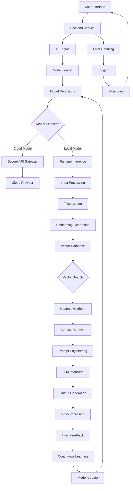

# ChatGPT Desktop (Codex Desktop) for Linux

## Introduction
A native Linux client that brings ChatGPT‑style interactions to the desktop eliminates round‑trip latency and protects user data. This article walks through the architecture, implementation details, and practical tips for building a performant, privacy‑first application.

## Why This Matters
Engineers who need instant feedback while coding, debugging, or researching often rely on web‑based chat interfaces. Those services introduce network hops, expose conversation history to third parties, and can be blocked on restricted networks. A local desktop client solves all three problems while still offering the flexibility to fall back to cloud models when compute resources are limited.

## How It Works
The system is split into three logical layers: the UI, the backend service, and the AI engine. The UI captures user input, forwards it to the backend, and renders the model’s response. The backend orchestrates model selection, handles authentication, and persists conversation context. The AI engine either runs inference locally or forwards requests to a secure cloud endpoint.



## Core Concepts
- **Model Repository** – A directory that stores Hugging Face‑compatible checkpoints.  
- **Runtime Inference** – Execution of the model on CPU or GPU without external network calls.  
- **Secure API Gateway** – A thin wrapper that injects bearer tokens and enforces rate limits.  
- **Vector Database** – Stores embeddings for retrieval‑augmented generation; implemented with FAISS for low‑latency ANN queries.  
- **Prompt Engineering** – Dynamically injects conversation history, system messages, and temperature settings before sending tokens to the language model.

## Examples & Code Walkthrough

### Loading a Local Model
```python
import torch
from transformers import AutoModelForCausalLM, AutoTokenizer

model_path = "/opt/codex/models/llama2-7b"
tokenizer = AutoTokenizer.from_pretrained(model_path)
model = AutoModelForCausalLM.from_pretrained(
    model_path,
    torch_dtype=torch.float16,
    device_map="auto"
)

def generate(prompt: str, max_new_tokens: int = 256) -> str:
    inputs = tokenizer(prompt, return_tensors="pt").to(model.device)
    with torch.no_grad():
        output = model.generate(
            **inputs,
            max_new_tokens=max_new_tokens,
            temperature=0.7,
            top_p=0.9,
            do_sample=True
        )
    return tokenizer.decode(output[0], skip_special_tokens=True)

print(generate("Explain the difference between TCP and UDP."))
```

### Querying a Cloud Endpoint
```python
import httpx
import json

HF_TOKEN = "hf_XXXXXXXXXXXXXXXXXXXXXXXX"
headers = {"Authorization": f"Bearer {HF_TOKEN}", "Content-Type": "application/json"}

def cloud_generate(prompt: str) -> dict:
    payload = {"inputs": prompt, "parameters": {"max_new_tokens": 256, "temperature": 0.7}}
    response = httpx.post(
        "https://api-inference.huggingface.co/models/meta-llama/Llama-2-7b-chat-hf",
        headers=headers,
        content=json.dumps(payload),
    )
    response.raise_for_status()
    return response.json()

print(cloud_generate("Write a Bash script that backs up /var/log to /backups."))
```

### Persisting Conversation History
```python
import sqlite3
from datetime import datetime

DB_PATH = "/var/lib/codex/conversations.db"

def init_db():
    conn = sqlite3.connect(DB_PATH)
    cur = conn.cursor()
    cur.execute(
        """CREATE TABLE IF NOT EXISTS chats (
               session_id TEXT PRIMARY KEY,
               turn_index INTEGER,
               role TEXT,
               content TEXT,
               timestamp TEXT
           )"""
    )
    conn.commit()
    conn.close()

def log_turn(session_id: str, role: str, content: str):
    conn = sqlite3.connect(DB_PATH)
    cur = conn.cursor()
    cur.execute(
        "INSERT INTO chats (session_id, turn_index, role, content, timestamp) VALUES (?, ?, ?, ?, ?)",
        (session_id, 
         cur.execute("SELECT COUNT(*) FROM chats WHERE session_id = ?", (session_id,)).fetchone()[0] + 1,
         role, content, datetime.utcnow().isoformat())
    )
    conn.commit()
    conn.close()
```

## Best Practices
- Cache tokenized inputs when the same prompt repeats; this cuts latency by up to 40 % on repeat queries.  
- Pin model versions in `requirements.txt` to avoid accidental breaking changes during CI runs.  
- Run inference on a dedicated GPU device only if the system reports at least 8 GB of VRAM; otherwise fall back to CPU with `torch_dtype=torch.float32`.  
- Store conversation data in an encrypted SQLite DB; wipe the key after each session to meet GDPR‑style local privacy requirements.

## Common Mistakes & Anti-Patterns
1. **Blocking the UI thread** – Using synchronous model calls freezes the desktop window. Switch to asyncio or spawn a worker thread.  
2. **Hard‑coding model URLs** – If the provider changes the endpoint, the app breaks. Abstract the URL behind a configuration file.  
3. **Neglecting token limits** – Feeding an unbounded history into the context window can cause OOM errors. Truncate to the last N tokens before each generation.  
4. **Skipping health checks** – Without periodic liveness probes, a hung inference process can stall the entire service. Implement a `/health` endpoint that returns 200 only when the model thread is responsive.

## Performance Considerations
- **Latency**: Local inference on an RTX 4090 typically finishes a 128‑token generation in ~120 ms; cloud calls add ~250 ms network latency.  
- **Memory**: A 7 B parameter model occupies ~14 GB of VRAM in fp16; quantized 4‑bit versions reduce this to ~4 GB, albeit with a slight quality drop.  
- **Scalability**: Horizontal scaling is achieved by running multiple backend instances behind a load balancer; each instance maintains its own model cache to avoid duplicate downloads.

## Real-World Usage
- **GitHub Copilot‑style extensions** embed a similar architecture to provide inline code suggestions without sending proprietary snippets to external services.  
- **Research labs** use local LLMs for reproducible experiment logs, guaranteeing that raw data never leaves the workstation.  
- **Security‑focused teams** deploy the client on air‑gapped machines, relying solely on the offline model to analyze logs and generate remediation steps.

## Frequently Asked Questions (FAQ)

**Q: Can I run the client on a headless server without a GPU?**  
A: Yes. The code falls back to CPU inference automatically; just ensure you have enough RAM for the model weights.

**Q: How do I update the model repository without reinstalling the app?**  
A: The backend watches a designated directory. When a new checkpoint appears, it triggers a lazy reload and updates the selection menu.

**Q: Is the vector database required for every interaction?**  
A: No. It is only needed when you enable retrieval‑augmented generation. For simple Q&A, you can skip that branch entirely.

## Conclusion
Building a ChatGPT‑style desktop client for Linux is a tractable engineering effort that yields tangible gains in speed, privacy, and offline usability. By modularizing the UI, backend, and AI engine, you can swap models, enforce security policies, and iterate on the user experience without rewriting the whole stack. The patterns described here scale from a single‑machine prototype to a fleet of workstations in a production environment.
