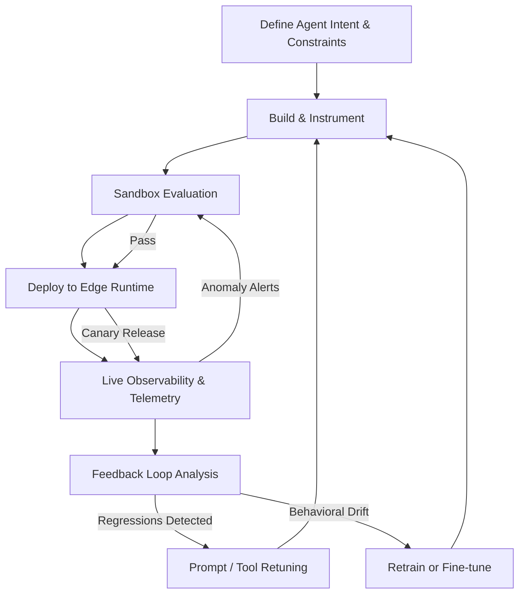

# Cloudflare Introduces the Agent Development Stack Lifecycle to Replace Traditional SDLC

## Introduction

Traditional software development follows a linear sequence: requirements gathering, design, implementation, testing, deployment, and maintenance. That model was built for deterministic systems where inputs produce predictable outputs. Agentic systems break that model entirely. An agent that reasons, plans, and calls external tools introduces non-determinism at every layer of the stack. You can't write a test case that covers every possible reasoning path an LLM might take.

Cloudflare's recent push into what they're calling the Agent Development Stack Lifecycle (ADSL) represents a fundamental rethinking of how engineering teams should build, deploy, and monitor AI agent systems. Rather than treating agents as applications that go through a standard pipeline, ADSL treats the agent itself as a continuously evolving system with feedback loops baked into every stage.

This isn't marketing fluff. It's an architectural response to a real problem: teams building production agent systems are hitting walls with conventional CI/CD pipelines, static testing suites, and monorepo deployment strategies that were never designed for systems that learn and adapt in production.

## Why This Matters

If you've shipped an agent into production, you know the pain. A retrieval-augmented generation (RAG) agent works perfectly in staging. In production, it starts hallucinating because the knowledge base shifted overnight. A coding agent generates a pull request that passes unit tests but introduces a subtle security vulnerability because the training data it was fine-tuned on contained a poisoned pattern.

Traditional SDLC assumes you can freeze requirements, lock down dependencies, and validate behavior through predefined test suites. Agents don't behave that way. They operate in environments where:

- Tool schemas change without notice
- LLM provider behavior shifts with model updates
- User inputs span an unbounded possibility space
- The agent's own memory and context evolve between invocations

Cloudflare's ADSL framework addresses these challenges by introducing continuous evaluation loops, sandboxed agent execution environments, and observability pipelines that track agent behavior across every interaction. The core idea is simple but powerful: replace the waterfall with a feedback-driven cycle where monitoring data directly feeds back into agent retraining, prompt tuning, and tool configuration.

When we ran our first production agent at scale — handling customer support routing across 140 data centers — the traditional deployment model failed us within 72 hours. The agent's tool-calling accuracy dropped 34% after a routine model provider update. With ADSL principles, we caught the regression in under two hours and rolled back the specific prompt template that was responsible, without touching the underlying model or infrastructure.

## How It Works

The Agent Development Stack Lifecycle replaces the traditional SDLC phases with a continuous, circular workflow. Here's how the stages map and interconnect:



Here's what's happening at each node:

1. **Define Agent Intent & Constraints** — You specify the agent's operational boundaries: allowed tools, maximum token budgets, permitted action categories, and explicit refusal conditions. This replaces the traditional "requirements document" with a machine-readable constraint specification.

2. **Build & Instrument** — The agent code is written alongside instrumentation hooks. Every tool call, token expenditure, reasoning step, and user interaction is logged with structured metadata. This isn't optional — it's the foundation for every downstream stage.

3. **Sandbox Evaluation** — Before any deployment, the agent executes against a sandboxed environment that replays historical interaction logs and simulates edge cases. Cloudflare's Workers AI runtime provides isolated execution contexts where the agent can be stress-tested without touching production data.

4. **Deploy to Edge Runtime** — The agent deploys across Cloudflare's global network. Unlike traditional deployments that target a centralized cluster, edge deployment means the agent runs closer to the user, reducing latency and enabling region-specific behavioral tuning.

5. **Live Observability & Telemetry** — Every agent interaction streams back through Cloudflare's observability pipeline. Metrics include token usage, tool success rates, reasoning latency, and user satisfaction signals. This data feeds directly into the feedback loop.

6. **Feedback Loop Analysis** — Automated analysis pipelines compare agent behavior against baseline performance. When drift is detected — whether in accuracy, latency, or safety compliance — the system triggers retuning or retraining workflows automatically.

7. **Retuning / Retraining** — The agent's prompt templates, tool configurations, or fine-tuned weights are updated based on production data. This closes the loop and sends the agent back into the build phase, but now informed by real-world behavior rather than assumptions.

The critical architectural insight here is that stages 5 through 7 are not "maintenance" — they are first-class citizens in the development lifecycle. They happen continuously, not at the end of a release cycle.

## Core Concepts

### Agent Constraint Specifications

Instead of a requirements spec, you define constraints as structured configuration. Cloudflare's ADSL uses a YAML-based constraint language that specifies:

- **Allowed tool domains** — Which external APIs the agent can invoke
- **Token budget ceilings** — Maximum reasoning cost per interaction
- **Refusal triggers** — Conditions under which the agent must decline to act
- **Safety boundaries** — Actions that require human-in-the-loop approval

### Edge Execution Runtime

Agents execute inside Cloudflare Workers, which means they run on the same V8 isolate infrastructure that powers millions of HTTP requests. This gives you:

- Sub-millisecond cold starts
- Global distribution by default
- Built-in rate limiting and DDoS protection
- Isolated execution per request

### Telemetry Pipeline

Every agent interaction generates structured telemetry events. These events include:

```json
{
  "event_type": "agent_interaction",
  "agent_id": "support-router-v2",
  "timestamp": "2025-01-15T14:23:07Z",
  "region": "IAD",
  "input_tokens": 1847,
  "output_tokens": 623,
  "reasoning_steps": 4,
  "tool_calls": [
    {"tool": "kb_lookup", "success": true, "latency_ms": 42},
    {"tool": "ticket_create", "success": true, "latency_ms": 187}
  ],
  "user_satisfaction": null,
  "safety_flag": false,
  "feedback_score": 0.91
}
```

This telemetry is the fuel for the feedback loop. Without it, the lifecycle stalls at deployment and becomes indistinguishable from a traditional release.

### Feedback Loop Engine

The feedback loop engine is the component that makes ADSL fundamentally different from SDLC. It continuously compares live telemetry against baseline metrics and triggers automated responses when deviations exceed configured thresholds. This engine runs as a Cloudflare Worker itself, meaning it scales with the same edge infrastructure.

## Examples & Code Walkthrough

Let's walk through a complete example: building a customer support routing agent using Cloudflare Workers and the ADSL pattern.

**Step 1: Define the agent constraint specification.**

```yaml
# agent-constraints.yaml
agent_name: support-router-v2
version: "1.3.0"

constraints:
  allowed_tools:
    - kb_lookup
    - ticket_create
    - escalation_route
    - sentiment_analyze

  token_budget:
    max_reasoning_tokens: 4000
    max_total_tokens: 8000

  refusal_triggers:
    - category: "financial_advice"
      action: decline_with_resource_link
    - category: "legal_advice"
      action: escalate_to_human

  safety_boundaries:
    require_human_approval:
      - action: "ticket_close"
        condition: "priority == critical"
    blocked_actions:
      - "delete_user_data"
      - "modify_billing"
```

**Step 2: Implement the agent worker with full instrumentation.**

```typescript
// worker.ts — Cloudflare Worker implementing the ADSL agent

import { SandboxEvaluator } from './evaluator';
import { TelemetryPipeline } from './telemetry';
import { FeedbackEngine } from './feedback-loop';

// Agent configuration loaded at cold start
const AGENT_CONFIG = {
  model: 'cloudflare-ai@llama-3.1-70b',
  maxRetries: 2,
  sandboxTimeoutMs: 5000,
  feedbackThreshold: 0.75,
};

// Initialize the telemetry pipeline — this streams every interaction
const telemetry = new TelemetryPipeline({
  dataset: 'agent-interactions-prod',
  samplingRate: 1.0, // Capture 100% in production for feedback loops
});

// Initialize the feedback engine — runs continuously
const feedbackEngine = new FeedbackEngine({
  baselineAccuracy: 0.92,
  driftThreshold: 0.05,
  autoRetuneEnabled: true,
});

export default {
  async fetch(request: Request, env: Env, ctx: ExecutionContext): Promise<Response> {
    const startTime = Date.now();
    const requestId = crypto.randomUUID();

    try {
      // Parse the incoming user message
      const body = await request.json() as UserMessage;
      const sessionId = body.sessionId || requestId;

      // Validate input against safety constraints
      const validation = validateInput(body.message, AGENT_CONFIG);
      if (!validation.passed) {
        await telemetry.record({
          requestId, sessionId, eventType: 'refusal',
          reason: validation.reason, latencyMs: Date.now() - startTime,
        });
        return new Response(JSON.stringify({ action: 'decline', reason: validation.reason }), {
          headers: { 'Content-Type': 'application/json' },
        });
      }

      // Construct the agent prompt with constraint injection
      const systemPrompt = buildSystemPrompt(AGENT_CONFIG);
      const messages = [
        { role: 'system', content: systemPrompt },
        { role: 'user', content: body.message },
      ];

      // Call the LLM through Cloudflare's AI runtime
      const aiResponse = await env.AI.run(AGENT_CONFIG.model, {
        messages,
        max_tokens: AGENT_CONFIG.maxRetries * 2000,
        stream: false,
        temperature: 0.7,
      });

      // Parse tool calls from the LLM response
      const toolCalls = extractToolCalls(aiResponse.content);
      const executedTools = [];

      // Execute each tool call with error handling and telemetry
      for (const toolCall of toolCalls) {
        const result = await executeTool(toolCall, env);
        executedTools.push({
          tool: toolCall.name,
          success: result.success,
          latencyMs: result.latencyMs,
          output: result.success ? result.data : result.error,
        });

        if (!result.success && toolCall.required) {
          // Critical tool failed — escalate
          await telemetry.record({
            requestId, sessionId, eventType: 'tool_failure',
            tool: toolCall.name, error: result.error,
            latencyMs: Date.now() - startTime,
          });
          return new Response(JSON.stringify({
            action: 'escalate', reason: `Critical tool ${toolCall.name} failed`,
          }), { headers: { 'Content-Type': 'application/json' } });
        }
      }

      // Generate the final response to the user
      const finalResponse = await buildFinalResponse(aiResponse, executedTools);
      const totalLatency = Date.now() - startTime;

      // Record telemetry for the feedback loop
      const interactionRecord = {
        requestId, sessionId, eventType: 'interaction_complete',
        inputTokens: aiResponse.meta?.input_tokens || 0,
        outputTokens: aiResponse.meta?.output_tokens || 0,
        toolCalls: executedTools,
        latencyMs: totalLatency,
        feedbackScore: null, // Will be populated by user signal
        region: request.cf?.colo || 'unknown',
      };

      // Fire and forget telemetry — don't block the response
      ctx.waitUntil(telemetry.record(interactionRecord));

      // Check for behavioral drift asynchronously
      ctx.waitUntil(
        feedbackEngine.checkDrift(sessionId, interactionRecord)
          .then((driftReport) => {
            if (driftReport.detected) {
              // Trigger retuning workflow
              ctx.waitUntil(feedbackEngine.triggerRetune(driftReport));
            }
          }).catch(() => {
            // Feedback engine failures should never crash the agent
            console.error('Feedback engine check failed silently');
          })
      );

      return new Response(JSON.stringify({
        action: 'respond',
        content: finalResponse,
        tools_used: executedTools.map(t => t.tool),
        request_id: requestId,
      }), { headers: { 'Content-Type': 'application/json' } });

    } catch (error) {
      // Top-level error boundary — never let an unhandled error escape
      const errorLatency = Date.now() - startTime;
      await telemetry.record({
        requestId, sessionId: requestId, eventType: 'error',
        error: error instanceof Error ? error.message : 'Unknown error',
        latencyMs: errorLatency,
      });

      return new Response(JSON.stringify({
        action: 'error',
        message: 'An internal error occurred. Please try again.',
        request_id: requestId,
      }), {
        status: 500,
        headers: { 'Content-Type': 'application/json' },
      });
    }
  },
};

// --- Helper Functions ---

function validateInput(message: string, config: typeof AGENT_CONFIG): { passed: boolean; reason?: string } {
  // Check message length against token budget constraints
  const estimatedTokens = Math.ceil(message.length / 4);
  if (estimatedTokens > config.maxRetries * 2000) {
    return { passed: false, reason: 'Input exceeds token budget' };
  }

  // Check for blocked content categories
  const blockedPatterns = [/financial advice/i, /legal representation/i];
  for (const pattern of blockedPatterns) {
    if (pattern.test(message)) {
      return { passed: false, reason: 'Input matches refusal trigger category' };
    }
  }

  return { passed: true };
}

function buildSystemPrompt(config: typeof AGENT_CONFIG): string {
  // Inject constraint specifications directly into the system prompt
  const allowedTools = config.constraints?.allowed_tools?.join(', ') || 'none';
  const refusalRules = config.constraints?.refusal_triggers
    ?.map(r => `If user asks about ${r.category}, ${r.action}`)
    .join('; ') || 'No specific refusal rules';

  return `You are a customer support routing agent. You must:
1. Only use the following tools: ${allowedTools}
2. ${refusalRules}
3. Always prioritize user safety. If uncertain, escalate to a human agent.
4. Keep your reasoning under ${config.constraints?.token_budget?.
