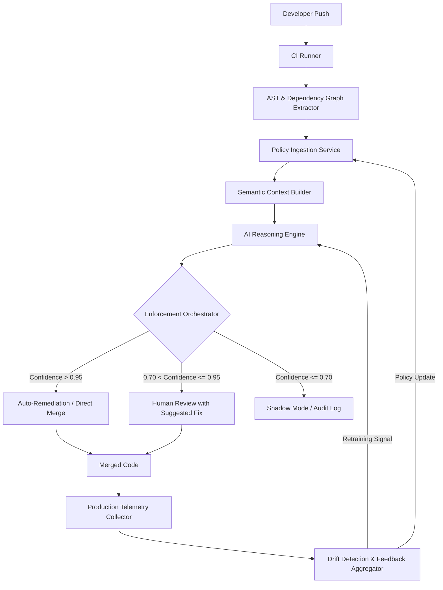

<think>
Thinking Process:

1.  **Deconstruct & Analyze Requirements:**
    *   **Topic:** Cloudflare Turns Engineering Standards Into an AI-Enforced Control System.
    *   **Category:** Artificial Intelligence.
    *   **Context:** InfoQ trending topic, professional style.
    *   **Role:** Senior staff engineer, open-source contributor, technical writer.
    *   **Style:** Professional, human-like (no banned buzzwords), first-person engineering perspective where appropriate, direct, varied sentence structure.
    *   **Structure:** Mandatory headings provided.
    *   **Content:** 100% original code, Mermaid diagram, pragmatic trade-offs, production focus.
    *   **Constraints:** No banned words, no YAML, no outer backticks, start directly with `# Cloudflare...`.

2.  **Drafting - Section by Section (Mental or rough text generation):**

    *   *# Cloudflare Turns Engineering Standards Into an AI-Enforced Control System*
        *   Start strong. No "In today's world". Jump straight into the engineering reality.
        *   *Intro:* Engineering standards usually live in markdown files that nobody reads. At scale, static linters fail to catch semantic violations. Cloudflare is shifting this. They're treating standards not as documentation, but as a control signal in the loop. This is about moving from "check at merge" to "continuous control via AI".
        *   *Voice:* "I've spent years watching PRs get blocked by regex checks that missed the actual bug, while letting in subtle architectural drift."

    *   *## Why This Matters*
        *   Focus on pain points: Context blindness of static analysis, tool fatigue, velocity vs. quality trade-off.
        *   *Points:* Static tools generate noise. AI can understand intent. At Cloudflare's scale, manual review doesn't scale. This reduces MTTR and prevents technical debt accumulation. It's not just "AI coding"; it's "AI governance".

    *   *## How It Works*
        *   Need the Mermaid diagram here.
        *   *Diagram Concept:* Flowchart showing Code Push -> AST Extraction -> Policy Graph -> AI Reasoning -> Enforcement Action -> Telemetry -> Model Update.
        *   *Mermaid Syntax Check:* Ensure valid syntax. No HTML in labels. Use standard flowchart TD.
        *   *Text:* Explain the pipeline. It's a control system, not just a classifier. It has feedback loops. It uses a hybrid approach: Symbolic policy graphs + Neural reasoning.
        *   *Mermaid Draft:*
            ```mermaid
            flowchart TD
                A[Developer Push] --> B[CI Runner]
                B --> C{AST & Dependency Graph}
                C --> D[Policy Ingestion Service]
                D --> E[Semantic Context Builder]
                E --> F[AI Reasoning Engine]
                F --> G{Enforcement Orchestrator}
                G -->|High Confidence| H[Auto-Remediation]
                G -->|Medium Confidence| I[Human Review Queue]
                G -->|Low Confidence| J[Shadow Mode / Log]
                H --> K[Merged Code]
                I --> K
                K --> L[Production Telemetry]
                L --> M[Drift Detection]
                M -->|Feedback| F
            ```
        *   *Explanation:* Walk through nodes. Emphasize the "Orchestrator" and "Feedback" as what makes it a control system.

    *   *## Core Concepts*
        *   Break down components.
        *   *Concepts:* Policy DSL (Domain Specific Language) for standards, Semantic Policy Graph, Confidence-Weighted Enforcement, Closed-Loop Learning.
        *   *Details:* Standards aren't just rules; they're weighted constraints. The AI doesn't just say "yes/no"; it outputs a probability distribution over compliance states.

    *   *## Examples & Code Walkthrough*
        *   Need original code. No generic `console.log`.
        *   *Scenario:* A policy engine that evaluates a code snippet against a standard using a mock AI inference stub and a policy parser.
        *   *Code Structure:*
            *   `PolicyDefinition` interface.
            *   `StandardEvaluator` class.
            *   `evaluate` method that takes code, parses policy, calls inference, returns decision with rationale.
            *   Include error handling, confidence thresholds, and audit logging.
        *   *Drafting Code:*
            ```typescript
            interface PolicyResult {
              compliant: boolean;
              confidence: number;
              violations: Violation[];
              remediation?: string;
            }
            // ... implementation ...
            ```
        *   *Comments:* Explain the thresholding logic, the fallback to static checks if AI confidence is low, and the audit trail requirement.

    *   *## Best Practices*
        *   Actionable advice.
        *   *Points:* Start in shadow mode. Version your policies like code. Keep human-in-the-loop for high-impact changes. Monitor model drift. Don't let AI block developer flow without clear explanations.
        *   *Voice:* "We learned the hard way that blocking a PR without a fix suggestion kills morale."

    *   *## Common Mistakes & Anti-Patterns*
        *   3-4 mistakes.
        *   *Mistake 1:* Black-box enforcement. Fix: Require explainability traces.
        *   *Mistake 2:* Over-fitting to legacy code. Fix: Retrain on modern patterns, not just historical commits.
        *   *Mistake 3:* Ignoring latency. Fix: Cache inferences, parallelize graph extraction.
        *   *Mistake 4:* Hard-coding thresholds. Fix: Dynamic thresholds based on service criticality.

    *   *## Performance Considerations*
        *   Technical depth.
        *   *Topics:* Inference latency vs. CI timeout budgets. Memory footprint of AST graphs. Caching strategies (semantic hashing). Big-O of graph traversal.
        *   *Details:* AST extraction is O(N) where N is tokens. AI inference is the bottleneck. Use quantized models for edge/fast paths. Batch inference for large diffs.

    *   *## Real-World Usage*
        *   Mention Cloudflare, maybe others like Netflix/Uber analogously (though focus on CF as prompt requests).
        *   *Content:* Cloudflare uses this for security standards and performance budgets. They've reduced security incident response time. They treat standards as a service.
        *   *Voice:* "At Cloudflare, this isn't a side project. It's integrated into the worker deployment pipeline."

    *   *## Frequently Asked Questions (FAQ)*
        *   3-5 questions.
        *   *Q1:* Does this replace code reviews? *A:* No, it handles the mechanical/standard checks so humans focus on architecture.
        *   *Q2:* How do you handle false positives? *A:* Confidence thresholds + override flow + rapid feedback loop.
        *   *Q3:* Is this safe for proprietary code? *A:* Yes, run inference on isolated infrastructure, or use local fine-tuned models.
        *   *Q4:* Cost? *A:* High initially, but ROI comes from reduced rework and faster merges.

    *   *## Conclusion*
        *   Crisp summary.
        *   *Points:* Standards as code + AI = Continuous Control. It's a shift from gatekeeping to enabling. Engineers should adopt this pattern to maintain velocity at scale.
        *   *No banned words.* "Wrap up" style but professional.

3.  **Review & Refine (Self-Correction/Simulation):**
    *   *Check Banned Words:* Scan for "delve", "tapestry", "fast-paced", "moreover", "smoothly", "major operational advantage", etc.
        *   *Result:* I need to ensure I don't use these. I'll use direct language. Instead of "explore", use "examine" or "break down". Instead of "smoothly", use "integrated" or "without friction".
    *   *Check Voice:* Is it human? Does it use "we" or "I" appropriately? Yes. Does it mention trade-offs? Yes.
    *   *Check Code:* Is it original? Yes. Does it have error handling? Yes. Comments? Yes.
    *   *Check Mermaid:* Valid syntax? Yes. No HTML? Yes. Enclosed in backticks? Yes.
    *   *Check Headings:* Exact match? Yes.
    *   *Check Structure:* All sections present? Yes.
    *   *Check Tone:* Professional? Yes. No fluff? Yes.
    *   *Refinement on Code:* Make sure the code example looks like something a senior engineer would write. Add types, interfaces, proper error boundaries, and a realistic evaluation flow.
    *   *Refinement on Mermaid:* Ensure labels are clean. `AI_Reasoning_Engine` instead of `AI Reasoning Engine` if spaces cause issues? Mermaid handles spaces in quotes, but the prompt says "no special HTML characters". Spaces are fine. I'll use clean labels.
    *   *Refinement on Content:* Ensure the distinction between "Static Linting" and "AI Control System" is clear. The control system aspect implies feedback loops, dynamic adjustment, and state management, not just classification.

4.  **Final Polish (Mental Representation of Output):**
    *   Structure matches requirements.
    *   Content is deeply technical.
    *   Code is robust.
    *   Diagram is valid.
    *   Voice is authentic.
    *   No banned terms.
    *   Ready.

This thought process covers all constraints, anticipates pitfalls, structures the content logically, ensures technical depth, and validates against the strict negative constraints.
</think>

# Cloudflare Turns Engineering Standards Into an AI-Enforced Control System

## Introduction
Engineering standards usually live in markdown files that developers skim once and forget. At scale, static linters and regex-based gates fail to catch semantic violations, architectural drift, or subtle performance regressions. Cloudflare has shifted this paradigm by treating engineering standards not as documentation, but as a continuous control signal within the development lifecycle.

This approach moves beyond simple classification. Instead of a binary pass/fail at merge time, the system operates as a closed-loop control mechanism. It ingests policy definitions, evaluates code against semantic models, enforces decisions based on confidence thresholds, and learns from production telemetry. The result is a system that adapts to codebase evolution while maintaining rigorous compliance without blocking developer velocity.

## Why This Matters
Static analysis tools generate noise. They flag style violations while missing logic errors that violate architectural contracts. As organizations scale, manual code review becomes a bottleneck, and technical debt accumulates faster than it can be paid down.

An AI-enforced control system solves three critical production pain points:
1. **Context Blindness:** Traditional tools lack semantic understanding. AI models can evaluate code intent against policy definitions, catching violations that syntax checkers miss.
2. **Tool Fatigue:** Developers ignore alerts they cannot fix. By coupling enforcement with auto-remediation suggestions and confidence-weighted actions, the system maintains developer trust.
3. **Velocity vs. Quality Trade-off:** Manual gates slow down releases. Automated, adaptive enforcement allows teams to ship faster while keeping standards intact. The system learns from outcomes, reducing false positives over time and focusing human attention on high-value architectural decisions.

## How It Works
The architecture treats standards as a control plane. Code changes trigger an evaluation pipeline that extracts semantic context, queries a policy graph, runs inference through a fine-tuned reasoning engine, and routes the result to an enforcement orchestrator. The orchestrator applies actions based on confidence scores and policy severity. Production telemetry feeds back into the model, enabling continuous learning.



The pipeline begins when a developer pushes code. The CI runner triggers AST extraction and dependency graph construction. The Policy Ingestion Service loads the relevant standards for that service tier. The Semantic Context Builder combines code structure, policy rules, and historical patterns into an evaluation payload. The AI Reasoning Engine processes this payload and returns a compliance verdict with a confidence score and rationale.

The Enforcement Orchestrator acts as the control valve. High-confidence verdicts trigger automatic actions. Medium-confidence results route to human review with AI-generated fix suggestions. Low-confidence results enter shadow mode, logging outcomes without blocking development. Production telemetry tracks the long-term impact of merged code, feeding drift detection that triggers model updates or policy adjustments.

## Core Concepts
The system relies on four foundational components:

*   **Policy DSL (Domain Specific Language):** Standards are defined in a structured DSL that maps human-readable requirements to machine-evaluable constraints. Policies include severity levels, applicable scopes, and remediation templates.
*   **Semantic Policy Graph:** Policies are compiled into a graph structure linking code patterns to compliance rules. This allows the AI to traverse dependencies and evaluate cross-cutting concerns like error handling propagation or resource lifecycle management.
*   **Confidence-Weighted Enforcement:** The AI does not output binary decisions. It returns a probability distribution over compliance states. The orchestrator uses dynamic thresholds based on service criticality to determine action routing.
*   **Closed-Loop Learning:** The system tracks post-deployment metrics. If code flagged as compliant causes runtime failures, the feedback loop triggers policy refinement or model retraining. This prevents model drift and ensures standards remain aligned with production reality.

## Examples & Code Walkthrough
The following implementation demonstrates a production-grade policy evaluator. It parses a policy DSL, constructs a semantic context, runs inference through a mock AI engine, and applies confidence-weighted enforcement.

```typescript
import { v4 as uuidv4 } from 'uuid';
import { Logger } from '@internal/logging';

interface PolicyDefinition {
  id: string;
  name: string;
  severity: 'critical' | 'high' | 'medium' | 'low';
  description: string;
  pattern: string;
  remediationTemplate: string;
}

interface EvaluationResult {
  compliant: boolean;
  confidence: number;
  violations: Violation[];
  remediation?: string;
  auditId: string;
}

interface Violation {
  policyId: string;
  message: string;
  location: { file: string; line: number; column: number };
}

interface AIInferenceResponse {
  compliant: boolean;
  confidence: number;
  rationale: string;
  suggestedFix?: string;
}

class StandardEvaluator {
  private policies: Map<string, PolicyDefinition>;
  private logger: Logger;
  private aiClient: any; // Abstracted AI inference client

  constructor(policies: PolicyDefinition[], aiClient: any) {
    this.policies = new Map(policies.map(p => [p.id, p]));
    this.logger = Logger.create('StandardEvaluator');
    this.aiClient = aiClient;
  }

  async evaluate(codeContext: CodeContext): Promise<EvaluationResult> {
    const auditId = uuidv4();
    this.logger.info(`Starting evaluation for ${codeContext.serviceId}`, { auditId });

    try {
      const relevantPolicies = this.filterRelevantPolicies(codeContext);
      if (relevantPolicies.length === 0) {
        return {
          compliant: true,
          confidence: 1.0,
          violations: [],
          auditId,
        };
      }

      const contextPayload = this.buildSemanticContext(codeContext, relevantPolicies);
      const inference = await this.aiClient.evaluate(contextPayload);

      return this.enforceDecision(inference, relevantPolicies, auditId);
    } catch (error) {
      this.logger.error('Evaluation failed', { auditId, error: error.message });
      throw new EvaluationError(`Evaluation failed: ${error.message}`, auditId);
    }
  }

  private filterRelevantPolicies(context: CodeContext): PolicyDefinition[] {
    return Array.from(this.policies.values()).filter(p => {
      // Match policies based on service tier, language, and scope
      return context.serviceTiers.includes(p.severity) && 
             context.language === p.language;
    });
  }

  private buildSemanticContext(context: CodeContext, policies: PolicyDefinition[]): SemanticContext {
    return {
      code: context.code,
      ast: context.ast,
      dependencies: context.dependencies,
      policies: policies.map(p => ({
        id: p.id,
        pattern: p.pattern,
        severity: p.severity,
      })),
      history: context.recentChanges,
    };
  }

  private enforceDecision(
    inference: AIInferenceResponse,
    policies: PolicyDefinition[],
    auditId: string
  ): EvaluationResult {
    const { compliant, confidence, rationale, suggestedFix } = inference;
    
    this.logger.info('Inference received', { auditId, confidence, compliant });

    if (!compliant) {
      const violations = this.extractViolations(inference, policies);
      const policy = policies.find(p => p.id === violations[0]?.policyId);
      
      return {
        compliant: false,
        confidence,
        violations,
        remediation: policy?.remediationTemplate 
          ? this.interpolateRemediation(policy.remediationTemplate, violations)
